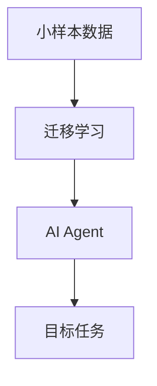
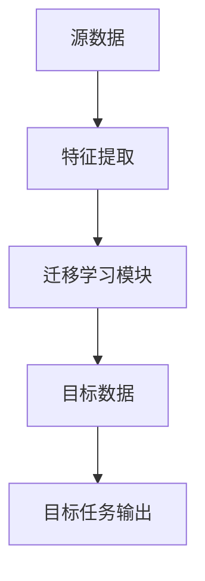
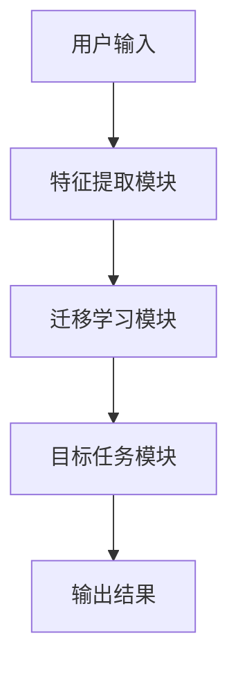

                 


# AI Agent的迁移学习在小样本学习中的应用

> 关键词：AI Agent，迁移学习，小样本学习，机器学习，深度学习

> 摘要：本文系统探讨了AI Agent在小样本学习中的迁移学习应用，分析了小样本学习的挑战，迁移学习的核心原理及其在AI Agent中的实现机制。通过案例分析和系统设计，展示了迁移学习如何帮助AI Agent在小样本数据下实现高效学习。文章还提供了详细的算法流程、系统架构设计和实战代码，为读者提供了从理论到实践的全面指导。

---

# 第一部分: 背景介绍

## 第1章: 问题背景与描述

### 1.1 数据量不足的挑战

在机器学习领域，数据量的多少直接影响模型的性能。然而，在许多实际场景中，获取大量标注数据往往成本高昂且耗时。例如，在医疗图像分析中，获取大量标注的医学图像需要专业医生的大量时间和资源。这种情况下，小样本学习（Few Shot Learning）成为一个重要的研究方向。

小样本学习的核心挑战在于如何在仅有少量标注数据的情况下，训练出具有泛化能力的模型。传统的监督学习方法在这种情况下往往表现不佳，因为模型难以从有限的数据中学习到足够的特征。

### 1.2 迁移学习的必要性

迁移学习（Transfer Learning）是一种通过将已学到的知识迁移到新任务的学习方法。在AI Agent中，迁移学习能够帮助模型在不同任务之间共享特征，从而在小样本条件下提升学习效率和性能。

例如，在自然语言处理任务中，预训练模型（如BERT）通过迁移学习可以在下游任务（如情感分析）中快速适应，即使下游任务的数据量有限。

### 1.3 AI Agent的定义与特点

AI Agent是一种具有自主决策和行动能力的智能实体。它能够感知环境、执行任务并优化自身的行动策略。AI Agent的核心特点包括：

- **自主性**：能够在没有外部干预的情况下执行任务。
- **反应性**：能够实时感知环境并做出反应。
- **目标导向性**：具有明确的目标，并通过行动来优化目标的实现。

在小样本学习场景中，AI Agent需要通过迁移学习快速适应新任务，从而在数据有限的情况下实现高性能。

---

## 第2章: 核心概念与联系

### 2.1 小样本学习与迁移学习的联系

小样本学习和迁移学习之间的关系可以表示为：

$$ \text{小样本学习} \subset \text{迁移学习} $$

迁移学习是一种更广泛的学习范式，而小样本学习是迁移学习的一种具体应用场景。

### 2.2 核心概念的ER实体关系图

下图展示了小样本学习、迁移学习和AI Agent之间的关系：



---

## 第3章: 算法原理讲解

### 3.1 迁移学习的算法流程

下图展示了迁移学习的基本流程：



### 3.2 算法实现代码

以下是一个简单的迁移学习实现示例：

```python
def迁移学习算法(source_data, target_data):
    # 特征提取
    features = extract_features(source_data)
    # 迁移学习
    model = train_model(features)
    # 应用到目标任务
    target_features = extract_features(target_data)
    result = model.predict(target_features)
    return result
```

### 3.3 数学模型与公式

迁移学习的核心思想是通过共享特征空间来减少不同任务之间的差异。一个常见的迁移学习模型可以表示为：

$$ P(y|x) = f_\theta(x) $$

其中，$x$ 是输入数据，$y$ 是目标标签，$f_\theta$ 是一个参数化的函数，$\theta$ 是模型参数。

在小样本学习中，我们通常使用预训练模型的特征提取部分，并在目标任务上进行微调：

$$ f_\theta(y|x) = g_\phi(y|x) $$

其中，$g_\phi$ 是目标任务上的微调模型。

---

## 第4章: 系统分析与架构设计

### 4.1 系统架构设计

下图展示了AI Agent的迁移学习系统架构：



### 4.2 系统功能设计

系统功能包括：

1. **特征提取模块**：从源数据和目标数据中提取特征。
2. **迁移学习模块**：实现特征的迁移和任务适配。
3. **目标任务模块**：根据目标数据生成最终输出。

---

## 第5章: 项目实战

### 5.1 环境安装

需要安装以下库：

```bash
pip install numpy pandas scikit-learn tensorflow
```

### 5.2 核心代码实现

```python
import numpy as np
from sklearn.model_selection import train_test_split
from tensorflow.keras.models import Model
from tensorflow.keras.layers import Dense, Input

def迁移学习算法(source_data, target_data):
    # 特征提取
    source_X, source_y = source_data
    target_X, target_y = target_data

    # 源任务模型
    input_layer = Input(shape=(source_X.shape[1],))
    dense_layer = Dense(64, activation='relu')(input_layer)
    prediction = Dense(10, activation='softmax')(dense_layer)
    model = Model(inputs=input_layer, outputs=prediction)
    model.compile(optimizer='adam', loss='sparse_categorical_crossentropy', metrics=['accuracy'])
    model.fit(source_X, source_y, epochs=10, batch_size=32)

    # 迁移到目标任务
    base_model = model.layers[1]
    base_model.trainable = False
    input_layer_target = Input(shape=(target_X.shape[1],))
    features = base_model(input_layer_target)
    prediction_target = Dense(target_y.shape[1], activation='softmax')(features)
    final_model = Model(inputs=input_layer_target, outputs=prediction_target)
    final_model.compile(optimizer='adam', loss='sparse_categorical_crossentropy', metrics=['accuracy'])
    final_model.fit(target_X, target_y, epochs=5, batch_size=32)

    return final_model

# 示例数据
source_X = np.random.randn(100, 64)
source_y = np.random.randint(0, 10, 100)
target_X = np.random.randn(20, 64)
target_y = np.random.randint(0, 10, 20)

model = 迁移学习算法((source_X, source_y), (target_X, target_y))
print("模型训练完成")
```

### 5.3 案例分析

假设我们有一个图像分类任务，目标是在仅有少量样本的情况下，训练一个高效的分类器。通过迁移学习，我们可以利用预训练模型（如ResNet）的特征提取能力，并在目标任务上进行微调。

---

## 第6章: 总结与展望

### 6.1 小结

本文详细探讨了AI Agent在小样本学习中的迁移学习应用，分析了迁移学习的核心原理和实现机制。通过具体的案例分析和系统设计，展示了迁移学习在实际应用中的潜力。

### 6.2 展望

未来的研究方向包括：

1. 更高效的迁移学习算法设计。
2. 迁移学习在动态环境中的应用。
3. 进一步优化AI Agent的迁移学习框架。

---

## Tips

- **注意数据预处理**：迁移学习的效果很大程度上依赖于特征的质量。
- **选择合适的预训练模型**：根据目标任务选择合适的预训练模型。
- **避免过拟合**：在微调过程中，要注意防止过拟合目标数据。

---

通过本文的分析，读者可以全面理解AI Agent的迁移学习在小样本学习中的应用，并能够将其应用于实际项目中。

