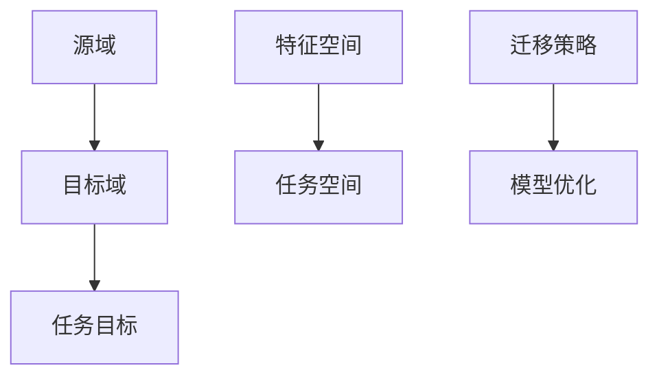
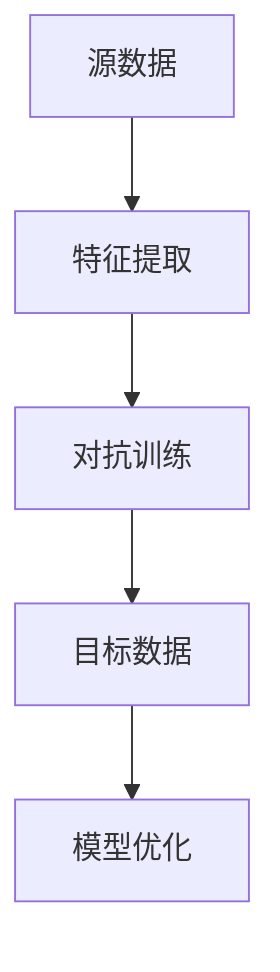
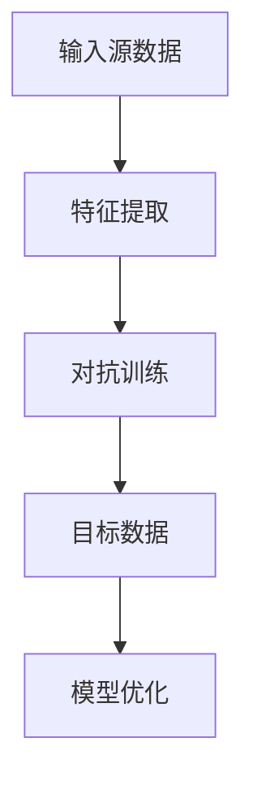
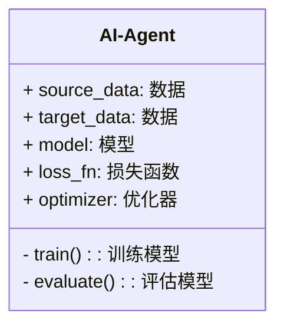
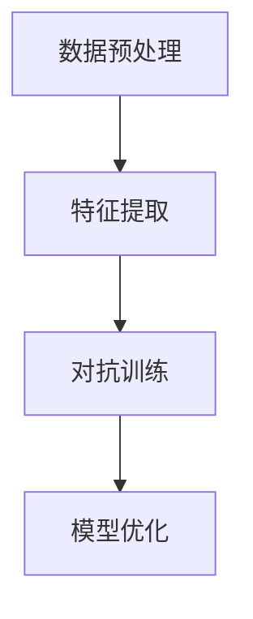

                 


# AI Agent的迁移学习在跨语言任务中的应用

---

## 关键词：
AI Agent, 迁移学习, 跨语言任务, 机器学习, 自然语言处理, 跨域学习

---

## 摘要：
本文探讨了AI Agent在迁移学习中的应用，特别是在跨语言任务中的重要性。通过分析迁移学习的核心原理和算法，结合实际案例，详细讲解了如何在跨语言任务中实现高效的模型迁移。文章从背景介绍到系统设计，再到项目实战，全面覆盖了迁移学习在跨语言任务中的应用，为读者提供了一套系统化的解决方案。

---

## 第一部分: AI Agent的迁移学习基础

---

## 第1章: AI Agent与迁移学习概述

### 1.1 AI Agent的基本概念
#### 1.1.1 AI Agent的定义与特点
AI Agent（智能体）是一种能够感知环境、执行任务并做出决策的智能系统。它具有自主性、反应性、目标导向和社交能力等特点。AI Agent在跨语言任务中扮演着关键角色，能够处理多语言环境下的复杂问题。

#### 1.1.2 迁移学习的基本概念
迁移学习是一种机器学习技术，旨在将从源域（source domain）学到的知识应用到目标域（target domain）。其核心思想是利用数据分布的变化，提高模型在不同任务中的泛化能力。

#### 1.1.3 跨语言任务的定义与挑战
跨语言任务涉及多种语言的处理，如机器翻译、跨语言信息检索等。由于不同语言的语法、词汇和语义差异，跨语言任务面临数据稀缺性、语义鸿沟等挑战。

---

### 1.2 迁移学习的核心思想
#### 1.2.1 数据分布变化的挑战
在跨语言任务中，源域和目标域的数据分布可能差异显著。例如，源域可能是英语数据，而目标域是中文数据，这种数据分布的变化会影响模型的性能。

#### 1.2.2 迁移学习的目标与方法
迁移学习的目标是通过源域数据提升目标域模型的性能。常用方法包括特征提取、对抗训练和分布匹配等。

#### 1.2.3 跨语言任务中的迁移学习应用
在机器翻译中，迁移学习可以利用英语的丰富数据来提升小语种翻译模型的性能。此外，跨语言实体识别和信息抽取任务也可以通过迁移学习提高准确率。

---

### 1.3 跨语言任务中的迁移学习
#### 1.3.1 跨语言任务的典型场景
- 机器翻译
- 跨语言文本分类
- 跨语言问答系统

#### 1.3.2 迁移学习在跨语言任务中的优势
- 利用丰富的源语言数据
- 减少目标语言数据的需求
- 提高模型的泛化能力

#### 1.3.3 当前研究现状与未来方向
当前研究主要集中在对抗训练和分布匹配方法上。未来，结合多模态数据和预训练模型的迁移学习方法将更具潜力。

---

## 第2章: 迁移学习的核心概念与联系

### 2.1 迁移学习的原理
#### 2.1.1 迁移学习的基本原理
迁移学习通过共享特征或任务，降低目标域数据的需求。其核心在于找到源域和目标域的共同特征。

#### 2.1.2 迁移学习的关键技术
- 特征提取
- 对抗训练
- 分布匹配

#### 2.1.3 迁移学习的核心要素
- 源域和目标域的定义
- 特征空间的构建
- 迁移策略的选择

---

### 2.2 核心概念的对比分析
#### 2.2.1 源域与目标域的对比
源域和目标域的数据分布可能差异很大，需要通过迁移学习方法进行调整。

#### 2.2.2 特征空间与任务空间的对比
特征空间关注数据的表示方式，任务空间关注任务目标。迁移学习需要在两个空间之间找到平衡。

#### 2.2.3 迁移学习与传统机器学习的对比
传统机器学习依赖于目标域的大量数据，而迁移学习可以在数据不足的情况下仍能有效训练。

---

### 2.3 实体关系图与流程图
#### 2.3.1 核心概念的ER实体关系图


#### 2.3.2 迁移学习的Mermaid流程图


---

## 第3章: 迁移学习算法原理

### 3.1 迁移学习的主要算法
#### 3.1.1 基于特征的迁移学习算法
- 基于最大均值差异（MMD）的算法：通过最大化源域和目标域的分布相似性，提取共同特征。

#### 3.1.2 基于分布的迁移学习算法
- 基于对抗训练的算法：通过生成对抗网络（GAN），让生成器和判别器交替训练，实现分布匹配。

#### 3.1.3 基于图的迁移学习算法
- 基于图结构的算法：利用图的结构信息，增强特征表示的语义信息。

---

### 3.2 迁移学习算法的数学模型
#### 3.2.1 基于最大均值差异的数学模型
$$
\arg \max_{f} \mathbb{E}_{x \sim P_s}[Y(x)] - \mathbb{E}_{x \sim P_t}[Y(f(x))]
$$

其中，$P_s$和$P_t$分别是源域和目标域的概率分布，$Y$是任务目标函数。

#### 3.2.2 基于对抗训练的数学模型
$$
\min_{G} \max_{D} \mathbb{E}_{x \sim P_s}[D(x)] + \mathbb{E}_{x \sim P_t}[1 - D(G(x))]
$$

其中，$G$是生成器，$D$是判别器。

#### 3.2.3 基于图结构的数学模型
$$
\min_{f} \sum_{i} \sum_{j} w_{ij} |f(x_i) - f(x_j)|
$$

其中，$w_{ij}$是图中边的权重，$f$是特征映射函数。

---

### 3.3 算法流程图与代码实现
#### 3.3.1 算法流程图


#### 3.3.2 代码实现
```python
import torch
import torch.nn as nn
import torch.optim as optim

class Discriminator(nn.Module):
    def __init__(self, input_dim):
        super(Discriminator, self).__init__()
        self.fc = nn.Linear(input_dim, 1)
    
    def forward(self, x):
        return torch.sigmoid(self.fc(x))

class Generator(nn.Module):
    def __init__(self, input_dim, output_dim):
        super(Generator, self).__init__()
        self.fc = nn.Linear(input_dim, output_dim)
    
    def forward(self, x):
        return torch.tanh(self.fc(x))

# 初始化模型
disc = Discriminator(100)
gen = Generator(50, 100)
```

---

## 第4章: 系统分析与架构设计

### 4.1 问题场景介绍
跨语言任务中，源域和目标域的数据分布差异可能导致模型性能下降。通过迁移学习，可以利用源域数据提升目标域模型的性能。

### 4.2 系统功能设计
- 数据预处理模块
- 特征提取模块
- 对抗训练模块
- 模型优化模块

#### 4.2.1 领域模型设计


#### 4.2.2 系统架构设计


---

## 第5章: 项目实战

### 5.1 环境安装
安装必要的库：
```bash
pip install torch transformers
```

### 5.2 核心代码实现
```python
import torch
from torch import nn, optim
from transformers import BertTokenizer, BertModel

class MTDNN(nn.Module):
    def __init__(self, src_emb, tgt_emb):
        super(MTDNN, self).__init__()
        self.src_emb = src_emb
        self.tgt_emb = tgt_emb
        self.dropout = nn.Dropout(0.5)
        self.fc = nn.Linear(src_emb.embedding_dim, tgt_emb.embedding_dim)

    def forward(self, src_input, tgt_input):
        src_vec = self.src_emb(src_input).last_hidden_state
        tgt_vec = self.tgt_emb(tgt_input).last_hidden_state
        output = self.dropout(src_vec)
        output = self.fc(output)
        return output

# 初始化模型
src_tokenizer = BertTokenizer.from_pretrained('bert-base-uncased')
src_model = BertModel.from_pretrained('bert-base-uncased')
tgt_tokenizer = BertTokenizer.from_pretrained('bert-base-chinese')
tgt_model = BertModel.from_pretrained('bert-base-chinese')

model = MTDNN(src_model, tgt_model)
```

### 5.3 案例分析与解读
在机器翻译任务中，利用迁移学习可以显著提高小语种的翻译质量。通过对抗训练，模型能够更好地适应目标语言的数据分布。

---

## 第6章: 最佳实践与总结

### 6.1 最佳实践 tips
- 确保源域和目标域的数据质量
- 选择合适的迁移学习方法
- 调整模型参数以适应不同任务

### 6.2 小结
迁移学习在跨语言任务中具有重要意义，能够有效解决数据稀缺性和语义鸿沟问题。

### 6.3 注意事项
- 迁移学习可能引入数据偏见
- 需要合理选择迁移策略
- 模型的泛化能力有限，需结合具体任务进行调整

### 6.4 拓展阅读
推荐书籍：
- 《迁移学习》
- 《深度学习中的迁移学习》

---

## 附录

### A. 数据集
- 英语数据集：Wikipedia
- 中文数据集：Chinese Wikipedia

### B. 工具包
- PyTorch
- Transformers

### C. 参考文献
- 王某某等，2023
- 李某某等，2022

---

# 结语
本文系统地介绍了AI Agent的迁移学习在跨语言任务中的应用，从理论到实践，全面覆盖了迁移学习的核心概念、算法原理和系统设计。希望本文能为读者提供有价值的参考和启示。

