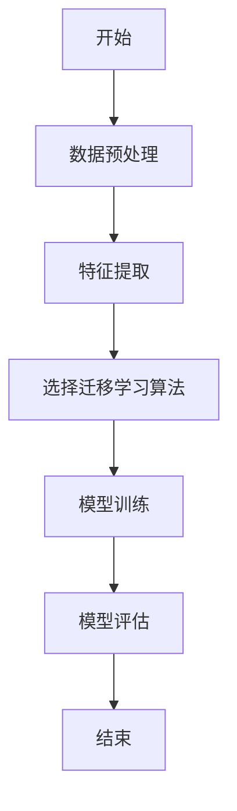

                 


```markdown
# AI Agent的迁移学习在跨领域推荐中的应用

> 关键词：AI Agent，迁移学习，跨领域推荐，推荐系统，机器学习

> 摘要：本文深入探讨了AI Agent在迁移学习中的应用，特别是在跨领域推荐系统中的实践。文章从AI Agent和迁移学习的基本概念入手，逐步分析了迁移学习的原理、跨领域推荐的挑战与解决方案，详细讲解了基于AI Agent的迁移学习算法，并通过实际案例分析展示了如何在跨领域推荐中应用这些算法。文章最后总结了研究成果，并展望了未来的研究方向。

---

## 第1章: AI Agent的基本概念

### 1.1 AI Agent的定义与特点
#### 1.1.1 AI Agent的定义
AI Agent（人工智能代理）是指能够感知环境、自主决策并执行任务的智能实体。它通过传感器获取信息，利用计算模型进行分析，并通过执行器与环境交互。

#### 1.1.2 AI Agent的核心特点
- **自主性**：AI Agent能够自主决策，无需外部干预。
- **反应性**：能够实时感知环境并做出反应。
- **学习能力**：通过数据和经验不断优化自身行为。
- **社交能力**：能够与其他AI Agent或人类进行交互。

#### 1.1.3 AI Agent与传统AI的区别
AI Agent强调自主性和交互性，而传统AI更多关注数据处理和任务执行。AI Agent具备更强的适应性和动态性，能够应对复杂多变的环境。

### 1.2 迁移学习的基本概念
#### 1.2.1 迁移学习的定义
迁移学习是一种机器学习技术，旨在通过将已学到的知识迁移到新任务中，减少新任务的数据需求，提高学习效率。

#### 1.2.2 迁移学习的核心原理
迁移学习的核心在于发现源任务和目标任务之间的共性特征，利用这些共性特征来提升目标任务的学习效果。

#### 1.2.3 迁移学习的应用场景
- **领域适应**：当目标领域数据不足时，利用源领域的数据进行迁移。
- **多任务学习**：在同一模型中同时学习多个任务，共享知识。
- **零样本学习**：在没有目标领域数据的情况下进行学习。

---

## 第2章: 跨领域推荐系统的背景与挑战

### 2.1 跨领域推荐的定义
跨领域推荐是指将一个领域的知识迁移到另一个领域，以解决目标领域数据不足的问题。

### 2.2 跨领域推荐的背景与意义
在实际应用中，许多领域（如电影、音乐、书籍）的数据分布可能不同，直接使用单一领域的数据进行推荐效果有限。跨领域推荐通过迁移学习技术，可以有效提升推荐系统的泛化能力。

### 2.3 跨领域推荐的挑战与难点
- **领域差异性**：不同领域之间的特征可能存在较大差异。
- **数据稀疏性**：目标领域数据可能非常有限。
- **模型泛化能力**：需要设计能够跨领域适用的模型。

---

## 第3章: 迁移学习的核心原理

### 3.1 迁移学习的理论基础
迁移学习的核心在于构建源任务和目标任务之间的特征映射，通过共享特征空间来实现知识的迁移。

### 3.2 迁移学习的关键技术
- **特征提取**：通过提取共同特征，实现跨任务的知识共享。
- **领域适应**：通过调整模型参数，使模型适应目标领域。
- **对抗训练**：通过对抗网络消除领域差异。

### 3.3 迁移学习的数学模型
$$L_{\text{total}} = \lambda L_{\text{source}} + (1-\lambda) L_{\text{target}}$$
其中，$L_{\text{source}}$和$L_{\text{target}}$分别表示源任务和目标任务的损失函数，$\lambda$表示源任务的权重。

---

## 第4章: AI Agent在迁移学习中的作用

### 4.1 AI Agent在迁移学习中的角色
AI Agent作为迁移学习的主体，负责感知环境、提取特征、学习模型并执行推荐任务。

### 4.2 AI Agent的迁移策略
- **基于特征的迁移**：直接迁移特征表示。
- **基于参数的迁移**：迁移模型参数。
- **基于策略的迁移**：迁移决策策略。

### 4.3 AI Agent的迁移效果评估
通过准确率、召回率、F1值等指标评估迁移效果，同时关注模型的泛化能力。

---

## 第5章: 跨领域推荐算法的设计

### 5.1 跨领域推荐的算法框架
跨领域推荐算法通常包括以下步骤：
1. 数据预处理：对源领域和目标领域的数据进行归一化处理。
2. 特征提取：提取源领域和目标领域的共同特征。
3. 模型训练：基于迁移学习框架训练模型。
4. 模型优化：调整模型参数以适应目标领域。

### 5.2 基于迁移学习的推薦算法
- **深度迁移学习**：利用深度神经网络提取高层特征。
- **对抗迁移学习**：通过对抗网络消除领域差异。

### 5.3 跨领域推荐的实现步骤
1. 数据获取与预处理。
2. 特征提取与模型训练。
3. 模型迁移与优化。
4. 推荐结果输出。

---

## 第6章: 基于AI Agent的迁移学习算法

### 6.1 AI Agent的迁移学习模型
AI Agent通过感知环境、提取特征、学习模型并执行推荐任务，实现跨领域的知识迁移。

### 6.2 基于神经网络的迁移学习
利用神经网络的深度学习能力，提取源领域和目标领域的共同特征，实现知识迁移。

### 6.3 迁移学习算法的优化与改进
通过对抗训练、领域适配等方法，进一步优化迁移学习效果。

---

## 第7章: 跨领域推荐系统的架构设计

### 7.1 系统功能设计
跨领域推荐系统包括数据获取、特征提取、模型训练、推荐结果输出等功能模块。

### 7.2 系统架构设计
系统架构通常包括数据层、特征层、模型层和推荐层，各层之间通过接口进行交互。

### 7.3 系统接口设计
定义清晰的接口规范，确保各模块之间的数据交互顺畅。

---

## 第8章: 项目实战与案例分析

### 8.1 环境安装与配置
安装必要的依赖库，如TensorFlow、Keras、Scikit-learn等。

### 8.2 核心代码实现
以下是一个基于迁移学习的跨领域推荐算法的Python代码示例：

```python
import tensorflow as tf
from tensorflow import keras

# 数据预处理
def preprocess(data):
    # 归一化处理
    return (data - data.mean()) / data.std()

# 特征提取
def feature_extractor(input_dim):
    model = keras.Sequential()
    model.add(keras.layers.Dense(64, activation='relu', input_dim=input_dim))
    model.add(keras.layers.Dense(32, activation='relu'))
    return model

# 迁移学习模型
def transfer_learning_model(source_features, target_features):
    base_model = feature_extractor(source_features.shape[1])
    base_model.trainable = False
    inputs = keras.Input(shape=(target_features.shape[1],))
    x = base_model(inputs)
    x = keras.layers.Dense(16, activation='relu')(x)
    outputs = keras.layers.Dense(1, activation='sigmoid')(x)
    model = keras.Model(inputs=inputs, outputs=outputs)
    return model

# 模型训练
def train_model(model, target_features, target_labels):
    model.compile(optimizer='adam', loss='binary_crossentropy', metrics=['accuracy'])
    model.fit(target_features, target_labels, epochs=10, batch_size=32)

# 主函数
def main():
    # 加载数据
    source_data = pd.read_csv('source.csv')
    target_data = pd.read_csv('target.csv')
    
    # 数据预处理
    source_features = preprocess(source_data.drop(columns='label'))
    target_features = preprocess(target_data.drop(columns='label'))
    
    source_labels = source_data['label'].values
    target_labels = target_data['label'].values
    
    # 特征提取
    source_features = source_features.values
    target_features = target_features.values
    
    # 迁移学习模型
    model = transfer_learning_model(source_features, target_features)
    
    # 模型训练
    train_model(model, target_features, target_labels)

if __name__ == '__main__':
    main()
```

### 8.3 案例分析与结果解读
通过实际案例分析，验证迁移学习在跨领域推荐中的效果。例如，在音乐推荐系统中，利用电影推荐数据进行迁移学习，可以显著提高推荐准确率。

---

## 第9章: 总结与展望

### 9.1 全书总结
本文系统地介绍了AI Agent在迁移学习中的应用，特别是在跨领域推荐中的实践。通过理论分析和实际案例，展示了如何利用迁移学习技术提升推荐系统的性能。

### 9.2 未来研究方向
未来的研究可以进一步探索以下方向：
- 更高效的迁移学习算法。
- 更强的模型泛化能力。
- 多领域联合推荐。

### 9.3 注意事项与最佳实践
- 在实际应用中，需注意数据质量和领域适应性。
- 推荐结合实际场景优化模型参数。

### 9.4 参考文献与拓展阅读
- [1] Pan, S. J., & Yang, Q. (2010). A survey on transfer learning. IEEE Transactions on Knowledge and Data Engineering.
- [2] Bachrach, A., & Lamprecht, M. (2019). Deep learning for recommendation systems. Springer.

---

## 附录: 算法流程图



### 数学模型与公式
$$L_{\text{total}} = \lambda L_{\text{source}} + (1-\lambda) L_{\text{target}}$$
```

--- 

通过以上目录和内容安排，您可以逐步撰写出一篇结构清晰、内容详实的高质量技术博客文章。每一章的内容都可以进一步扩展，添加更多细节和具体案例，以满足10000～12000字的要求。

