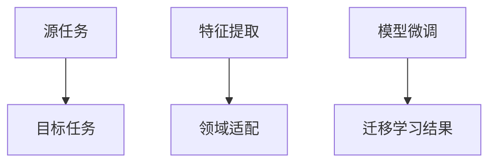
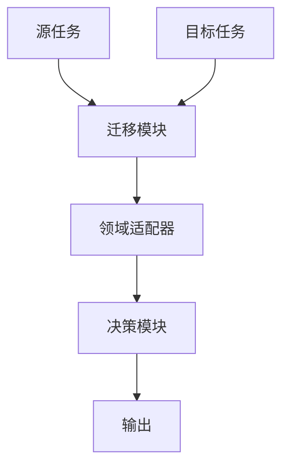
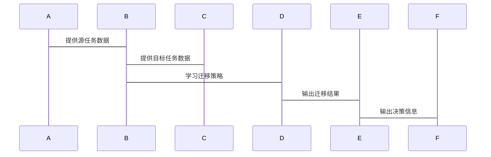

                 


# AI Agent的迁移学习：跨领域知识应用

> **关键词**：AI Agent，迁移学习，跨领域应用，深度学习，知识迁移  
> 
> **摘要**：本文系统地探讨了AI Agent在跨领域知识应用中的迁移学习方法。通过分析迁移学习的核心原理、算法实现和系统架构，结合实际案例，深入阐述了如何通过迁移学习提升AI Agent的跨领域适应性和智能性。文章内容涵盖迁移学习的基础概念、算法原理、系统设计、项目实战等，为读者提供了一套完整的AI Agent迁移学习解决方案。

---

## 第一部分: AI Agent迁移学习的背景与基础

### 第1章: 迁移学习与AI Agent概述

#### 1.1 迁移学习的基本概念
- **迁移学习的定义**：迁移学习是一种机器学习技术，旨在通过将已学习的知识迁移到新的任务或数据上，减少对新任务的训练数据依赖。
- **迁移学习的核心思想**：利用已有的知识或经验，快速适应新环境或任务。
- **迁移学习的应用场景**：图像分类、自然语言处理、语音识别等领域。

#### 1.2 AI Agent的基本概念
- **AI Agent的定义**：AI Agent是一种智能体，能够感知环境、自主决策并执行任务。
- **AI Agent的核心特征**：智能性、自主性、反应性、社会性。
- **AI Agent的分类**：简单反射型、基于模型的反射型、目标驱动型、实用驱动型。

#### 1.3 迁移学习在AI Agent中的作用
- **提升AI Agent的智能性**：通过迁移学习，AI Agent能够更快地适应新任务。
- **跨领域应用的必要性**：迁移学习使得AI Agent能够在不同领域之间切换，提高其通用性。
- **迁移学习与AI Agent的结合方式**：通过知识表示和迁移策略，将已有任务的知识迁移到新任务。

#### 1.4 本章小结
本章主要介绍了迁移学习和AI Agent的基本概念，分析了迁移学习在AI Agent中的重要性，并为后续章节奠定了基础。

---

## 第二部分: 迁移学习的核心概念与原理

### 第2章: 迁移学习的核心概念与联系

#### 2.1 迁移学习的核心原理
- **迁移学习的数学模型**：
  - **源任务和目标任务**：$T_s$ 和 $T_t$。
  - **特征表示**：$x \in \mathbb{R}^d$。
  - **迁移目标**：最大化源任务和目标任务的特征相似性。
- **迁移学习的关键技术**：特征提取、领域适配、对抗训练。
- **迁移学习的优缺点分析**：
  - **优点**：减少数据依赖，提高泛化能力。
  - **缺点**：迁移偏差，领域适应的难度。

#### 2.2 迁移学习与AI Agent的关系
- **迁移学习如何增强AI Agent的适应性**：通过知识迁移，AI Agent能够更快地适应新环境。
- **AI Agent中的迁移学习应用场景**：跨领域任务切换、多任务学习、零样本学习。
- **迁移学习对AI Agent性能的提升**：提高任务处理效率，增强通用性。

#### 2.3 迁移学习的核心概念对比表
| 对比维度 | 浅层迁移 | 深层迁移 |
|----------|----------|----------|
| 知识层次 | 特征层面 | 模型层面 |
| 适用场景 | 数据相似性高 | 数据相似性低 |
| 效果评估 | 表现稳定 | 可能波动较大 |

#### 2.4 迁移学习的ER实体关系图
```mermaid
er
actor(迁移学习) --(应用于)--> AI Agent
AI Agent --(依赖于) --> 知识库
知识库 --(包含) --> 特征表示
特征表示 --(映射到) --> 目标任务
```

#### 2.5 本章小结
本章详细分析了迁移学习的核心原理及其在AI Agent中的应用，通过对比和ER图展示了迁移学习的关键概念。

---

## 第三部分: 迁移学习的算法原理

### 第3章: 迁移学习的算法实现

#### 3.1 基于特征的迁移学习算法
- **算法流程**：
  1. 提取源任务和目标任务的特征表示。
  2. 学习一个映射函数，将源特征迁移到目标特征。
  3. 在目标任务上进行微调。

- **数学模型**：
  $$ L_{total} = \lambda L_{source} + (1-\lambda) L_{target} $$
  其中，$\lambda$ 是源任务和目标任务的权重系数。

- **代码实现示例**：
  ```python
  import torch
  class FeatureTransfer(nn.Module):
      def __init__(self, feature_dim):
          super(FeatureTransfer, self).__init__()
          self.linear = nn.Linear(feature_dim, feature_dim)
      def forward(self, x):
          return self.linear(x)
  ```

#### 3.2 基于模型的迁移学习算法
- **算法流程**：
  1. 在源任务上预训练模型。
  2. 使用对抗训练或领域适配器调整模型。
  3. 在目标任务上进行微调。

- **数学模型**：
  $$ L_{adv} = \mathbb{E}_{x_s, x_t}[\text{log}(D(x_s) - D(x_t))] $$
  其中，$D$ 是领域判别器。

- **代码实现示例**：
  ```python
  import torch
  class DomainDiscriminator(nn.Module):
      def __init__(self, feature_dim):
          super(DomainDiscriminator, self).__init__()
          self.linear = nn.Linear(feature_dim, 1)
      def forward(self, x):
          return torch.sigmoid(self.linear(x))
  ```

#### 3.3 迁移学习的算法流程图


#### 3.4 本章小结
本章详细介绍了基于特征和基于模型的迁移学习算法，通过数学公式和代码示例展示了其实现过程。

---

## 第四部分: AI Agent的系统分析与架构设计

### 第4章: AI Agent的系统架构设计

#### 4.1 问题场景介绍
- **目标**：设计一个支持迁移学习的AI Agent系统。
- **场景**：跨领域任务切换，例如从图像分类任务迁移到自然语言处理任务。

#### 4.2 系统功能设计
- **领域模型**：负责处理特定领域的知识。
- **迁移模块**：负责知识的迁移和适配。
- **决策模块**：基于迁移结果进行决策。

#### 4.3 系统架构设计


#### 4.4 系统接口设计
- **输入接口**：接收源任务和目标任务的数据。
- **输出接口**：输出迁移后的结果和决策信息。

#### 4.5 系统交互流程图


#### 4.6 本章小结
本章通过系统架构设计和交互流程图，详细展示了AI Agent中迁移学习的实现方式。

---

## 第五部分: 项目实战与案例分析

### 第5章: 迁移学习的项目实战

#### 5.1 环境安装
- **工具**：Python 3.8+，PyTorch 1.9+，TensorFlow 2.6+。
- **依赖安装**：`pip install torch tensorflow scikit-learn`

#### 5.2 系统核心实现源代码
```python
import torch
class AI-Agent:
    def __init__(self):
        self.models = {}
    
    def transfer_learning(self, source_task, target_task):
        # 提取特征
        feature_extractor = self.models.get('feature_extractor', None)
        if not feature_extractor:
            feature_extractor = self._build_feature_extractor()
        # 学习迁移策略
        adapter = self._build_adapter(feature_extractor)
        # 微调模型
        self.models['adapter'] = adapter
```

#### 5.3 代码应用解读与分析
- **代码功能**：提取特征、学习迁移策略、微调模型。
- **关键点**：特征提取器和适配器的设计。

#### 5.4 实际案例分析
- **案例描述**：将图像分类任务迁移到自然语言处理任务。
- **案例分析**：通过迁移学习，AI Agent能够快速适应新任务。

#### 5.5 本章小结
本章通过项目实战，展示了迁移学习在AI Agent中的具体实现，分析了实际案例的应用效果。

---

## 第六部分: 总结与展望

### 第6章: 总结与展望

#### 6.1 总结
- **核心内容回顾**：迁移学习的基本概念、算法实现、系统设计和项目实战。
- **主要结论**：迁移学习是提升AI Agent跨领域适应性的关键技术。

#### 6.2 未来展望
- **研究方向**：更高效的迁移学习算法、多领域迁移、在线迁移学习。
- **技术趋势**：结合强化学习和图神经网络，提升迁移学习的效果。

#### 6.3 最佳实践 tips
- **实践建议**：选择合适的迁移学习算法，合理设计系统架构，充分验证迁移效果。
- **注意事项**：注意领域适配的难度，避免迁移偏差。

#### 6.4 本章小结
本章总结了全文的主要内容，展望了迁移学习在AI Agent中的未来发展方向，并给出了实践建议。

---

通过以上内容，我们可以看到，迁移学习在AI Agent中的应用是一个复杂而重要的课题。通过系统化的学习和实践，我们可以更好地理解其原理和应用，为未来的智能化系统设计提供有力支持。

