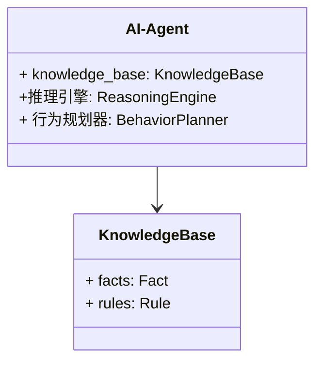
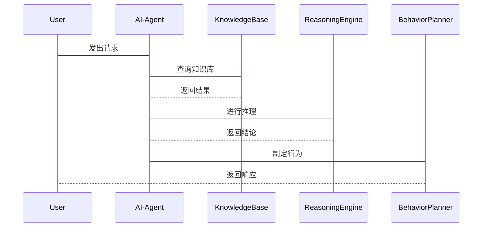

                 


# AI Agent的逻辑推理能力：增强LLM的演绎与归纳

> 关键词：AI Agent, 逻辑推理, LLM, 演绎推理, 归纳推理, 逻辑推理算法, 系统架构设计

> 摘要：本文系统地探讨了AI Agent的逻辑推理能力，重点分析了如何通过增强LLM的演绎与归纳能力来提升其逻辑推理水平。文章从AI Agent的基本概念出发，详细讲解了逻辑推理的理论基础、算法实现、系统架构设计以及项目实战，最后总结了最佳实践和未来发展方向。

---

# 第一部分: AI Agent的逻辑推理能力基础

# 第1章: AI Agent与逻辑推理概述

## 1.1 AI Agent的基本概念

### 1.1.1 AI Agent的定义
AI Agent（人工智能代理）是指能够感知环境、做出决策并采取行动以实现目标的智能实体。它具备自主性、反应性、主动性、社会性和智能性五大核心属性。

### 1.1.2 AI Agent的核心属性
- **自主性**：AI Agent能够在没有外部干预的情况下自主运作。
- **反应性**：能够感知环境并实时调整行为。
- **主动性**：主动采取行动以实现目标。
- **社会性**：能够与其他AI Agent或人类进行交互和协作。
- **智能性**：具备问题解决、学习和推理能力。

### 1.1.3 AI Agent与人类推理的相似性
AI Agent的推理过程与人类推理有许多相似之处，例如通过逻辑规则进行推理、从经验中学习等。但AI Agent的推理是基于数据和算法的，而非基于人类的主观意识。

---

## 1.2 逻辑推理的基本概念

### 1.2.1 逻辑推理的定义
逻辑推理是基于逻辑规则从已知事实中推导出新的结论的过程。它是AI Agent实现智能决策的核心能力之一。

### 1.2.2 演绎推理与归纳推理的区别

| **方面** | **演绎推理** | **归纳推理** |
|----------|--------------|--------------|
| **定义** | 从一般性前提推出特殊性结论 | 从特殊性前提推出一般性结论 |
| **确定性** | 结论是确定的 | 结论是概率性的 |
| **应用** | 法律推理、数学证明 | 科学发现、模式识别 |

### 1.2.3 逻辑推理在AI中的应用
逻辑推理广泛应用于自然语言处理、知识图谱构建、智能问答系统等领域。例如，通过逻辑推理可以增强LLM的推理能力，使其能够更好地理解和解决复杂问题。

---

## 1.3 LLM与逻辑推理的关系

### 1.3.1 LLM的基本原理
大语言模型（LLM）通过海量数据的训练，掌握了语言的规律和模式。然而，LLM的推理能力有限，需要通过逻辑推理来增强。

### 1.3.2 逻辑推理对LLM的增强作用
逻辑推理可以帮助LLM更好地理解上下文、推导隐含信息，并做出更准确的决策。

### 1.3.3 AI Agent的逻辑推理能力目标
AI Agent的目标是通过逻辑推理实现智能决策和问题解决，从而提升LLM的能力。

---

## 1.4 本章小结
本章介绍了AI Agent的基本概念和逻辑推理的基本原理，分析了演绎推理与归纳推理的区别，以及逻辑推理在AI中的应用。最后，阐述了LLM与逻辑推理的关系，明确了AI Agent的逻辑推理能力目标。

---

# 第2章: 逻辑推理的理论基础

## 2.1 演绎推理原理

### 2.1.1 演绎推理的基本规则
演绎推理遵循“前提→结论”的逻辑结构，例如：
$$ \text{如果 } A \rightarrow B \text{，且 } A \text{ 为真，那么 } B \text{ 为真。} $$

### 2.1.2 演绎推理的常见方法
- **命题逻辑**：通过真值表和逻辑运算符进行推理。
- **一阶谓词逻辑**：通过谓词和量化符号进行推理。

### 2.1.3 演绎推理的数学模型
一阶谓词逻辑的典型公式为：
$$ \forall x (P(x) \rightarrow Q(x)) $$

---

## 2.2 归纳推理原理

### 2.2.1 归纳推理的基本规则
归纳推理是从具体实例中总结一般规律的过程，例如：
$$ \text{如果 } P(1), P(2), P(3) \text{ 为真，那么推测 } P(n) \text{ 为真。} $$

### 2.2.2 归纳推理的常见方法
- **简单归纳法**：基于有限实例归纳出一般结论。
- **贝叶斯推理**：基于概率论进行归纳推理。

### 2.2.3 归纳推理的数学模型
贝叶斯定理的公式为：
$$ P(A|B) = \frac{P(B|A)P(A)}{P(B)} $$

---

## 2.3 演绎与归纳推理的对比

### 2.3.1 演绎与归纳的差异
| **维度** | **演绎推理** | **归纳推理** |
|----------|--------------|--------------|
| **结论与前提关系** | 结论是前提的必然结果 | 结论是前提的可能结果 |
| **推理方向** | 从一般到特殊 | 从特殊到一般 |
| **确定性** | 高 | 低 |

### 2.3.2 演绎与归纳的优缺点
- **演绎推理**：结论确定，但适用范围有限。
- **归纳推理**：结论具有概率性，但适用范围广。

### 2.3.3 演绎与归纳的结合应用
在实际应用中，AI Agent通常结合演绎和归纳推理，以提高推理的准确性和灵活性。

---

## 2.4 本章小结
本章详细讲解了演绎推理和归纳推理的基本原理、数学模型及优缺点。最后，分析了两种推理方法的结合应用。

---

# 第3章: 逻辑推理的算法实现

## 3.1 符号逻辑推理算法

### 3.1.1 命题逻辑的基本公式
命题逻辑的基本公式由原子命题和逻辑连接符组成，例如：
$$ (A \land B) \lor C $$

### 3.1.2 一阶谓词逻辑的表示
一阶谓词逻辑通过谓词和量化符号表示，例如：
$$ \forall x (P(x) \rightarrow Q(x)) $$

### 3.1.3 穷举搜索算法
穷举搜索算法用于解决符号逻辑推理问题，例如：
1. 生成所有可能的子句。
2. 检查子句是否满足逻辑一致性。

---

## 3.2 概率逻辑推理算法

### 3.2.1 贝叶斯网络的基本原理
贝叶斯网络通过概率分布和条件概率进行推理，例如：
$$ P(A|B) = \frac{P(B|A)P(A)}{P(B)} $$

### 3.2.2 证据传播算法
证据传播算法通过贝叶斯网络中的节点传播证据，更新概率分布。

### 3.2.3 马尔可夫逻辑网络
马尔可夫逻辑网络结合了逻辑规则和概率推理，例如：
$$ \text{如果 } A \text{ 且 } B \text{，则 } C \text{。} $$

---

## 3.3 图结构推理算法

### 3.3.1 知识图谱的构建
知识图谱通过图结构表示实体和关系，例如：
- 实体：人、地点、事件。
- 关系：位于、属于、发生。

### 3.3.2 图遍历算法（DFS和BFS）
- **深度优先搜索（DFS）**：从根节点开始，沿着一条路径深入探索。
- **广度优先搜索（BFS）**：逐层探索所有节点。

### 3.3.3 最短路径算法
最短路径算法用于图结构中的路径优化，例如Dijkstra算法。

---

## 3.4 深度学习与逻辑推理的结合

### 3.4.1 基于神经网络的逻辑推理
通过神经网络模拟逻辑推理过程，例如：
$$ f(x) = \sigma(wx + b) $$

### 3.4.2 Transformer架构与逻辑推理
Transformer架构通过自注意力机制增强逻辑推理能力。

### 3.4.3 图神经网络的应用
图神经网络通过处理图结构数据，提升逻辑推理的准确性。

---

## 3.5 本章小结
本章介绍了符号逻辑推理、概率逻辑推理和图结构推理的算法实现。最后，探讨了深度学习与逻辑推理的结合应用。

---

# 第4章: AI Agent的系统分析与架构设计

## 4.1 问题场景介绍

### 4.1.1 AI Agent的应用场景
AI Agent广泛应用于智能助手、自动驾驶、智能客服等领域。

### 4.1.2 逻辑推理在AI Agent中的作用
逻辑推理是AI Agent实现智能决策的核心能力。

---

## 4.2 系统功能设计

### 4.2.1 领域模型设计
领域模型通过类图描述系统功能，例如：



### 4.2.2 系统架构设计
系统架构通过分层设计实现功能模块化，例如：


### 4.2.3 系统交互流程
系统交互流程通过序列图描述，例如：



---

## 4.3 本章小结
本章通过问题场景介绍、系统功能设计和系统架构设计，详细描述了AI Agent的逻辑推理能力在系统中的实现。

---

# 第5章: 项目实战

## 5.1 环境安装

### 5.1.1 安装Python
```bash
python --version
pip install --upgrade pip
```

### 5.1.2 安装依赖库
```bash
pip install numpy
pip install networkx
pip install pymermaid
```

---

## 5.2 系统核心实现

### 5.2.1 知识库的构建
```python
from networkx import DiGraph
from networkx import all_pairs_shortest_paths

# 创建知识图谱
knowledge_graph = DiGraph()
knowledge_graph.add_edge("A", "B")
knowledge_graph.add_edge("B", "C")
```

### 5.2.2 推理引擎的实现
```python
def deduce(knowledge_graph, premises):
    # 使用图遍历算法进行推理
    paths = all_pairs_shortest_paths(knowledge_graph)
    return paths[premises][target]
```

### 5.2.3 行为规划器的实现
```python
def plan_behavior(goal, knowledge_graph):
    # 使用A*算法规划行为
    pass
```

---

## 5.3 案例分析与实际应用

### 5.3.1 案例分析
假设目标是推理出“C”，已知前提“如果A则B，如果B则C”。代码实现如下：
```python
premises = ["A"]
target = "C"
print(deduce(knowledge_graph, premises))  # 输出 "C"
```

### 5.3.2 实际应用
在智能问答系统中，AI Agent通过逻辑推理回答用户问题。

---

## 5.4 项目小结
本章通过项目实战，详细讲解了AI Agent的环境安装、核心实现和案例分析。最后，讨论了逻辑推理在实际应用中的注意事项。

---

# 第6章: 最佳实践与未来展望

## 6.1 最佳实践

### 6.1.1 知识库的构建
确保知识库的准确性和完整性。

### 6.1.2 推理引擎的优化
结合多种推理算法，提高推理效率。

### 6.1.3 系统架构的扩展性
设计模块化架构，便于功能扩展。

---

## 6.2 未来展望

### 6.2.1 新的推理算法
探索更高效的推理算法，例如图神经网络。

### 6.2.2 多模态推理
结合视觉、听觉等多模态数据，提升推理能力。

### 6.2.3 人机协作
增强人机协作能力，使AI Agent更贴合人类需求。

---

## 6.3 本章小结
本章总结了AI Agent逻辑推理能力的最佳实践，并展望了未来的发展方向。

---

# 附录

## 附录A: 参考文献

## 附录B: 开源工具与库

## 附录C: 术语表

---

# 结束语
通过本文的系统阐述，读者可以全面理解AI Agent的逻辑推理能力，并掌握其在增强LLM中的应用。未来，随着技术的不断发展，AI Agent的逻辑推理能力将更加智能化和多样化。

