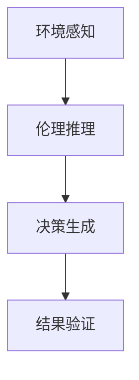
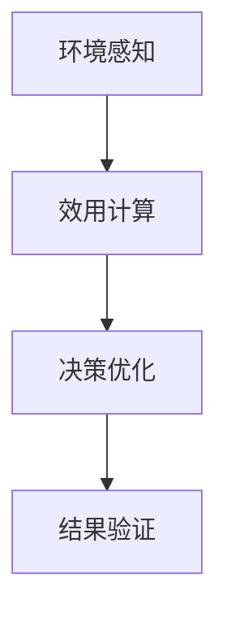
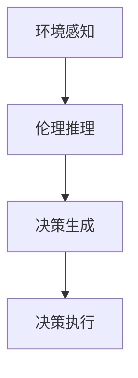
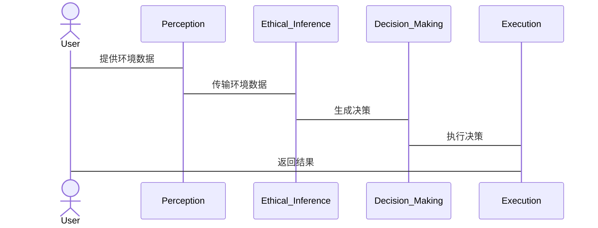

                 


# AI Agent的道德决策框架：伦理AI实践

## 关键词：AI Agent，道德决策，伦理框架，人工智能，决策算法

## 摘要：本文系统阐述了AI Agent道德决策框架的核心概念、算法原理、系统架构和实践应用。通过详细分析伦理决策的背景、核心要素，结合具体案例，探讨了如何构建具备伦理认知能力的AI Agent。文章深入解析了基于规则、效用及混合型的伦理决策算法，展示了实际系统的实现过程，并提出了应对伦理AI实践中的挑战性问题的解决方案。

---

## 第一章: AI Agent与道德决策的背景介绍

### 1.1 AI Agent的基本概念
#### 1.1.1 人工智能与AI Agent的定义
人工智能（Artificial Intelligence, AI）是指通过计算机技术模拟人类智能的系统。AI Agent（智能体）是能够感知环境、自主决策并采取行动的实体。AI Agent可以是软件程序、机器人或其他智能系统，具备以下核心特征：
- **自主性**：无需外部干预，自主决策。
- **反应性**：能够实时感知环境并调整行为。
- **目标导向**：基于目标驱动行动。
- **学习能力**：通过经验改进性能。

#### 1.1.2 AI Agent的核心特征与分类
AI Agent可以分为以下几类：
1. **简单反射型**：基于预设规则执行任务。
2. **基于模型的反应型**：利用内部模型预测行为后果。
3. **目标驱动型**：为实现特定目标而行动。
4. **实用驱动型**：优化效用函数以实现最优决策。

#### 1.1.3 AI Agent与人类决策的异同点
| 特性 | AI Agent | 人类决策 |
|------|----------|----------|
| 决策速度 | 快速，基于算法 | 较慢，涉及情感与理性 |
| 学习能力 | 可通过数据学习 | 需要经验与反思 |
| 决策范围 | 通常在预设范围内 | 可突破框架 |

### 1.2 道德决策的定义与重要性
#### 1.2.1 道德决策的基本概念
道德决策是指在符合伦理规范的前提下做出的选择。在AI Agent中，道德决策确保其行为符合社会 accepted 的价值观和伦理准则。

#### 1.2.2 道德决策在AI Agent中的作用
AI Agent的道德决策能力：
- **确保安全**：避免对人类或环境造成伤害。
- **提升信任**：让用户和公众信任AI系统。
- **符合法律**：遵守相关法律法规。

#### 1.2.3 道德决策的伦理与社会影响
- **伦理影响**：影响社会对AI的信任与接受度。
- **社会影响**：改变人类与AI的互动方式。

### 1.3 AI Agent道德决策的背景与挑战
#### 1.3.1 当前AI技术的发展现状
AI Agent已广泛应用于自动驾驶、医疗诊断等领域，但其决策的伦理问题日益突出。

#### 1.3.2 道德决策在AI中的必要性
AI Agent的决策可能对人类生命和财产造成重大影响，因此必须具备道德决策能力。

#### 1.3.3 实现AI Agent道德决策的主要挑战
| 挑战 | 描述 |
|------|------|
| 技术复杂性 | 道德决策涉及多学科知识 |
| 不确定性 | 现实世界中存在大量不确定性 |
| 利益冲突 | 不同利益相关者的冲突 |

---

## 第二章: AI Agent道德决策框架的核心概念与联系

### 2.1 道德决策框架的原理与结构
#### 2.1.1 道德决策框架的基本原理
框架通过定义伦理原则、建立决策规则，指导AI Agent做出符合伦理的决策。

#### 2.1.2 道德决策框架的组成结构
1. **伦理原则**：如功利主义、义务论等。
2. **决策规则**：将伦理原则转化为具体规则。
3. **决策模型**：整合规则与环境信息，生成决策。

#### 2.1.3 道德决策框架的核心要素
- **伦理原则**：指导决策的基本准则。
- **决策规则**：具体的行为规范。
- **环境模型**：感知环境信息。

### 2.2 道德决策框架的核心概念对比
#### 2.2.1 伦理原则与决策规则的对比
| 特性 | 伦理原则 | 决策规则 |
|------|----------|----------|
| 层次 | 宏观指导 | 微观规范 |
| 可变性 | 较高 | 较低 |

#### 2.2.2 不同伦理框架的优缺点分析
| 伦理框架 | 优点 | 缺点 |
|----------|------|------|
| 功利主义 | 结果最优 | 忽视过程 |
|义务论 | 重视义务 | 结果不可控 |

#### 2.2.3 道德决策与法律规范的关系
道德决策是法律规范的补充，法律为最低要求，道德为更高标准。

### 2.3 道德决策框架的ER实体关系图
```mermaid
er
actor: AI Agent
role: 决策者
rule: 伦理规则
outcome: 决策结果
```

---

## 第三章: AI Agent道德决策的算法原理

### 3.1 道德决策算法的基本原理
#### 3.1.1 基于规则的道德决策算法
- **规则定义**：将伦理原则转化为具体规则。
- **规则匹配**：根据环境信息匹配适用规则。
- **规则执行**：按照规则做出决策。

#### 3.1.2 基于效用的道德决策算法
- **效用函数**：量化决策的伦理价值。
- **优化过程**：通过优化算法找到效用最大化的决策。

#### 3.1.3 混合型决策算法
结合规则与效用两种方法，确保决策的灵活性与可靠性。

### 3.2 道德决策算法的实现步骤
1. **环境感知**：获取当前环境信息。
2. **伦理推理**：应用伦理原则进行推理。
3. **决策生成**：基于推理结果生成决策。
4. **结果验证**：验证决策的伦理合规性。

### 3.3 基于规则的道德决策算法实现
#### 3.3.1 算法流程图


#### 3.3.2 核心代码实现
```python
def ethical_decision-making(environment, rules):
    for rule in rules:
        if rule.apply(environment):
            return rule.action
    return default_action
```

### 3.4 基于效用的道德决策算法
#### 3.4.1 算法流程图


#### 3.4.2 核心代码实现
```python
def utility_function(action, environment):
    return sum([evaluate_utility(action, feature) for feature in environment])
```

### 3.5 算法的优缺点对比
| 算法类型 | 优点 | 缺点 |
|----------|------|------|
| 基于规则 | 简单易懂 | 适应性差 |
| 基于效用 | 灵活 | 计算复杂 |

---

## 第四章: AI Agent道德决策系统的架构设计

### 4.1 系统架构设计概述
系统由感知层、决策层和执行层组成，各层协同完成道德决策。

### 4.2 系统功能设计
#### 4.2.1 环境感知模块
负责收集和分析环境信息，如传感器数据。

#### 4.2.2 伦理推理模块
基于伦理原则和环境信息，推理出符合伦理的决策。

#### 4.2.3 决策执行模块
根据推理结果，执行具体动作。

### 4.3 系统架构图


### 4.4 系统接口设计
- **输入接口**：接收环境数据。
- **输出接口**：输出决策结果。

### 4.5 系统交互序列图


---

## 第五章: AI Agent道德决策框架的项目实战

### 5.1 项目背景与目标
以自动驾驶为例，设计一个具备道德决策能力的AI系统。

### 5.2 项目环境安装
安装Python、NumPy、Scikit-learn等工具。

### 5.3 核心代码实现
```python
class EthicalDecisionSystem:
    def __init__(self, rules):
        self.rules = rules

    def make_decision(self, environment):
        for rule in self.rules:
            if rule.check(environment):
                return rule.act(environment)
        return default_action
```

### 5.4 代码应用解读
分析代码实现，确保每一步都符合伦理规范。

### 5.5 实际案例分析
自动驾驶在紧急情况下如何做出道德决策。

### 5.6 项目小结
总结项目实现过程中的关键点和可能的错误。

---

## 第六章: 道德决策框架的挑战与解决方案

### 6.1 技术挑战
- **算法复杂性**：如何平衡规则与效用。
- **数据稀疏性**：如何处理稀疏数据。

### 6.2 社会挑战
- **文化差异**：不同文化背景下道德标准不同。
- **用户信任**：如何提升用户对AI决策的信任。

### 6.3 法律挑战
- **法律合规性**：确保AI决策符合法律法规。
- **责任归属**：明确AI决策的责任主体。

### 6.4 解决方案
- **技术层面**：结合多种算法，提高决策的灵活性。
- **社会层面**：通过教育和宣传提升公众认知。
- **法律层面**：制定相关法律法规，明确责任。

---

## 第七章: 总结与展望

### 7.1 本文总结
系统介绍了AI Agent道德决策框架的核心概念、算法原理和系统架构。

### 7.2 未来展望
- **算法优化**：开发更高效的伦理决策算法。
- **跨学科融合**：结合心理学、社会学等学科知识。
- **广泛应用**：在更多领域实现道德AI。

### 7.3 最佳实践 tips
- 在设计AI系统时，始终考虑伦理问题。
- 定期更新伦理框架，以适应社会发展。

### 7.4 小结
AI Agent的道德决策框架是实现伦理AI的关键，未来将更加重要。

---

## 参考文献
- Russell, S., & Norvig, P. (2010). Artificial Intelligence: A Modern Approach.
- Moor, J. H. (2006). What is an artificial moral agent?

