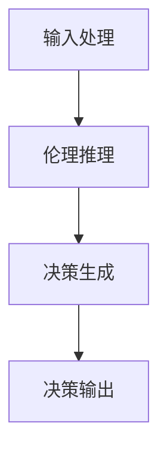
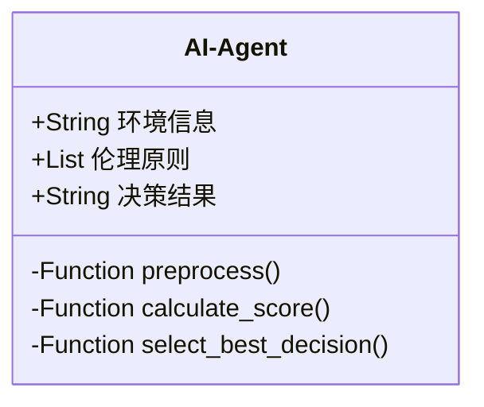
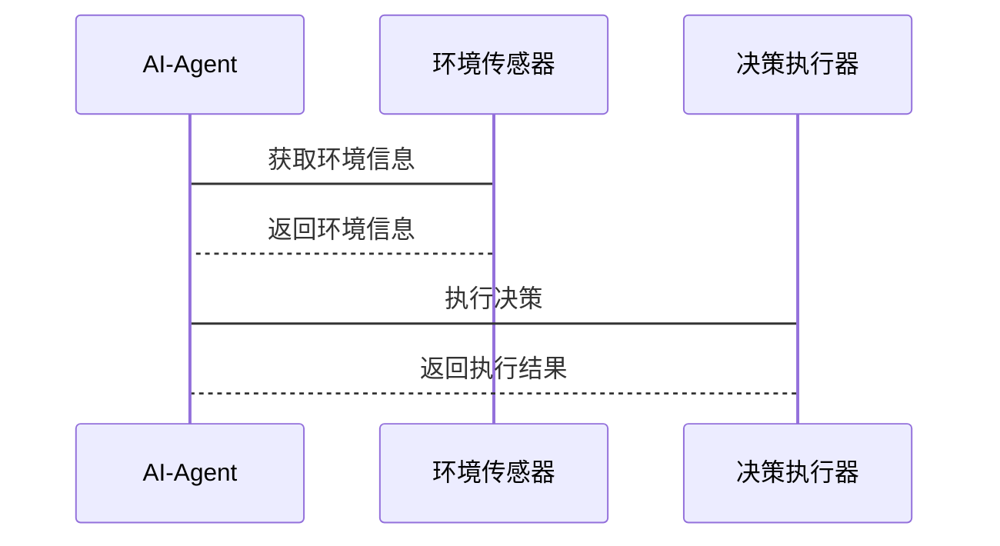

                 


# AI Agent的道德决策框架：在人工智能中植入伦理考量

## 关键词：AI Agent，道德决策，伦理框架，人工智能，决策算法

## 摘要：随着人工智能技术的快速发展，AI Agent在各个领域的应用日益广泛。然而，在AI Agent进行决策时，如何确保其遵循伦理和道德规范，成为一个亟待解决的重要问题。本文将从AI Agent的背景与概念出发，详细探讨道德决策框架的核心原理、算法实现、系统架构设计以及实际应用案例。通过分析和解读，为AI Agent的伦理决策提供理论支持和实践指导，帮助读者理解如何在人工智能中植入伦理考量。

---

# 第1章: AI Agent与道德决策框架的背景介绍

## 1.1 AI Agent的基本概念

### 1.1.1 人工智能代理的定义

人工智能代理（AI Agent）是指能够感知环境、自主决策并执行任务的智能实体。它通过传感器获取信息，利用计算模型进行推理，并通过执行器与环境交互。AI Agent的核心目标是通过智能决策和行动，实现预定任务或目标。

### 1.1.2 AI Agent的核心特征

AI Agent具有以下几个核心特征：
- **自主性**：能够在没有外部干预的情况下独立运行。
- **反应性**：能够根据环境反馈实时调整决策和行为。
- **目标导向**：以明确的目标为导向，优化决策过程。
- **学习能力**：通过数据和经验不断优化自身的决策能力。

### 1.1.3 伦理决策在AI Agent中的重要性

AI Agent的决策直接影响其行为结果，尤其是在涉及人类生命、财产或社会利益的场景中，伦理决策尤为重要。例如，在自动驾驶汽车中，AI Agent需要在紧急情况下做出符合伦理的决策，以最小化潜在的伤害。因此，将伦理考量融入AI Agent的决策框架，是确保其行为符合社会伦理规范的关键。

## 1.2 道德决策框架的背景与问题描述

### 1.2.1 当前AI技术的快速发展与伦理挑战

随着AI技术的迅速发展，AI Agent已经在医疗、交通、金融等领域得到广泛应用。然而，AI Agent的决策可能带来伦理上的争议。例如，AI Agent可能面临“电车难题”式的困境，在有限资源下选择最优决策，这需要明确的伦理框架来指导。

### 1.2.2 伦理决策框架的必要性

伦理决策框架是确保AI Agent行为符合伦理规范的核心工具。通过明确的伦理原则和决策规则，AI Agent可以在复杂场景中做出符合人类价值观的决策。此外，伦理决策框架还能帮助开发者在设计阶段就考虑伦理问题，避免潜在的伦理风险。

### 1.2.3 伦理决策的边界与外延

伦理决策的边界在于如何在有限的场景下应用伦理原则，同时避免过度泛化。例如，在自动驾驶中，AI Agent需要在紧急情况下做出决策，但并不需要在所有情况下都考虑伦理问题。伦理决策的外延则包括如何将伦理原则转化为具体的决策规则，以及如何在不同场景下动态调整这些规则。

### 1.2.4 伦理框架的核心要素

伦理框架的核心要素包括：
- **伦理原则**：如功利主义、义务论、公正和关怀伦理。
- **决策规则**：基于伦理原则制定的具体规则。
- **决策模型**：将伦理原则和规则转化为具体的决策算法。

## 1.3 本章小结

本章介绍了AI Agent的基本概念和核心特征，重点探讨了伦理决策在AI Agent中的重要性。通过分析当前AI技术面临的伦理挑战，提出了构建伦理决策框架的必要性，并明确了伦理框架的核心要素。

---

# 第2章: 道德决策框架的核心概念与联系

## 2.1 伦理决策框架的原理

### 2.1.1 伦理决策的基本原理

伦理决策框架通过将伦理原则转化为具体的决策规则，并结合实际情况进行推理和判断，最终生成符合伦理的决策。其基本原理包括以下几个步骤：
1. **感知环境**：通过传感器或数据输入获取相关信息。
2. **伦理推理**：基于伦理原则和决策规则进行推理。
3. **决策生成**：根据推理结果生成具体的决策。
4. **行为执行**：将决策转化为具体行动。

### 2.1.2 伦理原则与决策规则的关系

伦理原则是决策的指导思想，而决策规则是伦理原则的具体化。例如，功利主义原则可以转化为“最大化整体利益”的决策规则。

## 2.2 核心概念的属性特征对比

### 2.2.1 伦理原则的特征对比

以下是几种主要伦理原则的特征对比：

| 伦理原则       | 描述                                                                 |
|----------------|----------------------------------------------------------------------|
| 功利主义       | 以最大化整体利益为目标，强调结果的优化。                              |
| 义务论         | 强调行为的道德义务，以义务为导向。                                      |
| 公正           | 突出公平和正义，确保决策过程和结果的公平性。                            |
| 关怀伦理       | 强调个体关怀，注重决策对个体的影响。                                    |

### 2.2.2 决策模型的属性分析

决策模型的属性包括：
- **输入**：决策模型的输入包括环境信息和伦理原则。
- **输出**：决策模型的输出是具体的决策。
- **推理方式**：基于逻辑推理或概率计算。

## 2.3 ER实体关系图架构

以下是伦理决策框架的ER实体关系图：

```mermaid
erDiagram
    actor 伦理原则 <<--- role 应用场景
    应用场景 <<--- role 决策规则
    决策规则 <<--- role 决策模型
```

### 2.3.1 实体关系图的构建

伦理决策框架涉及的主要实体包括：
- **伦理原则**：决策的基础。
- **应用场景**：决策的具体情境。
- **决策规则**：伦理原则的具体化。
- **决策模型**：将决策规则转化为具体决策的算法。

### 2.3.2 实体关系图的分析

伦理原则通过应用场景与决策规则相关联，决策规则进一步与决策模型关联，最终生成具体的决策。

## 2.4 本章小结

本章通过对比分析伦理原则和决策规则的特征，构建了伦理决策框架的ER实体关系图，并详细探讨了各实体之间的关系。

---

# 第3章: 道德决策框架的算法原理

## 3.1 道德决策算法的概述

### 3.1.1 算法的基本流程

道德决策算法的基本流程包括：
1. **输入处理**：获取环境信息和伦理原则。
2. **伦理推理**：基于伦理原则进行推理。
3. **决策生成**：根据推理结果生成决策。

### 3.1.2 算法的核心思想

算法的核心思想是将伦理原则转化为具体的决策规则，并通过逻辑推理或概率计算生成决策。

## 3.2 道德决策算法的详细步骤

### 3.2.1 输入处理

输入处理包括：
- **环境信息**：如场景描述、相关方信息等。
- **伦理原则**：如功利主义、义务论等。

### 3.2.2 伦理推理

伦理推理包括：
- **逻辑推理**：基于伦理原则进行逻辑推理。
- **概率计算**：计算不同决策的可能结果及其概率。

### 3.2.3 决策生成

决策生成包括：
- **规则匹配**：根据推理结果匹配具体的决策规则。
- **决策输出**：生成具体的决策。

## 3.3 算法的数学模型与公式

### 3.3.1 数学模型的构建

以下是一个简单的数学模型，用于计算不同决策的伦理得分：

$$
\text{伦理得分} = \sum_{i=1}^{n} w_i \cdot p_i
$$

其中，$w_i$ 是伦理原则 $i$ 的权重，$p_i$ 是决策满足伦理原则 $i$ 的程度。

### 3.3.2 算法实现的Python代码示例

以下是一个简单的Python代码示例：

```python
def ethical_decision-making(environment_info, ethical_principles):
    # 环境信息处理
    processed_info = preprocess(environment_info)
    
    # 伦理推理
    scores = []
    for principle in ethical_principles:
        score = calculate_score(processed_info, principle)
        scores.append(score)
    
    # 决策生成
    decision = select_best_decision(scores)
    return decision

# 示例用法
environment_info = {
    'scenario': '交通事故',
    'parties_involved': ['驾驶员', '行人']
}
ethical_principles = ['功利主义', '义务论']

result = ethical_decision-making(environment_info, ethical_principles)
print(result)
```

### 3.3.3 算法的流程图

以下是算法的mermaid流程图：



## 3.4 本章小结

本章详细讲解了道德决策算法的基本流程和实现方法，并通过数学模型和Python代码示例进行了具体说明。

---

# 第4章: 道德决策框架的系统分析与架构设计

## 4.1 系统分析

### 4.1.1 问题场景介绍

以自动驾驶为例，AI Agent需要在紧急情况下做出符合伦理的决策。

### 4.1.2 项目介绍

本项目旨在构建一个基于伦理决策框架的自动驾驶系统。

## 4.2 系统功能设计

### 4.2.1 领域模型mermaid类图

以下是领域模型的mermaid类图：



## 4.3 系统架构设计

### 4.3.1 系统架构mermaid架构图

以下是系统架构的mermaid架构图：


### 4.3.2 系统接口设计

系统接口设计包括：
- **输入接口**：接收环境传感器的数据。
- **输出接口**：将决策结果发送给执行器。

### 4.3.3 系统交互mermaid序列图

以下是系统交互的mermaid序列图：



## 4.4 本章小结

本章通过系统分析和架构设计，构建了一个基于伦理决策框架的自动驾驶系统，并详细描述了系统的功能设计和架构设计。

---

# 第5章: 道德决策框架的项目实战

## 5.1 项目环境与工具安装

### 5.1.1 环境配置

以下是项目环境配置示例：

```bash
# 安装Python和相关库
pip install numpy
pip install matplotlib
pip install scikit-learn
```

## 5.2 系统核心实现

### 5.2.1 伦理决策算法实现

以下是伦理决策算法的Python代码实现：

```python
def preprocess(environment_info):
    # 数据预处理
    processed_info = {}
    for key, value in environment_info.items():
        processed_info[key] = value.lower()
    return processed_info

def calculate_score(processed_info, principle):
    # 计算伦理得分
    score = 0
    if principle == '功利主义':
        score = processed_info['人数'] * 10 + processed_info['伤害程度'] * 5
    elif principle == '义务论':
        score = 100 if processed_info['行为合法性'] else 0
    return score

def select_best_decision(scores):
    # 选择最优决策
    max_score = max(scores)
    best_decision = scores.index(max_score)
    return f"决策{best_decision + 1}"
```

### 5.2.2 项目代码实现

以下是项目的核心代码实现：

```python
class AI-Agent:
    def __init__(self):
        self.environment_info = {}
        self.ethical_principles = []
    
    def preprocess(self):
        # 数据预处理
        processed_info = {}
        for key, value in self.environment_info.items():
            processed_info[key] = value.lower()
        return processed_info
    
    def calculate_score(self, principle):
        # 计算伦理得分
        score = 0
        if principle == '功利主义':
            score = self.preprocess()['人数'] * 10 + self.preprocess()['伤害程度'] * 5
        elif principle == '义务论':
            score = 100 if self.preprocess()['行为合法性'] else 0
        return score
    
    def select_best_decision(self):
        # 选择最优决策
        scores = [self.calculate_score(principle) for principle in self.ethical_principles]
        max_score = max(scores)
        best_decision = scores.index(max_score)
        return f"决策{best_decision + 1}"
    
    def make_decision(self):
        # 执行决策
        decision = self.select_best_decision()
        return decision

# 示例用法
agent = AI-Agent()
agent.environment_info = {
    'scenario': '交通事故',
    '人数': 2,
    '伤害程度': 3,
    '行为合法性': True
}
agent.ethical_principles = ['功利主义', '义务论']
decision = agent.make_decision()
print(decision)
```

### 5.2.3 代码实现解读

上述代码实现了一个简单的伦理决策算法，能够根据不同的伦理原则生成具体的决策。通过预处理环境信息、计算伦理得分并选择最优决策，AI Agent能够做出符合伦理的决策。

### 5.2.4 实际案例分析

以自动驾驶为例，AI Agent在紧急情况下需要做出决策，例如在交通事故中选择较小的伤害。

### 5.2.5 决策结果解读

通过代码实现，AI Agent能够根据不同的伦理原则生成具体的决策，并输出决策结果。

## 5.3 项目小结

本章通过项目实战，详细讲解了如何将伦理决策框架应用于实际场景，并通过代码实现和案例分析，展示了伦理决策框架的实际应用价值。

---

# 第6章: 道德决策框架的挑战与解决方案

## 6.1 实际应用中的挑战

### 6.1.1 伦理原则的模糊性

伦理原则在实际应用中可能存在模糊性，例如“公正”和“关怀伦理”在具体场景中的应用可能因人而异。

### 6.1.2 决策的透明性与可解释性

AI Agent的决策过程需要具备透明性与可解释性，以便人类能够理解和信任AI的决策。

## 6.2 解决方案

### 6.2.1 伦理原则的动态调整

通过动态调整伦理原则的权重，AI Agent可以根据具体场景灵活调整决策策略。

### 6.2.2 提高决策的透明性与可解释性

通过记录决策过程和提供解释，AI Agent的决策过程可以更加透明和可解释。

## 6.3 本章小结

本章分析了伦理决策框架在实际应用中的挑战，并提出了相应的解决方案。

---

# 第7章: 总结与展望

## 7.1 总结

本文详细探讨了AI Agent的道德决策框架，从背景介绍、核心概念、算法原理、系统架构设计到项目实战，全面分析了伦理决策框架的构建与应用。通过具体的案例分析和代码实现，展示了伦理决策框架的实际应用价值。

## 7.2 最佳实践

在实际应用中，建议开发者：
- **明确伦理原则**：在设计阶段明确AI Agent的伦理原则。
- **动态调整决策规则**：根据具体场景动态调整决策规则。
- **提高透明性与可解释性**：确保AI Agent的决策过程透明且可解释。

## 7.3 未来展望

未来，随着AI技术的不断发展，伦理决策框架将更加复杂和精细。可以通过引入更多的伦理原则和动态调整决策规则，进一步提高AI Agent的伦理决策能力。

---

# 参考文献

（此处列出参考文献）

---

# 附录

（此处列出附录内容）

---

通过以上目录和内容，我们可以看到，AI Agent的道德决策框架是一个复杂而重要的领域。通过构建伦理决策框架，可以在人工智能系统中植入伦理考量，确保AI Agent的行为符合人类的价值观和道德规范。

