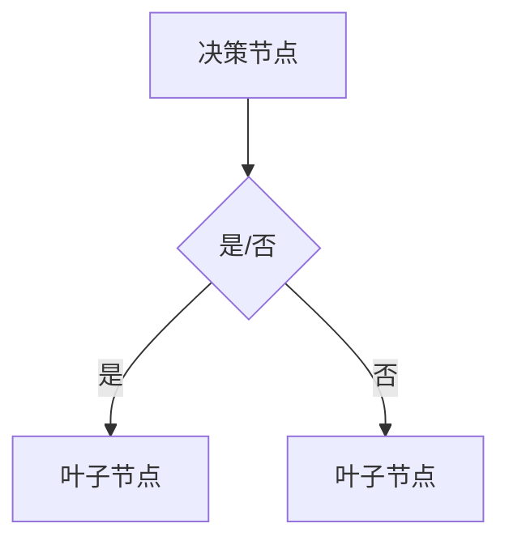
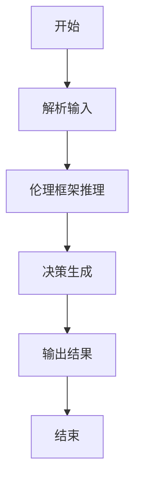
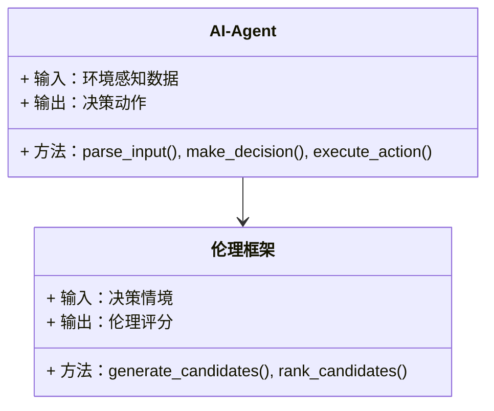
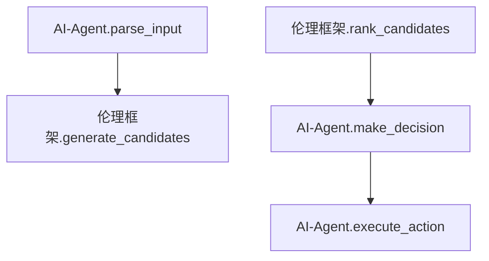

                 


# AI Agent的道德决策：在LLM中植入伦理框架

> **关键词**：AI Agent，道德决策，LLM，伦理框架，人工智能，大语言模型

> **摘要**：随着AI Agent技术的快速发展，如何在大语言模型（LLM）中植入伦理框架，使其在道德决策方面表现得更加合理和人性化，已成为当前人工智能领域的重要研究方向。本文将从AI Agent的基本概念出发，深入探讨道德决策的核心问题，并结合具体的伦理框架设计，分析如何在LLM中嵌入伦理决策机制。通过算法原理、系统架构和实战案例的详细讲解，本文旨在为AI Agent的伦理决策提供一份全面的技术指南。

---

## 第一部分：AI Agent的道德决策概述

### 第1章：AI Agent与道德决策概述

#### 1.1 AI Agent的基本概念

- **1.1.1 AI Agent的定义与特点**
  - AI Agent（智能体）是指能够感知环境并采取行动以实现目标的实体。
  - 特点包括自主性、反应性、目标导向性和社会性。

- **1.1.2 AI Agent的类型与应用场景**
  - 分为简单反射型、基于模型的反应型、目标驱动型和实用驱动型。
  - 应用场景包括自动驾驶、智能助手、机器人服务员等。

- **1.1.3 道德决策在AI Agent中的重要性**
  - AI Agent在复杂环境中需要做出符合伦理的决策。
  - 道德决策能力直接影响AI Agent的可信度和用户接受度。

#### 1.2 道德决策的核心问题

- **1.2.1 什么是道德决策**
  - 道德决策是指在多个可能的选择中，基于伦理准则选择最优行动的过程。

- **1.2.2 道德决策的复杂性与挑战**
  - 不同文化、法律和伦理体系下的道德标准差异。
  - 动态变化的环境和利益相关者的多样性。

- **1.2.3 为什么在AI Agent中需要道德决策**
  - 避免AI Agent的决策对人类或社会造成负面影响。
  - 提高AI Agent在复杂情境中的适应性和可信度。

#### 1.3 LLM与道德决策的结合

- **1.3.1 LLM的基本原理**
  - LLM（大语言模型）通过大量数据训练，能够理解和生成人类语言。
  - 基于概率分布生成文本，具备强大的文本理解和生成能力。

- **1.3.2 LLM在道德决策中的潜力**
  - LLM可以模拟人类的伦理推理过程。
  - 通过训练数据中的伦理案例，LLM能够生成符合伦理的决策。

- **1.3.3 当前LLM在道德决策中的局限性**
  - 缺乏明确的伦理框架指导，容易受到训练数据偏差的影响。
  - 难以处理动态变化的伦理情境。

## 第二部分：伦理框架的核心概念与联系

### 第2章：伦理框架的核心原理

#### 2.1 伦理框架的定义与属性

- **2.1.1 伦理框架的定义**
  - 伦理框架是一种用于指导AI Agent在决策过程中遵循伦理准则的结构化体系。

- **2.1.2 伦理框架的属性对比表**

| 属性       | 描述                                                                 |
|------------|--------------------------------------------------------------------|
| 目标性     | 伦理框架旨在实现特定的伦理目标，如公正、尊重隐私等。          |
| 可定制性   | 可根据不同场景和需求进行调整和优化。                            |
| 可解释性   | 伦理框架的决策过程需要清晰可解释，以增强用户信任。            |
| 动态适应性 | 能够根据环境变化和反馈实时调整伦理决策策略。                  |

- **2.1.3 伦理框架的ER实体关系图**

```mermaid
er
    %% 伦理框架实体关系图
    rectangle 伦理框架 {
        rectangle 伦理准则 {
            属性：名称，描述，权重
        }
        rectangle 决策规则 {
            属性：条件，操作，优先级
        }
        rectangle 反馈机制 {
            属性：输入，输出，处理方式
        }
        伦理准则 -[拥有]-> 决策规则
        决策规则 -[依赖]-> 反馈机制
    }
```

#### 2.2 伦理框架与AI Agent的结合

- **2.2.1 伦理框架在AI Agent中的作用**
  - 指导AI Agent在决策过程中遵循伦理准则。
  - 在多目标冲突时，通过伦理框架进行优先级排序。

- **2.2.2 伦理框架的选择与设计原则**
  - 基于具体应用场景选择合适的伦理框架。
  - 伦理框架应具备灵活性和可扩展性。

- **2.2.3 伦理框架的动态调整机制**
  - 根据用户反馈和环境变化动态调整伦理决策策略。
  - 使用强化学习等技术优化伦理框架的适应性。

#### 2.3 伦理框架的数学模型

- **2.3.1 伦理框架的数学表达式**

$$
\text{伦理决策} = \arg\max_{a \in A} \sum_{i=1}^{n} w_i \cdot v_i(a)
$$

其中：
- $A$ 是可选动作集合。
- $w_i$ 是伦理准则$v_i$的权重。
- $v_i(a)$ 是动作$a$在准则$v_i$下的价值评分。

- **2.3.2 伦理框架的权重分配模型**

$$
w_i = f(\text{场景特征}, \text{历史决策})
$$

其中：
- $f$ 是基于场景特征和历史决策动态调整权重的函数。

- **2.3.3 伦理框架的决策树模型**



---

## 第三部分：算法原理

### 第3章：算法原理与实现

#### 3.1 基于伦理框架的LLM决策算法

- **3.1.1 算法原理**



- **3.1.2 算法实现步骤**

1. 解析输入：分析当前决策情境，提取相关特征。
2. 伦理框架推理：基于伦理框架生成多个候选决策。
3. 决策生成：根据伦理准则对候选决策进行排序，选择最优动作。
4. 输出结果：生成符合伦理的决策输出。

- **3.1.3 代码实现**

```python
def ethical_decision-making(context, ethical_framework):
    # 解析输入
    features = extract_features(context)
    # 伦理框架推理
    candidates = ethical_framework.generate_candidates(features)
    # 决策生成
    ranked_candidates = ethical_framework.rank_candidates(candidates)
    # 输出结果
    return ranked_candidates[0]

# 示例伦理框架实现
class EthicalFramework:
    def __init__(self, weights):
        self.weights = weights

    def generate_candidates(self, features):
        # 基于特征生成候选决策
        return [f for f in features]

    def rank_candidates(self, candidates):
        # 根据权重对候选决策进行排序
        return sorted(candidates, key=lambda x: sum(w * v for w, v in zip(self.weights, x)))

# 使用示例
context = "需要帮助一位老人过马路"
weights = [0.5, 0.3, 0.2]  # 对应安全、效率、隐私
ethical_framework = EthicalFramework(weights)
decision = ethical_decision-making(context, ethical_framework)
print(decision)
```

- **3.1.4 算法数学模型**

$$
\text{决策评分} = \sum_{i=1}^{n} w_i \cdot s_i
$$

其中：
- $w_i$ 是决策准则的权重。
- $s_i$ 是决策在准则$i$下的评分。

---

## 第四部分：系统分析与架构设计

### 第4章：系统架构与实现

#### 4.1 问题场景介绍

- **4.1.1 问题场景**
  - AI Agent需要在多个选项中做出符合伦理的决策。
  - 例如：自动驾驶在紧急情况下如何选择最优路径。

- **4.1.2 项目介绍**
  - 开发一个基于伦理框架的AI Agent系统。
  - 系统需要具备感知环境、推理伦理决策和执行动作的能力。

#### 4.2 系统功能设计

- **4.2.1 系统功能模块**



- **4.2.2 系统功能流程**



#### 4.3 系统架构设计

- **4.3.1 系统架构图**

```mermaid
container 系统架构 {
    component AI-Agent {
        parse_input(), make_decision(), execute_action()
    }
    component 伦理框架 {
        generate_candidates(), rank_candidates()
    }
    AI-Agent --> 伦理框架
}
```

- **4.3.2 系统交互序列图**

```mermaid
sequenceDiagram
    participant AI-Agent
    participant 伦理框架
    AI-Agent ->> 伦理框架: 提供决策情境
    伦理框架 ->> AI-Agent: 返回候选决策
    AI-Agent ->> 伦理框架: 选择最优决策
    AI-Agent ->> 执行动作
```

---

## 第五部分：项目实战

### 第5章：项目实战与案例分析

#### 5.1 环境安装与配置

- **安装Python环境**
  - 使用Anaconda或virtualenv创建独立的Python环境。
  - 安装必要的库：`numpy`, `mermaid`, `graphviz`。

- **安装LLM模型**
  - 使用Hugging Face平台提供的预训练模型。
  - 下载并安装`transformers`库：`pip install transformers`.

#### 5.2 核心代码实现

- **伦理框架实现**

```python
class EthicalFramework:
    def __init__(self, weights):
        self.weights = weights

    def generate_candidates(self, features):
        return [f for f in features]

    def rank_candidates(self, candidates):
        return sorted(candidates, key=lambda x: sum(w * v for w, v in zip(self.weights, x)))

# 示例权重
weights = [0.5, 0.3, 0.2]
framework = EthicalFramework(weights)
```

- **AI-Agent实现**

```python
class AI-Agent:
    def __init__(self, framework):
        self.framework = framework

    def parse_input(self, context):
        # 解析输入，提取特征
        features = extract_features(context)
        return features

    def make_decision(self, features):
        candidates = self.framework.generate_candidates(features)
        ranked = self.framework.rank_candidates(candidates)
        return ranked[0]

    def execute_action(self, decision):
        # 执行动作，返回结果
        return f"执行{decision}"
```

#### 5.3 案例分析

- **案例背景**
  - AI Agent需要在自动驾驶场景中做出紧急决策。

- **案例分析**

```python
context = "需要紧急避让行人"
agent = AI-Agent(EthicalFramework([0.5, 0.3, 0.2]))
decision = agent.make_decision(agent.parse_input(context))
print(agent.execute_action(decision))
# 输出：执行转向避开行人
```

---

## 第六部分：总结与展望

### 第6章：总结与展望

#### 6.1 本章总结

- 本文详细探讨了在AI Agent中植入伦理框架的重要性。
- 通过算法原理、系统架构和实战案例的讲解，展示了如何实现基于伦理框架的道德决策。

#### 6.2 未来展望

- **伦理框架的动态优化**
  - 结合强化学习，进一步优化伦理框架的适应性。
- **多模态伦理决策**
  - 将视觉、听觉等多种模态信息融入伦理决策过程。
- **跨文化伦理决策**
  - 研究如何在不同文化背景下调整伦理决策策略。

#### 6.3 最佳实践 tips

- 在设计伦理框架时，需充分考虑不同场景和用户需求。
- 定期更新和优化伦理框架，以应对不断变化的伦理挑战。
- 保持透明和可解释性，增强用户对AI Agent的信任。

---

通过本文的详细讲解，读者可以全面了解如何在AI Agent中植入伦理框架，实现道德决策。未来，随着技术的进步，伦理框架将在更多领域发挥重要作用，为人类社会带来更加智能和和谐的决策支持。

