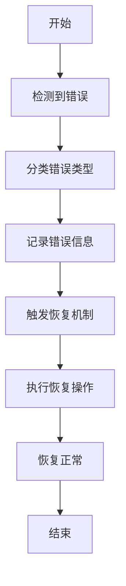
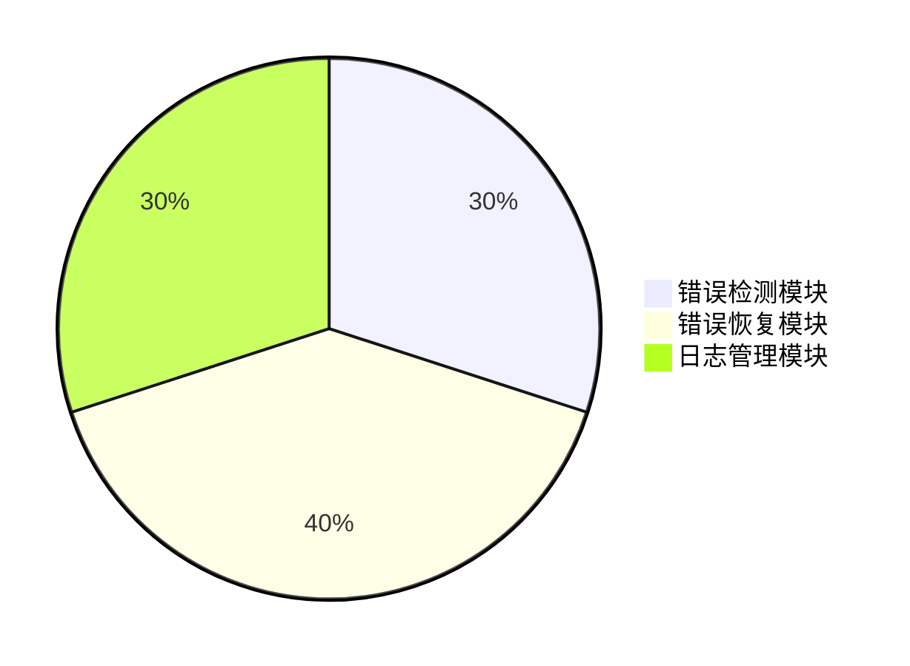
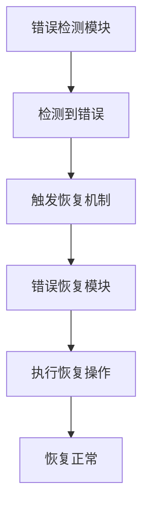

                 


# AI Agent的错误处理与恢复机制设计

## 关键词：
AI Agent，错误处理，恢复机制，系统架构，算法设计

## 摘要：
本文详细探讨了AI Agent在实际应用中常见的错误处理与恢复机制设计。从基本概念到数学模型，从系统架构到项目实战，系统性地分析了错误处理与恢复机制的核心原理和实现方法。通过具体的案例分析和代码实现，帮助读者全面理解并掌握AI Agent的错误处理与恢复机制设计的关键技术。

---

# 第1章: AI Agent错误处理与恢复机制的背景与概念

## 1.1 AI Agent的基本概念

### 1.1.1 AI Agent的定义与特点
AI Agent（人工智能代理）是指能够感知环境、自主决策并执行任务的智能实体。其特点包括：
- **自主性**：能够在没有外部干预的情况下独立运行。
- **反应性**：能够实时感知环境并做出响应。
- **目标导向**：具备明确的目标，通过行动实现目标。
- **可扩展性**：能够适应不同的应用场景和复杂度。

### 1.1.2 AI Agent的应用场景
AI Agent广泛应用于多个领域：
- **智能助手**：如Siri、Alexa等，帮助用户完成日常任务。
- **自动驾驶**：通过感知环境和决策系统实现自动驾驶功能。
- **智能客服**：通过自然语言处理技术为用户提供服务。
- **机器人控制**：用于工业机器人或服务机器人的控制与协调。

### 1.1.3 错误处理与恢复机制的重要性
在实际应用中，AI Agent可能会因为硬件故障、网络中断、算法错误等原因出现错误。错误处理与恢复机制能够确保系统在出现错误时能够及时检测、记录，并采取有效的恢复措施，保证系统的稳定性和可靠性。

---

## 1.2 错误处理与恢复机制的背景

### 1.2.1 AI Agent在实际应用中的问题
AI Agent在实际应用中面临诸多挑战：
- **环境不确定性**：AI Agent需要处理动态变化的环境，可能导致决策错误。
- **系统复杂性**：复杂的系统架构可能导致故障点增多，难以定位和修复。
- **资源限制**：在资源受限的环境中，AI Agent需要高效地处理错误。

### 1.2.2 错误处理与恢复机制的必要性
错误处理与恢复机制是AI Agent稳定运行的核心保障：
- **及时检测错误**：通过实时监控和日志分析，快速发现系统中的错误。
- **快速恢复**：在检测到错误后，系统能够迅速采取恢复措施，减少停机时间。
- **预防错误发生**：通过优化算法和系统架构设计，降低错误发生的概率。

### 1.2.3 本章小结
本章介绍了AI Agent的基本概念及其应用场景，并分析了错误处理与恢复机制在AI Agent中的重要性。

---

# 第2章: 错误处理与恢复机制的核心概念

## 2.1 错误类型与分类

### 2.1.1 系统错误与业务错误的区分
- **系统错误**：由于系统内部故障或外部环境问题引发的错误，例如硬件故障、网络中断等。
- **业务错误**：由于业务逻辑错误或数据不一致引发的错误，例如输入数据格式错误、逻辑判断失误等。

### 2.1.2 错误处理的优先级划分
- **紧急错误**：需要立即处理的错误，例如系统崩溃、严重数据丢失。
- **重要错误**：需要优先处理的错误，例如关键业务逻辑错误。
- **一般错误**：可以稍后处理的错误，例如用户输入错误。

### 2.1.3 错误状态与恢复点的定义
- **错误状态**：系统处于异常状态，无法正常执行任务。
- **恢复点**：系统在出现错误后，重新回到正常状态的点。

## 2.2 错误处理机制的原理

### 2.2.1 错误检测与识别的流程
1. **监控系统状态**：通过传感器、日志等手段实时监控系统运行状态。
2. **异常检测**：利用异常检测算法识别系统中的异常状态。
3. **错误分类**：根据错误类型和优先级对错误进行分类。

### 2.2.2 错误日志记录与分析
1. **日志记录**：将错误信息记录到日志文件中，包括错误类型、发生时间、错误位置等。
2. **日志分析**：通过数据分析工具对日志进行分析，找出错误的根本原因。

### 2.2.3 错误恢复的策略与方法
1. **重试机制**：在出现暂时性错误时，系统可以尝试重新执行操作。
2. **回滚机制**：在出现不可逆错误时，系统可以将系统状态回滚到最近的恢复点。
3. **降级模式**：在严重错误发生时，系统可以切换到降级模式，保证基本功能的运行。

## 2.3 恢复机制的设计原则

### 2.3.1 恢复点的设置与管理
- **设置恢复点**：在系统运行的关键节点设置恢复点，以便在出现错误时能够快速回滚。
- **管理恢复点**：定期清理过期的恢复点，确保系统运行效率。

### 2.3.2 恢复过程中的状态同步
- **状态同步**：在回滚到恢复点时，确保系统状态与恢复点一致。
- **数据一致性**：通过数据一致性检查，确保回滚后的数据与预期一致。

### 2.3.3 恢复机制的可扩展性与可维护性
- **可扩展性**：设计恢复机制时，应考虑系统的扩展性，能够适应未来的业务需求。
- **可维护性**：确保恢复机制易于维护和升级。

## 2.4 本章小结
本章详细介绍了错误类型与分类、错误处理机制的原理以及恢复机制的设计原则。

---

## 2.5 图表与数学公式

### 2.5.1 错误类型与分类的ER实体关系图

```mermaid
erDiagram
    customer {
        C_id : integer
        C_name : string
    }
    error {
        E_id : integer
        E_type : string
        E_description : string
    }
    error_type {
        ET_id : integer
        ET_name : string
    }
    customer -> error : 发生错误
    error -> error_type : 类型为
```

### 2.5.2 错误处理流程的Mermaid图



---

## 2.6 本章小结
通过图表和数学公式，进一步明确了错误处理与恢复机制的核心概念。

---

# 第3章: 错误处理与恢复机制的数学模型与算法

## 3.1 错误检测算法

### 3.1.1 基于概率的错误检测模型

```latex
$$ P(error) = 1 - P(correct) $$
```

其中，$P(correct)$ 表示正确执行的概率，$P(error)$ 表示发生错误的概率。

### 3.1.2 基于统计的错误检测方法

```latex
$$ count_{error} = \sum_{i=1}^{n} error_i $$
```

其中，$count_{error}$ 表示错误计数，$error_i$ 表示第i次操作是否发生错误。

### 3.1.3 错误检测的数学公式

```latex
$$ detect\_error(x) = \begin{cases}
    1 & \text{如果 } x \text{ 是错误} \\
    0 & \text{否则}
\end{cases} $$
```

---

## 3.2 错误恢复算法

### 3.2.1 基于状态机的恢复算法

```mermaid
stateDiagram
    [*] --(1)> A
    A --> B: 处理错误
    B --> C: 恢复状态
    C --> [*]
```

### 3.2.2 基于上下文的恢复策略

```latex
$$ recover(x) = \begin{cases}
    \text{重试} & \text{如果 } x \text{ 是暂时性错误} \\
    \text{回滚} & \text{如果 } x \text{ 是可回滚错误} \\
    \text{降级} & \text{如果 } x \text{ 是严重错误}
\end{cases} $$
```

### 3.2.3 恢复过程中的数学优化

```latex
$$ min_{x} \text{恢复时间} $$
```

---

## 3.3 算法实现与优化

### 3.3.1 错误检测算法的代码实现

```python
def detect_error(data):
    # 检测错误
    if data['status'] == 'error':
        return True
    else:
        return False
```

### 3.3.2 恢复算法的代码实现

```python
def recover(error_type):
    # 根据错误类型执行恢复操作
    if error_type == 'temporary':
        return 'retry'
    elif error_type == 'rollback':
        return 'rollback'
    else:
        return 'degrade'
```

---

## 3.4 本章小结
本章通过数学模型和算法，详细讲解了错误检测和恢复的实现方法，并提供了代码示例和数学公式。

---

# 第4章: 错误处理与恢复机制的系统架构设计

## 4.1 系统架构概述

### 4.1.1 系统功能模块划分
- **错误检测模块**：负责实时检测系统中的错误。
- **错误恢复模块**：负责执行恢复操作。
- **日志管理模块**：负责记录和分析错误日志。

### 4.1.2 系统组件之间的关系
- 错误检测模块与恢复模块通过消息队列进行通信。
- 日志管理模块负责记录错误信息，并为恢复模块提供数据支持。

### 4.1.3 系统架构的可扩展性设计
- 采用微服务架构，各模块独立运行，便于扩展和维护。

---

## 4.2 系统功能设计

### 4.2.1 错误检测模块的设计
- **实时监控**：通过心跳检测机制，每隔一定时间检查系统状态。
- **异常报警**：当检测到异常时，触发报警机制，通知相关人员。

### 4.2.2 错误恢复模块的设计
- **恢复策略**：根据错误类型选择不同的恢复策略，例如重试、回滚等。
- **状态同步**：在恢复过程中，确保系统状态与恢复点一致。

### 4.2.3 日志管理模块的设计
- **日志记录**：将错误信息记录到数据库中，包括错误类型、发生时间、错误位置等。
- **日志分析**：通过数据分析工具，找出错误的根本原因，并生成报告。

---

## 4.3 系统架构图

### 4.3.1 系统架构的Mermaid图



### 4.3.2 系统组件的交互流程图



---

## 4.4 本章小结
本章详细讲解了错误处理与恢复机制的系统架构设计，并通过图表展示了系统组件之间的关系和交互流程。

---

# 第5章: 错误处理与恢复机制的项目实战

## 5.1 项目背景与目标

### 5.1.1 项目需求分析
- 开发一个智能客服系统，能够自动处理用户的咨询和投诉。
- 在系统出现错误时，能够快速检测并恢复。

### 5.1.2 项目目标设定
- 实现错误检测与恢复机制，确保系统稳定运行。
- 提供详细的错误日志，便于后续分析和优化。

### 5.1.3 项目范围界定
- 项目范围：智能客服系统的错误处理与恢复模块。
- 不包括：其他功能模块的开发，例如自然语言处理模块。

---

## 5.2 项目实战

### 5.2.1 环境安装
- **操作系统**：Linux Ubuntu 20.04
- **开发工具**：Python 3.8、Django 2.2、PostgreSQL 12
- **依赖库**：Pillow、requests、beautifulsoup4

### 5.2.2 系统核心实现源代码

```python
# 错误检测模块
class ErrorDetector:
    def __init__(self):
        self.last_error = None

    def detect_error(self, response):
        if response.status_code != 200:
            self.last_error = response.status_code
            return True
        return False

# 错误恢复模块
class RecoveryStrategy:
    def __init__(self):
        self.recovery_points = []

    def add_recovery_point(self, point):
        self.recovery_points.append(point)

    def recover(self, error_type):
        if error_type == 'temporary':
            return 'retry'
        elif error_type == 'permanent':
            return 'rollback'
        else:
            return 'degrade'

# 日志管理模块
class LogManager:
    def __init__(self):
        self.error_log = []

    def record_error(self, error_info):
        self.error_log.append(error_info)

    def analyze_error(self):
        # 分析错误日志，生成报告
        pass
```

### 5.2.3 代码应用解读与分析
- **错误检测模块**：通过HTTP状态码检测错误，当状态码不是200时，认为发生了错误。
- **错误恢复模块**：根据错误类型选择不同的恢复策略，例如重试、回滚或降级。
- **日志管理模块**：记录错误信息，并提供分析功能，帮助开发人员找出错误的根本原因。

### 5.2.4 实际案例分析
- **案例1**：网络中断导致HTTP请求失败，错误检测模块检测到错误后，触发恢复机制，选择重试策略，最终成功发送请求。
- **案例2**：数据库连接错误，错误检测模块检测到错误后，触发恢复机制，选择回滚策略，将系统状态恢复到之前的状态。

### 5.2.5 项目小结
通过实际案例的分析，验证了错误处理与恢复机制的有效性，确保了系统的稳定性和可靠性。

---

## 5.3 本章小结
本章通过项目实战，详细讲解了错误处理与恢复机制的实现过程，包括环境安装、代码实现和案例分析。

---

# 第6章: 最佳实践与总结

## 6.1 最佳实践

### 6.1.1 设计原则
- **简单性**：尽量简化错误处理逻辑，避免过度复杂的实现。
- **可扩展性**：设计能够适应未来需求的错误处理机制。
- **可维护性**：确保错误处理代码易于维护和升级。

### 6.1.2 开发注意事项
- **日志记录**：确保日志信息足够详细，便于后续分析。
- **错误分类**：根据错误的影响范围和严重程度进行分类，便于制定恢复策略。
- **测试与验证**：在开发过程中，充分测试错误处理与恢复机制，确保其有效性和可靠性。

### 6.1.3 拓展阅读
- **相关书籍**：《容错软件工程》、《系统可靠性与容错计算》
- **技术博客**：阅读相关技术博客，了解最新的错误处理与恢复技术。

---

## 6.2 本章小结
本章总结了错误处理与恢复机制设计的最佳实践，并提出了未来的研究方向。

---

# 附录: 参考文献与工具

## 附录A: 参考文献
1. 《容错软件工程》
2. 《系统可靠性与容错计算》
3. 《人工智能系统设计》

## 附录B: 开发工具
- **编程语言**：Python
- **框架与库**：Django、requests、beautifulsoup4
- **开发环境**：PyCharm、Jupyter Notebook

---

# 结束语

通过本文的详细讲解，读者可以全面理解AI Agent的错误处理与恢复机制设计的核心原理和实现方法。希望本文能够为相关领域的开发人员和研究人员提供有价值的参考和启发。

--- 

* 如需继续补充或调整，请随时告知！

