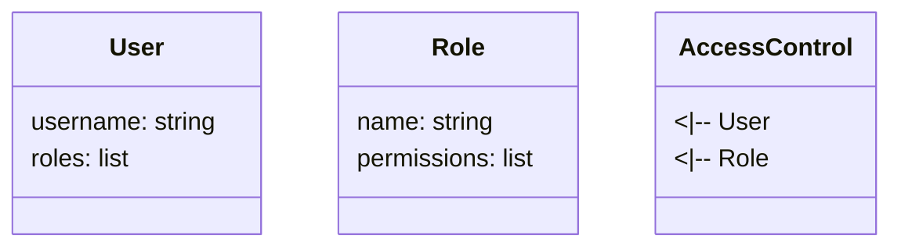
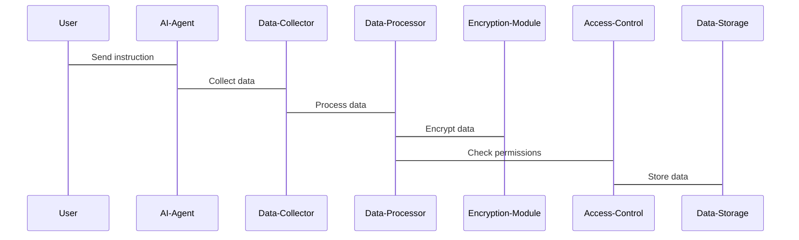

                 


# AI Agent的隐私保护措施：用户数据安全

## 关键词：
AI Agent、隐私保护、数据安全、加密技术、匿名化处理、访问控制

## 摘要：
随着AI Agent技术的快速发展，用户数据隐私保护变得越来越重要。本文将从AI Agent的基本概念出发，详细探讨隐私保护的核心问题，包括数据加密、匿名化处理和访问控制等技术。通过分析这些技术的原理和应用，结合实际案例，为读者提供一份全面的隐私保护解决方案。

---

# 第1章: AI Agent与隐私保护的背景

## 1.1 AI Agent的基本概念

### 1.1.1 AI Agent的定义与特点
AI Agent（人工智能代理）是指能够感知环境并采取行动以实现目标的智能实体。AI Agent的特点包括自主性、反应性、目标导向性和社交能力。它能够通过传感器或接口与外部环境交互，并根据需求做出决策和行动。

### 1.1.2 AI Agent在现代信息技术中的作用
AI Agent广泛应用于智能助手、推荐系统、自动化控制等领域。例如，智能音箱通过AI Agent技术能够理解用户的指令并执行相应的操作。AI Agent的存在极大地提升了人机交互的效率和体验。

### 1.1.3 隐私保护的重要性
随着AI Agent的普及，用户数据的收集和处理变得更加频繁。用户的隐私信息可能包括地理位置、行为习惯、生物特征等。保护这些数据不被滥用或泄露，是AI Agent设计中的核心问题。

## 1.2 隐私保护的背景与挑战

### 1.2.1 当今数据隐私面临的威胁
近年来，数据泄露事件频发，黑客攻击、内部滥用、技术漏洞等问题严重威胁着用户的隐私安全。AI Agent作为数据处理的核心，必须采取有效的隐私保护措施。

### 1.2.2 AI Agent在数据处理中的潜在风险
AI Agent在处理数据时可能面临以下风险：
1. 数据收集阶段：未经授权的第三方可能通过AI Agent获取用户的敏感信息。
2. 数据处理阶段：AI算法可能对数据进行不当处理，导致隐私泄露。
3. 数据存储与传输阶段：存储不当或传输过程中的安全漏洞可能导致数据被窃取。

### 1.2.3 隐私保护的法律与伦理要求
全球范围内的隐私保护法规（如欧盟的GDPR、美国的CCPA）对数据处理提出了严格的要求。AI Agent的设计必须符合相关法律法规，并遵循伦理原则，确保用户隐私权不受侵犯。

---

# 第2章: AI Agent隐私保护的核心问题

## 2.1 用户数据在AI Agent中的流动过程

### 2.1.1 数据收集阶段
AI Agent通过传感器、API或其他接口收集用户的输入数据，如语音指令、地理位置、用户行为等。数据收集是隐私保护的第一道防线，必须确保数据的合法性和合规性。

### 2.1.2 数据处理阶段
收集到的数据需要进行清洗、转换和分析。在这个阶段，AI算法可能对数据进行特征提取、模式识别等操作。数据处理阶段是隐私泄露的高风险区域，必须采取严格的数据匿名化和访问控制措施。

### 2.1.3 数据存储与传输阶段
数据需要存储在数据库中，并通过网络传输到后端服务器进行处理。数据存储和传输过程中，必须采取加密措施，防止数据被窃取或篡改。

## 2.2 隐私泄露的主要途径

### 2.2.1 数据收集中的未经授权访问
攻击者可能通过漏洞或弱密码入侵AI Agent系统，直接获取用户的隐私数据。

### 2.2.2 数据处理中的滥用风险
内部员工或第三方开发者可能滥用数据处理权限，将数据用于未经授权的目的。

### 2.2.3 数据存储中的安全漏洞
数据库可能因为配置错误或漏洞被攻击者入侵，导致数据泄露。

## 2.3 隐私保护的目标与边界

### 2.3.1 隐私保护的核心目标
隐私保护的核心目标是确保用户数据的机密性、完整性和可用性。机密性指未经授权的人无法访问数据；完整性指数据在存储和传输过程中不被篡改；可用性指合法用户能够顺利访问和使用数据。

### 2.3.2 隐私保护的边界与外延
隐私保护的边界在于合法用户的数据访问权限。外延则包括数据加密、匿名化处理、访问控制等技术手段。

### 2.3.3 隐私保护与数据利用的平衡
在保护用户隐私的同时，AI Agent仍需利用数据进行分析和决策。如何在保护隐私和数据利用之间找到平衡点，是隐私保护设计中的关键问题。

---

# 第3章: 数据隐私保护的核心技术

## 3.1 数据加密技术

### 3.1.1 加密算法的分类与特点
加密算法主要分为对称加密和非对称加密两类：
1. 对称加密：加密和解密使用相同的密钥，速度快，适用于大量数据加密。常用算法包括AES、DES等。
2. 非对称加密：加密和解密使用不同的密钥，安全性高，适用于安全通信。常用算法包括RSA、椭圆曲线加密等。

### 3.1.2 对称加密与非对称加密的对比
| 特性          | 对称加密      | 非对称加密      |
|---------------|---------------|-----------------|
| 密钥管理      | 使用一对密钥   | 使用公钥和私钥   |
| 加密速度      | 快            | 较慢            |
| 安全性        | 较低          | 较高            |
| 适用场景      | 数据存储加密  | 数字签名、安全通信 |

### 3.1.3 数据加密在AI Agent中的应用
在AI Agent中，数据加密通常用于以下几个方面：
1. 数据存储加密：保护存储在本地或云端的数据。
2. 数据传输加密：确保数据在网络传输过程中不被窃听。
3. 数据处理加密：对敏感数据进行加密处理，防止数据泄露。

## 3.2 数据匿名化技术

### 3.2.1 数据匿名化的定义与实现方法
数据匿名化是指通过技术手段将数据中的个人信息脱敏，使其无法被重新识别的过程。常用方法包括：
1. 数据屏蔽：对敏感字段进行部分隐藏，如将姓名中的某些字母替换为星号。
2. 数据泛化：将数据模糊化，如将具体地址泛化为区域名称。
3. 数据扰动：对数据进行微小的修改，使其无法被准确识别。

### 3.2.2 数据脱敏技术的原理与应用
数据脱敏技术通过替换、删除或加密敏感数据，降低数据泄露风险。例如，将用户的身份证号中的部分数字替换为星号，或对地理位置数据进行粗粒化处理。

### 3.2.3 数据匿名化的优缺点对比
| 特性          | 优点              | 缺点              |
|---------------|-------------------|-------------------|
| 数据可用性    | 高                | 可能降低数据的分析价值 |
| 数据安全性    | 高                | 需要复杂的匿名化处理技术 |
| 实施难度      | 中                | 对某些应用场景可能不适用 |

## 3.3 数据访问控制技术

### 3.3.1 基于角色的访问控制（RBAC）
RBAC是一种常见的访问控制模型，通过定义用户角色和权限，确保用户只能访问其角色允许的数据。例如，普通用户只能访问自己的数据，管理员可以访问所有用户的数据。

### 3.3.2 基于属性的访问控制（ABAC）
ABAC是一种更灵活的访问控制模型，基于用户属性（如地理位置、时间、设备类型等）动态调整访问权限。例如，用户在特定时间或设备上才能访问敏感数据。

### 3.3.3 数据加密与访问控制的结合
通过结合数据加密和访问控制技术，可以进一步增强数据安全性。例如，将加密后的数据存储在数据库中，并使用访问控制策略限制数据的访问权限。

---

# 第4章: 核心概念的原理与联系

## 4.1 数据隐私保护的原理

### 4.1.1 数据隐私保护的基本原理
数据隐私保护的核心是通过技术手段确保数据在收集、处理、存储和传输过程中的安全性。这包括数据加密、匿名化处理、访问控制等多种技术的综合应用。

### 4.1.2 数据加密的数学模型与公式
对称加密算法的数学模型如下：
$$ C = E_k(P) $$
$$ P = D_k(C) $$
其中，$P$是明文，$C$是密文，$E_k$是加密函数，$D_k$是解密函数，$k$是密钥。

非对称加密算法的数学模型如下：
$$ C = E_{pub}(P) $$
$$ P = D_{priv}(C) $$
其中，$E_{pub}$是公钥加密函数，$D_{priv}$是私钥解密函数。

### 4.1.3 数据匿名化的实现机制
数据匿名化的实现机制包括数据屏蔽、数据泛化和数据扰动。例如，通过数据屏蔽技术，可以将用户的姓名中的某些字符替换为星号，防止他人通过姓名识别用户身份。

## 4.2 核心概念的属性特征对比

### 4.2.1 数据加密与数据匿名化的对比表格
| 特性          | 数据加密          | 数据匿名化        |
|---------------|-------------------|-------------------|
| 目标          | 保护数据机密性    | 防止数据识别       |
| 实施方式      | 对数据进行编码     | 对数据进行脱敏处理 |
| 适用场景      | 数据存储与传输    | 数据展示与分析     |

### 4.2.2 数据访问控制技术的优缺点分析
| 特性          | RBAC              | ABAC              |
|---------------|-------------------|-------------------|
| 管理复杂度     | 较低              | 较高              |
| 灵活性         | 较低              | 较高              |
| 适用场景       | 角色固定的场景    | 场景复杂的场景    |

### 4.2.3 数据隐私保护技术的综合应用
通过综合应用数据加密、匿名化处理和访问控制技术，可以构建一个多层次的隐私保护体系。例如，先对数据进行加密存储，再通过访问控制策略限制数据的访问权限，最后对数据进行匿名化处理，防止数据被滥用。

---

# 第5章: 算法原理讲解

## 5.1 数据加密算法的实现

### 5.1.1 AES加密算法的实现
以下是AES加密算法的Python实现示例：
```python
import hashlib

def aes_encrypt(key, data):
    key = hashlib.sha256(key.encode()).digest()
    # 使用AES加密
    cipher = hashlib.new('AES', key=key, mode='ECB')
    encrypted_data = cipher.encrypt(data)
    return encrypted_data

def aes_decrypt(key, encrypted_data):
    key = hashlib.sha256(key.encode()).digest()
    cipher = hashlib.new('AES', key=key, mode='ECB')
    decrypted_data = cipher.decrypt(encrypted_data)
    return decrypted_data
```

### 5.1.2 RSA加密算法的实现
以下是RSA加密算法的Python实现示例：
```python
from cryptography.hazmat.primitives.asymmetric import rsa
from cryptography.hazmat.primitives.asymmetric.rsa import RSAPublicKey, RSAPrivateKey
from cryptography.hazmat.primitives import serialization

# 生成RSA密钥对
key = rsa.generate_private_key(
    public_exponent=65537,
    key_size=2048
)

public_key = key.public_key()
private_key = key

# 加密数据
message = b"Hello, World!"
encrypted_data = public_key.encrypt(message, padding=padding.PKCS1v1_5())

# 解密数据
decrypted_data = private_key.decrypt(encrypted_data, padding=padding.PKCS1v1_5())
```

## 5.2 数据匿名化算法的实现

### 5.2.1 数据屏蔽算法的实现
以下是数据屏蔽算法的Python实现示例：
```python
def data_masking(data, mask_length=5):
    if len(data) <= mask_length:
        return data
    masked_data = data[:mask_length] + '*'*(len(data)-mask_length)
    return masked_data
```

### 5.2.2 数据泛化算法的实现
以下是数据泛化算法的Python实现示例：
```python
def data_generalization(data, granularity='city'):
    if granularity == 'city':
        return data.split()[0] + '市'
    elif granularity == 'province':
        return data.split()[0] + '省'
    else:
        return data
```

## 5.3 数据访问控制算法的实现

### 5.3.1 RBAC模型的实现
以下是RBAC模型的Python实现示例：
```python
class Role:
    def __init__(self, name, permissions):
        self.name = name
        self.permissions = permissions

class User:
    def __init__(self, username, roles):
        self.username = username
        self.roles = roles

class AccessControl:
    def __init__(self, roles):
        self.roles = roles

    def check_permission(self, user, permission):
        for role in user.roles:
            if permission in role.permissions:
                return True
        return False
```

### 5.3.2 ABAC模型的实现
以下是ABAC模型的Python实现示例：
```python
class ABAC:
    def __init__(self, user, role, environment, permissions):
        self.user = user
        self.role = role
        self.environment = environment
        self.permissions = permissions

    def check_permission(self, action):
        for permission in self.permissions:
            if permission.action == action and permission.role == self.role and permission.environment == self.environment:
                return True
        return False
```

---

# 第6章: 系统分析与架构设计方案

## 6.1 系统功能设计

### 6.1.1 领域模型（mermaid类图）


### 6.1.2 系统架构设计（mermaid架构图）
```mermaid
archiecture
    AI-Agent -> Data-Collector: Collect data
    Data-Collector -> Data-Processor: Process data
    Data-Processor -> Data-Storage: Store data
    Data-Processor -> Encryption-Module: Encrypt data
    Data-Processor -> Access-Control: Check permissions
```

### 6.1.3 系统接口设计
1. 数据收集接口：`collect_data()`
2. 数据处理接口：`process_data()`
3. 数据存储接口：`store_data()`
4. 数据加密接口：`encrypt_data()`
5. 权限检查接口：`check_permission()`

### 6.1.4 系统交互流程（mermaid序列图）


---

# 第7章: 项目实战

## 7.1 环境安装
1. 安装Python
2. 安装加密库（如`cryptography`）
3. 安装数据分析库（如`pandas`）

## 7.2 系统核心实现

### 7.2.1 数据加密实现
```python
from cryptography.hazmat.primitives.asymmetric import rsa
from cryptography.hazmat.primitives.asymmetric.rsa import RSAPublicKey, RSAPrivateKey
from cryptography.hazmat.primitives import serialization

def generate_keys():
    key = rsa.generate_private_key(
        public_exponent=65537,
        key_size=2048
    )
    return key

def encrypt_data(public_key, data):
    cipher = public_key.encrypt(data, padding=padding.PKCS1v1_5())
    return cipher

def decrypt_data(private_key, encrypted_data):
    message = private_key.decrypt(encrypted_data, padding=padding.PKCS1v1_5())
    return message
```

### 7.2.2 数据匿名化实现
```python
def mask_name(name, mask_length=5):
    if len(name) <= mask_length:
        return name
    return name[:mask_length] + '*' * (len(name) - mask_length)

def generalize_location(location, granularity='city'):
    parts = location.split()
    if granularity == 'city':
        return parts[0] + '市'
    elif granularity == 'province':
        return parts[0] + '省'
    else:
        return location
```

### 7.2.3 数据访问控制实现
```python
class Role:
    def __init__(self, name, permissions):
        self.name = name
        self.permissions = permissions

class User:
    def __init__(self, username, roles):
        self.username = username
        self.roles = roles

class AccessControl:
    def __init__(self, roles):
        self.roles = roles

    def check_permission(self, user, permission):
        for role in user.roles:
            if permission in role.permissions:
                return True
        return False
```

## 7.3 实际案例分析

### 7.3.1 案例背景
假设我们开发了一个智能音箱AI Agent，需要保护用户的语音指令和地理位置数据。

### 7.3.2 数据处理流程
1. 数据收集：AI Agent通过麦克风收集用户的语音指令。
2. 数据处理：将语音指令转换为文本，并提取地理位置信息。
3. 数据加密：对提取的地理位置信息进行加密。
4. 数据存储：将加密后的数据存储在云端数据库中。
5. 权限检查：确保只有授权的用户才能访问加密数据。

### 7.3.3 代码实现与分析
通过上述代码实现，可以有效保护用户的语音指令和地理位置数据，防止数据泄露。

---

# 第8章: 总结与展望

## 8.1 总结
本文从AI Agent的背景出发，详细探讨了隐私保护的核心问题，包括数据加密、匿名化处理和访问控制等技术。通过分析这些技术的原理和应用，结合实际案例，为读者提供了一份全面的隐私保护解决方案。

## 8.2 最佳实践 tips
1. 在设计AI Agent时，始终将隐私保护放在首位。
2. 综合应用数据加密、匿名化处理和访问控制技术，构建多层次的隐私保护体系。
3. 定期进行安全测试和漏洞扫描，确保系统的安全性。

## 8.3 小结
隐私保护是AI Agent设计中的核心问题，需要从数据收集、处理、存储和传输等多个环节入手，采取综合措施保护用户隐私。

## 8.4 注意事项
1. 遵守相关法律法规，确保数据处理的合法性。
2. 定期更新安全策略和加密算法，应对新的安全威胁。
3. 提高用户隐私保护意识，增强用户的信任感。

## 8.5 拓展阅读
1. 《数据隐私保护技术与应用》
2. 《人工智能与隐私保护的伦理思考》
3. 《区块链技术在隐私保护中的应用》

---

# 结语
随着AI Agent技术的不断发展，隐私保护将面临新的挑战和机遇。通过技术创新和制度完善，我们可以更好地保护用户的隐私权益，推动AI技术的健康发展。

