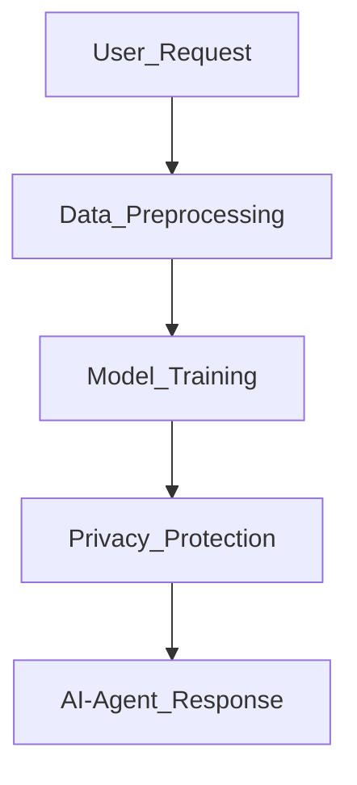

                 


# AI Agent的隐私保护：确保LLM应用的数据安全

## 关键词：AI Agent, 隐私保护, 大语言模型, 数据安全, 匿名化, 加密算法

## 摘要：随着大语言模型（LLM）在AI Agent中的广泛应用，隐私保护成为一个重要挑战。本文从隐私保护的核心概念、算法原理和系统架构等方面，详细探讨如何确保LLM应用的数据安全。通过分析同态加密、秘密分享和差分隐私等技术，结合系统设计和项目实战，为AI Agent的隐私保护提供全面解决方案。

---

## 第一部分: AI Agent的隐私保护基础

### 第1章: AI Agent与隐私保护概述

#### 1.1 AI Agent的基本概念
- **1.1.1 AI Agent的定义与特点**
  AI Agent是一种智能实体，能够感知环境并执行任务，具有自主性、反应性、目标导向和社交能力。
  
- **1.1.2 AI Agent在LLM应用中的角色**
  LLM赋予AI Agent理解和生成自然语言的能力，使其能够进行对话和决策。

- **1.1.3 隐私保护的重要性**
  随着AI Agent处理的数据增加，隐私泄露风险也增加，保护用户数据至关重要。

#### 1.2 隐私保护的背景与挑战
- **1.2.1 数据泄露的现状**
  近年来数据泄露事件频发，尤其是个人数据被滥用的情况。

- **1.2.2 隐私保护的法律与伦理要求**
  GDPR等法规要求数据处理者必须保护用户隐私，伦理上也需尊重用户数据权利。

- **1.2.3 LLM应用中的隐私风险**
  LLM训练和推理过程中可能泄露用户数据，需采取技术手段保护。

---

### 第2章: 隐私保护的核心概念

#### 2.1 数据隐私与数据安全的定义
- **数据隐私**：控制数据的收集、存储和使用，防止未经授权的访问。
- **数据安全**：保护数据的机密性、完整性和可用性，防止数据被篡改或丢失。

#### 2.2 隐私保护的关键技术
- **数据加密**：通过加密技术保护数据在传输和存储过程中的安全性。
- **数据匿名化**：去除或模糊数据中的敏感信息，使其无法关联到具体个人。
- **访问控制**：限制数据访问权限，确保只有授权人员可以接触敏感数据。

---

## 第二部分: 隐私保护的核心概念与技术

### 第3章: 隐私保护算法概述

#### 3.1 同态加密
- **同态加密的定义**：允许在密文上进行计算，结果与明文计算结果相同。
- **数学模型**：
  $$ Enc: \mathbb{M} \rightarrow \mathbb{C} $$
  $$ Dec: \mathbb{C} \rightarrow \mathbb{M} $$
  同态加密支持加法和乘法操作：
  $$ Enc(x) + Enc(y) = Enc(x + y) $$
  $$ Enc(x) \times Enc(y) = Enc(x \times y) $$

- **应用场景**：适用于需要在加密状态下进行数据分析的情况，如医疗数据共享。

#### 3.2 秘密分享
- **秘密分享的定义**：将秘密分成多个部分，只有同时拥有所有部分才能恢复秘密。
- **实现原理**：基于多项式插值，每个部分是多项式的一个点。
- **安全性分析**：使用门限方案，k-out-of-n方案的安全性依赖于数学模型：
  $$ S = \{s_1, s_2, ..., s_n\} $$
  其中，$k$ 是恢复秘密所需的最小部分数。

#### 3.3 差分隐私
- **差分隐私的定义**：通过添加噪声，确保单条记录的改变不会影响整体数据的统计结果。
- **数学模型**：差分隐私定义为：
  $$ \Pr[M(S) = r] - \Pr[M(S') = r] \leq \epsilon $$
  其中，$\epsilon$ 是隐私预算，控制隐私泄露程度。

---

### 第4章: 隐私保护算法的实现

#### 4.1 同态加密的实现
- **Python代码实现**：
  ```python
  def add_encrypted(Enc_x, Enc_y):
      return Enc_x + Enc_y
  def multiply_encrypted(Enc_x, Enc_y):
      return Enc_x * Enc_y
  ```
- **算法流程图**：
  ```mermaid
  graph TD
      A[明文x] --> B[加密x]
      A --> C[加密y]
      B --> D[加法操作]
      C --> D
      D --> E[密文结果]
  ```

#### 4.2 秘密分享的实现
- **Python代码实现**：
  ```python
  def share_secret(secret, k, n):
      coefficients = [secret] + [random.getrandbits(8) for _ in range(n-1)]
      shares = []
      for i in range(n):
          x = i + 1
          y = sum(coeff * x**i for i, coeff in enumerate(coefficients))
          shares.append(y)
      return shares
  ```
- **算法流程图**：
  ```mermaid
  graph TD
      A[秘密] --> B[生成多项式]
      B --> C[计算每个部分]
      C --> D[分享结果]
  ```

#### 4.3 差分隐私的实现
- **Python代码实现**：
  ```python
  def add_noise(x, epsilon, sensitivity):
      noise = np.random.laplace(0, 1/epsilon, size=x.shape)
      return x + noise * sensitivity
  ```
- **数学模型**：
  $$ y = x + noise $$
  其中，$noise$ 服从拉普拉斯分布，确保隐私预算$\epsilon$。

---

## 第三部分: 隐私保护的算法原理与系统架构

### 第5章: 系统分析与架构设计

#### 5.1 系统架构设计
- **模块划分**：
  - 数据预处理模块：清洗和匿名化数据。
  - 模型训练模块：使用加密数据训练LLM。
  - 隐私保护模块：集成加密和访问控制技术。
  
- **架构图**：
  ```mermaid
  graph TD
      Data_Preprocessing --> Model_Training
      Model_Training --> Privacy_Protection
      Privacy_Protection --> AI-Agent
  ```

#### 5.2 系统接口设计
- **数据预处理接口**：提供数据清洗和匿名化的API。
- **模型训练接口**：支持加密数据的训练接口。
- **隐私保护接口**：实现数据加密和访问控制的功能。

#### 5.3 系统交互流程图


### 第6章: 项目实战

#### 6.1 环境安装
- 安装Python和必要的库：
  ```bash
  pip install numpy matplotlib
  ```

#### 6.2 核心实现
- 数据匿名化处理：
  ```python
  def anonymize_data(data):
      return data.drop(columns=['personal_info'])
  ```

#### 6.3 案例分析
- 某电商系统使用差分隐私保护用户数据，确保推荐算法不泄露用户隐私。

---

## 第7章: 总结与展望

### 7.1 本章总结
本文详细探讨了AI Agent的隐私保护技术，包括核心概念、算法原理和系统架构。通过同态加密、秘密分享和差分隐私等技术，确保LLM应用中的数据安全。

### 7.2 未来展望
未来研究方向包括联邦学习、多方安全计算和隐私增强的LLM设计，进一步提升隐私保护能力。

---

## Tips
- **安全性检查**：定期进行安全审计，确保系统无漏洞。
- **用户教育**：提高用户对隐私保护的意识。
- **持续优化**：根据反馈和技术进步，不断优化隐私保护措施。

---

希望这篇文章能够为AI Agent的隐私保护提供有价值的参考，确保LLM应用的数据安全。

