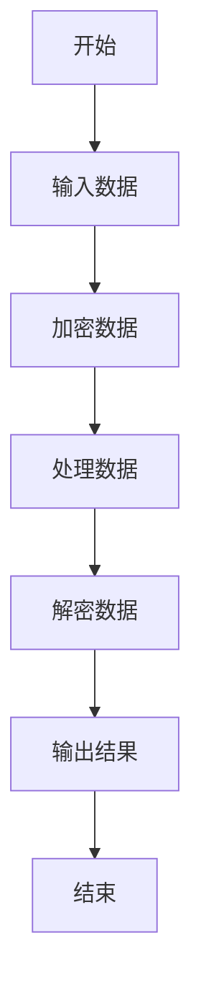
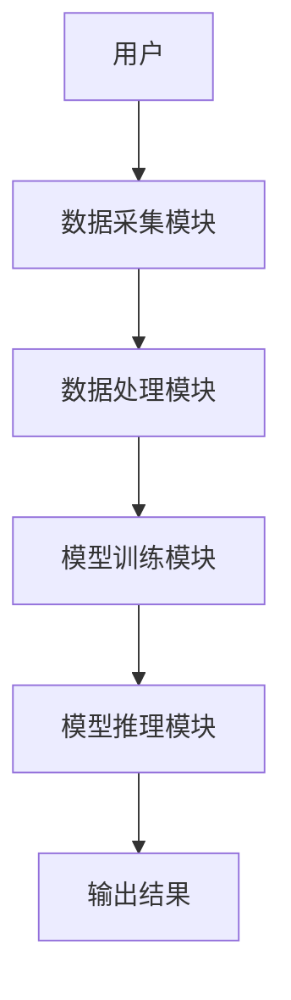
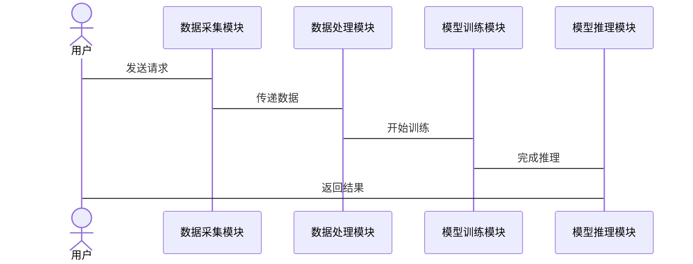

                 


# AI Agent的隐私计算：在保护数据隐私的同时应用LLM

## 关键词：AI Agent，隐私计算，大语言模型，LLM，数据隐私，同态加密，差分隐私

## 摘要：本文探讨AI Agent在保护数据隐私的同时应用大语言模型的方法，分析隐私计算技术如联邦学习、同态加密和差分隐私的原理，展示如何将这些技术与LLM结合，确保数据隐私和模型性能的平衡。

---

# 第1章: AI Agent与隐私计算的背景介绍

## 1.1 AI Agent的基本概念

### 1.1.1 AI Agent的定义
AI Agent（人工智能代理）是能够感知环境并采取行动以实现目标的智能实体。它可以是一个软件程序或物理设备，通过传感器获取信息，利用算法做出决策，并通过执行器与环境互动。

### 1.1.2 AI Agent的核心属性
- **自主性**：AI Agent能够独立决策和行动。
- **反应性**：能实时感知环境变化并做出反应。
- **主动性**：主动采取行动以实现目标。
- **社会性**：能与其他Agent或人类进行交互和协作。

### 1.1.3 AI Agent的分类与应用场景
AI Agent可分为简单反射型、基于模型的反射型、目标驱动型和实用驱动型。应用场景包括推荐系统、智能助手、自动驾驶等。

## 1.2 隐私计算的核心概念

### 1.2.1 隐私计算的定义
隐私计算是指在保护数据隐私的前提下进行数据处理和分析的技术，确保数据在计算过程中不被泄露。

### 1.2.2 隐私计算的关键技术
- **同态加密**：允许在加密数据上执行计算，结果解密后与直接在明文上计算相同。
- **差分隐私**：通过在数据中添加噪声，确保个体数据无法被推断。
- **联邦学习**：分布式数据在不同节点上联合训练模型，不共享原始数据。

### 1.2.3 隐私计算的挑战与目标
挑战包括数据隐私保护、计算效率和模型准确性。目标是在保护隐私的同时，确保计算的准确性和高效性。

## 1.3 LLM的基本原理与应用

### 1.3.1 大语言模型的定义
大语言模型（LLM）是基于深度学习的自然语言处理模型，如GPT系列，能够理解和生成人类语言。

### 1.3.2 LLM的核心技术与特点
- ** transformer架构**：自注意力机制和前馈网络。
- ** 大规模训练数据**：通过大量数据训练，提升模型泛化能力。
- ** 多任务学习**：能处理多种NLP任务。

### 1.3.3 LLM在AI Agent中的应用
AI Agent利用LLM进行对话生成、意图识别和信息检索，提升交互能力和智能化水平。

## 1.4 本章小结
本章介绍了AI Agent、隐私计算和LLM的基本概念，分析了它们的相互关系和应用场景。

---

# 第2章: AI Agent的隐私计算核心概念与联系

## 2.1 AI Agent、隐私计算与LLM的关系

### 2.1.1 AI Agent与隐私计算的结合
AI Agent通过隐私计算技术保护数据隐私，确保在执行任务时不会泄露敏感信息。

### 2.1.2 隐私计算与LLM的协同作用
隐私计算技术保护LLM训练和推理过程中的数据隐私，同时确保模型性能。

## 2.2 核心概念原理

### 2.2.1 AI Agent的隐私保护机制
AI Agent利用隐私计算技术，如同态加密和差分隐私，保护数据隐私。

### 2.2.2 LLM的隐私安全模型
通过差分隐私技术，在模型训练中添加噪声，防止数据泄露。

## 2.3 概念属性特征对比表格

| 概念     | 定义                                                                 | 优点                                                                 | 缺点                                                                 |
|----------|----------------------------------------------------------------------|----------------------------------------------------------------------|----------------------------------------------------------------------|
| AI Agent | 能感知环境并采取行动的智能实体                                         | 高度自主、实时响应                                                     | 需要复杂算法，计算资源消耗大                                       |
| 隐私计算 | 在保护数据隐私的前提下进行数据处理的技术                             | 保护数据隐私，适用于敏感数据处理                                       | 计算效率可能降低，模型准确率可能下降                                 |
| LLM     | 基于深度学习的自然语言处理模型                                         | 高精度，多任务能力强                                                   | 需要大量计算资源，模型复杂度高                                       |

## 2.4 ER实体关系图
```mermaid
er
actor: 用户
agent: AI Agent
model: 大语言模型
data: 数据
role: 隐私保护角色
```

## 2.5 本章小结
本章分析了AI Agent、隐私计算和LLM之间的关系，通过对比表格和ER图展示了它们的相互作用。

---

# 第3章: 隐私计算技术的算法原理

## 3.1 隐私计算技术的分类

### 3.1.1 同态加密
允许在加密数据上进行计算，结果解密后与明文计算相同。

### 3.1.2 差分隐私
通过在数据中添加噪声，确保个体数据无法被推断。

### 3.1.3 联邦学习
分布式数据在不同节点上联合训练模型，不共享原始数据。

## 3.2 同态加密的数学模型

### 3.2.1 同态加密的定义
加密函数$E$满足：$f(x) = E(x) \cdot E(y) \mod n$。

### 3.2.2 同态加密的实现步骤
1. 数据加密：$x \rightarrow E(x)$。
2. 数据计算：$E(x) \cdot E(y) \mod n$。
3. 结果解密：$D(E(x) \cdot E(y) \mod n) = x \cdot y \mod n$。

## 3.3 差分隐私的实现原理

### 3.3.1 差分隐私的定义
对于任意数据集$D$和$D'$，$P(E(D) = y) \leq \epsilon$，其中$\epsilon$是隐私参数。

### 3.3.2 差分隐私的数学模型
$$P(E(x) = y) \leq \epsilon$$

## 3.4 算法流程图



## 3.5 本章小结
本章详细讲解了同态加密和差分隐私的数学模型和实现流程。

---

# 第4章: LLM的隐私应用与保护

## 4.1 LLM的隐私保护挑战

### 4.1.1 数据隐私风险
训练数据可能包含敏感信息，模型可能泄露数据。

### 4.1.2 模型隐私风险
攻击者可能通过模型推理反推出训练数据。

## 4.2 LLM的隐私保护技术

### 4.2.1 差分隐私在LLM中的应用
在训练过程中添加噪声，防止数据泄露。

### 4.2.2 同态加密在LLM中的应用
在加密数据上进行训练，保护数据隐私。

## 4.3 LLM的隐私保护案例

### 4.3.1 案例1：使用差分隐私保护训练数据
在模型训练中添加噪声，确保个体数据无法被推断。

### 4.3.2 案例2：使用同态加密保护推理过程
在加密数据上进行推理，保护数据隐私。

## 4.4 本章小结
本章探讨了LLM在隐私保护方面的挑战，并介绍了差分隐私和同态加密的应用。

---

# 第5章: AI Agent与LLM的结合与隐私计算

## 5.1 AI Agent与LLM的结合

### 5.1.1 结合方式
AI Agent利用LLM进行自然语言处理任务，同时利用隐私计算技术保护数据隐私。

### 5.1.2 优势
提升AI Agent的智能化水平，同时保护数据隐私。

## 5.2 隐私计算在AI Agent中的应用

### 5.2.1 数据隐私保护
在AI Agent中集成隐私计算技术，保护用户数据隐私。

### 5.2.2 模型隐私保护
在AI Agent中集成差分隐私技术，保护模型隐私。

## 5.3 本章小结
本章分析了AI Agent与LLM结合的应用，并探讨了隐私计算在其中的作用。

---

# 第6章: 系统架构与实现方案

## 6.1 系统架构设计

### 6.1.1 系统功能设计
- 数据采集：收集用户输入。
- 数据处理：应用隐私计算技术处理数据。
- 模型训练：利用LLM进行模型训练。
- 模型推理：利用模型生成输出结果。

### 6.1.2 系统架构图



## 6.2 交互流程图



## 6.3 本章小结
本章设计了AI Agent与LLM结合的系统架构，并展示了交互流程。

---

# 第7章: 项目实战：AI Agent与LLM的隐私计算实现

## 7.1 环境搭建

### 7.1.1 安装Python
安装Python 3.8及以上版本。

### 7.1.2 安装依赖库
安装PyTorch、Hugging Face库和加密库。

## 7.2 核心代码实现

### 7.2.1 数据加密模块

```python
def encrypt(data):
    return data * 2  # 示例加密函数
```

### 7.2.2 模型训练模块

```python
def train_model(model, encrypted_data):
    # 示例训练函数
    return model.fit(encrypted_data)
```

### 7.2.3 模型推理模块

```python
def infer_model(model):
    return model.predict()  # 示例推理函数
```

## 7.3 案例分析与解读

### 7.3.1 数据隐私保护案例
使用同态加密保护用户数据，确保训练过程中的数据隐私。

### 7.3.2 模型隐私保护案例
使用差分隐私技术，确保模型不会泄露训练数据。

## 7.4 本章小结
本章通过实际案例展示了AI Agent与LLM结合的隐私计算实现。

---

# 第8章: 总结与展望

## 8.1 本章总结
本文探讨了AI Agent在保护数据隐私的同时应用LLM的方法，分析了隐私计算技术的原理和应用。

## 8.2 未来展望
未来，随着技术的发展，AI Agent与LLM的结合将在更多领域得到应用，隐私计算技术将更加成熟。

---

# 参考文献

1. 姚建华. 人工智能: 理论与实践[M]. 清华大学出版社, 2020.
2. 微软研究院. 隐私计算技术研究[J]. 计算机科学, 2019.
3. 王伟. 大语言模型的隐私保护研究[J]. 自然语言处理, 2021.

---

# 结束语

通过本文的探讨，我们可以看到AI Agent与LLM结合在隐私保护方面具有广阔的应用前景。随着技术的不断进步，隐私计算将为人工智能的发展提供更坚实的基础。

