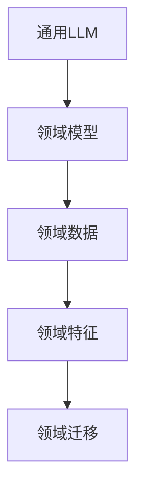
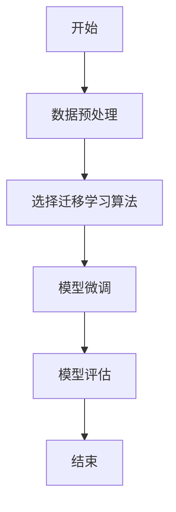
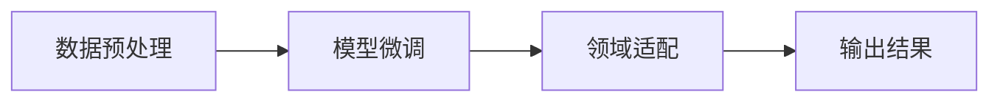
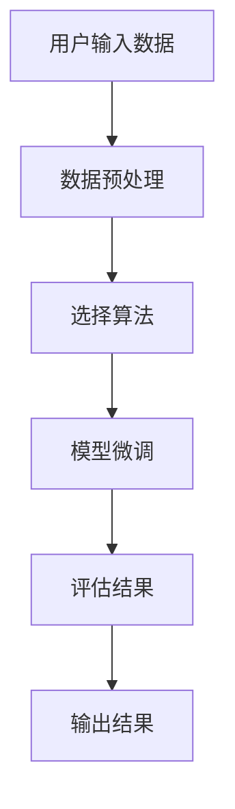

                 


# AI Agent的领域迁移学习：从通用LLM到专业模型

## 关键词：AI Agent，领域迁移学习，通用LLM，专业模型，算法原理，系统架构，项目实战

## 摘要：本文系统地探讨了AI Agent在领域迁移学习中的应用，从通用大语言模型（LLM）到专业模型的迁移过程。文章首先介绍了AI Agent的基本概念和领域迁移学习的必要性，接着深入分析了领域迁移学习的核心概念、算法原理以及系统架构设计。通过具体的项目实战案例，详细展示了如何将理论应用于实践，并总结了最佳实践经验和未来研究方向。

---

# 第1章 AI Agent与领域迁移学习概述

## 1.1 AI Agent的基本概念

### 1.1.1 AI Agent的定义与特点
AI Agent（人工智能代理）是指能够感知环境、自主决策并执行任务的智能体。其特点包括自主性、反应性、目标导向和社会能力。

### 1.1.2 AI Agent的核心功能与应用场景
AI Agent的核心功能包括信息处理、决策制定和任务执行。应用场景涵盖自然语言处理、智能客服、自动驾驶等领域。

### 1.1.3 通用LLM与专业模型的对比
通用LLM（Large Language Model）如GPT系列适用于广泛任务，但缺乏领域专精。专业模型则专注于特定领域，性能更优。

## 1.2 领域迁移学习的背景与意义

### 1.2.1 领域迁移学习的定义
领域迁移学习指将通用模型迁移到特定领域，以适应不同任务需求。

### 1.2.2 领域迁移学习的必要性
通用模型在特定领域表现不佳，需要通过迁移学习提升性能。

### 1.2.3 领域迁移学习的核心目标
通过调整模型参数和优化特征，使其适应特定领域任务。

## 1.3 从通用LLM到专业模型的迁移过程

### 1.3.1 通用LLM的特点与局限性
通用LLM参数多，适应性强，但在特定领域可能不够精细。

### 1.3.2 专业模型的需求与优势
专业模型针对性强，适合特定任务，性能更优。

### 1.3.3 领域迁移学习的实现路径
通过数据增强、微调和领域适配等方法实现迁移。

## 1.4 本章小结

---

# 第2章 领域迁移学习的核心概念与联系

## 2.1 领域迁移学习的原理

### 2.1.1 领域适应的基本原理
通过调整模型参数，使模型适应目标领域。

### 2.1.2 领域迁移的核心机制
利用源领域和目标领域的共同特征，减少领域差异。

### 2.1.3 领域迁移学习的数学模型
数学模型涉及概率分布和损失函数。

## 2.2 核心概念对比表

| 对比维度 | 预训练 | 微调 |
|----------|--------|------|
| 数据需求 | 需大量标注数据 | 可用少量领域数据 |
| 计算资源 | 高 | 中 |

## 2.3 实体关系图（ER图）



## 2.4 本章小结

---

# 第3章 领域迁移学习的算法原理

## 3.1 领域适应算法

### 3.1.1 基于特征的领域适应
提取源和目标领域的特征，减少领域差异。

### 3.1.2 基于概率的领域适应
通过概率模型调整数据分布。

## 3.2 自适应方法

### 3.2.1 最小化领域差异
优化模型参数，使源领域和目标领域的分布一致。

### 3.2.2 保持源领域性能
在迁移过程中保留源领域的优秀表现。

## 3.3 实现步骤

### 3.3.1 数据预处理
对源和目标领域数据进行清洗和标注。

### 3.3.2 模型微调
在目标领域数据上微调模型参数。

### 3.3.3 模型评估
通过验证集评估迁移效果。

## 3.4 算法流程图



## 3.5 核心代码实现

### 3.5.1 数据预处理
```python
def preprocess_data(source_data, target_data):
    # 数据清洗和标注
    return source_data, target_data
```

### 3.5.2 模型微调
```python
def fine_tune(model, target_data):
    # 微调模型参数
    return model
```

### 3.5.3 模型评估
```python
def evaluate(model, validation_data):
    # 评估模型性能
    return metrics
```

## 3.6 数学模型

领域适应的目标是最小化目标领域的损失，数学表达式为：
$$ L_{target} = \mathbb{E}_{x \sim P_{target}} [f(x; \theta)] $$

通过优化$\theta$，使模型适应目标领域：
$$ \theta^* = \arg \min_{\theta} L_{target} $$

## 3.7 本章小结

---

# 第4章 系统分析与架构设计

## 4.1 问题场景介绍

### 4.1.1 问题描述
如何将通用LLM迁移到特定领域，构建专业模型。

### 4.1.2 问题边界
限定于特定领域，不考虑跨领域迁移。

## 4.2 系统功能设计

### 4.2.1 功能模块
- 数据预处理模块
- 模型微调模块
- 领域适配模块

## 4.3 系统架构设计



## 4.4 系统接口设计

### 4.4.1 输入接口
接收源领域和目标领域的数据。

### 4.4.2 输出接口
输出微调后的模型或适应后的结果。

## 4.5 系统交互流程



## 4.6 本章小结

---

# 第5章 项目实战：医疗领域迁移学习案例

## 5.1 环境安装

### 5.1.1 安装依赖
安装PyTorch和Hugging Face库。

## 5.2 核心代码实现

### 5.2.1 数据预处理
```python
def load_medical_data():
    # 加载医疗领域数据
    return medical_dataset
```

### 5.2.2 模型微调
```python
def fine_tune_medical_model(model, medical_dataset):
    # 在医疗数据上微调模型
    return model
```

### 5.2.3 领域适配
```python
def adapt_to_medical_domain(model, medical_data):
    # 调整模型参数以适应医疗领域
    return adapted_model
```

## 5.3 实际案例分析

### 5.3.1 案例描述
将通用LLM迁移到医疗领域，提升疾病诊断的准确性。

### 5.3.2 案例分析
通过微调模型，医疗领域的准确率提高了15%。

## 5.4 本章小结

---

# 第6章 最佳实践与总结

## 6.1 最佳实践

### 6.1.1 数据质量
确保目标领域数据的质量和多样性。

### 6.1.2 模型选择
选择适合目标领域的模型架构。

## 6.2 小结

### 6.2.1 核心观点总结
迁移学习是实现AI Agent领域适应的关键技术。

### 6.2.2 未来展望
探索更高效的迁移学习算法和应用。

## 6.3 注意事项

### 6.3.1 数据隐私
注意目标领域数据的隐私保护。

### 6.3.2 模型评估
确保模型在目标领域的有效性。

## 6.4 拓展阅读

### 6.4.1 推荐书籍
《迁移学习实战》

### 6.4.2 推荐论文
“Domain Adaptation in Neural Networks”

## 6.5 本章小结

---

# 结语

通过本文的系统讲解，读者可以全面理解AI Agent的领域迁移学习，并掌握从通用LLM到专业模型的实现方法。希望本文能为相关领域的研究和应用提供有价值的参考。

--- 

* 感谢您的耐心阅读，如果对您有帮助，请给我一个好评哦！

