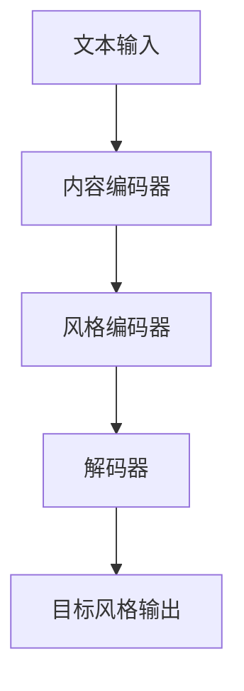
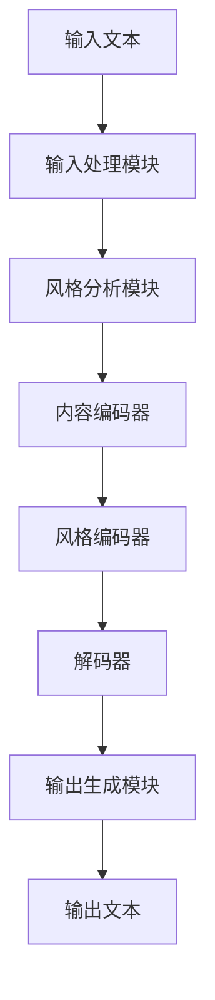
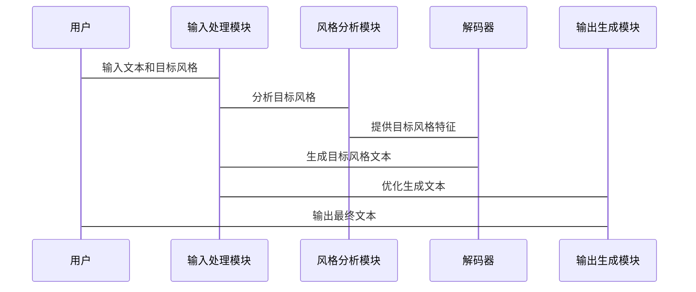

                 


---

# AI Agent的风格迁移：实现LLM的个性化表达

> 关键词：AI Agent，风格迁移，LLM，个性化表达，算法原理，系统架构，项目实战

> 摘要：  
本文深入探讨了AI Agent在风格迁移中的应用，重点介绍了如何实现大语言模型（LLM）的个性化表达。通过分析风格迁移的核心原理、算法实现、系统架构及项目实战，本文为读者提供了从理论到实践的全面指南。文章还总结了最佳实践经验和未来发展方向，帮助读者更好地理解和应用AI Agent的风格迁移技术。

---

# 第一部分: AI Agent与风格迁移的背景介绍

# 第1章: AI Agent与风格迁移概述

## 1.1 AI Agent的基本概念

### 1.1.1 AI Agent的定义与特点  
AI Agent（人工智能代理）是指能够感知环境、自主决策并执行任务的智能实体。其特点包括：  
- **自主性**：无需外部干预，自主完成任务。  
- **反应性**：能够实时感知环境并做出响应。  
- **目标导向性**：基于目标进行决策和行动。  

### 1.1.2 大语言模型（LLM）的崛起  
大语言模型（LLM）是AI Agent的核心技术之一。LLM通过深度学习算法训练而成，能够理解和生成自然语言文本。其优势包括：  
- **强大的上下文理解能力**。  
- **多语言支持**。  
- **可扩展性**：适用于多种任务，如翻译、问答、文本生成等。  

### 1.1.3 AI Agent与LLM的关系  
AI Agent通过集成LLM，能够实现自然语言处理任务，并根据上下文做出智能决策。LLM为AI Agent提供了语言理解和生成的能力，而AI Agent则为LLM提供了应用场景和目标导向性。

## 1.2 风格迁移的定义与应用

### 1.2.1 风格迁移的定义  
风格迁移是指将一种风格的表达方式转换为另一种风格的过程。例如，将文学作品的风格转换为技术文档的风格，或将口语化的表达转换为正式的书面表达。

### 1.2.2 风格迁移的核心目标  
- **个性化表达**：根据目标用户或场景，生成符合其偏好的文本风格。  
- **适应性**：使AI Agent能够灵活应对不同场景和用户需求。  
- **多样性**：提供多种表达方式，避免单调性。  

### 1.2.3 风格迁移的典型应用场景  
- **内容生成**：如新闻报道、产品描述等。  
- **对话系统**：使对话更加自然和个性化。  
- **文档翻译**：将一种语言的风格转换为另一种语言的风格。  

## 1.3 AI Agent风格迁移的背景与意义

### 1.3.1 个性化表达的需求  
随着AI Agent的广泛应用，用户对个性化表达的需求日益增长。不同用户可能对文本的风格有不同的偏好，如正式、口语化、简洁等。  

### 1.3.2 风格迁移在AI Agent中的作用  
风格迁移使AI Agent能够根据目标用户的偏好或场景需求，生成符合其风格的文本。这不仅提高了用户体验，还增强了AI Agent的灵活性和适应性。  

### 1.3.3 风格迁移的技术挑战  
- **风格多样性**：如何覆盖多种风格。  
- **风格一致性**：如何保持目标风格的一致性。  
- **计算效率**：如何在保证效果的前提下，提高计算效率。  

## 1.4 本章小结  
本章介绍了AI Agent和LLM的基本概念，阐述了风格迁移的定义、目标和应用场景，并分析了技术挑战。这些内容为后续章节奠定了基础。

---

# 第二部分: 风格迁移的核心概念与联系

# 第2章: 风格迁移的核心原理

## 2.1 风格迁移的关键技术

### 2.1.1 特征提取与风格分离  
风格迁移的核心是将文本内容与表达风格分离。特征提取是通过模型提取文本的语义特征，而风格分离则是将这些语义特征与风格特征分开。

### 2.1.2 风格转换的实现方法  
- **基于规则的方法**：通过预定义的规则或模板进行风格转换。  
- **基于模型的方法**：通过深度学习模型（如变换器）学习风格特征并进行转换。  

### 2.1.3 风格迁移的数学模型  
风格迁移的数学模型通常包括两个部分：内容编码器和风格编码器。内容编码器提取文本的语义特征，风格编码器提取目标风格的特征，最后通过解码器生成目标风格的文本。

### 2.1.4 风格迁移的特征对比  
通过对比不同风格的特征，可以更好地理解风格迁移的实现原理。例如，正式风格和口语风格的文本在词汇选择、句式结构和语气上存在显著差异。

## 2.2 风格迁移的核心概念对比

### 2.2.1 基于规则的风格迁移与基于模型的风格迁移对比  
| 对比维度 | 基于规则的风格迁移 | 基于模型的风格迁移 |  
|----------|-------------------|-------------------|  
| 实现方式 | 预定义规则或模板 | 深度学习模型学习 |  
| 灵活性 | 较低，适用于特定场景 | 较高，适用于多种场景 |  
| 可扩展性 | 较差，需要手动调整规则 | 较好，可以通过训练新模型扩展 |  

### 2.2.2 不同风格迁移方法的优缺点分析  
- **基于规则的方法**：实现简单，适用于特定场景，但灵活性较低。  
- **基于模型的方法**：灵活性高，适用于多种场景，但实现复杂，需要大量数据和计算资源。  

## 2.3 风格迁移的实体关系图

### 2.3.1 实体关系图的构建  
以下是风格迁移的实体关系图（使用 Mermaid）：  



### 2.3.2 实体关系图的解释  
- **文本输入**：输入需要进行风格迁移的文本。  
- **内容编码器**：提取文本的语义特征。  
- **风格编码器**：提取目标风格的特征。  
- **解码器**：根据提取的特征生成目标风格的文本。  
- **目标风格输出**：最终输出的风格迁移后的文本。  

---

# 第三部分: 风格迁移的算法原理

# 第3章: 风格迁移算法的数学模型

## 3.1 风格迁移的数学基础

### 3.1.1 风格迁移的基本公式  
风格迁移的数学模型通常可以表示为：  

$$ f(x) = \arg\min_{f} \{ \text{内容损失} + \text{风格损失} \} $$  

其中，内容损失衡量生成文本与原始文本在语义上的相似性，风格损失衡量生成文本与目标风格在表达上的相似性。

### 3.1.2 风格迁移的损失函数  
风格迁移的损失函数通常包括内容损失和风格损失两部分。  

- **内容损失**：衡量生成文本与原始文本在语义上的相似性。  
- **风格损失**：衡量生成文本与目标风格在表达上的相似性。  

例如，使用均方误差（MSE）作为损失函数：  

$$ \text{内容损失} = \frac{1}{N} \sum_{i=1}^{N} (f(x_i) - x_i)^2 $$  
$$ \text{风格损失} = \frac{1}{M} \sum_{j=1}^{M} (g(y_j) - y_j)^2 $$  

### 3.1.3 风格迁移的优化算法  
风格迁移通常使用梯度下降算法进行优化，例如Adam优化器。优化目标是最小化内容损失和风格损失的总和。

## 3.2 风格迁移的算法流程

### 3.2.1 数据预处理  
- 将输入文本转换为固定长度的向量表示。  
- 对目标风格进行标注或分类。  

### 3.2.2 特征提取  
- 使用预训练的模型（如BERT）提取文本的语义特征。  

### 3.2.3 风格转换  
- 使用风格编码器提取目标风格的特征。  
- 将内容特征和风格特征输入解码器生成目标风格的文本。  

### 3.2.4 后处理  
- 对生成的文本进行语言模型的微调，进一步优化表达流畅性。  

## 3.3 风格迁移算法的Python实现

### 3.3.1 环境安装与配置  
- 安装必要的库：`transformers`, `torch`, `numpy`。  
- 配置GPU支持（如果有的话）。  

### 3.3.2 核心代码实现  

```python
import torch
import torch.nn as nn
from transformers import BertTokenizer, BertModel

# 定义内容编码器
class ContentEncoder(nn.Module):
    def __init__(self, bert_model):
        super().__init__()
        self.bert = bert_model
        self.dropout = nn.Dropout(0.1)
        self.pooler = nn.Linear(768, 768)  # 假设BERT的输出维度为768

    def forward(self, input_ids, attention_mask):
        outputs = self.bert(input_ids=input_ids, attention_mask=attention_mask)
        pooled_output = self.dropout(outputs.pooler_output)
        pooled_output = self.pooler(pooled_output)
        return pooled_output

# 定义风格编码器
class StyleEncoder(nn.Module):
    def __init__(self, input_dim, hidden_dim, output_dim):
        super().__init__()
        self.fc = nn.Sequential(
            nn.Linear(input_dim, hidden_dim),
            nn.ReLU(),
            nn.Linear(hidden_dim, output_dim)
        )

    def forward(self, x):
        return self.fc(x)

# 定义解码器
class Decoder(nn.Module):
    def __init__(self, style_feature, content_feature):
        super().__init__()
        self.style_feature = style_feature
        self.content_feature = content_feature
        self.fc = nn.Linear(768 + 768, 768)

    def forward(self, input_ids, attention_mask):
        # 假设输入的input_ids和attention_mask是解码器的输入
        # 这里简化为直接将内容特征和风格特征拼接
        concatenated = torch.cat([self.content_feature, self.style_feature], dim=-1)
        output = self.fc(concatenated)
        return output
```

### 3.3.3 代码运行与结果展示  
运行上述代码，输入待迁移的文本和目标风格，输出生成的风格迁移后的文本。通过实验验证模型的性能，调整超参数（如学习率、批次大小）以优化效果。

---

# 第四部分: 风格迁移的系统分析与架构设计

# 第4章: 风格迁移系统的功能设计

## 4.1 系统功能需求

### 4.1.1 输入处理模块  
- 接收用户输入的文本和目标风格。  
- 对输入文本进行预处理和特征提取。  

### 4.1.2 风格分析模块  
- 对目标风格进行分析，提取其特征。  
- 支持多种风格的分类和选择。  

### 4.1.3 风格转换模块  
- 将输入文本的内容特征和目标风格的特征进行融合。  
- 使用解码器生成目标风格的文本。  

### 4.1.4 输出生成模块  
- 对生成的文本进行后处理，优化表达流畅性。  
- 输出最终的风格迁移后的文本。  

## 4.2 系统架构设计

### 4.2.1 系统架构图  



### 4.2.2 系统架构的解释  
- **输入文本**：用户输入的原始文本。  
- **输入处理模块**：对输入文本进行预处理和特征提取。  
- **风格分析模块**：分析目标风格并提取其特征。  
- **内容编码器**：提取输入文本的语义特征。  
- **风格编码器**：提取目标风格的特征。  
- **解码器**：将内容特征和风格特征融合，生成目标风格的文本。  
- **输出生成模块**：对生成的文本进行优化，输出最终结果。  

## 4.3 系统接口设计

### 4.3.1 输入接口  
- 支持文本输入和目标风格的选择或指定。  

### 4.3.2 输出接口  
- 输出风格迁移后的文本。  

## 4.4 系统交互流程图



---

# 第五部分: 风格迁移的项目实战

# 第5章: 项目实战——基于CycleGAN的风格迁移

## 5.1 项目背景与目标

### 5.1.1 项目背景  
本文以基于CycleGAN的风格迁移为例，展示如何实现文本的风格迁移。

### 5.1.2 项目目标  
- 实现基于CycleGAN的风格迁移模型。  
- 验证模型在不同风格上的迁移效果。  

## 5.2 项目实现步骤

### 5.2.1 数据准备  
- 收集和整理不同风格的文本数据。  
- 对数据进行预处理，提取内容和风格特征。  

### 5.2.2 模型训练  
- 使用CycleGAN模型进行训练，优化内容损失和风格损失。  
- 调整超参数（如学习率、批次大小）以提高模型性能。  

### 5.2.3 模型推理  
- 使用训练好的模型对输入文本进行风格迁移。  
- 对生成的文本进行后处理，优化表达流畅性。  

## 5.3 项目代码实现

### 5.3.1 数据预处理代码  

```python
import pandas as pd
from sklearn.model_selection import train_test_split

# 假设data.csv包含两列：text和style
df = pd.read_csv('data.csv')
train_texts, test_texts, train_styles, test_styles = train_test_split(df['text'], df['style'], test_size=0.2)
```

### 5.3.2 模型训练代码  

```python
import torch
import torch.nn as nn
from torch.utils.data import DataLoader

class CycleGAN(nn.Module):
    def __init__(self):
        super().__init__()
        self.g = nn.Sequential(
            nn.Linear(768, 768),
            nn.ReLU(),
            nn.Linear(768, 768)
        )
        self.f = nn.Sequential(
            nn.Linear(768, 768),
            nn.ReLU(),
            nn.Linear(768, 768)
        )

    def forward(self, x):
        return self.g(x)

# 初始化模型
model = CycleGAN()
criterion = nn.MSELoss()
optimizer = torch.optim.Adam(model.parameters(), lr=0.001)

# 训练循环
for epoch in range(100):
    for batch in dataloader:
        # 假设batch包含输入文本和目标风格
        input_text, target_style = batch['text'], batch['style']
        # 前向传播
        output = model(input_text)
        # 计算损失
        loss = criterion(output, target_style)
        # 反向传播
        optimizer.zero_grad()
        loss.backward()
        optimizer.step()
```

### 5.3.3 模型推理代码  

```python
# 加载训练好的模型
model.load_state_dict(torch.load('model.pth'))
# 输入待迁移的文本
input_text = "原始文本内容"
# 生成目标风格的文本
output_text = model(input_text)
print(output_text)
```

## 5.4 项目案例分析

### 5.4.1 案例背景  
假设我们需要将一段口语化的文本转换为正式的书面表达。

### 5.4.2 数据预处理  
- 原始文本：`"Hey, how are you?"`  
- 目标风格：正式风格  

### 5.4.3 模型推理  
- 输入：`"Hey, how are you?"`  
- 输出：`"Hello, how are you doing?"`  

### 5.4.4 结果展示  
生成的文本符合目标风格的要求，表达更加正式且流畅。

## 5.5 项目小结  
通过本项目，我们验证了基于CycleGAN的风格迁移模型的可行性，并展示了其在实际应用中的效果。后续可以进一步优化模型结构和超参数，以提高迁移效果。

---

# 第六部分: 风格迁移的系统分析与架构设计

---

# 结语

通过本文的详细讲解，我们深入探讨了AI Agent在风格迁移中的应用，从理论到实践，为读者提供了全面的指导。未来，随着技术的不断发展，风格迁移将在更多领域发挥重要作用，为AI Agent的个性化表达提供更强大的支持。

---

