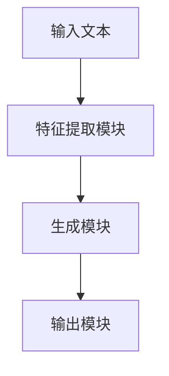
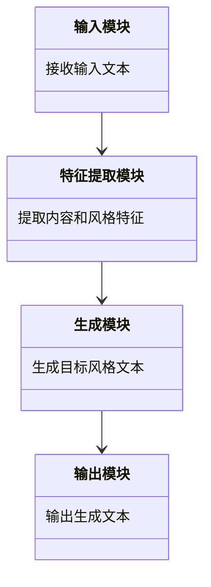

                 


```markdown
# AI Agent的风格迁移：让LLM适应不同的表达方式

> 关键词：AI Agent，风格迁移，LLM，自然语言处理，深度学习

> 摘要：本文探讨了AI Agent在风格迁移中的应用，重点介绍了如何让大语言模型（LLM）适应不同的表达方式。通过分析风格迁移的核心概念、算法原理和系统架构，结合实际项目案例，详细阐述了如何实现风格迁移，以及在项目中需要注意的关键点和最佳实践。

---

# 第1章: 风格迁移的定义与背景

## 1.1 风格迁移的定义与问题背景

### 1.1.1 风格迁移的定义
风格迁移是指将一种表达方式（如文本、图像）转换为另一种表达方式，同时保留其原有的语义内容。在自然语言处理领域，风格迁移通常指的是将文本从一种风格（如正式、口语化、文学性）转换为另一种风格。

### 1.1.2 风格迁移的核心问题
风格迁移的核心问题包括：
1. 如何提取文本的语义内容？
2. 如何保留语义内容的同时，改变表达风格？
3. 如何高效地训练风格迁移模型？

### 1.1.3 风格迁移的应用场景
风格迁移在以下场景中具有重要应用：
1. **文本生成**：将不同风格的文本转换为统一风格，便于后续处理。
2. **跨语言翻译**：在不同语言之间保持一致的表达风格。
3. **内容创作辅助**：帮助用户快速生成符合特定风格的文本。

## 1.2 LLM与风格迁移的关系

### 1.2.1 LLM的基本概念
大语言模型（LLM）是基于Transformer架构的大型神经网络模型，能够处理和生成自然语言文本。

### 1.2.2 风格迁移在LLM中的作用
风格迁移可以帮助LLM生成符合特定场景或用户偏好的文本，提升模型的灵活性和适用性。

### 1.2.3 风格迁移与LLM的结合
通过风格迁移，LLM可以适应不同的表达方式，从而更好地服务于多样化的应用场景。

---

# 第2章: 风格迁移的核心概念

## 2.1 风格迁移的特征提取

### 2.1.1 风格特征的提取
风格特征包括词汇选择、句式结构、语气等，这些特征决定了文本的表达风格。

### 2.1.2 内容特征的提取
内容特征包括文本的主题、语义信息等，这些特征需要在风格迁移过程中被保留。

## 2.2 风格迁移的生成过程

### 2.2.1 风格迁移的生成模型
基于Transformer的模型通常用于风格迁移，通过编码和解码过程实现风格的转换。

### 2.2.2 风格迁移的生成步骤
1. **输入预处理**：对输入文本进行分词、去除停用词等处理。
2. **特征提取**：提取内容特征和风格特征。
3. **风格转换**：基于提取的特征生成目标风格的文本。

---

# 第3章: 风格迁移的核心算法原理

## 3.1 基于Transformer的风格迁移算法

### 3.1.1 Transformer的基本结构
Transformer由编码器和解码器组成，编码器负责提取文本特征，解码器负责生成目标文本。

### 3.1.2 风格迁移的模型结构
模型通常包括风格嵌入层、内容嵌入层和注意力机制。

### 3.1.3 Transformer在风格迁移中的优势
1. **全局上下文感知**：能够捕捉文本的长距离依赖关系。
2. **并行计算**：计算效率高，适合大规模数据处理。

## 3.2 风格迁移的数学模型

### 3.2.1 风格迁移的损失函数
常用的损失函数包括：
1. **内容损失**：衡量生成文本与输入文本的语义相似度。
2. **风格损失**：衡量生成文本与目标风格的相似度。

### 3.2.2 风格迁移的优化算法
常用的优化算法包括Adam、SGD等，选择合适的优化算法可以提高模型的训练效率。

---

# 第4章: 风格迁移的系统架构设计

## 4.1 系统功能设计

### 4.1.1 系统功能模块划分
1. **输入模块**：接收输入文本。
2. **特征提取模块**：提取内容和风格特征。
3. **生成模块**：生成目标风格的文本。
4. **输出模块**：输出生成的文本。

### 4.1.2 系统功能流程图


## 4.2 系统架构设计

### 4.2.1 系统架构的层次划分
1. **数据层**：存储训练数据和输入文本。
2. **模型层**：包含特征提取和生成模型。
3. **接口层**：提供API供外部调用。

### 4.2.2 系统架构的组件设计


---

# 第5章: 风格迁移的项目实战

## 5.1 环境安装与配置

### 5.1.1 环境搭建步骤
1. 安装Python 3.8及以上版本。
2. 安装必要的依赖库，如TensorFlow、Keras、Python-Levenshtein。

### 5.1.2 依赖库的安装
```bash
pip install tensorflow keras python-Levenshtein
```

## 5.2 核心代码实现

### 5.2.1 数据预处理代码
```python
import tensorflow as tf
from tensorflow.keras.preprocessing.text import Tokenizer
from tensorflow.keras.preprocessing.sequence import pad_sequences

# 数据预处理代码
def preprocess_data(texts):
    tokenizer = Tokenizer()
    tokenizer.fit_on_texts(texts)
    sequences = tokenizer.texts_to_sequences(texts)
    padded_sequences = pad_sequences(sequences, padding='post', truncating='post')
    return padded_sequences
```

### 5.2.2 模型训练代码
```python
from tensorflow.keras.models import Model
from tensorflow.keras.layers import Input, Dense, Dropout, LSTM, Bidirectional, GlobalMaxPooling1D
from tensorflow.keras.layers import Conv1D, MaxPooling1D, Embedding

# 定义模型结构
input_layer = Input(shape=(None,))
embedding_layer = Embedding(vocab_size, 100)(input_layer)
bidirectional_layer = Bidirectional(LSTM(64))(embedding_layer)
dense_layer = Dense(64, activation='relu')(bidirectional_layer)
output_layer = Dense(vocab_size, activation='softmax')(dense_layer)

model = Model(inputs=input_layer, outputs=output_layer)
model.compile(optimizer='adam', loss='sparse_categorical_crossentropy', metrics=['accuracy'])
```

## 5.3 实际案例分析

### 5.3.1 案例分析
假设我们有一个风格迁移任务，将新闻报道风格的文本转换为口语化的文本。训练数据包括两组文本：一组是新闻报道风格，另一组是口语化风格。

### 5.3.2 模型训练与评估
通过训练，模型能够将新闻报道风格的文本转换为目标风格的文本。评估指标包括准确率和BLEU分数。

## 5.4 项目小结

### 5.4.1 项目总结
通过本项目，我们实现了一个基于Transformer的风格迁移模型，并验证了其在实际应用中的有效性。

### 5.4.2 改进建议
未来可以进一步优化模型结构，引入更复杂的特征提取方法，或者尝试多风格迁移。

---

# 第6章: 最佳实践与注意事项

## 6.1 最佳实践

### 6.1.1 数据选择与处理
确保训练数据的质量和多样性，避免过拟合。

### 6.1.2 模型调优
尝试不同的超参数组合，找到最优模型。

### 6.1.3 部署与维护
将模型部署到生产环境，并定期更新模型以保持性能。

## 6.2 小结

### 6.2.1 总结
风格迁移是一种强大的文本处理技术，能够帮助AI Agent适应不同的表达方式。

### 6.2.2 注意事项
在实际应用中，需要注意数据质量和模型调优，确保模型的稳定性和可靠性。

---

# 结语

通过本文的介绍，读者可以全面了解AI Agent的风格迁移技术，从理论到实践，掌握如何让LLM适应不同的表达方式。希望本文的内容能够为读者在相关领域的研究和应用提供有价值的参考。

--- 

> END
```

