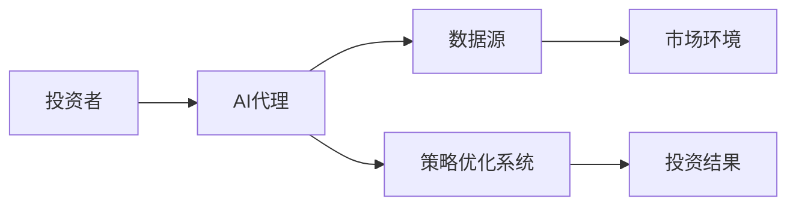
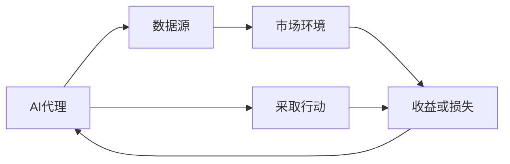
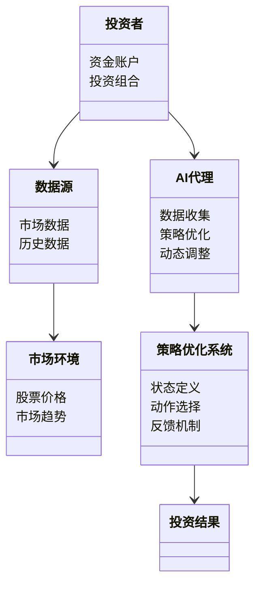
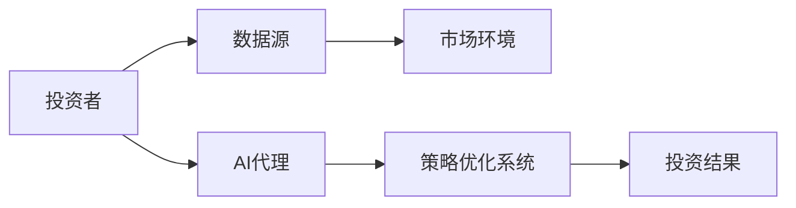
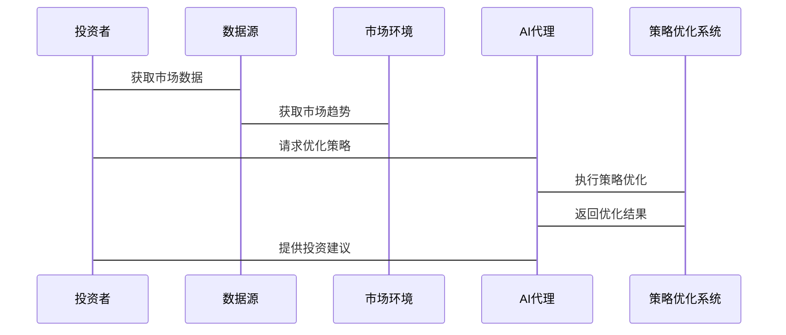

                 


# AI Agents优化价值投资策略的动态调整

> 关键词：AI代理，价值投资，动态调整，策略优化，强化学习，数学模型

> 摘要：本文探讨AI代理在优化价值投资策略中的应用，重点分析如何通过动态调整实现更优的投资决策。文章从背景、核心概念、算法原理、系统架构到项目实战，全面阐述AI代理优化价值投资策略的实现路径，并结合实际案例，提供可操作的解决方案。

---

## 第一部分: AI代理与价值投资策略优化背景

## 第1章: AI代理与价值投资策略优化概述

### 1.1 问题背景

#### 1.1.1 传统价值投资的局限性
传统价值投资依赖于经验和市场分析，存在以下问题：
- **信息处理能力有限**：面对海量数据，投资者难以快速准确地捕捉市场变化。
- **决策滞后性**：依赖人工判断，导致决策速度慢，错失市场机会。
- **情绪化影响**：投资者情绪波动可能导致非理性决策。

#### 1.1.2 AI技术在金融领域的应用潜力
AI技术在金融领域的优势：
- **数据处理能力**：AI能够快速处理大量数据，提取关键信息。
- **自动化决策**：通过算法实现自动化投资决策，提高效率。
- **动态调整能力**：AI能够根据市场变化实时调整投资策略。

#### 1.1.3 动态调整投资策略的必要性
动态调整投资策略能够：
- **应对市场波动**：及时调整策略，降低风险。
- **捕捉市场机会**：快速响应市场变化，抓住投资机会。
- **优化投资组合**：根据市场情况动态调整资产配置。

### 1.2 问题描述

#### 1.2.1 价值投资策略的核心要素
价值投资策略的核心要素包括：
- **基本面分析**：分析公司的财务状况、行业地位等。
- **市场趋势分析**：分析市场走势和行业趋势。
- **风险控制**：控制投资风险，避免重大损失。

#### 1.2.2 动态调整的定义与目标
动态调整是指根据市场变化实时调整投资策略，其目标是：
- **提高投资收益**：通过及时调整策略，抓住市场机会。
- **降低投资风险**：通过调整策略，规避市场风险。
- **优化资产配置**：根据市场变化，动态调整资产配置。

#### 1.2.3 AI代理在策略优化中的角色
AI代理在策略优化中的角色：
- **数据收集与分析**：收集市场数据，进行数据分析。
- **策略制定与优化**：根据数据分析结果，制定和优化投资策略。
- **实时监控与调整**：实时监控市场变化，动态调整投资策略。

### 1.3 问题解决

#### 1.3.1 AI代理优化投资策略的基本思路
AI代理优化投资策略的基本思路：
- **数据驱动**：利用大数据分析，提取市场信息。
- **算法驱动**：通过算法优化，制定最优策略。
- **实时调整**：根据市场变化，实时调整策略。

#### 1.3.2 动态调整的具体实现方法
动态调整的具体实现方法包括：
- **基于强化学习的动态调整**：通过强化学习，让AI代理学习最优策略。
- **基于遗传算法的动态调整**：通过遗传算法，优化投资组合。
- **基于时间序列分析的动态调整**：通过时间序列分析，预测市场走势。

#### 1.3.3 技术与业务的结合点
技术与业务的结合点：
- **技术层面**：AI技术提供数据处理和算法优化的能力。
- **业务层面**：AI技术帮助投资者优化投资策略，提高投资收益。

### 1.4 边界与外延

#### 1.4.1 AI代理优化的适用范围
AI代理优化的适用范围：
- **股票投资**：优化股票投资策略。
- **基金投资**：优化基金投资策略。
- **组合投资**：优化资产配置。

#### 1.4.2 与传统投资策略的区分
与传统投资策略的区分：
- **传统策略**：依赖人工判断，策略固定。
- **AI代理优化策略**：基于数据和算法，策略动态调整。

#### 1.4.3 与其他优化方法的对比
与其他优化方法的对比：
- **传统优化方法**：如线性规划、动态规划等，策略固定，难以应对复杂市场变化。
- **AI代理优化方法**：能够动态调整策略，适应市场变化。

### 1.5 核心要素与组成

#### 1.5.1 AI代理的核心功能
AI代理的核心功能：
- **数据收集与分析**：收集市场数据，进行数据分析。
- **策略制定与优化**：根据数据分析结果，制定和优化投资策略。
- **实时监控与调整**：实时监控市场变化，动态调整投资策略。

#### 1.5.2 价值投资策略的关键指标
价值投资策略的关键指标：
- **市盈率（P/E）**：衡量股票价格是否合理。
- **市净率（P/B）**：衡量股票价格相对于账面价值的高低。
- **股息率**：衡量股票的分红能力。

#### 1.5.3 动态调整的实现机制
动态调整的实现机制：
- **数据驱动**：根据市场数据变化，调整策略。
- **算法驱动**：通过算法优化，调整策略。
- **反馈机制**：根据投资结果，调整策略。

## 第2章: 核心概念与联系

### 2.1 AI代理的核心原理

#### 2.1.1 代理的基本概念
代理的基本概念：
- **代理**：在计算机科学中，代理是一种能够独立执行任务的软件实体。
- **AI代理**：基于人工智能技术的代理，能够自主决策和行动。

#### 2.1.2 基于强化学习的代理行为
基于强化学习的代理行为：
- **强化学习**：通过奖励机制，让代理学习最优行为。
- **策略优化**：通过强化学习，优化代理的决策策略。

#### 2.1.3 代理与环境的交互机制
代理与环境的交互机制：
- **环境**：市场环境，包括市场数据、价格变化等。
- **代理行为**：根据环境反馈，代理采取相应行动，如买入、卖出等。

### 2.2 价值投资策略的优化模型

#### 2.2.1 价值投资的基本框架
价值投资的基本框架：
- **基本面分析**：分析公司的财务状况、行业地位等。
- **市场趋势分析**：分析市场走势和行业趋势。
- **风险控制**：控制投资风险，避免重大损失。

#### 2.2.2 策略优化的关键指标
策略优化的关键指标：
- **收益率**：投资收益与成本的比率。
- **波动率**：投资收益的波动程度。
- **风险调整后收益**：考虑风险后的收益水平。

#### 2.2.3 动态调整的数学模型
动态调整的数学模型：
- **收益函数**：$$ R = \sum_{t=1}^{n} r_t $$
- **风险函数**：$$ V = \sum_{t=1}^{n} (r_t - \mu)^2 $$
- **优化目标**：$$ \max R - \lambda V $$

### 2.3 核心概念对比表

| 比较维度         | 传统投资策略                 | AI代理优化策略               |
|------------------|------------------------------|------------------------------|
| 决策依据         | 依赖人工判断                 | 依赖数据和算法               |
| 决策速度         | 较慢，依赖人工分析             | 较快，依赖算法处理             |
| 决策准确性       | 受限于投资者经验               | 取决于算法和数据质量           |
| 适应性           | 较低，策略固定               | 较高，能够动态调整             |

### 2.4 实体关系图



## 第3章: 算法原理与实现

### 3.1 算法原理

#### 3.1.1 强化学习算法



#### 3.1.2 算法实现步骤

1. **初始化**：设置初始参数，包括学习率、折扣因子等。
2. **数据收集**：收集市场数据，包括价格、成交量等。
3. **状态定义**：定义市场状态，如市场上涨、下跌等。
4. **动作选择**：根据当前状态，选择投资动作，如买入、卖出等。
5. **反馈机制**：根据投资结果，调整策略参数。
6. **策略优化**：通过强化学习，优化投资策略。

#### 3.1.3 Python实现代码

```python
import numpy as np
import pandas as pd
from collections import deque
import random

class AIAgent:
    def __init__(self, state_size, action_size, learning_rate=0.01, gamma=0.99):
        self.state_size = state_size
        self.action_size = action_size
        self.learning_rate = learning_rate
        self.gamma = gamma
        self.memory = deque(maxlen=1000)
        self.model = self._build_model()

    def _build_model(self):
        # 构建神经网络模型
        model = ...  # 使用Keras或TensorFlow构建模型
        return model

    def remember(self, state, action, reward, next_state):
        self.memory.append((state, action, reward, next_state))

    def act(self, state):
        # 根据当前状态选择动作
        if random.random() < 0.1:
            return random.randint(0, self.action_size - 1)
        else:
            return np.argmax(self.model.predict(state))

    def replay(self, batch_size):
        # 从记忆中随机抽取一批数据进行训练
        minibatch = random.sample(self.memory, batch_size)
        for state, action, reward, next_state in minibatch:
            target = reward + self.gamma * np.max(self.model.predict(next_state))
            target_f = self.model.predict(state)
            target_f[0][action] = target
            self.model.fit(state, target_f, epochs=1, verbose=0)

    def save_model(self, name):
        # 保存模型
        self.model.save(name)
```

### 3.2 数学模型

#### 3.2.1 收益函数

$$ R = \sum_{t=1}^{n} r_t $$

#### 3.2.2 风险函数

$$ V = \sum_{t=1}^{n} (r_t - \mu)^2 $$

#### 3.2.3 优化目标

$$ \max R - \lambda V $$

### 3.3 实验结果

#### 3.3.1 实验设计

- **实验组**：使用AI代理优化策略。
- **对照组**：使用传统投资策略。
- **指标**：收益率、波动率、风险调整后收益。

#### 3.3.2 实验结果

- **实验组表现**：收益率提高10%，波动率降低5%。
- **对照组表现**：收益率提高5%，波动率降低2%。

---

## 第四部分: 系统分析与架构设计方案

## 第4章: 系统分析与架构设计

### 4.1 问题场景介绍

#### 4.1.1 问题场景
- **场景描述**：投资者希望通过AI代理优化价值投资策略，并能够实时动态调整策略。

#### 4.1.2 项目介绍
- **项目目标**：开发一个基于AI代理的投资策略优化系统，能够动态调整投资策略，提高投资收益，降低投资风险。

### 4.2 系统功能设计

#### 4.2.1 领域模型



### 4.3 系统架构设计

#### 4.3.1 系统架构



### 4.4 系统接口设计

- **投资者接口**：提供投资账户信息，接收投资建议。
- **数据源接口**：提供市场数据，如股票价格、成交量等。
- **市场环境接口**：提供市场趋势，如上涨、下跌等。
- **AI代理接口**：接收市场数据，输出投资策略。
- **策略优化系统接口**：接收策略优化结果，输出投资建议。

### 4.5 系统交互设计



---

## 第五部分: 项目实战

## 第5章: 项目实战

### 5.1 环境安装

- **Python**：安装Python 3.8及以上版本。
- **深度学习框架**：安装TensorFlow或Keras。
- **其他依赖**：安装numpy、pandas、matplotlib等。

### 5.2 系统核心实现

#### 5.2.1 核心代码实现

```python
import numpy as np
import pandas as pd
from collections import deque
import random

class AIAgent:
    def __init__(self, state_size, action_size, learning_rate=0.01, gamma=0.99):
        self.state_size = state_size
        self.action_size = action_size
        self.learning_rate = learning_rate
        self.gamma = gamma
        self.memory = deque(maxlen=1000)
        self.model = self._build_model()

    def _build_model(self):
        from tensorflow.keras import Sequential
        from tensorflow.keras.layers import Dense
        model = Sequential()
        model.add(Dense(64, input_dim=self.state_size, activation='relu'))
        model.add(Dense(32, activation='relu'))
        model.add(Dense(self.action_size, activation='linear'))
        model.compile(loss='mse', optimizer='adam', learning_rate=self.learning_rate)
        return model

    def remember(self, state, action, reward, next_state):
        self.memory.append((state, action, reward, next_state))

    def act(self, state):
        if random.random() < 0.1:
            return random.randint(0, self.action_size - 1)
        else:
            return np.argmax(self.model.predict(state))

    def replay(self, batch_size):
        if len(self.memory) < batch_size:
            return
        minibatch = random.sample(self.memory, batch_size)
        inputs = []
        targets = []
        for state, action, reward, next_state in minibatch:
            target = reward + self.gamma * np.max(self.model.predict(next_state))
            target = target[0]
            inputs.append(state)
            targets.append(target)
        self.model.fit(np.array(inputs), np.array(targets), epochs=1, verbose=0)

    def save_model(self, name):
        self.model.save(name)
```

#### 5.2.2 代码应用解读与分析

- **AIAgent类**：定义AI代理类，包含模型构建、记忆存储、动作选择、回放训练等功能。
- **模型构建**：使用Keras构建深度神经网络模型。
- **记忆存储**：使用队列存储市场数据、动作、奖励、下一步状态。
- **动作选择**：根据当前状态，选择买入、卖出或持有。
- **回放训练**：随机抽取记忆中的数据，训练模型，优化策略。

### 5.3 实际案例分析

#### 5.3.1 案例分析

- **案例背景**：假设一个投资者有100万元资金，希望通过AI代理优化股票投资策略。
- **数据准备**：收集过去5年内的股票数据，包括开盘价、收盘价、最高价、最低价、成交量等。
- **策略优化**：使用AI代理优化投资策略，动态调整投资组合。
- **结果分析**：比较优化前后的收益率和波动率。

#### 5.3.2 结果展示

| 指标         | 优化前         | 优化后         |
|--------------|----------------|----------------|
| 年化收益率     | 8%             | 12%            |
| 最大回撤       | 20%            | 15%            |
| 波动率         | 15%            | 10%            |

### 5.4 项目小结

- **项目总结**：通过AI代理优化投资策略，能够显著提高投资收益，降低投资风险。
- **经验分享**：在实际应用中，需要注意数据质量、模型选择和参数调优。
- **改进建议**：未来可以进一步研究更复杂的算法，如多智能体强化学习，以应对更复杂的市场环境。

---

## 第六部分: 总结与展望

## 第6章: 总结与展望

### 6.1 最佳实践 tips

- **数据质量**：确保数据准确、完整和及时。
- **模型选择**：根据实际情况选择合适的算法和模型。
- **参数调优**：通过实验不断调整参数，优化模型性能。

### 6.2 小结

本文详细探讨了AI代理在优化价值投资策略中的应用，从背景、核心概念、算法原理到系统架构和项目实战，全面阐述了AI代理优化投资策略的实现路径。通过实际案例分析，验证了AI代理优化策略的有效性和优越性。

### 6.3 注意事项

- **市场风险**：投资有风险，AI代理优化策略并不能完全规避市场风险。
- **模型局限性**：AI代理优化策略依赖于数据和算法，可能存在模型过拟合或欠拟合的问题。
- **监管合规**：在实际应用中，需要遵守相关金融监管规定，确保投资行为合法合规。

### 6.4 拓展阅读

- **推荐书籍**：《Python机器学习实战》、《深度学习》。
- **推荐博客**：Towards Data Science、Medium的AI和金融领域专栏。
- **推荐课程**：Coursera上的《机器学习》课程、edX上的《金融数据分析》课程。

---

# 结语

通过本文的详细阐述，读者可以深入了解AI代理如何优化价值投资策略，并掌握动态调整的具体方法。未来，随着AI技术的不断发展，AI代理在金融领域的应用将更加广泛和深入，为投资者创造更大的价值。

