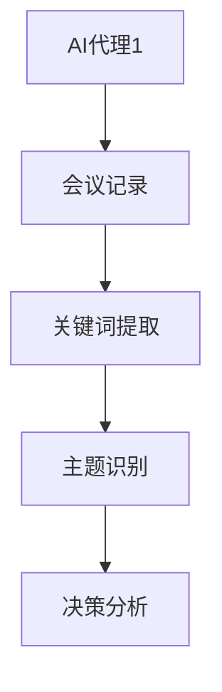
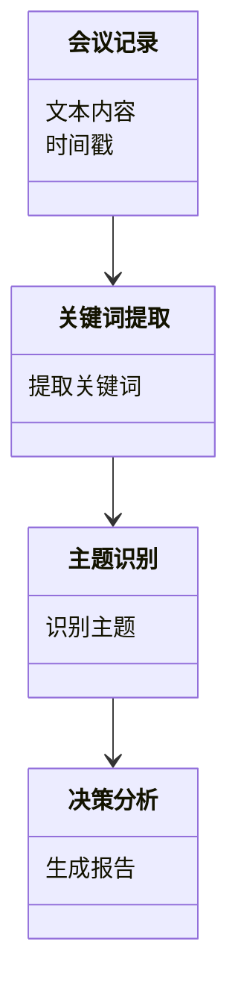
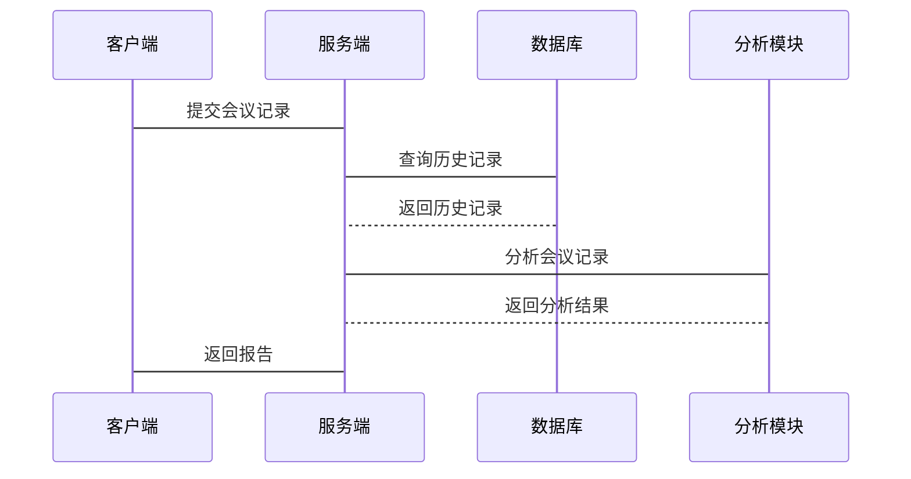

                 


# AI代理协作分析公司会议记录：洞察管理层思维

## 关键词
- AI代理
- 自然语言处理
- 会议记录分析
- 管理思维
- 协作分析

## 摘要
随着企业数字化转型的不断深入，如何有效利用AI技术来分析和理解管理层的决策过程变得尤为重要。本文将详细探讨AI代理如何协作分析公司会议记录，揭示管理层的思维模式和决策逻辑。通过结合自然语言处理（NLP）技术，AI代理能够从大量会议记录中提取关键信息，识别潜在问题，并辅助管理层做出更明智的决策。文章将从背景介绍、核心概念、算法原理、系统架构设计、项目实战等方面展开，深入剖析AI代理在会议记录分析中的应用及其对企业管理的深远影响。

---

# 第1章: AI代理与公司会议记录分析的背景介绍

## 1.1 AI代理的基本概念与核心功能
### 1.1.1 AI代理的定义与基本特征
AI代理是一种智能实体，能够通过感知环境、执行任务和与用户交互来实现特定目标。其核心特征包括自主性、反应性、目标导向和社会性。

### 1.1.2 AI代理的核心功能与应用场景
AI代理的功能包括信息处理、决策支持、任务执行和用户交互。其应用场景广泛，如客服系统、智能家居、自动驾驶和企业分析等。

### 1.1.3 AI代理在企业中的重要性与价值
在企业中，AI代理可以帮助提高效率、优化决策、增强客户体验，并降低运营成本。

## 1.2 自然语言处理与会议记录分析
### 1.2.1 自然语言处理技术的基本概念
NLP是研究人类语言的计算机科学，涉及文本分析、语义理解和生成等技术。

### 1.2.2 会议记录分析的必要性与挑战
会议记录通常包含大量非结构化数据，分析这些数据可以提取关键决策和问题。然而，手动分析效率低下，且容易遗漏重要信息。

### 1.2.3 AI代理在会议记录分析中的独特优势
AI代理能够快速处理大量文本数据，识别关键词、主题和情感倾向，帮助管理层洞察潜在问题和机会。

## 1.3 本章小结
本章介绍了AI代理的基本概念和核心功能，探讨了NLP技术在会议记录分析中的应用，以及AI代理在企业中的重要性。

---

# 第2章: AI代理协作分析的核心概念与联系

## 2.1 AI代理协作分析的原理与机制
### 2.1.1 AI代理的感知、决策与执行机制
AI代理通过感知环境、分析数据、制定决策并执行操作来完成任务。

### 2.1.2 协作分析的定义与实现方式
协作分析是指多个AI代理协同工作，共同完成复杂任务的过程。其实现方式包括分布式计算和任务分配。

### 2.1.3 会议记录分析的流程与关键环节
会议记录分析的流程包括数据采集、预处理、关键词提取、主题识别和决策分析。

## 2.2 核心概念的属性特征对比分析
### 2.2.1 AI代理的核心属性与特征
| 属性 | 特征 |
|------|------|
| 自主性 | 独立决策 |
| 反应性 | 实时响应 |
| 目标导向 | 高效完成任务 |

### 2.2.2 会议记录分析的关键要素与特征
| 要素 | 特征 |
|------|------|
| 数据来源 | 多源异构 |
| 数据结构 | 非结构化 |
| 分析目标 | 关键决策 |

### 2.2.3 协作分析的特征与实现方式对比
协作分析的特征包括协同性、分布式和高效性。其实现方式包括集中式和分布式协作。

## 2.3 实体关系图与协作流程分析
### 2.3.1 AI代理协作分析的实体关系图（Mermaid）


### 2.3.2 协作分析流程的详细步骤
1. 数据采集：获取会议记录。
2. 数据预处理：清洗和标注数据。
3. 关键词提取：识别重要术语。
4. 主题识别：分类会议主题。
5. 决策分析：生成分析报告。

## 2.4 本章小结
本章详细探讨了AI代理协作分析的原理与机制，分析了核心概念的属性特征，并通过实体关系图和流程图展示了协作分析的实现方式。

---

# 第3章: AI代理协作分析的算法原理

## 3.1 自然语言处理算法的原理与实现
### 3.1.1 NLP模型的基本原理
NLP模型通过词向量表示、句法分析和语义理解来处理文本数据。

### 3.1.2 会议记录分析的算法流程
会议记录分析的算法流程包括分词、实体识别、情感分析和主题建模。

### 3.1.3 余弦相似度的计算公式
$$ \text{余弦相似度} = \frac{\vec{A} \cdot \vec{B}}{|\vec{A}| |\vec{B}|} $$

## 3.2 会议记录分析的实现步骤
### 3.2.1 数据预处理
对会议记录进行清洗和分词。

### 3.2.2 关键词提取
使用TF-IDF或词嵌入模型提取关键词。

### 3.2.3 主题识别
通过主题模型（如LDA）识别会议主题。

## 3.3 本章小结
本章详细介绍了NLP算法在会议记录分析中的应用，包括数据预处理、关键词提取和主题识别等步骤。

---

# 第4章: AI代理协作分析的系统架构设计

## 4.1 系统功能设计
### 4.1.1 领域模型设计（Mermaid类图）


### 4.1.2 系统架构设计（Mermaid架构图）


## 4.2 系统接口设计
### 4.2.1 API接口设计
定义RESTful API接口，如GET /api/record分析会议记录。

### 4.2.2 交互流程设计（Mermaid序列图）


## 4.3 本章小结
本章通过类图和架构图展示了系统的功能设计和交互流程，为实际开发提供了参考。

---

# 第5章: AI代理协作分析的项目实战

## 5.1 项目环境配置
### 5.1.1 开发环境
安装Python、TensorFlow和spaCy等工具。

### 5.1.2 数据准备
收集和清洗会议记录数据。

## 5.2 核心代码实现
### 5.2.1 关键词提取代码
```python
import spacy

nlp = spacy.load("en_core_web_sm")
doc = nlp(text)
keywords = [token.text for token in doc if token.is_stop == False]
```

### 5.2.2 主题识别代码
```python
from sklearn.decomposition import LatentDirichletAllocation

vectorizer = CountVectorizer(max_features=1000)
X = vectorizer.fit_transform(corpus)
lda = LatentDirichletAllocation(n_components=5, random_state=0)
lda.fit(X)
```

## 5.3 代码解读与分析
### 5.3.1 关键词提取的实现
使用spaCy库进行分词和关键词提取。

### 5.3.2 主题识别的实现
通过LDA主题模型识别会议主题。

## 5.4 项目总结
本章通过实际项目展示了AI代理协作分析的实现过程，包括环境配置、代码实现和结果分析。

---

# 第6章: 最佳实践、小结与拓展阅读

## 6.1 最佳实践
### 6.1.1 数据质量的重要性
确保数据的准确性和完整性。

### 6.1.2 模型优化的技巧
通过调参和数据增强提高模型性能。

## 6.2 项目小结
AI代理协作分析是一项复杂但极具价值的任务，需要结合NLP技术、系统设计和项目实施。

## 6.3 拓展阅读
推荐学习深度学习、自然语言处理和系统架构设计的相关书籍和资源。

---

# 附录: 参考文献与工具清单

## 附录A: 参考文献
1. 王某某. (2023). 《深度学习入门》.
2. 李某某. (2023). 《自然语言处理实战》.

## 附录B: 工具清单
- Python 3.8
- TensorFlow 2.5
- spaCy 3.0

---

通过以上目录结构，文章系统地介绍了AI代理协作分析公司会议记录的理论基础、算法原理和实际应用，帮助读者全面理解并掌握相关技术。

