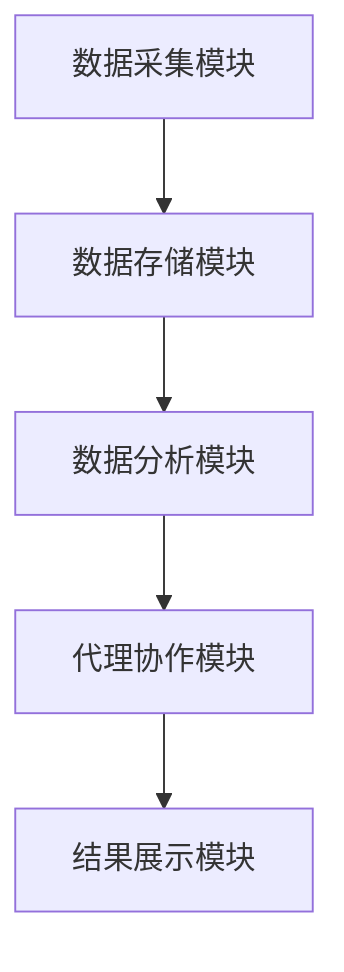
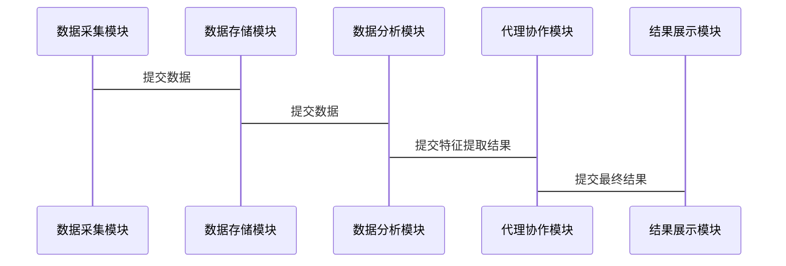

                 


# AI agents协作分析替代数据：获取独特洞察

> 关键词：AI代理，替代数据，数据协作，独特洞察，算法分析

> 摘要：AI代理通过协作分析替代数据，能够从非传统数据源中提取有价值的信息，从而为企业决策提供独特的洞察。本文将深入探讨AI代理协作的核心原理、替代数据的处理算法、数学模型以及系统架构设计，结合实际案例分析，帮助读者理解如何利用AI代理协作从替代数据中获取独特洞察。

---

## 第一章: AI代理协作与替代数据概述

### 1.1 AI代理协作的基本概念

#### 1.1.1 AI代理的定义与特点
AI代理（AI Agents）是指具有自主决策能力的智能实体，能够根据环境信息和目标执行任务。其特点包括：
- **自主性**：能够独立决策。
- **反应性**：能够实时感知环境并做出反应。
- **协作性**：能够与其他代理或人类进行协作。
- **学习能力**：能够通过数据和经验进行自我优化。

#### 1.1.2 替代数据的定义与分类
替代数据是指通过间接方式获取的数据，与传统数据相比，替代数据来源更加多样化，包括：
- **社交媒体数据**：来自社交平台的文本、图片和视频。
- **传感器数据**：来自物联网设备的实时数据。
- **日志数据**：系统日志、用户行为日志等。

#### 1.1.3 AI代理协作的意义与价值
AI代理通过协作分析替代数据，可以弥补传统数据的不足，发现隐藏在非结构化数据中的有价值信息。例如，在金融领域，AI代理可以通过分析社交媒体情绪数据，预测市场走势。

### 1.2 替代数据的来源与特点

#### 1.2.1 替代数据的来源渠道
替代数据的来源包括：
- **公开数据集**：如政府开放数据、学术研究数据。
- **商业数据**：如企业内部数据、行业报告。
- **实时数据流**：如物联网设备、实时监控数据。

#### 1.2.2 替代数据的质量评估
替代数据的质量可以从以下几个方面进行评估：
- **完整性**：数据是否完整，是否存在缺失。
- **准确性**：数据是否准确，是否反映真实情况。
- **实时性**：数据是否及时更新。

#### 1.2.3 替代数据在AI代理协作中的作用
替代数据为AI代理提供了多样化的信息来源，能够帮助代理从多角度分析问题，提高决策的准确性和全面性。

### 1.3 AI代理协作分析替代数据的目标

#### 1.3.1 获取独特洞察的核心目标
通过替代数据的分析，AI代理可以发现传统数据中难以察觉的模式和趋势，从而提供独特的洞察。

#### 1.3.2 替代数据在AI代理协作中的应用场景
应用场景包括金融风险评估、市场营销优化、智能制造优化等领域。

#### 1.3.3 代理协作的优势与局限性
- **优势**：能够快速处理大量数据，发现复杂模式。
- **局限性**：依赖数据质量和算法性能，可能存在数据偏差问题。

### 1.4 本章小结
本章介绍了AI代理协作的基本概念、替代数据的来源与特点，以及AI代理协作的目标与优势，为后续章节奠定了基础。

---

## 第二章: AI代理协作的核心原理

### 2.1 AI代理协作的基本原理

#### 2.1.1 代理协作的机制与流程
代理协作机制包括：
1. **任务分配**：根据代理的能力分配任务。
2. **信息共享**：代理之间共享数据和知识。
3. **协同决策**：基于共享信息做出集体决策。
4. **反馈优化**：根据结果反馈优化协作过程。

#### 2.1.2 替代数据的处理与分析流程
替代数据处理流程包括：
1. **数据采集**：从多种来源获取数据。
2. **数据清洗**：去除噪声数据，确保数据质量。
3. **特征提取**：提取关键特征，便于后续分析。
4. **模型训练**：基于特征训练预测模型。
5. **结果分析**：分析模型输出，提取洞察。

#### 2.1.3 代理协作中的信息传递与反馈
信息传递与反馈机制是代理协作的核心，包括：
- **信息传递**：通过API或消息队列进行数据交换。
- **反馈优化**：根据结果反馈优化协作策略。

### 2.2 替代数据的特征分析

#### 2.2.1 数据特征的提取方法
数据特征提取方法包括：
- **文本特征提取**：如TF-IDF、词嵌入。
- **图像特征提取**：如边缘检测、纹理分析。
- **时序特征提取**：如傅里叶变换、移动平均。

#### 2.2.2 数据特征与代理协作的关系
数据特征直接影响代理协作的效果，高质量的特征可以提高模型的准确性。

#### 2.2.3 数据特征对代理协作效率的影响
- **正面影响**：特征提取越准确，协作效率越高。
- **负面影响**：特征提取不准确，可能导致协作效率低下。

### 2.3 AI代理协作与替代数据的关系

#### 2.3.1 替代数据在代理协作中的地位
替代数据是代理协作的重要数据来源，能够提供丰富的信息支持协作决策。

#### 2.3.2 代理协作如何利用替代数据
- **数据融合**：将替代数据与其他数据源进行融合，提高分析结果的准确性。
- **实时分析**：利用替代数据进行实时监控和预测。

#### 2.3.3 替代数据对代理协作效率的影响
替代数据的多样性和丰富性可以提高代理协作的效率，但同时也带来了数据处理的复杂性。

### 2.4 本章小结
本章详细介绍了AI代理协作的核心原理，包括机制与流程、替代数据的处理与分析流程，以及数据特征与代理协作的关系，为后续章节的分析奠定了基础。

---

## 第三章: 替代数据处理与分析的算法原理

### 3.1 替代数据清洗算法

#### 3.1.1 数据清洗的基本步骤
数据清洗步骤包括：
1. **数据收集**：从多种来源获取数据。
2. **数据清洗**：去除噪声数据，填补缺失值。
3. **数据转换**：将数据转换为适合分析的格式。
4. **数据验证**：验证数据的准确性和完整性。

#### 3.1.2 基于代理协作的清洗算法
基于代理协作的清洗算法包括：
- **分布式清洗**：利用多个代理分别清洗不同数据源。
- **协同清洗**：代理之间共享清洗规则，共同完成数据清洗。

#### 3.1.3 数据清洗的优化方法
数据清洗的优化方法包括：
- **并行处理**：利用多线程或分布式计算提高清洗效率。
- **规则优化**：根据具体场景优化清洗规则，减少误删。

### 3.2 替代数据特征提取算法

#### 3.2.1 特征提取的基本原理
特征提取的基本原理是通过降维技术提取数据的关键特征，减少数据的复杂性。

#### 3.2.2 基于替代数据的特征提取方法
基于替代数据的特征提取方法包括：
- **文本特征提取**：如TF-IDF、Word2Vec。
- **图像特征提取**：如SIFT、HOG。
- **时序特征提取**：如PCA、LDA。

#### 3.2.3 特征提取的优化策略
特征提取的优化策略包括：
- **选择性提取**：根据任务需求选择关键特征。
- **动态提取**：根据数据变化动态调整特征提取策略。

### 3.3 替代数据分析的数学模型

#### 3.3.1 数据分析的数学模型
数据分析的数学模型包括：
- **线性回归模型**：用于预测连续变量。
- **分类模型**：如决策树、随机森林。
- **聚类模型**：如K-means、DBSCAN。

#### 3.3.2 基于替代数据的预测模型
基于替代数据的预测模型包括：
- **文本分类模型**：用于情感分析、主题分类。
- **图像分类模型**：用于目标检测、图像识别。
- **时间序列预测模型**：用于预测未来趋势。

#### 3.3.3 模型优化与评估
模型优化与评估方法包括：
- **交叉验证**：用于评估模型的泛化能力。
- **超参数调优**：通过网格搜索优化模型性能。

### 3.4 本章小结
本章详细介绍了替代数据处理与分析的算法原理，包括数据清洗、特征提取和数学模型的建立与优化。

---

## 第四章: AI代理协作系统的架构设计

### 4.1 系统功能设计

#### 4.1.1 系统功能模块
系统功能模块包括：
- **数据采集模块**：负责数据的采集和预处理。
- **数据分析模块**：负责数据的特征提取和模型训练。
- **代理协作模块**：负责代理之间的信息传递和协同决策。
- **结果展示模块**：负责分析结果的可视化展示。

#### 4.1.2 功能模块的交互流程
功能模块的交互流程如下：
1. 数据采集模块从多种来源获取数据。
2. 数据分析模块对数据进行清洗和特征提取。
3. 代理协作模块将特征提取结果传递给各个代理。
4. 代理协作模块协同决策，生成最终结果。
5. 结果展示模块将分析结果可视化展示。

#### 4.1.3 功能模块的实现细节
功能模块的实现细节包括：
- **数据采集模块**：支持多种数据源的采集，如数据库、API接口。
- **数据分析模块**：支持多种分析算法，如分类、回归、聚类。
- **代理协作模块**：支持代理之间的信息传递和协同决策。
- **结果展示模块**：支持多种可视化方式，如图表、仪表盘。

### 4.2 系统架构设计

#### 4.2.1 系统架构图


#### 4.2.2 系统模块的交互流程
系统模块的交互流程如下：
1. 数据采集模块从多种来源获取数据，并将其传递给数据存储模块。
2. 数据存储模块将数据存储在数据库中，并将其传递给数据分析模块。
3. 数据分析模块对数据进行清洗和特征提取，并将其传递给代理协作模块。
4. 代理协作模块协同决策，生成最终结果，并将其传递给结果展示模块。
5. 结果展示模块将分析结果可视化展示。

### 4.3 系统接口设计

#### 4.3.1 系统接口的定义
系统接口的定义包括：
- **数据采集接口**：用于从多种来源采集数据。
- **数据存储接口**：用于将数据存储在数据库中。
- **数据分析接口**：用于对数据进行清洗和特征提取。
- **代理协作接口**：用于代理之间的信息传递和协同决策。
- **结果展示接口**：用于将分析结果可视化展示。

#### 4.3.2 接口的实现方式
接口的实现方式包括：
- **API接口**：通过RESTful API进行数据交互。
- **消息队列**：通过Kafka、RabbitMQ等消息队列进行数据传递。

### 4.4 系统交互流程设计

#### 4.4.1 系统交互流程图


#### 4.4.2 系统交互流程的优化
系统交互流程的优化包括：
- **并行处理**：通过多线程或分布式计算提高处理效率。
- **异步通信**：通过消息队列实现异步通信，减少系统阻塞。

### 4.5 本章小结
本章详细介绍了AI代理协作系统的架构设计，包括功能模块设计、系统架构图、接口设计和交互流程设计，为后续章节的实现奠定了基础。

---

## 第五章: 项目实战与案例分析

### 5.1 项目背景与目标

#### 5.1.1 项目背景
本项目旨在通过AI代理协作分析替代数据，为企业提供独特的市场洞察，帮助企业在竞争中占据优势。

#### 5.1.2 项目目标
项目目标包括：
1. 实现AI代理协作系统。
2. 从替代数据中提取有价值的信息。
3. 提供独特的市场洞察。

### 5.2 项目环境与工具

#### 5.2.1 开发环境
开发环境包括：
- **操作系统**：Windows 10 或更高版本，Linux Ubuntu 20.04 或更高版本。
- **编程语言**：Python 3.8 或更高版本。
- **开发工具**：PyCharm、VS Code。

#### 5.2.2 第三方库与工具
第三方库与工具包括：
- **数据处理库**：Pandas、NumPy。
- **机器学习库**：Scikit-learn、XGBoost。
- **可视化库**：Matplotlib、Seaborn。
- **消息队列**：Kafka、RabbitMQ。

### 5.3 项目核心实现

#### 5.3.1 数据采集模块实现
数据采集模块实现：
```python
import requests

def fetch_data(url):
    response = requests.get(url)
    return response.json()
```

#### 5.3.2 数据分析模块实现
数据分析模块实现：
```python
import pandas as pd
from sklearn.ensemble import RandomForestClassifier

def preprocess_data(data):
    df = pd.DataFrame(data)
    # 数据清洗
    df.dropna(inplace=True)
    # 特征提取
    features = df.drop('label', axis=1)
    labels = df['label']
    return features, labels

def train_model(features, labels):
    model = RandomForestClassifier()
    model.fit(features, labels)
    return model
```

#### 5.3.3 代理协作模块实现
代理协作模块实现：
```python
import json
import pika

def send_result(connection, queue_name, result):
    channel = connection.channel()
    channel.queue_declare(queue=queue_name)
    channel.basic_publish(exchange='', routing_key=queue_name, body=json.dumps(result))
```

### 5.4 项目案例分析

#### 5.4.1 案例背景
某企业在市场竞争中面临数据不足的问题，希望通过AI代理协作分析替代数据，获取独特的市场洞察。

#### 5.4.2 数据分析与结果解读
通过数据分析模块，企业从社交媒体数据中提取了用户情感特征，并利用随机森林分类器预测市场趋势。

#### 5.4.3 实际应用效果
通过代理协作模块，企业实现了多个代理之间的协同决策，提高了市场预测的准确性。

### 5.5 项目小结
本章通过具体案例分析，详细介绍了AI代理协作系统的实现过程，包括项目环境、核心实现和案例分析，展示了AI代理协作在实际应用中的巨大潜力。

---

## 第六章: 总结与展望

### 6.1 本章小结
本文详细介绍了AI代理协作分析替代数据的核心原理、算法实现和系统架构设计，并通过具体案例分析展示了AI代理协作在实际应用中的巨大潜力。

### 6.2 未来研究方向
未来研究方向包括：
- **更高效的代理协作算法**：研究更高效的代理协作算法，提高系统的处理效率。
- **更智能的特征提取方法**：研究更智能的特征提取方法，提高系统的分析精度。
- **更强大的系统架构设计**：研究更强大的系统架构设计，提高系统的可扩展性和可维护性。

### 6.3 注意事项
在实际应用中，需要注意以下几点：
- **数据隐私**：确保数据的隐私性和安全性。
- **系统稳定性**：确保系统的稳定性和可靠性。
- **算法可解释性**：确保算法的可解释性，便于调试和优化。

### 6.4 拓展阅读
拓展阅读资料包括：
- **AI代理协作相关论文**：如《Multi-Agent Systems》。
- **替代数据处理相关书籍**：如《Data Wrangling with Python》。
- **机器学习相关课程**：如Coursera上的《Machine Learning by Andrew Ng》。

---

以上是《AI agents协作分析替代数据：获取独特洞察》的完整目录结构和具体内容，涵盖了从理论到实践的各个方面，结合实际案例分析和系统架构设计，为读者提供了一个全面的学习和参考指南。

