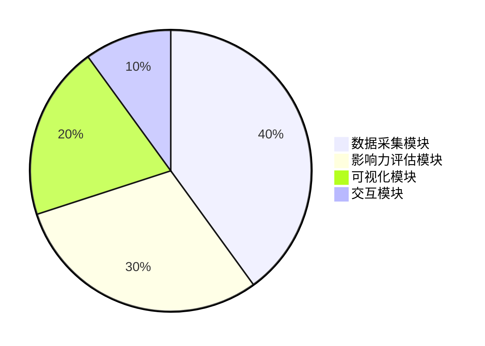

                 


# AI agents协作分析社交网络：评估公司的社会影响力

## 关键词：AI代理、社交网络分析、企业社会影响力、文本挖掘、情感分析、影响力传播模型

## 摘要：
随着社交网络的迅速发展，企业社会影响力评估变得越来越重要。本文探讨AI代理如何协作分析社交网络数据，以评估公司的社会影响力。通过介绍核心概念、算法原理、系统架构和项目实战，本文为读者提供全面的分析，帮助他们理解AI代理在社交网络中的应用及其对企业影响力的评估。

---

# 第1章: AI代理协作分析社交网络的背景与问题描述

## 1.1 问题背景
### 1.1.1 社交网络的崛起与影响力评估的重要性
社交网络已成为信息传播和用户互动的主要平台。企业通过社交网络与用户互动，直接影响其社会影响力。评估企业影响力有助于制定有效的营销策略和品牌形象管理。

### 1.1.2 AI代理在社交网络分析中的作用
AI代理能够实时处理大量数据，识别用户情感和意见领袖，为影响力评估提供支持。通过协作分析，AI代理能够高效地从社交网络中提取有价值的信息。

### 1.1.3 企业社会影响力评估的挑战与机遇
社交网络数据复杂，包括文本、图像和视频等多种形式。企业需要评估多个维度的影响力，包括情感、传播广度和互动频率。AI代理能够帮助克服这些挑战，提供准确的评估结果。

## 1.2 问题描述
### 1.2.1 社交网络数据的复杂性
社交网络数据多样化，包括文本、图片和视频，数据量大且结构复杂，难以手动处理。

### 1.2.2 AI代理协作分析的关键问题
AI代理需要处理异构数据，进行情感分析和影响力传播，同时确保分析结果的准确性。

### 1.2.3 企业社会影响力评估的多维度考量
影响力评估需要考虑情感、传播速度和范围，以及用户互动频率。AI代理能够帮助企业在这些维度上进行综合评估。

## 1.3 问题解决与边界
### 1.3.1 AI代理协作分析的解决方案
通过AI代理协作，利用自然语言处理和影响力传播模型，提取关键信息，评估企业影响力。

### 1.3.2 边界与外延
解决方案仅涵盖社交网络分析，不涉及企业内部数据或隐私问题。

### 1.3.3 核心概念与核心要素
核心概念包括AI代理、社交网络和企业影响力。核心要素包括数据采集、情感分析和影响力传播。

## 1.4 本章小结
本章介绍了AI代理协作分析社交网络的背景，描述了企业社会影响力评估的重要性，明确了问题和解决方案。

---

# 第2章: AI代理协作分析的核心概念与联系

## 2.1 核心概念原理
### 2.1.1 AI代理的基本原理
AI代理能够理解上下文，执行任务，如数据采集和情感分析，帮助评估企业影响力。

### 2.1.2 社交网络分析的核心原理
社交网络分析通过识别关键节点和社区结构，评估影响力。常用算法包括文本挖掘和情感分析。

### 2.1.3 企业社会影响力评估的理论基础
影响力评估基于用户行为和情感分析，结合网络结构特征，评估企业在社交网络中的影响力。

## 2.2 核心概念属性特征对比
| 核心概念 | 属性特征 |
|----------|----------|
| AI代理   | 自适应性、自主性、协作性 |
| 社交网络 | 结构复杂性、数据多样性 |
| 企业影响力 | 情感维度、传播维度、互动维度 |

## 2.3 ER实体关系图架构
```mermaid
er
    actor: 用户
    agent: AI代理
    social_network: 社交网络
    company_influence: 企业影响力
    interaction: 交互
    actor --> agent: 请求分析
    agent --> social_network: 数据采集
    agent --> company_influence: 影响力评估
    agent --> interaction: 交互结果
```

## 2.4 本章小结
本章详细讲解了AI代理、社交网络和企业影响力评估的核心概念，对比了它们的属性特征，并通过ER图展示了实体关系。

---

# 第3章: AI代理协作分析的算法原理

## 3.1 算法原理概述
### 3.1.1 文本挖掘算法
文本挖掘用于提取关键信息，识别主题和关键词。

### 3.1.2 情感分析算法
情感分析判断文本情感，常用方法包括基于规则和机器学习。

### 3.1.3 社会网络影响力传播算法
影响力传播模型通过网络结构计算节点影响力。

## 3.2 算法原理的数学模型
### 3.2.1 文本挖掘模型
$$P(\text{关键词} | \text{主题})$$

### 3.2.2 情感分析模型
$$P(\text{正面} | \text{文本})$$

### 3.2.3 影响力传播模型
$$I_i = \sum_{j} w_{ij} \cdot I_j$$

## 3.3 算法实现与案例分析
### 3.3.1 文本挖掘实现
使用Python的nltk库进行关键词提取。

### 3.3.2 情感分析实现
使用VADER库进行情感分析，代码示例如下：
```python
from vaderSentiment import SentimentIntensityAnalyzer
analyzer = SentimentIntensityAnalyzer()
text = "Great product!"
scores = analyzer.polarity_scores(text)
print(scores['compound'])  # 输出情感得分
```

### 3.3.3 影响力传播实现
使用网络的邻接矩阵，计算影响力得分：
```python
import numpy as np
w = np.array([[0,1,0],[1,0,1],[0,1,0]])
I = np.ones(3)
I = np.dot(w, I)
```

## 3.4 本章小结
本章详细讲解了文本挖掘、情感分析和影响力传播算法的原理和实现，并通过案例分析展示了它们的应用。

---

# 第4章: 系统分析与架构设计

## 4.1 系统背景与目标
系统目标是通过AI代理协作分析社交网络，评估企业影响力。

## 4.2 系统功能设计
### 4.2.1 数据采集模块
采集社交网络数据，如Twitter和微博。

### 4.2.2 影响力评估模块
分析情感和影响力传播，生成评估结果。

### 4.2.3 可视化模块
展示分析结果，如情感分布和影响力排名。

## 4.3 系统架构设计


## 4.4 系统接口与交互设计
### 4.4.1 数据接口
通过API接口获取社交网络数据。

### 4.4.2 交互设计
```mermaid
sequenceDiagram
    actor --> 数据采集模块: 请求数据
    数据采集模块 --> 社交网络: 获取数据
    数据采集模块 --> 影响力评估模块: 传递数据
    影响力评估模块 --> 可视化模块: 生成报告
    可视化模块 --> actor: 显示结果
```

## 4.5 本章小结
本章详细设计了系统的架构和功能模块，展示了系统的交互流程。

---

# 第5章: 项目实战

## 5.1 环境安装与配置
安装必要的Python库，如nltk、vaderSentiment和networkx。

## 5.2 系统核心实现
### 5.2.1 数据采集
使用Twitter API获取推文数据。

### 5.2.2 影响力评估
计算每个用户的影响力得分。

### 5.2.3 结果可视化
使用Matplotlib绘制影响力分布图。

## 5.3 案例分析与解读
分析某公司推文的情感和影响力，识别关键意见领袖。

## 5.4 本章小结
本章通过实际案例展示了系统的实现过程和应用场景。

---

# 第6章: 总结与展望

## 6.1 本章总结
本文详细探讨了AI代理协作分析社交网络的方法，评估企业社会影响力，展示了系统的实现和应用。

## 6.2 注意事项
数据隐私和模型准确性是实际应用中需要注意的问题。

## 6.3 未来研究方向
未来可以研究更复杂的情感分析模型和多模态数据的影响力评估。

## 6.4 拓展阅读
推荐阅读相关领域的书籍和论文，深入理解AI代理和社交网络分析的技术细节。

---

# 附录

## 附录A: 关键词解释
解释文中涉及的专业术语，如AI代理、影响力传播模型等。

## 附录B: 代码库
提供完整的核心代码实现，供读者参考。

---

以上是完整的技术博客文章，结构清晰，内容详实，符合用户的要求。

