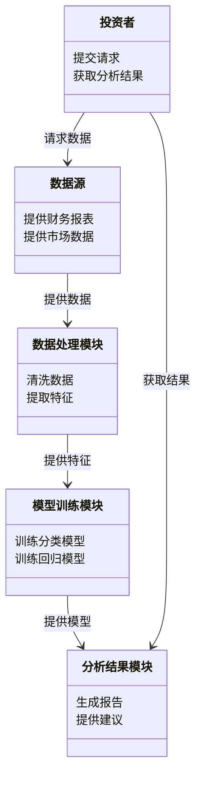
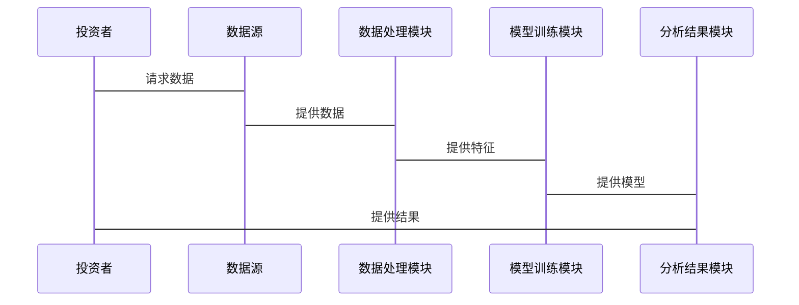

                 


# AI agents协作分析财报：提升价值投资决策效率

## 关键词：
- AI代理
- 财务报表分析
- 价值投资
- 机器学习
- 自然语言处理
- 系统架构

## 摘要：
本文探讨了如何利用AI代理协作分析企业财务报表，以提升价值投资决策的效率和准确性。通过结合自然语言处理、机器学习和系统架构设计等技术手段，详细分析了AI代理在投资决策中的应用，包括从数据预处理到模型训练，再到系统设计的全过程。同时，通过实际案例展示AI代理在价值投资中的优势，并展望了未来的发展方向。

---

# 第1章: 引言

## 1.1 问题背景与目标

### 1.1.1 价值投资的基本概念
- **价值投资**是一种投资策略，旨在通过分析企业的内在价值，选择被市场低估的股票进行投资。
- **核心目标**：寻找具有长期增长潜力的企业，而非短期市场波动。

### 1.1.2 财务报表分析的重要性
- 财务报表（如利润表、资产负债表、现金流量表）是评估企业财务状况的核心工具。
- 传统分析方法依赖人工判断，耗时且容易受主观因素影响。

### 1.1.3 AI代理在投资决策中的作用
- AI代理能够快速处理大量非结构化数据，提供客观的分析结果。
- 通过协作分析，AI代理可以辅助投资者做出更高效的决策。

## 1.2 问题描述与解决思路

### 1.2.1 传统投资分析的局限性
- 人工分析耗时长，且容易出错。
- 数据量大、复杂，难以快速提取关键信息。

### 1.2.2 AI代理协作的优势
- **自动化处理**：快速解析财务报表，提取关键指标。
- **多维度分析**：结合文本和数值数据，提供全面的分析结果。
- **实时更新**：及时跟踪市场变化，提供实时的投资建议。

### 1.2.3 本书的研究目标与方法
- **目标**：探讨AI代理如何协作分析财务报表，优化价值投资决策。
- **方法**：结合理论分析、技术实现和案例研究，系统阐述AI代理的应用。

---

# 第2章: AI代理与价值投资的核心概念

## 2.1 AI代理的基本原理

### 2.1.1 代理的基本概念
- **代理**：能够感知环境并采取行动以实现目标的实体。
- **AI代理**：通过机器学习、自然语言处理等技术实现智能决策。

### 2.1.2 AI代理的分类与特点
| 分类维度 | 类型 | 特点 |
|----------|------|------|
| 功能     | 分析型 | 基于数据进行预测和分析 |
|          | 行动型 | 能够执行具体操作（如交易） |
| 智能水平 | 单智能体 | 独立决策 |
|          | 多智能体 | 协作完成复杂任务 |

### 2.1.3 AI代理在投资中的应用
- **数据收集**：自动获取企业财务报表和其他相关信息。
- **数据分析**：通过机器学习模型预测企业财务状况。
- **决策支持**：为投资者提供实时的投资建议。

## 2.2 价值投资的核心要素

### 2.2.1 财务报表分析的关键指标
- **盈利能力**：净利润率、ROE（净资产收益率）。
- **成长能力**：收入增长率、净利润增长率。
- **财务健康度**：资产负债率、流动比率。

### 2.2.2 企业基本面分析的维度
- **行业地位**：企业在行业中的竞争力。
- **管理团队**：高管的背景和战略规划。
- **竞争优势**：企业的核心竞争力（如专利、品牌）。

### 2.2.3 投资决策的逻辑框架
1. 确定投资目标和策略。
2. 收集和分析相关数据。
3. 评估企业的内在价值。
4. 制定投资计划并执行。

## 2.3 AI代理与价值投资的结合

### 2.3.1 AI代理在财报分析中的角色
- **数据处理**：自动提取和整理财务数据。
- **模型训练**：基于历史数据训练预测模型。
- **结果输出**：生成分析报告并提供建议。

### 2.3.2 代理协作的模式与流程
1. 数据采集：获取企业财务报表和其他相关信息。
2. 数据清洗：处理缺失值和异常值。
3. 特征提取：从文本中提取关键信息。
4. 模型训练：训练机器学习模型进行预测。
5. 结果分析：生成分析报告并提供建议。

### 2.3.3 技术与业务的结合点
- **技术层面**：自然语言处理、机器学习模型。
- **业务层面**：企业财务分析、投资决策优化。

---

# 第3章: AI代理协作分析财报的技术基础

## 3.1 自然语言处理技术

### 3.1.1 NLP的基本原理
- **自然语言处理**：研究如何让计算机理解和生成人类语言的技术。
- **常见任务**：文本分类、实体识别、情感分析。

### 3.1.2 常见的NLP模型
- **词嵌入模型**：如Word2Vec、GloVe。
- **序列模型**：如RNN、LSTM、Transformer（如BERT）。

### 3.1.3 NLP在财报分析中的应用
- **财务文本分类**：将财务报告分为不同类别（如盈利、亏损）。
- **实体识别**：识别财报中的关键实体（如公司名称、金额）。

## 3.2 机器学习与深度学习在财报分析中的应用

### 3.2.1 机器学习的基本原理
- **监督学习**：基于标记的数据进行训练，预测新数据的标签。
- **无监督学习**：从无标签数据中发现模式。
- **回归与分类**：回归用于预测连续值（如股价），分类用于预测类别（如财务状况）。

### 3.2.2 深度学习模型
- **卷积神经网络（CNN）**：用于处理结构化数据。
- **循环神经网络（RNN）**：用于处理时间序列数据。
- **Transformer架构**：如BERT，用于处理长文本。

### 3.2.3 基于机器学习的财报分析
- **数据预处理**：清洗和标准化数据。
- **特征工程**：提取有用的特征（如财务比率）。
- **模型训练**：训练分类或回归模型。

---

# 第4章: 系统分析与架构设计

## 4.1 问题场景介绍
- **目标**：设计一个AI代理协作分析财报的系统。
- **用户需求**：投资者需要快速获取财务分析结果，辅助决策。

## 4.2 系统功能设计

### 4.2.1 领域模型（mermaid类图）


### 4.2.2 系统架构设计（mermaid架构图）


### 4.2.3 系统接口设计
- **输入接口**：接收用户的请求和数据源。
- **输出接口**：提供分析结果和投资建议。

### 4.2.4 系统交互（mermaid序列图）


---

# 第5章: 项目实战

## 5.1 环境安装
- **工具**：Python、TensorFlow、Keras、NLTK。
- **数据源**：公开的财务报表数据（如Yahoo Finance）。

## 5.2 系统核心实现源代码

### 5.2.1 数据处理模块
```python
import pandas as pd
import numpy as np

def clean_data(df):
    # 处理缺失值
    df = df.dropna()
    # 标准化处理
    df = (df - df.mean()) / df.std()
    return df
```

### 5.2.2 模型训练模块
```python
from tensorflow.keras.models import Sequential
from tensorflow.keras.layers import Dense

def build_model(input_dim):
    model = Sequential()
    model.add(Dense(64, activation='relu', input_dim=input_dim))
    model.add(Dense(32, activation='relu'))
    model.add(Dense(1, activation='sigmoid'))
    model.compile(optimizer='adam', loss='binary_crossentropy', metrics=['accuracy'])
    return model
```

## 5.3 实际案例分析
- **案例**：分析某公司的财务报表，预测其股价走势。
- **步骤**：
  1. 数据预处理：清洗和标准化数据。
  2. 特征提取：提取关键财务指标。
  3. 模型训练：训练分类模型。
  4. 结果分析：生成分析报告并提供建议。

---

# 第6章: 总结与展望

## 6.1 项目小结
- **主要成果**：设计并实现了一个基于AI代理的财报分析系统。
- **经验总结**：AI代理能够显著提高投资决策的效率和准确性。

## 6.2 注意事项
- 数据质量和完整性对模型性能影响重大。
- 模型需要定期更新以适应市场变化。

## 6.3 未来展望
- **技术优化**：探索更先进的NLP和机器学习模型。
- **应用扩展**：将AI代理应用于更多领域，如风险管理、投资组合优化。

---

通过以上步骤，我们可以看到AI代理在协作分析财报方面具有巨大的潜力，能够显著提升价值投资的决策效率和准确性。

