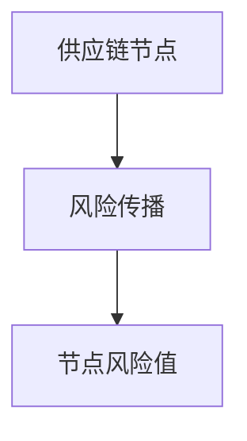
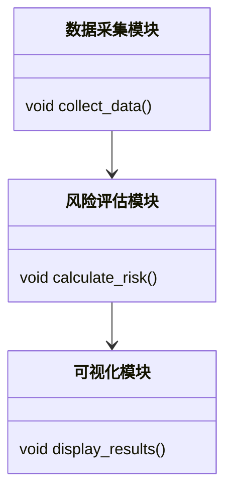

                 


# AI agents协作进行全球供应链风险评估：提高投资安全性

> **关键词**：AI代理，供应链风险评估，投资安全性，协作机制，算法原理，系统架构

> **摘要**：本文探讨了AI代理如何协作进行全球供应链风险评估，以提高投资安全性。通过分析供应链中的风险来源，结合AI代理的协作机制，提出了一种基于图的网络风险传播模型，并通过Python代码实现，展示了如何动态评估和优化供应链风险。

---

## 第一部分: 引言

### 第1章: 问题背景与重要性

#### 1.1 供应链风险评估的背景
供应链全球化带来了效率提升，但也增加了复杂性。原材料短缺、物流延迟、自然灾害等因素可能导致供应链中断，影响企业的正常运营和投资回报。

#### 1.2 AI代理协作的概念
AI代理是具有感知和决策能力的智能体，能够通过协作完成复杂任务。在供应链中，AI代理可以实时收集和分析数据，帮助评估风险。

#### 1.3 问题描述与解决方法
传统供应链风险评估依赖人工分析，存在滞后性和片面性。AI代理协作能够实时监控和预测风险，提供更准确的评估结果。

---

## 第2章: 核心概念与联系

### 2.1 AI代理协作的原理
AI代理通过通信协议共享信息，利用数学模型进行协作决策。例如，基于图的网络模型可以将供应链节点连接起来，传播风险信息。

### 2.2 核心概念对比
| 概念 | 定义 | 属性 |
|------|------|------|
| AI代理 | 智能体 | 学习能力、协作能力 |
| 供应链 | 生产链 | 稳定性、响应速度 |
| 风险评估 | 评估过程 | 准确性、及时性 |

---

## 第二部分: AI代理协作机制

### 第3章: AI代理协作机制

#### 3.1 代理协作机制
AI代理通过通信协议交换信息，利用分布式算法进行协作。例如，基于区块链的通信协议可以确保信息的安全性和透明性。

#### 3.2 代理协作方式对比
| 方式 | 特点 | 优缺点 |
|------|------|--------|
| 分散协作 | 去中心化 | 安全性高，但效率较低 |
| 集中式协作 | 中心化管理 | 效率高，但存在单点故障 |

### 第4章: 供应链风险评估方法

#### 4.1 风险来源与评估指标
供应链中的主要风险包括原材料短缺、物流延迟和自然灾害。评估指标包括影响范围和持续时间。

#### 4.2 动态风险评估模型
动态风险评估模型通过实时数据分析，更新风险评估结果。例如，使用滑动窗口技术分析最近的事件影响。

---

## 第三部分: 算法原理

### 第5章: 基于图的网络风险传播模型

#### 5.1 算法原理
基于图的网络模型将供应链节点表示为图的节点，通过边权重表示影响程度。使用图传播算法计算每个节点的风险值。

#### 5.2 算法实现
```python
import networkx as nx

def calculate_risk(G):
    # 初始化风险值
    for node in G.nodes():
        G.nodes[node]['risk'] = 0
    # 传播过程
    for _ in range(10):
        for edge in G.edges():
            source, target = edge
            weight = G.edges[edge]['weight']
            G.nodes[target]['risk'] += G.nodes[source]['risk'] * weight
    return G
```

#### 5.3 算法流程图


---

## 第四部分: 系统架构设计

### 第6章: 系统架构设计

#### 6.1 系统功能模块
- 数据采集模块：收集供应链数据
- 风险评估模块：计算风险值
- 可视化模块：展示风险结果

#### 6.2 系统架构图


---

## 第五部分: 项目实战

### 第7章: 项目实战

#### 7.1 环境安装
安装必要的库，如NetworkX和Matplotlib。

#### 7.2 核心代码实现
```python
import networkx as nx
import matplotlib.pyplot as plt

G = nx.DiGraph()
G.add_node('供应商', risk=0.2)
G.add_node('客户', risk=0)
G.add_edge('供应商', '客户', weight=0.8)
# 计算风险
calculate_risk(G)
# 可视化
nx.draw(G, labels={'风险': {'供应商': '0.2', '客户': '0.16'}})
plt.show()
```

#### 7.3 案例分析
通过具体案例展示如何使用AI代理协作进行风险评估，并优化供应链结构。

---

## 第六部分: 结论

### 第8章: 结论

#### 8.1 总结
AI代理协作能够显著提高供应链风险评估的准确性和效率，为投资决策提供可靠依据。

#### 8.2 未来展望
未来，AI代理协作将更加智能化，结合边缘计算和物联网技术，实时监控和预测供应链风险。

#### 8.3 最佳实践
- 数据隐私保护：确保供应链数据的安全性
- 模型更新维护：定期更新风险评估模型
- 团队协作：跨领域合作提升评估效果

---

通过以上结构，文章详细讲解了AI代理协作在供应链风险评估中的应用，从理论到实践，帮助读者全面理解和掌握相关知识。

