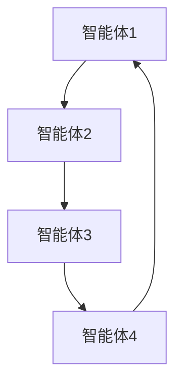
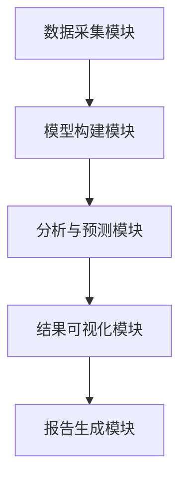

                 

# AI agents协作进行全球宏观经济分析：把握大趋势

> 关键词：AI agents, 宏观经济分析, 多智能体系统, 分布式计算, 经济预测, 宏观经济指标, 自然语言处理

> 摘要：本文深入探讨了AI agents协作进行全球宏观经济分析的方法与应用，分析了宏观经济的核心指标与模型，详细讲解了AI agents协作的算法原理，结合实际案例分析，展示了如何利用AI技术提升宏观经济分析的精度与效率，为把握全球经济大趋势提供了新的视角与工具。

---

# 第一部分: AI agents协作进行全球宏观经济分析概述

## 第1章: AI agents与宏观经济分析概述

### 1.1 AI agents的基本概念
#### 1.1.1 AI agents的定义与分类
人工智能代理（AI agents）是指能够感知环境并采取行动以实现特定目标的智能实体。根据智能体的智能水平和复杂程度，可以分为简单反射代理、基于模型的反射代理、目标驱动代理、效用驱动代理和学习代理。

#### 1.1.2 AI agents的核心特征
AI agents的核心特征包括自主性（Autonomy）、反应性（Reactivity）、目标导向性（Goal-oriented）、学习能力（Learnt）和协作性（Collaborative）。这些特征使得AI agents能够独立完成任务，并在复杂环境中与其他代理协作。

#### 1.1.3 AI agents在宏观经济分析中的应用前景
AI agents在宏观经济分析中的应用前景广阔，可以用于经济预测、政策模拟、市场监控和风险评估等领域。AI agents的协作能力使其能够处理复杂经济系统的多维度数据和动态变化。

### 1.2 宏观经济分析的基本概念
#### 1.2.1 宏观经济分析的定义与范围
宏观经济分析是研究整体经济系统运行规律的学科，包括GDP、通货膨胀、失业率等宏观经济指标的分析。宏观经济分析的范围涵盖经济政策制定、经济预测和经济模型构建。

#### 1.2.2 宏观经济指标与模型
宏观经济指标是衡量经济运行状况的关键指标，主要包括GDP、通货膨胀率、失业率和消费者价格指数（CPI）。宏观经济模型是描述经济系统运行机制的数学模型，如IS-LM模型和消费函数模型。

#### 1.2.3 宏观经济分析的挑战与机遇
宏观经济分析的挑战包括数据复杂性、模型的动态性和不确定性。AI技术的应用为宏观经济分析提供了新的机遇，可以利用大数据和机器学习算法提高分析的精度和效率。

### 1.3 AI agents协作进行宏观经济分析的背景
#### 1.3.1 全球化与宏观经济复杂性的加剧
全球化导致经济系统的复杂性加剧，传统的宏观经济分析方法难以应对多维度数据和动态变化的挑战。AI agents的协作能力为解决这一问题提供了新的思路。

#### 1.3.2 AI技术在宏观经济分析中的优势
AI技术在宏观经济分析中的优势包括大数据处理能力、实时分析能力、预测能力以及自适应能力。AI agents可以通过协作处理复杂的经济问题，提高分析的效率和准确性。

#### 1.3.3 AI agents协作的必要性与可行性
AI agents协作的必要性在于复杂经济问题的解决需要多维度的数据和多方面的知识。AI agents协作的可行性基于分布式计算和多智能体系统的技术进步。

---

## 第2章: AI agents协作的理论基础

### 2.1 多智能体系统（Multi-Agent Systems, MAS）
#### 2.1.1 多智能体系统的定义与特点
多智能体系统是由多个智能体组成的协作系统，具有分布式性、自主性、反应性和社会性等特点。多智能体系统的协作可以通过通信和协调机制实现。

#### 2.1.2 多智能体系统的分类与应用
多智能体系统可以根据智能体的智能水平、协作方式和应用场景进行分类。在宏观经济分析中，多智能体系统可以用于经济预测、政策模拟和市场监控。

#### 2.1.3 多智能体系统在宏观经济分析中的优势
多智能体系统在宏观经济分析中的优势包括分布式计算能力、协作能力和自适应能力。这些优势使得多智能体系统能够处理复杂经济系统的多维度数据和动态变化。

### 2.2 分布式计算与协作机制
#### 2.2.1 分布式计算的基本原理
分布式计算是将计算任务分布在多个计算节点上完成的计算方式。分布式计算的特点包括任务分配、数据通信和负载均衡。

#### 2.2.2 AI agents的协作机制
AI agents的协作机制包括通信机制、协调机制和决策机制。通信机制用于实现智能体之间的信息交换，协调机制用于实现任务分配和冲突解决，决策机制用于实现智能体的自主决策。

#### 2.2.3 分布式计算在宏观经济分析中的应用
在宏观经济分析中，分布式计算可以用于实时数据处理、经济预测和政策模拟。通过分布式计算，可以提高宏观经济分析的效率和精度。

### 2.3 宏观经济分析中的AI agents协作模型
#### 2.3.1 宏观经济分析的多智能体模型
宏观经济分析的多智能体模型包括多个智能体，每个智能体代表一个经济主体，如消费者、企业和政府。这些智能体通过协作完成宏观经济分析任务。

#### 2.3.2 AI agents协作的数学模型
AI agents协作的数学模型可以用于描述智能体之间的协作关系和协作过程。通过数学模型，可以实现宏观经济分析任务的建模和仿真。

#### 2.3.3 宏观经济分析中的协作流程
宏观经济分析中的协作流程包括任务分配、数据采集、模型构建、分析与预测。通过协作流程，可以实现宏观经济分析任务的高效完成。

---

## 第3章: 宏观经济分析的核心指标与模型

### 3.1 宏观经济核心指标
#### 3.1.1 国内生产总值（GDP）
国内生产总值（GDP）是衡量一个国家或地区经济规模的重要指标，反映了经济的总体状况。

#### 3.1.2 通货膨胀率
通货膨胀率是衡量物价水平变化的指标，反映了货币购买力的变化。

#### 3.1.3 失业率
失业率是衡量劳动力市场状况的指标，反映了经济中的就业情况。

#### 3.1.4 消费者价格指数（CPI）
消费者价格指数（CPI）是衡量消费者购买商品和服务价格变化的指标，反映了通货膨胀状况。

### 3.2 宏观经济分析模型
#### 3.2.1 IS-LM模型
IS-LM模型是宏观经济分析中的经典模型，用于描述产品市场和货币市场的均衡状况。

#### 3.2.2 消费函数模型
消费函数模型是描述消费与收入关系的模型，用于分析消费行为和需求变化。

#### 3.2.3 投资函数模型
投资函数模型是描述投资与利率关系的模型，用于分析投资行为和资本积累。

#### 3.2.4 货币政策与财政政策模型
货币政策与财政政策模型是分析政府宏观调控政策的模型，用于研究政策对经济的影响。

### 3.3 AI agents在宏观经济分析中的指标处理
#### 3.3.1 AI agents对宏观经济指标的实时监测
AI agents可以通过实时数据采集和处理，实现宏观经济指标的实时监测。

#### 3.3.2 AI agents对宏观经济指标的预测与优化
AI agents可以利用机器学习算法，对宏观经济指标进行预测和优化，提高宏观经济分析的精度。

#### 3.3.3 AI agents在宏观经济模型中的应用
AI agents可以通过协作和分布式计算，提高宏观经济模型的建模和仿真能力。

---

## 第4章: AI agents协作的算法原理

### 4.1 分布式计算算法
#### 4.1.1 分布式计算的基本原理
分布式计算的基本原理是将计算任务分布在多个计算节点上完成，通过任务分配和数据通信实现计算结果的整合。

#### 4.1.2 分布式计算中的通信机制
分布式计算中的通信机制包括消息传递、数据共享和同步机制，用于实现计算节点之间的信息交换。

#### 4.1.3 分布式计算中的任务分配与负载均衡
分布式计算中的任务分配与负载均衡是通过合理的任务分配策略和负载均衡算法，实现计算节点之间的任务均衡。

### 4.2 多智能体协作算法
#### 4.2.1 多智能体协作的基本原理
多智能体协作的基本原理是通过智能体之间的协作，实现复杂任务的完成。协作过程包括任务分配、信息共享和决策协调。

#### 4.2.2 多智能体协作中的通信与协调
多智能体协作中的通信与协调是通过通信协议和协调算法实现的，用于解决智能体之间的冲突和协作问题。

#### 4.2.3 多智能体协作中的决策机制
多智能体协作中的决策机制是通过决策算法实现的，用于智能体在协作过程中的自主决策和策略选择。

### 4.3 AI agents协作的算法实现
#### 4.3.1 分布式计算算法的实现
分布式计算算法的实现可以通过Python的多线程和多进程库完成，例如使用`multiprocessing`和`concurrent.futures`模块。

#### 4.3.2 多智能体协作算法的实现
多智能体协作算法的实现可以通过通信库如`socket`或` zmq`实现智能体之间的通信，通过协调算法如一致性算法实现任务分配。

#### 4.3.3 算法流程图

### 4.4 宏观经济分析中的算法应用
#### 4.4.1 经济预测算法
经济预测算法可以通过时间序列分析和机器学习算法实现，例如ARIMA和LSTM模型。

#### 4.4.2 经济模型构建算法
经济模型构建算法可以通过参数估计和优化算法实现，例如最小二乘法和遗传算法。

#### 4.4.3 经济数据处理算法
经济数据处理算法可以通过数据清洗和特征提取算法实现，例如数据平滑和主成分分析。

---

## 第5章: 系统分析与架构设计

### 5.1 宏观经济分析场景介绍
#### 5.1.1 宏观经济分析的典型场景
宏观经济分析的典型场景包括经济预测、政策模拟和市场监控。

#### 5.1.2 系统功能需求
系统功能需求包括数据采集、模型构建、分析与预测、结果可视化和报告生成。

#### 5.1.3 系统性能需求
系统性能需求包括高计算效率、高数据处理能力和高准确性。

### 5.2 系统架构设计
#### 5.2.1 系统功能模块设计
系统功能模块包括数据采集模块、模型构建模块、分析与预测模块、结果可视化模块和报告生成模块。

#### 5.2.2 系统架构图

#### 5.2.3 系统交互流程
系统交互流程包括数据采集、模型构建、分析与预测、结果可视化和报告生成。

---

## 第6章: 项目实战

### 6.1 环境安装与配置
#### 6.1.1 系统环境要求
系统环境要求包括操作系统、Python版本和相关库的安装，例如NumPy、Pandas、Matplotlib和Scikit-learn。

#### 6.1.2 开发工具安装
开发工具安装包括Python开发环境的配置，例如安装Jupyter Notebook和PyCharm。

### 6.2 核心代码实现
#### 6.2.1 数据采集与处理
数据采集与处理可以通过API接口或数据爬取实现，例如使用requests库和BeautifulSoup库。

#### 6.2.2 模型构建与训练
模型构建与训练可以通过机器学习算法实现，例如使用Scikit-learn库中的线性回归和随机森林算法。

#### 6.2.3 分析与预测
分析与预测可以通过时间序列分析和机器学习模型实现，例如使用ARIMA和LSTM模型。

#### 6.2.4 结果可视化
结果可视化可以通过Matplotlib和Seaborn库实现，例如绘制折线图和散点图。

### 6.3 实际案例分析
#### 6.3.1 数据来源与背景
数据来源与背景包括宏观经济指标的数据来源和经济分析的背景。

#### 6.3.2 数据预处理与特征工程
数据预处理与特征工程包括数据清洗、缺失值处理和特征提取。

#### 6.3.3 模型训练与评估
模型训练与评估包括模型参数调优、模型评估和模型预测。

#### 6.3.4 结果分析与解读
结果分析与解读包括预测结果的分析和经济意义的解读。

---

## 第7章: 最佳实践与总结

### 7.1 小结
通过AI agents协作进行全球宏观经济分析，可以提高经济分析的效率和精度，为经济预测和政策制定提供有力支持。

### 7.2 注意事项
在实际应用中，需要注意数据的准确性和模型的稳定性，避免模型过拟合和数据偏差。

### 7.3 拓展阅读
推荐进一步阅读相关领域的书籍和论文，例如《机器学习实战》和《宏观经济学》。

---

通过以上目录和内容的设计，我们可以系统地探讨AI agents协作进行全球宏观经济分析的方法与应用，为读者提供理论与实践相结合的指导。

