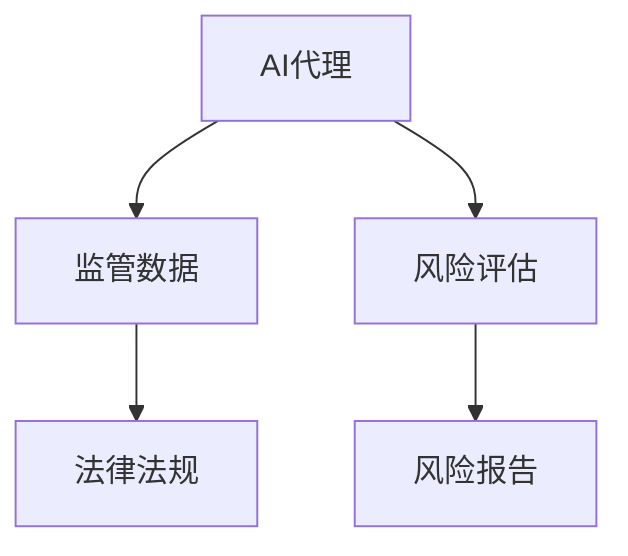
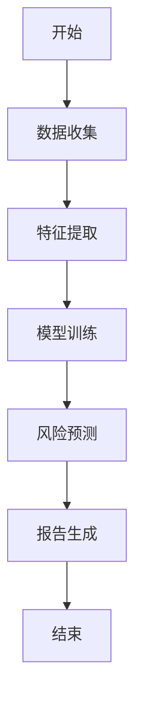
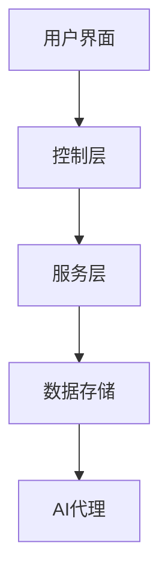

                 


# AI Agents协作进行全球监管环境分析：评估跨国公司风险

**关键词**：AI代理，全球监管环境，风险评估，跨国公司，系统架构，算法原理，项目实战

**摘要**：  
随着全球化进程的加速，跨国公司面临的监管环境日益复杂，传统的监管分析方法难以应对动态变化的全球法规和风险。本文探讨如何利用AI代理协作技术，实现全球监管环境的智能分析与风险评估。通过详细阐述AI代理的核心概念、算法原理、系统架构及实际案例，本文为跨国公司提供了一种高效、可靠的监管风险解决方案。

---

# 第一部分：背景与概念

## 第1章：背景介绍

### 1.1 问题背景
跨国公司在全球范围内运营，需遵守不同国家和地区的法律法规。监管环境的动态变化、法律的复杂性和地域差异使得传统的监管分析方法效率低下，成本高昂。

### 1.2 问题描述
1. **监管环境的动态变化**：法律法规不断更新，跨国公司需实时跟踪和分析多个司法管辖区的最新法规。
2. **合规成本高昂**：传统方法依赖人工分析，效率低且容易出错。
3. **风险不确定性**：缺乏实时监控和预测机制，难以及时发现潜在的法律风险。

### 1.3 问题解决
AI代理协作技术通过分布式计算和多智能体协作，实现对全球监管环境的实时分析和风险评估。

### 1.4 边界与外延
AI代理协作的边界包括数据来源、分析范围和结果应用。外延则涉及AI代理的扩展功能，如实时监控和自适应学习。

---

# 第二部分：核心概念与联系

## 第2章：核心概念与联系

### 2.1 AI代理协作的原理
AI代理通过分布式协作机制，利用多智能体系统实现信息共享和任务分配。代理间的通信与协调是协作的核心。

### 2.2 全球监管环境分析的模型
监管环境分析模型包括法律、政策、经济等多个维度，构建多维分析框架。

### 2.3 核心概念对比表
| 概念         | 属性       | 描述                                         |
|--------------|------------|--------------------------------------------|
| AI代理       | 智能性     | 可以自主决策和学习                         |
| 全球监管环境   | 多维性     | 包括法律、政策、经济等多个维度             |
| 风险评估       | 动态性     | 随环境变化而变化                         |

### 2.4 实体关系图


---

# 第三部分：算法原理

## 第3章：算法原理讲解

### 3.1 算法流程


### 3.2 代码实现
```python
def collect_data():
    # 数据收集逻辑
    pass

def preprocess_data(data):
    # 数据预处理逻辑
    return processed_data

def train_model(data):
    # 模型训练逻辑
    return model

def predict_risk(model):
    # 风险预测逻辑
    return risk_score

def generate_report(risk_score):
    # 报告生成逻辑
    pass
```

### 3.3 数学模型
风险评分公式：
$$ \text{风险评分} = \sum_{i=1}^{n} w_i \cdot f_i $$
其中，\( w_i \) 是特征 \( f_i \) 的权重。

---

# 第四部分：系统架构

## 第4章：系统架构设计

### 4.1 应用场景
系统用于实时监控跨国公司的监管环境，提供风险预警和合规建议。

### 4.2 领域模型
```mermaid
classDiagram
    class AI代理 {
        +数据源：监管数据
        +方法：特征提取、模型训练
        +输出：风险评分
    }
    class 监管环境 {
        +法律法规：法律文本
        +经济指标：GDP、通胀率
    }
    AI代理 --> 监管环境：数据输入
    AI代理 --> 风险报告：输出
```

### 4.3 系统架构


### 4.4 接口设计
API接口：
- `/collect-data`：收集监管数据
- `/predict-risk`：预测风险
- `/generate-report`：生成报告

### 4.5 交互流程
```mermaid
sequenceDiagram
    用户 ->> 控制层：发起请求
    控制层 ->> 服务层：调用服务
    服务层 ->> AI代理：获取数据
    AI代理 ->> 服务层：返回风险评分
    服务层 ->> 用户：返回报告
```

---

# 第五部分：项目实战

## 第5章：项目实战

### 5.1 环境安装
安装Python、AI框架（如TensorFlow）、数据处理库（如Pandas）。

### 5.2 核心代码实现
```python
import pandas as pd
from sklearn.model import Model

def main():
    data = pd.read_csv('regulatory_data.csv')
    processed_data = preprocess_data(data)
    model = train_model(processed_data)
    risk_score = predict_risk(model)
    generate_report(risk_score)

if __name__ == '__main__':
    main()
```

### 5.3 案例分析
分析某跨国公司在欧盟和美国的监管风险，生成风险报告。

### 5.4 项目小结
AI代理协作技术能够高效、准确地分析全球监管环境，帮助跨国公司降低合规成本和风险。

---

# 第六部分：最佳实践

## 第6章：总结与展望

### 6.1 小结
本文详细介绍了AI代理协作技术在全球监管环境分析中的应用，展示了其实现方法和实际案例。

### 6.2 注意事项
- 数据隐私保护
- 算法的可解释性
- 系统的实时性

### 6.3 拓展阅读
推荐相关书籍和论文，进一步深入学习AI代理协作技术。

---

**关键词**：AI代理，全球监管环境，风险评估，跨国公司，系统架构，算法原理，项目实战  
**摘要**：本文探讨了AI代理协作技术在跨国公司全球监管环境分析中的应用，通过详细阐述核心概念、算法原理和系统架构，为读者提供了全面的技术解决方案。

