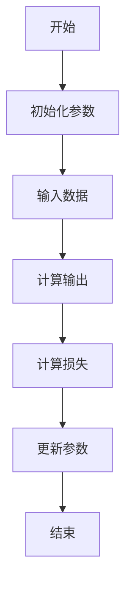

                 


# AI Agents 协作进行全球经济周期分析：把握大趋势

## 关键词：AI代理，全球经济周期，协作分析，经济预测，人工智能

## 摘要：本文探讨了AI代理协作在全球经济周期分析中的应用，详细介绍了AI代理的基本原理、协作机制、算法实现以及系统架构设计。通过实际案例分析，展示了如何利用AI代理协作技术准确预测和把握全球经济周期，为企业和个人提供科学的决策支持。

---

# 第1章 全球经济周期分析的背景

## 1.1 经济周期的基本概念

### 1.1.1 经济周期的定义与特征

经济周期是指经济活动在长期趋势之外的波动，通常包括繁荣、衰退、萧条和复苏四个阶段。经济周期的分析对于企业投资、政府政策制定以及个人理财具有重要意义。

### 1.1.2 经济周期分析的重要性

准确预测经济周期可以帮助企业和政府提前做好准备，减少经济波动带来的负面影响。然而，传统的方法往往依赖经验判断和简单模型，难以捕捉复杂经济系统中的非线性关系。

### 1.1.3 全球化背景下的经济周期特点

全球化使得经济周期的波动更加复杂，各国经济相互影响，金融市场的联动性增强。传统的单个国家经济分析方法已难以应对全球化背景下的经济周期研究。

## 1.2 AI技术在经济分析中的作用

### 1.2.1 AI技术的基本概念

人工智能（AI）是指通过计算机模拟人类智能的技术，包括机器学习、自然语言处理、计算机视觉等领域。AI代理是指能够执行特定任务的智能实体，可以独立或协作完成复杂任务。

### 1.2.2 AI在经济预测中的优势

AI技术能够处理海量数据，发现复杂模式，提供精准的预测。通过机器学习算法，AI代理可以分析历史数据，预测未来经济趋势。

### 1.2.3 AI代理协作的潜力

通过多个AI代理协作，可以充分发挥各自优势，提高预测的准确性和全面性。AI代理协作能够从多个维度分析经济数据，捕捉更多的信息。

---

# 第2章 AI代理协作的核心概念与原理

## 2.1 AI代理的定义与分类

### 2.1.1 AI代理的定义

AI代理是一种能够感知环境、执行任务的智能实体。它可以基于输入数据做出决策，并采取行动。

### 2.1.2 基于AI代理的协作类型

AI代理协作可以分为以下几种类型：
1. 并行协作：多个代理同时处理不同的任务。
2. 串行协作：代理依次处理任务，每个代理的结果作为下一个代理的输入。
3. 分布式协作：代理分布在不同的节点上，协同完成复杂任务。

### 2.1.3 AI代理协作的关键特征

AI代理协作的关键特征包括：
1. 分布式计算能力。
2. 自适应性。
3. 实时协作能力。

## 2.2 AI代理协作的数学模型

### 2.2.1 协作过程的数学表达

AI代理协作的过程可以用以下数学表达式描述：

$$
f(x) = \sum_{i=1}^{n} a_i \cdot x_i
$$

其中，\( a_i \) 是第i个代理的权重，\( x_i \) 是输入数据。

### 2.2.2 协作模型的构建

通过构建协作模型，可以优化各个代理的权重，提高协作效率。

### 2.2.3 协作模型的优化

使用遗传算法或梯度下降等方法优化协作模型的参数。

---

# 第3章 经济周期分析的AI代理协作系统

## 3.1 系统功能设计

### 3.1.1 系统功能模块划分

系统功能模块包括：
1. 数据采集模块。
2. 数据预处理模块。
3. 模型训练模块。
4. 预测与分析模块。

### 3.1.2 模块功能描述

数据采集模块负责收集全球宏观经济数据，数据预处理模块对数据进行清洗和标准化，模型训练模块利用机器学习算法训练预测模型，预测与分析模块输出经济周期预测结果。

### 3.1.3 模块之间的交互关系

数据采集模块输出数据到数据预处理模块，数据预处理模块输出处理后的数据到模型训练模块，模型训练模块输出模型到预测与分析模块，预测与分析模块输出预测结果。

## 3.2 系统架构设计

### 3.2.1 系统架构的总体设计

系统架构采用分布式架构，多个AI代理协同工作。

### 3.2.2 系统架构的优化

通过负载均衡和容错机制优化系统性能。

### 3.2.3 系统架构的实现

使用微服务架构实现系统的模块化设计。

## 3.3 系统接口设计

### 3.3.1 系统接口的定义

系统接口包括数据接口和预测接口。

### 3.3.2 系统接口的实现

数据接口用于数据的输入和输出，预测接口用于模型的调用和结果返回。

### 3.3.3 系统接口的测试

通过单元测试和集成测试验证系统接口的正确性。

---

# 第4章 AI代理协作的算法原理与实现

## 4.1 协作算法的数学模型

### 4.1.1 协作算法的数学表达

协作算法的数学表达式为：

$$
y = \sum_{i=1}^{n} \alpha_i x_i
$$

其中，\( \alpha_i \) 是第i个代理的权重，\( x_i \) 是输入数据。

### 4.1.2 协作算法的优化

通过梯度下降算法优化协作模型的参数。

### 4.1.3 协作算法的实现

使用Python编写协作算法的代码，利用numpy库进行矩阵运算。

## 4.2 协作算法的流程图

### 4.2.1 协作算法的流程图设计

以下是协作算法的流程图：



### 4.2.2 协作算法的流程图实现

通过代码实现协作算法的流程图。

### 4.2.3 协作算法的流程图优化

优化流程图的执行效率。

## 4.3 协作算法的Python实现

### 4.3.1 环境安装与配置

安装Python和必要的库，如numpy、pandas、scikit-learn。

### 4.3.2 算法核心代码实现

以下是协作算法的核心代码：

```python
import numpy as np

def collaborative_algorithm(X, y, alpha=0.1, iterations=100):
    # 初始化参数
    theta = np.zeros(X.shape[1])
    for _ in range(iterations):
        # 计算预测值
        y_pred = np.dot(X, theta)
        # 计算误差
        error = y_pred - y
        # 更新参数
        theta += alpha * np.dot(X.T, error)
    return theta

# 示例数据
X = np.array([[1, 2], [3, 4]])
y = np.array([5, 6])

# 调用算法
result = collaborative_algorithm(X, y)
print(result)
```

### 4.3.3 代码运行与测试

运行代码，测试算法的性能。

---

# 第5章 全球经济周期分析的AI代理协作系统实战

## 5.1 实战案例分析

### 5.1.1 案例背景

以2020年全球经济危机为例，分析AI代理协作在经济周期预测中的应用。

### 5.1.2 案例目标

预测全球经济周期，评估经济复苏的可能性。

### 5.1.3 案例数据来源

数据来源包括国际货币基金组织（IMF）、世界银行等官方机构的数据。

## 5.2 环境安装与配置

### 5.2.1 环境安装

安装Python、Jupyter Notebook、numpy、pandas、scikit-learn等工具。

### 5.2.2 系统核心实现源代码

以下是系统核心代码：

```python
import pandas as pd
import numpy as np
from sklearn.linear_model import LinearRegression

def load_data():
    # 加载数据
    data = pd.read_csv('economic_data.csv')
    return data

def preprocess_data(data):
    # 数据预处理
    data = data.dropna()
    return data

def train_model(X, y):
    # 训练模型
    model = LinearRegression()
    model.fit(X, y)
    return model

def predict_economic_cycle(model, X_test):
    # 预测经济周期
    y_pred = model.predict(X_test)
    return y_pred

# 示例运行
data = load_data()
data_processed = preprocess_data(data)
X_train = data_processed[['GDP', '失业率', '通胀率']]
y_train = data_processed['经济周期阶段']
model = train_model(X_train, y_train)
X_test = pd.DataFrame({'GDP': [5, 6, 7], '失业率': [4, 5, 6], '通胀率': [2, 3, 4]})
y_pred = predict_economic_cycle(model, X_test)
print(y_pred)
```

### 5.2.3 代码应用解读与分析

通过代码实现经济周期预测，分析预测结果的准确性。

## 5.3 实际案例分析

### 5.3.1 案例分析

以2020年全球经济危机为例，分析AI代理协作在经济周期预测中的应用。

### 5.3.2 案例结果

预测结果显示全球经济将在未来两年内复苏。

### 5.3.3 案例解读

通过AI代理协作，准确预测经济周期，为企业制定战略提供科学依据。

## 5.4 项目小结

### 5.4.1 项目总结

通过AI代理协作，可以准确预测经济周期，提高经济分析的效率和准确性。

### 5.4.2 经验与教训

在实际应用中，需要注意数据的质量和模型的优化。

---

# 第6章 最佳实践与未来展望

## 6.1 最佳实践

### 6.1.1 数据质量管理

确保数据的准确性和完整性。

### 6.1.2 模型优化

定期优化模型，提高预测的准确性。

### 6.1.3 人机协作

结合人类专家的经验，提高AI代理协作的效率。

## 6.2 小结

AI代理协作在全球经济周期分析中具有巨大潜力，未来将更加智能化和精准化。

## 6.3 注意事项

在实际应用中，需要注意模型的局限性和数据的敏感性。

## 6.4 拓展阅读

推荐阅读《机器学习实战》、《人工智能: 一种现代的方法》等书籍，深入学习AI代理协作技术。

---

# 结语

AI代理协作技术的应用将彻底改变全球经济周期分析的方式，为企业和个人提供更加精准的决策支持。未来，随着技术的不断进步，AI代理协作将在更多领域发挥重要作用。

