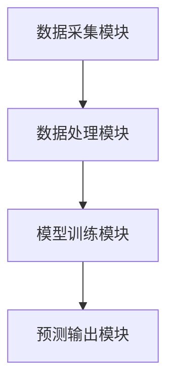

                 


# AI agents协作进行全球资金流动分析：预测市场走向

> 关键词：AI代理，全球资金流动，市场预测，时间序列分析，机器学习，深度学习

> 摘要：本文探讨了利用AI代理协作进行全球资金流动分析的方法，详细介绍了AI代理的核心原理、资金流动分析的技术手段，以及基于时间序列分析和机器学习模型的预测方法。通过系统架构设计和项目实战，展示了如何构建高效的全球资金流动分析系统，并通过实例分析验证了系统的有效性和准确性。

---

## 第一部分: 背景介绍

### 第1章: 问题背景与描述

#### 1.1 问题背景

##### 1.1.1 全球资金流动分析的重要性
全球资金流动是金融市场的重要组成部分，直接影响全球经济的稳定与发展。资金流动的分析能够帮助投资者、政策制定者和金融机构更好地理解市场动态，做出更明智的决策。

##### 1.1.2 当前资金流动分析的挑战
传统的资金流动分析依赖于人工经验和统计模型，存在以下挑战：
- 数据量大且复杂，难以快速处理和分析。
- 市场波动性强，传统模型难以捕捉非线性关系。
- 数据实时性要求高，人工分析难以满足时效性需求。

##### 1.1.3 AI代理在资金流动分析中的优势
AI代理能够通过多代理协作，实现以下优势：
- **自动化处理**：快速分析海量数据，实时更新分析结果。
- **分布式计算**：多个代理协作，提高计算效率和准确性。
- **自适应学习**：通过机器学习模型不断优化预测精度。

#### 1.2 问题描述

##### 1.2.1 资金流动分析的核心问题
如何通过AI代理协作，实现对全球资金流动的实时监测、分析和预测。

##### 1.2.2 AI代理协作的必要性
单个代理的能力有限，通过多代理协作可以实现更复杂的分析任务。

##### 1.2.3 市场预测的复杂性与不确定性
金融市场具有高度的不确定性和波动性，预测模型需要具备较强的鲁棒性和适应性。

#### 1.3 问题解决方法

##### 1.3.1 AI代理协作的基本思路
通过分布式计算和协同学习，多个AI代理共同完成数据处理、特征提取和预测任务。

##### 1.3.2 数据驱动的市场预测方法
利用历史数据训练机器学习模型，通过数据特征提取和模型优化实现精准预测。

##### 1.3.3 多代理协作的优势
- 提高计算效率。
- 增强模型的鲁棒性。
- 实现复杂任务的分解与协同。

#### 1.4 边界与外延

##### 1.4.1 资金流动分析的边界条件
- 数据范围：仅限于金融市场的资金流动数据。
- 时间范围：短期预测为主。
- 场景限制：适用于相对稳定的金融市场环境。

##### 1.4.2 AI代理协作的适用范围
- 适合处理复杂、分布式的问题。
- 适用于需要实时响应的场景。

##### 1.4.3 市场预测的局限性
- 无法完全预测突发事件的影响。
- 模型精度受数据质量和算法限制。

#### 1.5 概念结构与核心要素

##### 1.5.1 核心概念的定义
- **AI代理**：具备自主决策和学习能力的智能体。
- **资金流动分析**：对资金在金融市场中的流动趋势进行分析和预测。
- **预测模型**：基于历史数据训练的机器学习模型。

##### 1.5.2 核心要素的组成
- 数据采集模块。
- 数据处理模块。
- 模型训练模块。
- 预测输出模块。

##### 1.5.3 概念之间的关系
AI代理通过处理资金流动数据，驱动预测模型的优化与应用，最终实现市场预测的目标。

---

## 第二部分: 核心概念与联系

### 第2章: 核心概念与联系

#### 2.1 AI代理的核心原理

##### 2.1.1 AI代理的基本定义
AI代理是一种智能体，能够感知环境、自主决策并执行任务。

##### 2.1.2 AI代理的分类与特点
- **单智能体**：独立完成任务。
- **多智能体**：通过协作完成复杂任务。
- **强化学习代理**：通过与环境互动优化决策。

##### 2.1.3 多代理协作的机制
- **任务分解**：将复杂任务分解为多个子任务。
- **信息共享**：代理之间共享数据和知识。
- **协同决策**：通过协商达成一致的决策。

#### 2.2 资金流动分析的核心原理

##### 2.2.1 资金流动的基本概念
资金流动是指资金在全球金融市场中的流动趋势和流向。

##### 2.2.2 资金流动的驱动因素
- **经济指标**：GDP、利率、通货膨胀率等。
- **市场情绪**：投资者信心、市场预期。
- **政策变化**：政府政策、监管措施。

##### 2.2.3 资金流动的预测模型
- **时间序列分析**：基于历史数据预测未来趋势。
- **机器学习模型**：利用特征提取和深度学习提高预测精度。

#### 2.3 预测模型的核心原理

##### 2.3.1 时间序列分析的基本原理
时间序列分析是一种通过历史数据预测未来趋势的方法，常用模型包括ARIMA和LSTM。

##### 2.3.2 机器学习在预测中的应用
机器学习通过训练数据提取特征，建立预测模型。

##### 2.3.3 深度学习在预测中的应用
深度学习通过多层神经网络捕捉数据中的复杂模式。

#### 2.4 核心概念的对比分析

##### 2.4.1 AI代理与传统数据分析工具的对比
| **对比维度** | **AI代理** | **传统数据分析工具** |
|--------------|------------|-----------------------|
| **自主性**   | 高         | 低                   |
| **学习能力** | 高         | 低                   |
| **处理速度** | 快         | 较慢                 |

##### 2.4.2 资金流动分析与经济预测的对比
| **对比维度** | **资金流动分析** | **经济预测** |
|--------------|----------------|---------------|
| **数据类型** | 时间序列数据    | 综合数据       |
| **预测范围** | 短期预测为主     | 中长期预测    |

##### 2.4.3 时间序列分析与机器学习模型的对比
| **对比维度** | **时间序列分析** | **机器学习模型** |
|--------------|----------------|-----------------|
| **模型复杂度** | 低             | 高             |
| **预测精度** | 中             | 高             |
| **适用场景** | 线性趋势为主     | 非线性趋势为主   |

#### 2.5 概念结构与联系

##### 2.5.1 AI代理与资金流动分析的关系
AI代理通过处理资金流动数据，驱动预测模型的优化与应用。

##### 2.5.2 资金流动分析与预测模型的关系
资金流动分析为预测模型提供数据支持，预测模型为资金流动分析提供决策依据。

---

## 第三部分: 算法原理

### 第3章: 算法原理

#### 3.1 时间序列分析

##### 3.1.1 ARIMA模型
ARIMA（自回归积分滑动平均模型）是一种常用的时间序列预测模型，其数学公式为：
$$ ARIMA(p, d, q) $$
其中：
- \( p \) 表示自回归阶数。
- \( d \) 表示差分阶数。
- \( q \) 表示滑动平均阶数。

##### 3.1.2 LSTM模型
长短期记忆网络（LSTM）是一种深度学习模型，特别适合处理时间序列数据。其核心思想是通过记忆单元（$c_t$）和遗忘门（$f_t$）来捕捉长期依赖关系。

##### 3.1.3 时间序列分析的实现步骤
1. 数据预处理：标准化、缺失值处理。
2. 模型选择：选择合适的时间序列模型。
3. 模型训练：训练模型并调整参数。
4. 模型预测：利用训练好的模型进行预测。

#### 3.2 机器学习模型

##### 3.2.1 机器学习模型的分类
- **监督学习**：回归、分类。
- **无监督学习**：聚类。
- **强化学习**：策略优化。

##### 3.2.2 机器学习模型的实现步骤
1. 数据采集：收集相关数据。
2. 数据预处理：特征提取、数据清洗。
3. 模型选择：选择合适的学习算法。
4. 模型训练：训练模型并优化参数。
5. 模型预测：利用训练好的模型进行预测。

---

## 第四部分: 系统分析与架构设计

### 第4章: 系统分析与架构设计

#### 4.1 项目介绍

##### 4.1.1 项目场景介绍
本项目旨在利用AI代理协作，构建一个全球资金流动分析系统，实现对金融市场趋势的实时预测。

#### 4.2 系统功能设计

##### 4.2.1 领域模型设计
- **数据采集模块**：负责采集全球金融市场数据。
- **数据处理模块**：对数据进行预处理和特征提取。
- **模型训练模块**：训练时间序列分析和机器学习模型。
- **预测输出模块**：输出预测结果并提供可视化界面。

##### 4.2.2 系统架构设计
- **数据层**：数据存储和管理。
- **服务层**：数据处理和模型训练。
- **应用层**：用户交互和结果展示。

##### 4.2.3 系统架构图


#### 4.3 接口设计

##### 4.3.1 系统接口设计
- **数据接口**：数据采集模块与数据源的接口。
- **模型接口**：模型训练模块与预测输出模块的接口。

##### 4.3.2 交互设计
- **用户输入**：用户输入预测参数。
- **系统输出**：系统输出预测结果。

---

## 第五部分: 项目实战

### 第5章: 项目实战

#### 5.1 环境安装

##### 5.1.1 环境配置
- **Python**：3.8及以上版本。
- **库**：numpy、pandas、scikit-learn、keras、tensorflow。

#### 5.2 系统核心实现

##### 5.2.1 数据采集模块
```python
import pandas as pd
import numpy as np

# 数据采集函数
def fetch_data(start_date, end_date):
    # 数据源接口
    pass
```

##### 5.2.2 数据处理模块
```python
def preprocess(data):
    # 数据清洗和特征提取
    pass
```

##### 5.2.3 模型训练模块
```python
def train_model(X, y):
    # 模型训练
    pass
```

##### 5.2.4 预测输出模块
```python
def predict(model, new_data):
    # 预测并输出结果
    pass
```

#### 5.3 案例分析

##### 5.3.1 数据分析案例
```python
data = fetch_data('2020-01-01', '2023-12-31')
processed_data = preprocess(data)
```

##### 5.3.2 模型训练案例
```python
model = train_model(X, y)
```

##### 5.3.3 预测案例
```python
result = predict(model, new_data)
print(result)
```

#### 5.4 项目总结

##### 5.4.1 项目成果
构建了一个高效的全球资金流动分析系统，能够实时预测市场趋势。

##### 5.4.2 经验总结
- 数据预处理是关键。
- 多模型融合能够提高预测精度。

---

## 第六部分: 最佳实践

### 第6章: 最佳实践

#### 6.1 小结

##### 6.1.1 核心内容回顾
本文介绍了AI代理协作在资金流动分析中的应用，详细讲解了算法原理和系统架构设计。

#### 6.2 注意事项

##### 6.2.1 数据质量
数据预处理是关键，需确保数据的准确性和完整性。

##### 6.2.2 模型优化
需不断优化模型参数，提高预测精度。

#### 6.3 拓展阅读

##### 6.3.1 推荐读物
- 《时间序列分析》。
- 《机器学习实战》。

---

# 结语

通过本文的详细讲解，读者可以全面了解AI代理协作在资金流动分析中的应用，掌握时间序列分析和机器学习模型的实现方法，并能够实际操作项目。希望本文对读者在相关领域的研究和实践有所帮助。

---

# 感谢

感谢您的耐心阅读，如需进一步探讨或合作，请随时联系。

