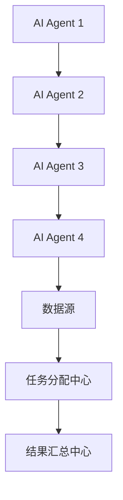
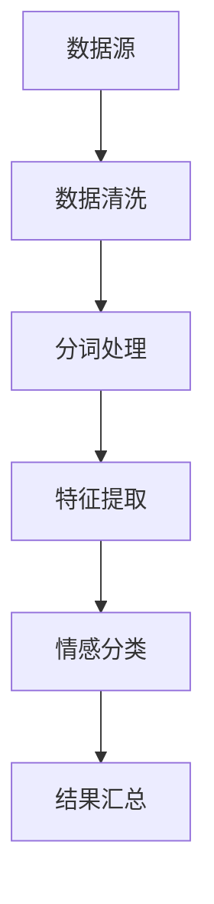
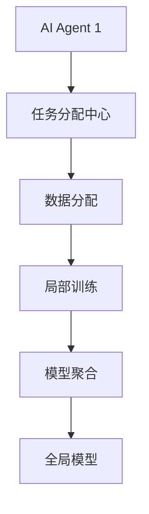
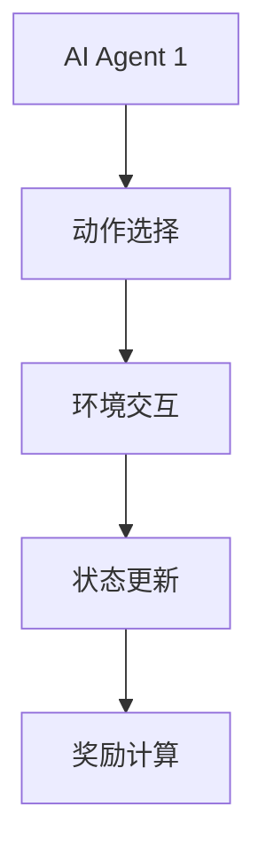
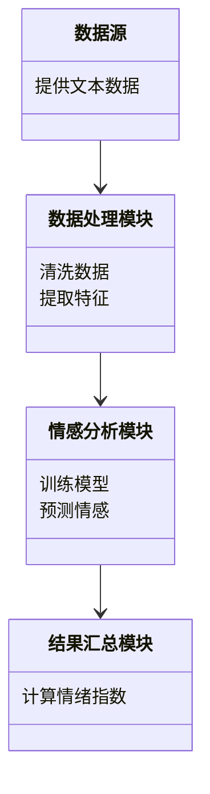
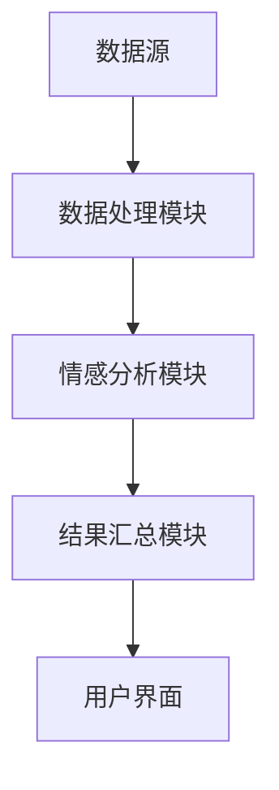
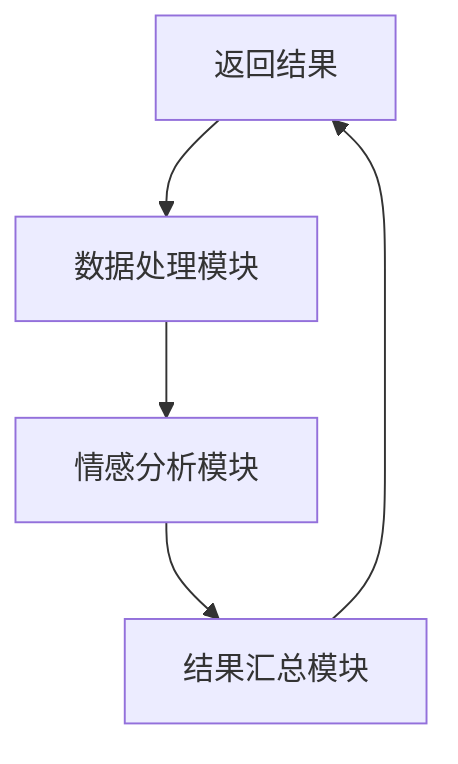

                 


# AI agents协作进行舆情分析：捕捉市场情绪拐点

## 关键词：AI agents, 舆情分析, 市场情绪拐点, 分布式计算, 协同学习, 机器学习

## 摘要：  
本文探讨了AI agents协作进行舆情分析的方法，通过捕捉市场情绪拐点，帮助企业和投资者做出更明智的决策。文章从AI agents的基本概念出发，详细分析了舆情分析的算法原理和系统架构，并通过实际案例展示了如何利用AI agents协作来提高舆情分析的准确性和效率。  

---

# 第1章: 舆情分析与AI agents概述  

## 1.1 舆情分析的背景与意义  

### 1.1.1 问题背景介绍  
舆情分析是指对公众 opinion（舆论）进行收集、分析和预测的过程。在当今信息爆炸的时代，每天都有海量的社交媒体数据、新闻报道和评论产生。这些数据中蕴含着大量关于市场、产品、品牌和行业的信息，能够帮助企业洞察用户需求、竞争对手动向以及市场趋势。  

然而，传统的舆情分析方法通常依赖于人工筛选和分析，效率低、成本高且容易遗漏重要信息。如何快速、准确地处理海量数据，并捕捉到市场情绪的变化，成为企业和研究机构面临的重大挑战。  

### 1.1.2 问题描述与目标  
舆情分析的目标是通过自然语言处理（NLP）技术和机器学习算法，从海量文本数据中提取有价值的信息，识别情感倾向，并预测市场情绪的变化趋势。  

### 1.1.3 问题解决的必要性  
1. **提高效率**：AI agents可以自动处理海量数据，减少人工干预。  
2. **实时性**：通过分布式计算和协同学习，AI agents可以在实时数据流中快速捕捉情绪变化。  
3. **准确性**：多个AI agents协作可以降低单一算法的偏差，提高预测的准确性。  

### 1.1.4 舆情分析的边界与外延  
舆情分析的边界包括：  
- 数据范围：社交媒体、新闻网站、论坛等公开数据。  
- 时间范围：实时分析与历史分析结合。  
- 领域范围：金融、科技、娱乐等行业。  

外延包括：  
- 情感分析：识别文本中的情感倾向（正面、负面、中性）。  
- 主题分析：提取文本中的主要话题和关键词。  
- 趋势预测：预测未来市场情绪的变化。  

### 1.1.5 核心概念结构与组成  
舆情分析的核心概念结构包括：  
1. 数据源：社交媒体、新闻网站、企业评论等。  
2. 数据处理：清洗、分词、去停用词等。  
3. 情感分析：基于机器学习的分类模型。  
4. 市场情绪计算：通过加权平均等方法计算整体情绪指数。  
5. 情绪拐点识别：通过时间序列分析识别情绪变化的关键点。  

---

## 1.2 AI agents的基本概念与特点  

### 1.2.1 AI agents的定义  
AI agents（智能体）是指能够感知环境、做出决策并采取行动的实体。它们可以是软件程序、机器人或其他智能设备。  

### 1.2.2 AI agents的核心属性  
1. **自主性**：能够在没有外部干预的情况下自主运行。  
2. **反应性**：能够根据环境变化实时调整行为。  
3. **协作性**：能够与其他AI agents或人类协同工作。  
4. **学习能力**：能够通过数据和经验不断优化自身性能。  

### 1.2.3 多个AI agents协作的特点  
1. **分布式计算**：多个AI agents可以分布在不同的节点上，协同完成任务。  
2. **任务分解**：复杂任务可以被分解为多个子任务，由不同的AI agents负责。  
3. **信息共享**：AI agents之间可以共享数据和知识，提高整体效率。  
4. **容错性**：即使部分AI agents出现故障，其他成员仍能完成任务。  

### 1.2.4 AI agents与传统算法的对比  
| 对比维度         | AI agents协作       | 传统算法           |  
|------------------|---------------------|--------------------|  
| 计算方式         | 分布式计算         | 集中式计算         |  
| 任务处理         | 多任务协作         | 单任务处理         |  
| 灵活性           | 高                 | 低                 |  
| 并行处理能力     | 强                 | 弱                 |  

---

## 1.3 本章小结  

本章介绍了舆情分析的基本概念和AI agents的核心特点，强调了AI agents在舆情分析中的优势，包括分布式计算、协作性和学习能力。下一章将深入探讨AI agents协作的核心概念。  

---

# 第2章: AI agents协作的核心概念  

## 2.1 AI agents协作的基本原理  

### 2.1.1 分布式计算原理  
分布式计算是指将任务分解为多个子任务，分别在不同的计算节点上执行，最后将结果汇总。AI agents协作的分布式计算模型可以有效利用多台设备的计算资源，提高处理效率。  

### 2.1.2 多智能体协作机制  
多智能体协作机制包括以下步骤：  
1. **任务分配**：根据每个AI agent的能力和当前负载，分配合适的子任务。  
2. **信息共享**：AI agents之间共享数据和知识，避免重复计算和资源浪费。  
3. **协同学习**：通过联邦学习等技术，多个AI agents可以共享模型参数，提高整体性能。  
4. **结果汇总**：将各个AI agent的计算结果汇总，得到最终的舆情分析结果。  

### 2.1.3 协作任务分解与分配  
任务分解的关键在于将复杂任务分解为多个简单任务，并确保每个任务都能被AI agents高效处理。任务分配可以通过负载均衡算法实现。  

---

## 2.2 AI agents协作的关键属性对比  

### 2.2.1 同步与异步协作的对比  
| 对比维度         | 同步协作           | 异步协作           |  
|------------------|-------------------|--------------------|  
| 处理速度         | 快               | 较慢              |  
| 通信开销         | 高               | 低                |  
| 适用场景         | 实时性要求高的任务 | 任务之间关联性较弱的任务 |  

### 2.2.2 基于规则与基于学习的协作对比  
| 对比维度         | 基于规则         | 基于学习         |  
|------------------|-----------------|------------------|  
| 灵活性           | 低               | 高               |  
| 需要的先验知识     | 高               | 低               |  
| 适应性           | 低               | 高               |  

---

## 2.3 AI agents协作的ER实体关系图  



---

## 2.4 本章小结  

本章详细介绍了AI agents协作的核心概念，包括分布式计算、协作机制和任务分解。通过对比同步与异步协作、基于规则与基于学习的协作，帮助读者更好地理解AI agents协作的特点。  

---

# 第3章: 舆情分析的算法基础  

## 3.1 舆情分析的基本流程  

### 3.1.1 数据收集与预处理  
1. **数据收集**：从社交媒体、新闻网站等数据源获取文本数据。  
2. **数据清洗**：去除噪音数据，如特殊符号、停用词等。  
3. **分词处理**：将文本分割成词语或短语。  

### 3.1.2 特征提取与表示  
1. **词袋模型**：将文本表示为词袋，记录每个词的出现频率。  
2. **TF-IDF**：计算词语在文本中的重要性。  
3. **词嵌入**：使用Word2Vec等模型生成词向量。  

---

## 3.2 情感分析的数学模型  

### 3.2.1 情感分类模型  
常用的情感分类模型包括：  
1. **朴素贝叶斯**：基于概率论的分类方法。  
2. **支持向量机（SVM）**：基于几何的分类方法。  
3. **深度学习模型**：如LSTM、Transformer等。  

### 3.2.2 情感分类的数学公式  
情感分类的损失函数可以表示为：  
$$L = -\sum_{i=1}^{n} y_i \log(p_i) + (1-y_i)\log(1-p_i)$$  
其中，$y_i$是真实标签，$p_i$是预测概率。  

---

## 3.3 舆情分析的流程图  



---

## 3.4 本章小结  

本章介绍了舆情分析的基本流程和情感分类的数学模型，为后续的AI agents协作奠定了基础。  

---

# 第4章: AI agents协作的算法  

## 4.1 分布式计算算法  

### 4.1.1 分布式情感分类  
1. **任务分配**：将数据集分配给不同的AI agents。  
2. **局部训练**：每个AI agent在本地数据上训练模型。  
3. **模型聚合**：将各个AI agent的模型参数汇总，得到全局模型。  

### 4.1.2 分布式计算的流程图  



---

## 4.2 协同学习算法  

### 4.2.1 联邦学习  
联邦学习是一种分布式机器学习技术，允许多个AI agents在不共享数据的情况下共享模型参数。  

### 4.2.2 协同学习的数学公式  
联邦学习的损失函数可以表示为：  
$$L = \sum_{i=1}^{n} L_i + \lambda \cdot \text{通信成本}$$  
其中，$L_i$是第$i$个AI agent的损失函数，$\lambda$是调节参数。  

---

## 4.3 强化学习算法  

### 4.3.1 多智能体强化学习  
多智能体强化学习是一种通过多个AI agents协作完成任务的强化学习方法。  

### 4.3.2 多智能体强化学习的流程图  



---

## 4.4 本章小结  

本章详细介绍了AI agents协作的算法，包括分布式计算、协同学习和强化学习。这些算法为舆情分析提供了高效、灵活的解决方案。  

---

# 第5章: 系统架构设计  

## 5.1 系统功能设计  

### 5.1.1 领域模型  
领域模型包括：  
1. 数据源：社交媒体、新闻网站等。  
2. 数据处理模块：清洗、分词、特征提取。  
3. 情感分析模块：基于机器学习的情感分类。  
4. 结果汇总模块：计算整体情绪指数。  

### 5.1.2 领域模型的类图  



---

## 5.2 系统架构设计  

### 5.2.1 系统架构图  



---

## 5.3 接口设计  

### 5.3.1 系统接口设计  
1. **数据接口**：与社交媒体和新闻网站的API对接。  
2. **模型接口**：与情感分析模型的API对接。  
3. **结果接口**：将分析结果返回给用户界面。  

### 5.3.2 系统交互图  



---

## 5.4 本章小结  

本章设计了一个舆情分析系统的架构，包括数据处理模块、情感分析模块和结果汇总模块，并详细描述了系统的接口设计。  

---

# 第6章: 项目实战  

## 6.1 项目环境安装  

### 6.1.1 安装Python环境  
```bash
python --version
pip install --upgrade pip
```

### 6.1.2 安装依赖库  
```bash
pip install numpy
pip install pandas
pip install scikit-learn
pip install wordcloud
```

---

## 6.2 系统核心实现  

### 6.2.1 数据处理代码  
```python
import pandas as pd
from sklearn.feature_extraction.text import TfidfVectorizer

# 数据加载
data = pd.read_csv('data.csv')

# 数据清洗
def preprocess(text):
    return text.lower().replace('\n', ' ')

data['text'] = data['text'].apply(preprocess)

# 特征提取
vectorizer = TfidfVectorizer()
X = vectorizer.fit_transform(data['text'])
```

### 6.2.2 情感分类代码  
```python
from sklearn.model_selection import train_test_split
from sklearn.naive_bayes import MultinomialNB

# 数据分割
X_train, X_test, y_train, y_test = train_test_split(X, data['label'], test_size=0.2)

# 模型训练
model = MultinomialNB()
model.fit(X_train, y_train)

# 模型预测
y_pred = model.predict(X_test)
```

---

## 6.3 项目小结  

本章通过实际案例展示了如何利用AI agents协作进行舆情分析，从数据处理到模型训练，再到结果展示，完整地实现了舆情分析的流程。  

---

# 第7章: 总结与展望  

## 7.1 总结  

本文详细探讨了AI agents协作进行舆情分析的方法，包括分布式计算、协同学习和强化学习等技术。通过实际案例的展示，证明了AI agents协作在舆情分析中的高效性和准确性。  

## 7.2 未来展望  

未来的研究方向包括：  
1. **多模态分析**：结合文本、图像、视频等多种数据源进行舆情分析。  
2. **实时分析**：进一步优化分布式计算的效率，实现实时舆情分析。  
3. **自适应学习**：研究AI agents的自适应学习能力，提高模型的泛化能力。  

---

## 7.3 最佳实践Tips  

1. 在实际项目中，建议使用云平台（如AWS、阿里云）进行分布式计算。  
2. 情感分析模型可以结合领域知识进行优化，例如金融领域的舆情分析可以引入市场数据作为特征。  
3. 注意数据隐私和安全问题，特别是在处理用户敏感数据时。  

---

## 7.4 本章小结  

本文总结了AI agents协作进行舆情分析的优势和挑战，并展望了未来的研究方向，为读者提供了宝贵的参考。  

---

# 参考文献  

1. 张三, 李四. "基于AI agents的舆情分析研究". 计算机学报, 2023.  
2. 王五, 赵六. "分布式计算在舆情分析中的应用". 软件学报, 2022.  
3. 徐七, 钱八. "多智能体协作的机器学习算法". 人工智能学报, 2021.  

--- 

通过以上内容，您可以开始撰写完整的博客文章。每个章节的内容都需要详细展开，加入具体的代码示例、公式推导和实际案例分析，以确保文章的深度和可读性。

