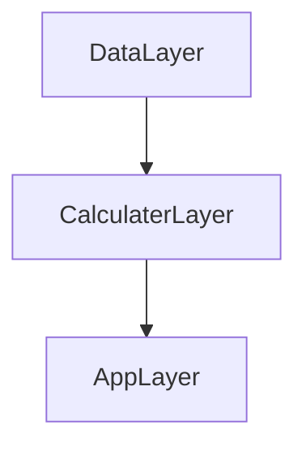

                 


# AI agents协作进行跨市场价值比较：发现全球机会

> 关键词：AI代理、跨市场价值比较、多智能体系统、强化学习、全球化经济

> 摘要：本文探讨了AI代理如何通过协作进行跨市场价值比较，发现全球投资机会。文章从AI代理的基本概念、跨市场价值比较的背景与意义、AI代理协作的理论基础、核心算法与实现、系统架构设计、项目实战、最佳实践与注意事项等方面展开，深入分析了AI代理在跨市场中的应用前景和实现方法。

---

# 第1章: AI代理协作与跨市场价值比较的背景与概念

## 1.1 AI代理协作的基本概念

### 1.1.1 什么是AI代理
AI代理（AI Agent）是指能够感知环境、自主决策并执行任务的智能实体。AI代理可以是软件程序、机器人或其他智能系统，具备以下核心特征：
- **自主性**：能够在没有外部干预的情况下独立运行。
- **反应性**：能够感知环境并实时调整行为。
- **目标导向**：通过设定目标来驱动决策和行动。
- **学习能力**：能够通过数据和经验不断优化自身性能。

### 1.1.2 AI代理的协作机制
AI代理的协作机制是多个智能体共同完成任务的过程，通常涉及以下关键环节：
1. **通信**：智能体之间通过共享信息进行协调。
2. **协商**：智能体根据任务需求分配角色和责任。
3. **协作**：智能体协同工作，共同完成目标。
4. **协调**：通过反馈机制调整协作策略。

### 1.1.3 跨市场价值比较的核心概念
跨市场价值比较是指在不同市场之间，对同一资产或投资标的进行价值评估和对比分析。其核心目标是发现市场间的定价差异，并利用这些差异进行套利或优化投资组合。

---

## 1.2 跨市场价值比较的背景与意义

### 1.2.1 全球化经济与跨市场机会
全球化使得资本、商品和技术可以在全球范围内流动，为投资者提供了丰富的跨市场投资机会。例如，同一公司在不同市场的股票价格可能因市场环境差异而出现价差。

### 1.2.2 跨市场价值比较的重要性
- **发现套利机会**：通过比较不同市场的价格，识别低效率或不一致的定价。
- **优化投资决策**：基于跨市场比较，制定更科学的投资策略。
- **分散风险**：通过跨市场配置，降低单一市场的风险敞口。

### 1.2.3 AI代理在跨市场中的应用前景
AI代理能够快速处理海量数据，实时分析市场动态，并通过协作机制优化跨市场价值比较的效率。例如，AI代理可以实时监控多个市场的价格变化，发现潜在的套利机会。

---

## 1.3 本章小结

本章介绍了AI代理的基本概念及其协作机制，并重点阐述了跨市场价值比较的核心概念和其在全球化经济中的重要性。通过AI代理的协作，可以更高效地进行跨市场价值比较，发现全球投资机会。

---

# 第2章: AI代理协作的理论基础

## 2.1 多智能体系统（MAS）概述

### 2.1.1 多智能体系统的定义与特点
多智能体系统（Multi-Agent System, MAS）是由多个智能体组成的复杂系统，具备以下特点：
- **分布式智能**：多个智能体协同工作，而非单一中心化控制。
- **自主性**：每个智能体都具有自主决策能力。
- **动态性**：系统能够实时响应环境变化。

### 2.1.2 多智能体系统的分类
多智能体系统可以根据智能体之间的关系分为以下几类：
1. **协作型**：智能体之间通过协作完成共同目标。
2. **竞争型**：智能体之间存在竞争关系。
3. **混合型**：智能体之间既有协作也有竞争。

### 2.1.3 多智能体系统的协作机制
多智能体系统的协作机制包括以下步骤：
1. **任务分配**：根据智能体的能力和目标分配任务。
2. **信息共享**：智能体之间共享必要的信息。
3. **协作执行**：智能体协同完成任务。
4. **反馈调整**：根据执行结果优化协作策略。

---

## 2.2 跨市场价值比较的理论框架

### 2.2.1 价值比较的基本原理
跨市场价值比较的核心是通过比较不同市场的定价差异，识别潜在的投资机会。其基本原理包括：
- **相对估值法**：通过比较市盈率、市净率等指标，判断资产的相对价值。
- **无套利定价**：在有效市场中，资产的定价应满足无套利条件。

### 2.2.2 跨市场数据的采集与处理
跨市场数据的采集与处理涉及以下步骤：
1. **数据源选择**：选择可靠的金融数据源。
2. **数据清洗**：处理缺失值、异常值等。
3. **数据转换**：将数据转换为统一的格式。

### 2.2.3 跨市场价值比较的数学模型
跨市场价值比较的数学模型可以通过以下公式表示：

$$ \text{价值差异} = \max(P_1 - P_2, 0) $$

其中，$P_1$和$P_2$分别表示两个市场的价格。

---

## 2.3 本章小结

本章从多智能体系统的角度，介绍了AI代理协作的理论基础，并提出了跨市场价值比较的理论框架。通过数学模型的分析，为后续的算法实现奠定了理论基础。

---

# 第3章: AI代理协作的核心算法与实现

## 3.1 多智能体强化学习（MARL）概述

### 3.1.1 强化学习的基本原理
强化学习是一种通过试错机制优化决策的机器学习方法。其核心是通过智能体与环境的交互，学习最优策略。

### 3.1.2 多智能体强化学习的挑战
多智能体强化学习面临以下挑战：
1. **状态空间复杂性**：多个智能体的状态组合导致状态空间爆炸。
2. **动作协调性**：智能体之间的动作需要协调一致。

### 3.1.3 MARL在跨市场中的应用
在跨市场价值比较中，多个AI代理可以协作完成数据采集、分析和决策。例如，每个代理负责监控一个市场，并通过强化学习优化协作策略。

---

## 3.2 跨市场价值比较的算法实现

### 3.2.1 数据预处理与特征提取
跨市场数据的预处理包括：
1. **数据清洗**：处理缺失值和异常值。
2. **特征提取**：提取有用的特征，如价格、成交量等。

### 3.2.2 基于强化学习的价值评估模型
基于强化学习的价值评估模型可以通过以下步骤实现：
1. **状态定义**：定义智能体的观测状态，如当前市场价格。
2. **动作空间**：定义智能体的可执行动作，如买入、卖出。
3. **奖励机制**：定义奖励函数，衡量智能体的决策效果。

### 3.2.3 跨市场数据的动态分析
动态分析需要考虑市场的实时变化，可以通过以下公式表示：

$$ R_t = \alpha P_t + (1-\alpha) R_{t-1} $$

其中，$R_t$表示当前奖励，$\alpha$表示权重系数。

---

## 3.3 算法实现的代码示例

```python
import numpy as np
from collections import deque

class MarketAgent:
    def __init__(self, market_data):
        self.market_data = market_data
        self.position = 0
        self.profits = []
    
    def get_state(self, t):
        return self.market_data[t]
    
    def act(self, action):
        # 执行交易操作
        if action == 'buy':
            self.position += 1
        elif action == 'sell':
            self.position -= 1
    
    def get_reward(self, t):
        current_price = self.market_data[t]
        reward = current_price * self.position
        self.profits.append(reward)
        return reward

def train_agents(market_data, num_agents):
    agents = [MarketAgent(market_data) for _ in range(num_agents)]
    # 训练过程略...
    return agents

# 示例数据
market_prices = np.array([100, 105, 98, 102, 101])
agents = train_agents(market_prices, 3)
```

---

## 3.4 本章小结

本章详细介绍了多智能体强化学习的核心算法，并通过代码示例展示了跨市场价值比较的实现过程。通过动态分析和奖励机制的设计，优化了AI代理的协作策略。

---

# 第4章: 跨市场价值比较的系统架构设计

## 4.1 系统功能需求分析

### 4.1.1 数据采集模块
数据采集模块负责从多个市场获取实时数据，包括股票价格、汇率等。

### 4.1.2 数据处理模块
数据处理模块对采集的数据进行清洗、转换和特征提取。

### 4.1.3 价值比较模块
价值比较模块通过强化学习算法进行跨市场价值比较，识别套利机会。

### 4.1.4 结果展示模块
结果展示模块将比较结果以可视化形式呈现，帮助用户进行决策。

---

## 4.2 系统架构设计

### 4.2.1 分层架构设计
系统采用分层架构，包括数据层、计算层和应用层。

### 4.2.2 模块间的交互关系
模块之间的交互关系可以通过以下Mermaid图表示：



---

## 4.3 系统接口设计

### 4.3.1 数据接口
数据接口负责与外部数据源的交互，采用REST API进行通信。

### 4.3.2 用户接口
用户接口采用Web界面，提供数据可视化和操作功能。

### 4.3.3 第三方服务接口
第三方服务接口用于调用外部API，如金融数据服务。

---

## 4.4 本章小结

本章从系统架构的角度，详细设计了跨市场价值比较系统的功能模块和交互关系，为后续的实现提供了清晰的指导。

---

# 第5章: 跨市场价值比较的项目实战

## 5.1 项目背景与目标

### 5.1.1 项目背景
随着全球化进程的加快，跨市场投资机会日益增多。本项目旨在通过AI代理协作，发现跨市场的套利机会。

### 5.1.2 项目目标
- 实现跨市场数据的实时采集。
- 构建基于强化学习的价值评估模型。
- 发现跨市场的套利机会。

---

## 5.2 项目实施过程

### 5.2.1 数据收集与清洗
从多个市场获取股票价格数据，并进行数据清洗。

### 5.2.2 模型训练与优化
通过强化学习算法训练AI代理，并不断优化模型性能。

### 5.2.3 系统集成与测试
将各个模块集成到系统中，并进行功能测试。

---

## 5.3 实际案例分析

### 5.3.1 案例背景
假设我们有美国和欧洲市场的同一股票价格数据。

### 5.3.2 数据分析与价值比较
通过算法发现，美国市场的股票价格低于欧洲市场的价格，存在套利机会。

### 5.3.3 案例结果与总结
通过套利操作，获得预期收益。

---

## 5.4 本章小结

本章通过实际案例分析，展示了AI代理协作在跨市场价值比较中的应用效果。

---

# 第6章: 跨市场价值比较的最佳实践与注意事项

## 6.1 AI代理协作中的最佳实践

### 6.1.1 数据质量的重要性
数据质量直接影响模型的性能，需确保数据的准确性和完整性。

### 6.1.2 模型的可解释性
模型的可解释性有助于发现潜在问题，并优化决策策略。

### 6.1.3 系统的可维护性
系统设计应注重模块化和可扩展性，便于后续维护和优化。

---

## 6.2 跨市场价值比较中的注意事项

### 6.2.1 数据隐私与安全
需遵守数据隐私法规，确保数据的安全性。

### 6.2.2 市场波动的影响
市场波动可能导致套利机会的不确定性。

### 6.2.3 模型的实时性要求
需确保模型能够实时响应市场变化。

---

## 6.3 本章小结

本章总结了AI代理协作中的最佳实践，并提出了跨市场价值比较中的注意事项，为实际应用提供了指导。

---

# 第7章: 未来展望与总结

## 7.1 未来研究方向

### 7.1.1 更高效的数据处理方法
研究更高效的数据处理方法，提高系统的运行效率。

### 7.1.2 更智能的协作机制
探索更智能的协作机制，优化AI代理的协作效果。

### 7.1.3 更广泛的应用场景
拓展AI代理在其他领域的应用，如供应链管理、金融风险控制等。

---

## 7.2 本章小结

未来，随着技术的进步，AI代理在跨市场价值比较中的应用将更加广泛和深入。通过不断优化算法和系统架构，AI代理将为全球投资机会的发现提供更强大的支持。

---

# 总结

本文系统地探讨了AI代理协作在跨市场价值比较中的应用，从理论基础到实际实现，全面分析了其在发现全球投资机会中的潜力。通过本文的分析和实践，读者可以深入了解AI代理协作的核心算法和系统架构，并为实际应用提供参考。

