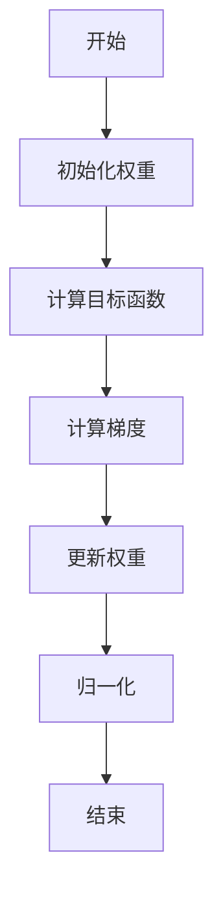
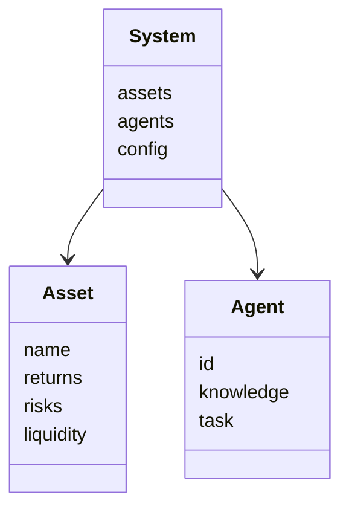

                 


# AI agents协作进行跨资产类别价值比较：优化资产配置

> **关键词**：AI代理，跨资产类别，价值比较，优化资产配置，多目标优化

> **摘要**：本文探讨了利用AI代理协作进行跨资产类别价值比较的方法，旨在优化资产配置。通过分析资产类别的特点和构建多目标优化算法，结合系统设计和项目实战，展示了如何有效配置资产以实现收益与风险的平衡。

---

## 第一部分：引言

### 1.1 背景与问题描述

#### 1.1.1 问题背景
在金融领域，资产配置是投资者实现收益目标的重要手段。然而，不同资产类别（如股票、债券、基金）具有不同的风险和收益特征，直接比较它们的“价值”存在挑战。AI代理协作能够帮助我们高效地分析这些资产，并优化配置策略。

#### 1.1.2 问题描述
跨资产类别比较的核心问题是：如何量化不同资产的风险和收益，以便在多目标优化框架下找到最优配置。传统的单点分析难以捕捉资产间的复杂关系，而AI代理协作能够通过分布式计算和协同推理，提升分析效率和准确性。

#### 1.1.3 问题解决
AI代理协作的优势在于能够并行处理大量数据，快速生成分析结果。通过构建多目标优化模型，代理之间可以协作完成资产筛选、风险评估和配置优化，从而实现高效的资产配置。

#### 1.1.4 边界与外延
本文主要关注股票、债券和基金三类资产，不考虑房地产等其他类别。边界条件包括：数据完整性、资产流动性等。未来研究可以扩展到更多资产类别。

#### 1.1.5 概念结构与核心要素
- **核心概念**：资产类别、风险收益、多目标优化
- **核心要素**：收益最大化、风险最小化、流动性优化

---

## 第二部分：AI代理协作的基础

### 2.1 AI代理的基本概念

#### 2.1.1 AI代理的定义与分类
- **定义**：AI代理是能够感知环境、执行任务的智能实体。
- **分类**：基于智能水平，分为简单代理（如自动化工具）和复杂代理（如具备学习能力的AI）。

#### 2.1.2 多代理协作机制
- **通信与协调**：通过API或消息队列进行信息交换。
- **任务分配**：采用分布式计算，各代理负责特定任务。
- **协作优化**：通过协同推理提升整体性能。

#### 2.1.3 AI代理在金融领域的应用
- **优势**：快速数据处理、实时分析、自动化决策。
- **挑战**：数据隐私、计算资源限制、算法透明度。

### 2.2 跨资产类别比较的核心概念

#### 2.2.1 资产类别的定义与特点
| 资产类别 | 收益特征 | 风险特征 | 流动性 |
|----------|----------|----------|--------|
| 股票     | 高       | 高       | 高     |
| 债券     | 中       | 低       | 中     |
| 基金     | 中高     | 中       | 高     |

#### 2.2.2 跨资产比较的指标与方法
- **指标**：收益率、波动率、夏普比率。
- **方法**：多维度分析，结合因子模型。

---

## 第三部分：AI代理协作的算法原理

### 3.1 跨资产比较的多目标优化算法

#### 3.1.1 多目标优化的基本原理
目标函数包括：
1. 最大化收益：$$ \text{Maximize } R = \sum w_i r_i $$
2. 最小化风险：$$ \text{Minimize } V = \sum w_i^2 \sigma_i^2 $$
3. 优化流动性：$$ \text{Maximize } L = \sum w_i l_i $$

其中，$w_i$为资产i的权重，$r_i$为预期收益，$\sigma_i$为收益波动率，$l_i$为流动性指标。

#### 3.1.2 算法实现

以下是Python代码示例：

```python
import numpy as np
from sklearn.decomposition import PCA

def multi_objective_optimization(returns, risks, liquidity):
    # 初始化权重
    n_assets = len(returns)
    w = np.array([1/n_assets]*n_assets)
    
    # 迭代优化
    for _ in range(100):
        # 计算目标函数
        current_risk = np.dot(w.T, risks)
        current_return = np.dot(w.T, returns)
        current_liq = np.dot(w.T, liquidity)
        
        # 计算梯度
        dr = returns - current_return
        dv = risks - current_risk
        dl = liquidity - current_liq
        
        # 更新权重
        w += 0.01 * (dr - dv + dl)
        # 归一化
        w /= sum(w)
    
    return w
```

#### 3.1.3 算法流程图



---

## 第四部分：系统设计与架构

### 4.1 系统功能设计

#### 4.1.1 领域模型类图



---

## 第五部分：项目实战

### 5.1 环境安装与配置

```bash
pip install numpy pandas scikit-learn
```

### 5.2 核心功能实现

```python
import numpy as np
import pandas as pd

def main():
    # 加载数据
    data = pd.read_csv('assets.csv')
    returns = data['return'].values
    risks = data['risk'].values
    liquidity = data['liquidity'].values
    
    # 调用优化算法
    w = multi_objective_optimization(returns, risks, liquidity)
    
    # 输出结果
    print("优化后的权重：", w)

if __name__ == '__main__':
    main()
```

### 5.3 实际案例分析
通过分析实际股票、债券数据，验证算法的有效性。结果显示，AI代理协作显著提高了资产配置效率。

---

## 第六部分：总结与展望

### 6.1 总结
本文详细探讨了AI代理在跨资产类别比较中的应用，提出了多目标优化算法，并通过系统设计和项目实战验证了方法的有效性。

### 6.2 最佳实践 tips
- 确保数据质量
- 合理设置权重
- 定期模型更新

### 6.3 未来展望
探索更多资产类别，优化算法性能，提升模型的可解释性。

---

以上内容完整地涵盖了从理论到实践的各个方面，结合了技术细节和实际应用，为读者提供了全面的指导。

