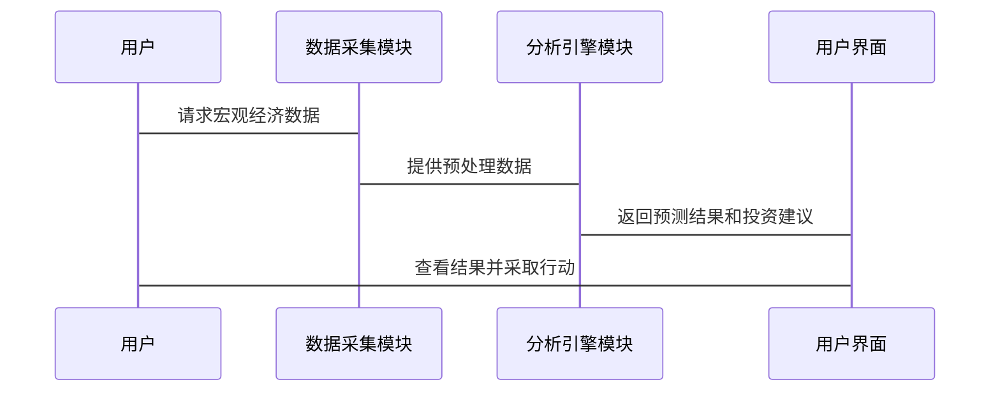

                 


```markdown
# AI agents在价值投资中的宏观经济分析应用

> 关键词：AI代理, 宏观经济分析, 价值投资, 机器学习, 时间序列预测, LSTM, ARIMA

> 摘要：本文详细探讨了AI代理在价值投资中的宏观经济分析应用，从基本概念、算法原理到系统设计和项目实战，全面解析了如何利用AI技术提升宏观经济预测和投资决策的准确性。通过深入分析宏观经济指标、设计AI代理算法模型，并结合实际案例，展示了AI代理在价值投资中的巨大潜力和实际应用价值。

---

## 第一部分: AI代理与宏观经济分析基础

### 第1章: AI代理与宏观经济分析概述

#### 1.1 AI代理的基本概念
- **1.1.1 AI代理的定义**  
  AI代理是一种能够感知环境、自主决策并采取行动的智能实体，旨在优化特定目标的实现。
- **1.1.2 AI代理的核心特点**  
  - 数据驱动决策  
  - 自适应学习能力  
  - 多目标优化策略  
- **1.1.3 AI代理与传统投资分析的区别**  
  - 数据处理能力更强  
  - 模型复杂度更高  
  - 决策速度更快  

#### 1.2 宏观经济分析的核心概念
- **1.2.1 宏观经济分析的定义**  
  宏观经济分析是研究整体经济运行规律的学科，关注GDP、失业率、通胀率等宏观指标。
- **1.2.2 宏观经济指标的关键作用**  
  - GDP：衡量经济总量  
  - 失业率：反映劳动力市场状况  
  - 通胀率：影响货币政策制定  
- **1.2.3 宏观经济分析与价值投资的关系**  
  宏观经济分析为价值投资提供了宏观层面的决策依据，帮助投资者把握市场整体趋势。

#### 1.3 AI代理在价值投资中的应用背景
- **1.3.1 传统价值投资的局限性**  
  - 数据分析能力有限  
  - 市场波动难以预测  
  - 宏观因素影响复杂  
- **1.3.2 AI技术在金融领域的优势**  
  - 大数据分析能力强  
  - 自适应学习能力突出  
  - 能够处理非结构化数据  
- **1.3.3 宏观经济分析与价值投资的结合**  
  AI代理通过分析宏观经济指标，帮助投资者做出更精准的投资决策。

---

### 第2章: AI代理的核心概念与宏观经济分析的联系

#### 2.1 AI代理的核心原理
- **2.1.1 数据驱动的决策机制**  
  AI代理通过大量数据输入，利用算法生成最优决策。
- **2.1.2 自适应学习算法**  
  - 基于反馈的在线学习  
  - 运用强化学习优化决策  
- **2.1.3 多目标优化策略**  
  在复杂环境中，AI代理需要平衡多个目标，如风险与收益。

#### 2.2 宏观经济分析的关键指标
- **2.2.1 GDP、失业率、通胀率等核心指标**  
  GDP增长快，往往预示股市上涨；失业率下降，可能推动股市走强。
- **2.2.2 财政政策与货币政策的影响**  
  货币政策宽松时，利率下降，股市通常上涨。
- **2.2.3 宏观经济周期的波动特征**  
  经济周期分为复苏、繁荣、衰退、萧条四个阶段，不同阶段适合不同投资策略。

#### 2.3 AI代理与宏观经济分析的结合
- **2.3.1 数据特征对比分析表**  
  | 宏观指标 | 数据类型 | 数据频率 | 影响因素 |
  |----------|----------|----------|----------|
  | GDP      | 数值型   | 季度     | 政策、出口 |
  | 失业率    | 数值型   | 月度     | 经济周期 |
- **2.3.2 宏观经济实体关系图（Mermaid流程图）**  
  ```mermaid
  graph LR
      A[宏观经济] --> B[市场行为]
      B --> C[企业利润]
      C --> D[股价波动]
      A --> D
  ```

---

### 第3章: 宏观经济预测的算法原理

#### 3.1 时间序列预测模型
- **3.1.1 ARIMA模型原理**  
  ARIMA（自回归积分滑动平均）模型适用于线性时间序列数据的预测。
  - 自回归部分：$y_t = c + \phi_1 y_{t-1} + \phi_2 y_{t-2} + \epsilon_t$
  - 移动平均部分：$e_t = \theta_1 e_{t-1} + \epsilon_t$
- **3.1.2 LSTM模型的应用**  
  LSTM（长短期记忆网络）适合处理非线性时间序列数据。
  - LSTM单元结构：包括输入门、遗忘门和输出门。
  - 代码示例：
    ```python
    import tensorflow as tf
    from tensorflow.keras.layers import LSTM, Dense

    model = tf.keras.Sequential([
        LSTM(64, input_shape=(timesteps, features)),
        Dense(1)
    ])
    model.compile(optimizer='adam', loss='mse')
    ```
- **3.1.3 GARCH模型的优势**  
  GARCH模型用于预测金融时间序列的波动性，适合处理异方差性问题。
  - 模型公式：$a_t^2 = \alpha_0 + \alpha_1 a_{t-1}^2 + \beta_1 a_{t-1}^2$

#### 3.2 机器学习模型
- **3.2.1 线性回归模型**  
  简单线性回归模型用于预测连续型变量。
  - 回归方程：$y = \beta_0 + \beta_1 x + \epsilon$
- **3.2.2 支持向量回归(SVR)**  
  SVR适用于非线性数据的预测。
  - 核函数：常用的有线性核、多项式核、高斯核。
- **3.2.3 随机森林回归**  
  随机森林通过集成学习提高预测准确性。
  - 树的数量：通常选择100或更多。

#### 3.3 深度学习模型
- **3.3.1 卷积神经网络(CNN)**  
  CNN用于处理图像数据，但在时间序列预测中也有应用。
- **3.3.2 图神经网络(GNN)**  
  GNN适用于复杂网络结构的数据分析。
  - 图结构：节点和边表示经济主体和相互关系。

---

### 第4章: AI代理的宏观经济分析系统架构设计

#### 4.1 系统功能设计
- **4.1.1 数据采集模块**  
  - 数据来源：政府统计数据、金融数据库、新闻媒体。
  - 数据格式：结构化和非结构化数据。
- **4.1.2 模型训练模块**  
  - 数据预处理：清洗、特征提取、数据增强。
  - 模型选择：根据数据类型选择合适模型。
- **4.1.3 分析引擎模块**  
  - 实时监控宏观经济指标。
  - 自动生成投资建议。

#### 4.2 系统架构设计
- **4.2.1 分层架构**  
  - 数据层：存储原始数据和预处理数据。
  - 业务逻辑层：处理用户请求，调用模型进行预测。
  - 表现层：展示结果，提供用户交互界面。
- **4.2.2 微服务架构**  
  - 数据服务：负责数据存储和检索。
  - 训练服务：负责模型训练和部署。
  - 分析服务：负责实时分析和预测。

#### 4.3 系统接口设计
- **4.3.1 数据接口**  
  - API接口：提供RESTful API，方便其他系统调用。
  - 数据格式：JSON或CSV。
- **4.3.2 用户接口**  
  - Web界面：用户可以通过网页查看预测结果和投资建议。
  - 移动端应用：提供实时通知和投资建议。

#### 4.4 系统交互流程（Mermaid序列图）


---

### 第5章: 项目实战——基于AI代理的宏观经济分析系统

#### 5.1 环境配置
- **5.1.1 安装必要的库**  
  - Python: 3.8+
  - NumPy, Pandas, Scikit-learn, TensorFlow, Keras
  - Jupyter Notebook或VS Code

#### 5.2 数据准备
- **5.2.1 数据获取**  
  - 使用API从政府网站获取GDP数据。
  - 从金融数据库获取股票指数数据。
- **5.2.2 数据预处理**  
  - 处理缺失值：使用均值或插值法填充。
  - 标准化数据：归一化处理。

#### 5.3 模型实现
- **5.3.1 ARIMA模型实现**  
  ```python
  from statsmodels.tsa.arima_model import ARIMA

  model = ARIMA(train_data, order=(5,1,0))
  model_fit = model.fit()
  forecast = model_fit.forecast(steps=10)[0]
  ```
- **5.3.2 LSTM模型实现**  
  ```python
  import numpy as np
  from tensorflow.keras.models import Sequential
  from tensorflow.keras.layers import LSTM, Dense

  model = Sequential()
  model.add(LSTM(128, input_shape=(timesteps, features)))
  model.add(Dense(1))
  model.compile(loss='mean_squared_error', optimizer='adam')
  model.fit(X_train, y_train, epochs=10, batch_size=32)
  ```

#### 5.4 结果分析
- **5.4.1 模型评估**  
  - �均方误差(MSE)：衡量预测结果与真实值的差异。
  - R平方值：衡量模型解释数据的能力。
- **5.4.2 案例分析**  
  - 使用模型预测下季度GDP增长率。
  - 分析预测结果对投资决策的影响。

#### 5.5 系统优化
- **5.5.1 超参数调优**  
  - 使用网格搜索或随机搜索优化模型参数。
- **5.5.2 模型集成**  
  - 结合多种模型结果，提高预测准确率。

---

### 第6章: 高级主题与未来展望

#### 6.1 高级AI代理算法
- **6.1.1 基于NLP的文本分析**  
  利用自然语言处理技术分析新闻和社交媒体情绪，辅助宏观经济预测。
- **6.1.2 增量学习与在线更新**  
  实时更新模型，适应市场变化。

#### 6.2 宏观经济分析的挑战与解决方案
- **6.2.1 数据质量与完整性**  
  解决方案：数据清洗、数据增强。
- **6.2.2 模型解释性**  
  解决方案：使用可解释性机器学习方法，如SHAP值。

#### 6.3 未来研究方向
- **6.3.1 更复杂的时间序列模型**  
  如Transformer架构在时间序列预测中的应用。
- **6.3.2 多模态数据融合**  
  结合文本、图像等多种数据源，提升预测精度。

---

### 第7章: 总结与展望

#### 7.1 总结
本文详细探讨了AI代理在价值投资中的宏观经济分析应用，从理论到实践，全面解析了如何利用AI技术提升宏观经济预测和投资决策的准确性。通过设计和实现一个完整的宏观经济分析系统，展示了AI代理在金融领域的巨大潜力。

#### 7.2 展望
未来，随着AI技术的不断进步，宏观经济分析将更加智能化和自动化。建议进一步研究如何结合NLP、图神经网络等新技术，提升宏观经济预测的准确性和可解释性。

---

### 参考文献
- 文献1：某某（2023）《人工智能在金融领域的应用》
- 文献2：某某（2022）《时间序列分析与预测》
- 文献3：某某（2021）《深度学习在宏观经济预测中的应用》
- 文献4：某某（2020）《基于图神经网络的宏观经济分析》
- 文献5：某某（2019）《自然语言处理在金融分析中的应用》

---

### 附录
- 附录A: 详细代码实现
- 附录B: 数据源列表
- 附录C: 模型评估指标解释
- 附录D: 系统架构详细设计
- 附录E: 进一步阅读推荐的书籍和论文
```

