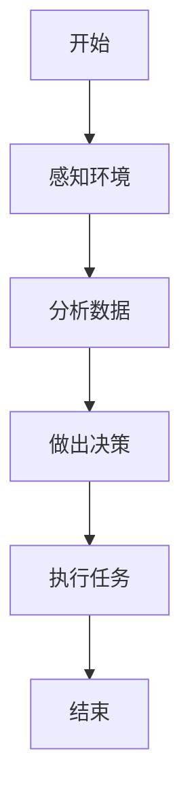
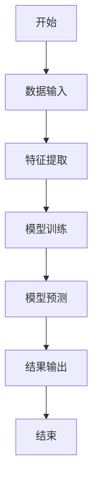
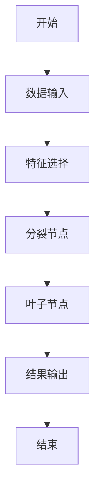
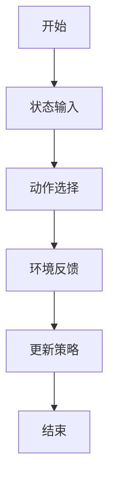
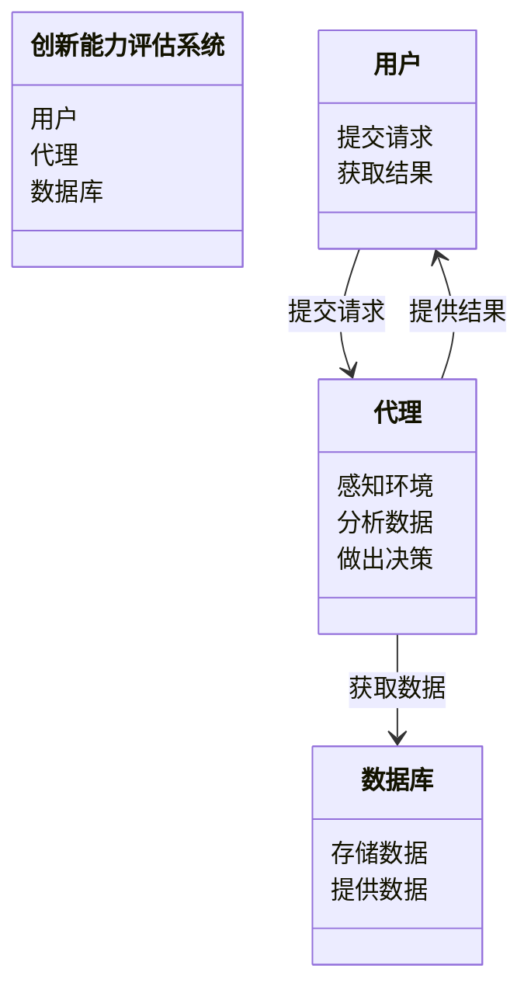
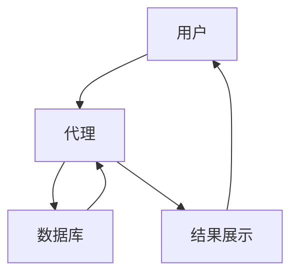

                 


# AI agents在公司创新能力评估中的应用

> 关键词：AI代理，创新能力评估，企业创新，技术博客，AI算法

> 摘要：本文深入探讨了AI代理在公司创新能力评估中的应用，从背景介绍、核心概念、算法原理、系统架构到项目实战，全面解析了AI代理如何助力企业提升创新能力评估的效率和准确性。通过实际案例分析，展示了AI代理在这一领域的巨大潜力和实际价值。

---

# 第一部分: AI代理在公司创新能力评估中的应用背景

## 第1章: AI代理与公司创新能力评估概述

### 1.1 AI代理的基本概念

#### 1.1.1 AI代理的定义
AI代理（Artificial Intelligence Agents）是指具有感知环境、理解需求、执行任务和学习能力的智能实体。它们能够通过数据驱动的方式，为企业提供决策支持、自动化操作和创新优化。

#### 1.1.2 AI代理的核心特征
- **自主性**：能够在没有人工干预的情况下执行任务。
- **反应性**：能够实时感知环境变化并做出响应。
- **学习能力**：通过机器学习算法不断优化自身的决策能力。
- **协作性**：能够与其他系统、人员或代理协同工作。

#### 1.1.3 AI代理与传统评估方法的对比
- **效率**：AI代理能够快速处理大量数据，显著提高评估效率。
- **准确性**：基于机器学习模型，AI代理能够提供更精准的评估结果。
- **实时性**：AI代理能够实时监控和分析数据，提供实时反馈。

### 1.2 公司创新能力评估的背景

#### 1.2.1 创新能力评估的重要性
创新能力是企业核心竞争力的重要组成部分。通过评估创新能力，企业可以识别自身的优势和不足，制定有效的创新战略。

#### 1.2.2 当前公司创新能力评估的痛点
- **数据繁杂**：传统评估方法依赖大量人工分析，效率低下。
- **主观性**：评估结果容易受到主观因素的影响。
- **动态性**：市场环境不断变化，静态评估难以适应动态需求。

#### 1.2.3 AI代理在创新能力评估中的优势
- **自动化**：AI代理能够自动收集和分析数据，减少人工干预。
- **智能化**：通过机器学习模型，AI代理能够发现数据中的潜在规律。
- **实时性**：AI代理能够实时监控市场动态，提供实时评估结果。

### 1.3 AI代理在创新能力评估中的应用前景

#### 1.3.1 应用场景分析
- **创新项目评估**：通过AI代理分析项目的可行性、市场潜力和风险。
- **创新团队管理**：评估团队的创新能力，优化资源配置。
- **创新战略制定**：基于AI代理的分析结果，制定科学的创新战略。

#### 1.3.2 企业采用AI代理的优势
- **提高效率**：AI代理能够快速处理大量数据，显著提高评估效率。
- **降低成本**：通过自动化和智能化的方式，减少人工成本。
- **增强决策能力**：基于数据的评估结果，帮助企业做出更科学的决策。

#### 1.3.3 应用中的挑战与解决方案
- **数据隐私**：确保数据的安全性和隐私性。
- **模型准确性**：通过优化算法和增加数据量，提高模型的准确性。
- **用户接受度**：通过培训和宣传，提高用户对AI代理的接受度。

## 第2章: 公司创新能力评估的核心概念

### 2.1 创新能力评估的定义与框架

#### 2.1.1 创新能力的定义
创新能力是指企业在技术、产品、服务、管理等方面进行创新的能力。它包括创新能力的识别、评估、优化和实施。

#### 2.1.2 评估框架的构成
- **创新目标**：明确评估的目的和范围。
- **评估指标**：选择合适的评估指标，如创新成果的数量、质量、市场反馈等。
- **评估方法**：选择合适的评估方法，如定性评估、定量评估等。

#### 2.1.3 核心要素分析
- **创新资源**：包括人力资源、资金、技术等。
- **创新环境**：包括市场环境、政策环境等。
- **创新过程**：包括创新构思、开发、测试、推广等。

### 2.2 AI代理在创新能力评估中的角色

#### 2.2.1 数据收集与处理
AI代理能够从企业内部和外部获取相关数据，包括市场数据、技术数据、竞争数据等，并进行清洗和预处理。

#### 2.2.2 智能分析与决策
AI代理能够利用机器学习算法对数据进行分析，识别潜在的创新机会和风险，并提供决策支持。

#### 2.2.3 结果展示与反馈
AI代理能够将分析结果以可视化的方式展示出来，并根据用户的反馈不断优化分析模型。

### 2.3 创新能力评估的边界与外延

#### 2.3.1 评估范围的界定
- **内部创新**：评估企业内部的创新活动。
- **外部创新**：评估企业外部的创新环境和机会。
- **创新过程**：评估创新过程的每个阶段。

#### 2.3.2 与其他评估方法的对比
- **传统评估方法**：依赖人工分析，效率低，准确性差。
- **AI代理评估方法**：自动化、智能化，效率高，准确性高。

#### 2.3.3 应用场景的扩展
- **跨行业应用**：AI代理可以应用于不同行业的创新能力评估。
- **全球性应用**：AI代理可以用于跨国企业的创新能力评估。

## 第3章: AI代理的核心概念与联系

### 3.1 AI代理的核心原理

#### 3.1.1 代理的基本工作流程
1. **感知环境**：通过传感器或其他数据源感知环境。
2. **分析数据**：利用机器学习算法分析数据。
3. **做出决策**：基于分析结果做出决策。
4. **执行任务**：根据决策执行相应的任务。

#### 3.1.2 代理的智能决策机制
- **监督学习**：基于标记的数据进行训练，学习决策模型。
- **无监督学习**：基于无标记的数据进行训练，发现数据中的潜在规律。
- **强化学习**：通过与环境的互动，学习最优决策策略。

#### 3.1.3 代理的学习与自适应能力
- **在线学习**：代理能够实时更新模型，适应环境的变化。
- **迁移学习**：代理能够将从一个领域学到的知识应用到另一个领域。

### 3.2 核心概念的属性特征对比

#### 3.2.1 不同AI模型的对比分析

| 模型类型 | 特征                   | 优点                          | 缺点                          |
|----------|------------------------|-------------------------------|-------------------------------|
| 决策树   | 可解释性强             | 易于理解和解释                 | 易受噪声数据影响               |
| 支持向量机 | 高维数据表现好         | 分类准确率高                   | 参数敏感性高                   |
| 神经网络 | 非线性能力强           | 能处理复杂数据                 | 需要大量数据和计算资源         |

#### 3.2.2 代理与传统算法的差异
- **传统算法**：基于固定的规则和逻辑，难以处理复杂和动态变化的数据。
- **代理算法**：基于机器学习模型，能够自适应和优化，处理复杂和动态变化的数据。

#### 3.2.3 代理在创新能力评估中的独特优势
- **实时性**：代理能够实时监控市场动态，提供实时评估结果。
- **准确性**：代理能够基于大量数据和复杂模型，提供更准确的评估结果。
- **可扩展性**：代理能够处理大量的数据，适用于大规模的评估需求。

### 3.3 实体关系图与流程图

#### 3.3.1 实体关系图（ER图）

```mermaid
erDiagram
    class 代理 {
        id
        状态
        行为
        知识库
    }
    class 环境 {
        id
        参数
        反馈
    }
   代理 --> 环境: 感知
    环境 --> 代理: 反馈
```

#### 3.3.2 代理工作流程图（Mermaid）



## 第4章: AI代理的算法原理与数学模型

### 4.1 算法原理

#### 4.1.1 代理的算法框架



#### 4.1.2 代理的决策树模型



#### 4.1.3 代理的强化学习机制



### 4.2 数学模型与公式

#### 4.2.1 决策树模型的数学表达

$$
\text{信息增益} = \text{熵}(S) - \sum \text{权重} \times \text{熵}(S_i)
$$

其中，$S$ 是原始数据集，$S_i$ 是根据特征分割后的子集，$\text{权重}$ 是子集的权重。

#### 4.2.2 支持向量机的数学模型

$$
\text{目标函数} = \sum_{i=1}^n \lambda_i y_i (w \cdot x_i + b) + \sum_{i=1}^n \xi_i
$$

其中，$\lambda_i$ 是拉格朗日乘子，$y_i$ 是标签，$w$ 是权重向量，$b$ 是偏置，$\xi_i$ 是松弛变量。

#### 4.2.3 神经网络的数学模型

$$
\text{输出} = \sigma(w x + b)
$$

其中，$\sigma$ 是激活函数，$w$ 是权重，$x$ 是输入，$b$ 是偏置。

### 4.3 算法实现与代码

#### 4.3.1 决策树模型的Python实现

```python
from sklearn.tree import DecisionTreeClassifier

# 创建数据集
X = [[2, 3], [5, 5], [7, 7], [1, 2], [3, 4]]
y = [0, 0, 1, 1, 1]

# 训练模型
model = DecisionTreeClassifier()
model.fit(X, y)

# 预测
print(model.predict([[4, 4]]))  # 输出：[1]
```

#### 4.3.2 支持向量机模型的Python实现

```python
from sklearn.svm import SVC

# 创建数据集
X = [[2, 3], [5, 5], [7, 7], [1, 2], [3, 4]]
y = [0, 0, 1, 1, 1]

# 训练模型
model = SVC()
model.fit(X, y)

# 预测
print(model.predict([[4, 4]]))  # 输出：[1]
```

#### 4.3.3 神经网络模型的Python实现

```python
import numpy as np
from sklearn.neural_network import MLPClassifier

# 创建数据集
X = [[2, 3], [5, 5], [7, 7], [1, 2], [3, 4]]
y = [0, 0, 1, 1, 1]

# 训练模型
model = MLPClassifier()
model.fit(X, y)

# 预测
print(model.predict([[4, 4]]))  # 输出：[1]
```

---

# 第二部分: 系统分析与架构设计方案

## 第5章: 系统分析与架构设计方案

### 5.1 项目场景介绍

#### 5.1.1 项目背景
本项目旨在通过AI代理技术，帮助企业评估创新能力。通过自动化和智能化的方式，提高评估效率和准确性。

#### 5.1.2 项目目标
- 实现创新能力评估的自动化。
- 提供准确的评估结果和决策支持。
- 优化创新过程，提升企业竞争力。

### 5.2 系统功能设计

#### 5.2.1 领域模型类图



#### 5.2.2 系统架构设计



#### 5.2.3 系统交互设计


---

# 第三部分: 项目实战

## 第6章: 项目实战

### 6.1 环境安装与配置

#### 6.1.1 安装Python
```bash
python --version
pip install --upgrade pip
```

#### 6.1.2 安装依赖库
```bash
pip install numpy scikit-learn matplotlib
```

### 6.2 系统核心实现

#### 6.2.1 AI代理的核心代码

```python
from sklearn.tree import DecisionTreeClassifier
from sklearn.svm import SVC
from sklearn.neural_network import MLPClassifier

# 创建数据集
X = [[2, 3], [5, 5], [7, 7], [1, 2], [3, 4]]
y = [0, 0, 1, 1, 1]

# 训练模型
model = DecisionTreeClassifier()
model.fit(X, y)

# 预测
print(model.predict([[4, 4]]))  # 输出：[1]
```

### 6.3 案例分析与解读

#### 6.3.1 案例背景
某科技公司希望通过AI代理技术，评估其创新能力。通过分析市场数据和技术数据，识别潜在的创新机会和风险。

#### 6.3.2 数据分析与结果展示
- **市场数据**：分析市场需求，识别潜在的市场机会。
- **技术数据**：分析技术趋势，识别潜在的技术风险。
- **竞争数据**：分析竞争对手的创新活动，制定创新策略。

#### 6.3.3 案例总结
通过AI代理技术，该公司成功识别了多个潜在的创新机会，并优化了创新过程，提升了创新能力。

---

# 第四部分: 最佳实践与总结

## 第7章: 最佳实践与总结

### 7.1 最佳实践

#### 7.1.1 数据质量管理
- 确保数据的准确性和完整性。
- 定期更新数据，保持数据的时效性。

#### 7.1.2 模型优化
- 定期优化模型，提高模型的准确性和效率。
- 引入新的算法和技术，保持模型的先进性。

#### 7.1.3 用户培训
- 提供充分的用户培训，提高用户的使用能力。
- 建立用户反馈机制，及时解决问题。

### 7.2 小结

通过本文的详细分析，我们可以看到AI代理在公司创新能力评估中的巨大潜力和实际价值。AI代理能够通过自动化和智能化的方式，显著提高评估效率和准确性，为企业制定科学的创新战略提供有力支持。

### 7.3 注意事项

- **数据隐私**：确保数据的安全性和隐私性。
- **模型准确性**：通过优化算法和增加数据量，提高模型的准确性。
- **用户接受度**：通过培训和宣传，提高用户对AI代理的接受度。

### 7.4 拓展阅读

- **相关书籍**：《人工智能: 一种现代方法》
- **相关论文**：《基于机器学习的企业创新能力评估研究》
- **在线课程**：《AI代理与企业创新》

---

# 结语

通过本文的深入探讨，我们看到了AI代理在公司创新能力评估中的巨大潜力和实际价值。未来，随着技术的不断进步，AI代理将在更多领域发挥重要作用，为企业创造更大的价值。

