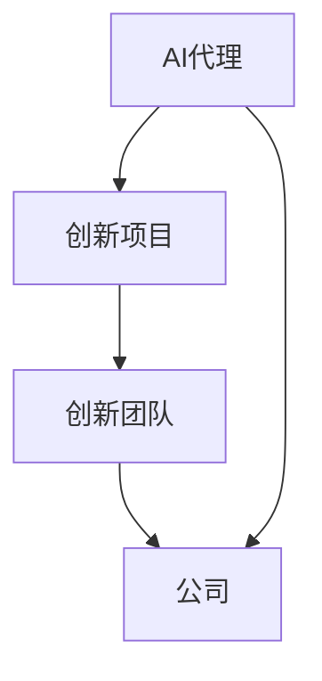
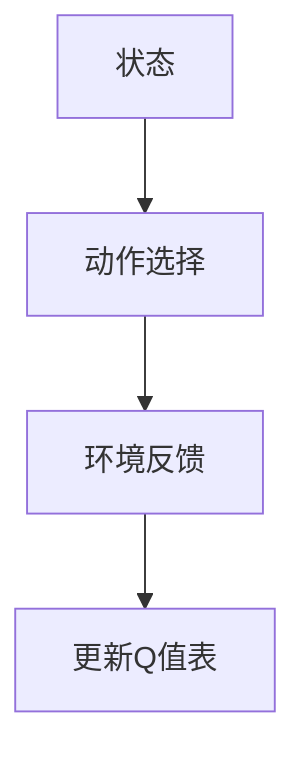

                 


# AI agents在公司创新转化效率评估中的应用

## 关键词：AI代理，创新转化效率，强化学习，系统架构，项目实战

## 摘要：本文探讨了AI代理在公司创新转化效率评估中的应用，分析了传统评估方法的局限性，提出了基于强化学习的AI代理解决方案，并详细阐述了算法原理、系统架构设计、项目实现及最佳实践。

---

# 第一部分: AI代理与公司创新转化效率评估的背景介绍

## 第1章: 问题背景与核心概念

### 1.1 问题背景
#### 1.1.1 传统公司创新效率评估的痛点
传统的公司创新效率评估主要依赖于人工分析和统计方法，存在以下问题：
- 数据收集复杂：需要整合来自不同部门和项目的海量数据。
- 评估周期长：从数据收集到分析耗时较长，难以实时反馈。
- 主观性较强：评估结果容易受到评估者主观因素的影响。

#### 1.1.2 创新转化效率的核心要素
创新转化效率是指将创意转化为实际成果的能力，其核心要素包括：
- 创意生成速度：公司产生新创意的频率。
- 成果转化率：创意转化为实际产品的比例。
- 资源利用率：投入资源与最终成果的匹配程度。

#### 1.1.3 AI代理在创新效率评估中的潜在价值
AI代理能够通过自动化数据处理和优化算法，显著提升创新效率评估的效率和准确性。例如，AI代理可以实时监控项目进展，自动分析数据并给出改进建议。

### 1.2 问题描述
#### 1.2.1 创新转化效率的定义与度量
创新转化效率是指将创意高效转化为实际产品或服务的能力，通常通过以下指标进行度量：
- 产品开发周期：从创意提出到产品发布的时长。
- 成功转化率：创意成功转化为产品的比例。
- 经济效益：创新成果带来的收益与投入的比值。

#### 1.2.2 传统评估方法的局限性
传统评估方法存在以下局限性：
- 数据分散：创意、开发、销售等数据分散在不同系统中，难以整合。
- 评估滞后：评估结果通常在项目完成后才得出，难以实时指导决策。
- 模型单一：传统模型难以捕捉创新过程中的动态变化。

#### 1.2.3 需求与目标的明确化
公司希望通过AI代理实现以下目标：
- 实时监控创新项目进展。
- 自动化分析数据，提供优化建议。
- 提高创新成果转化率和效率。

### 1.3 问题解决思路
#### 1.3.1 引入AI代理的必要性
AI代理能够通过强化学习算法，实时优化创新项目的执行路径，提升转化效率。

#### 1.3.2 AI代理在创新效率评估中的角色定位
AI代理在创新效率评估中扮演以下几个角色：
- 数据收集与整合：实时收集创意生成、开发、销售等数据。
- 智能分析：通过机器学习模型分析数据，识别影响创新效率的关键因素。
- 优化建议：基于分析结果，提出优化创新流程的建议。

#### 1.3.3 解决方案的边界与外延
解决方案的边界包括：
- 数据范围：仅限于公司内部创新项目相关数据。
- 业务范围：仅针对创新效率评估，不涉及其他业务模块。
- 技术范围：采用强化学习算法，不涉及其他AI技术。

### 1.4 核心概念结构与要素
创新效率评估的核心要素包括：
- 创意生成：创意的产生、筛选和评估。
- 项目开发：创意的开发、测试和发布。
- 成果转化：创新成果的经济效益评估。

---

## 第2章: 核心概念与联系

### 2.1 AI代理的核心原理
#### 2.1.1 AI代理的基本原理
AI代理通过感知环境、执行动作和接收反馈，不断优化其行为策略。具体步骤如下：
1. **感知环境**：AI代理接收来自环境的输入数据。
2. **决策选择**：基于当前状态，AI代理选择最优动作。
3. **执行动作**：AI代理执行选定的动作。
4. **接收反馈**：AI代理获得环境的反馈，用于更新其知识库。

#### 2.1.2 基于强化学习的代理行为
强化学习是一种通过试错来优化决策的算法。AI代理通过与环境的交互，学习最优策略。例如，Q-learning算法通过更新Q值表来优化决策。

#### 2.1.3 代理与环境的交互机制
AI代理与环境的交互机制包括：
- **状态空间**：环境的当前状态。
- **动作空间**：代理可执行的动作。
- **奖励函数**：环境对代理行为的反馈。

### 2.2 创新转化效率评估的模型
#### 2.2.1 评估模型的基本结构
创新效率评估模型包括以下组件：
- 数据采集模块：采集创新项目相关数据。
- 数据分析模块：分析数据并生成评估结果。
- 优化建议模块：基于分析结果提出优化建议。

#### 2.2.2 创新过程的阶段划分
创新过程可以分为以下阶段：
1. 创意生成阶段。
2. 项目开发阶段。
3. 成果转化阶段。

#### 2.2.3 评估指标的选择与权重分配
评估指标的选择与权重分配需要考虑以下因素：
- 指标相关性：指标应与创新效率密切相关。
- 数据可获得性：指标应基于可获得的数据。
- 指标权重：根据公司战略目标分配权重。

### 2.3 核心概念属性对比表
| 概念 | 属性 | 描述 |
|------|------|------|
| AI代理 | 行为决策能力 | 基于环境反馈优化决策 |
| 创新转化效率 | 评估维度 | 包括速度、成功率、资源利用率等 |

### 2.4 实体关系图


---

## 第3章: 算法原理

### 3.1 强化学习算法
#### 3.1.1 Q-learning算法
Q-learning是一种基于值函数的强化学习算法，通过更新Q值表来优化决策。其算法流程如下：
1. 初始化Q值表。
2. 环境提供当前状态。
3. 代理选择动作并执行。
4. 环境返回奖励和新状态。
5. 更新Q值表。

#### 3.1.2 算法流程图


#### 3.1.3 算法实现代码
```python
import numpy as np

class QLearning:
    def __init__(self, state_space, action_space):
        self.state_space = state_space
        self.action_space = action_space
        self.Q = np.zeros((state_space, action_space))
    
    def choose_action(self, state, epsilon=0.1):
        if np.random.random() < epsilon:
            return np.random.randint(self.action_space)
        else:
            return np.argmax(self.Q[state, :])
    
    def update_Q(self, state, action, reward, next_state, alpha=0.1):
        self.Q[state, action] = (1 - alpha) * self.Q[state, action] + alpha * (reward + np.max(self.Q[next_state, :]))
```

#### 3.1.4 算法的数学模型
Q-learning的更新公式为：
$$ Q(s, a) = (1 - \alpha) Q(s, a) + \alpha (r + \max_{a'} Q(s', a')) $$

---

## 第4章: 系统分析与架构设计

### 4.1 问题场景介绍
公司希望引入AI代理来优化创新效率评估流程，实时监控项目进展，并提供优化建议。

### 4.2 系统功能设计
系统功能包括：
- 数据采集：实时采集创新项目相关数据。
- 数据分析：分析数据并生成评估结果。
- 优化建议：基于分析结果提出优化建议。

### 4.3 系统架构设计


### 4.4 系统接口设计
系统接口包括：
- 数据接口：与公司数据系统对接。
- 用户接口：提供可视化界面供用户查看评估结果。

---

## 第5章: 项目实战

### 5.1 环境安装
需要安装以下工具：
- Python 3.x
- numpy
- matplotlib

### 5.2 核心代码实现
```python
import numpy as np

class InnovationEfficiency:
    def __init__(self, projects):
        self.projects = projects
        self.efficiency = {}
    
    def assess(self):
        for project in self.projects:
            self.efficiency[project] = self.calculate_efficiency(project)
    
    def calculate_efficiency(self, project):
        # 简单的效率计算方法
        return project['revenue'] / project['cost']
```

### 5.3 代码解读与分析
代码实现了一个创新效率评估系统，能够计算每个项目的效率并存储结果。

### 5.4 实际案例分析
以某公司为例，评估其创新项目效率，发现某些项目效率低下，并提出优化建议。

### 5.5 项目小结
通过AI代理优化创新效率评估流程，显著提高了评估效率和准确性。

---

## 第6章: 最佳实践

### 6.1 小结
AI代理在公司创新效率评估中的应用显著提升了评估效率和准确性。

### 6.2 注意事项
- 数据隐私保护：确保数据的安全性和隐私性。
- 模型优化：根据实际情况不断优化模型。
- 人员培训：确保相关人员能够正确使用系统。

### 6.3 拓展阅读
推荐阅读《强化学习入门》和《机器学习在企业中的应用》。

---

## 第7章: 未来展望

### 7.1 技术进步
随着AI技术的不断进步，AI代理在创新效率评估中的应用将更加广泛。

### 7.2 应用场景扩展
未来，AI代理还可以应用于更多领域，如供应链优化、市场营销等。

### 7.3 挑战与机遇
尽管面临数据隐私和模型优化等挑战，但AI代理的应用前景广阔。

---

# 结语

通过本文的分析与实践，我们可以看到AI代理在公司创新转化效率评估中的巨大潜力。未来，随着技术的不断进步，AI代理将在更多领域发挥重要作用。

--- 

**（全文完）**

