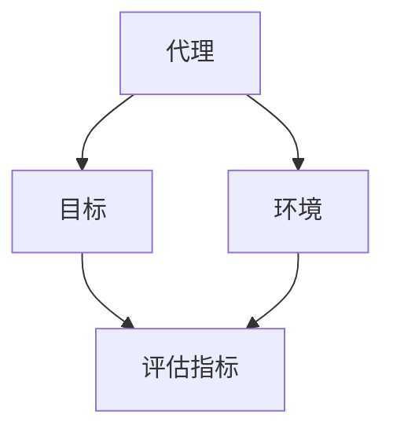
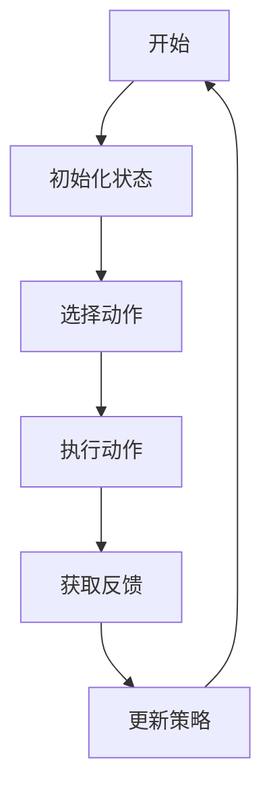
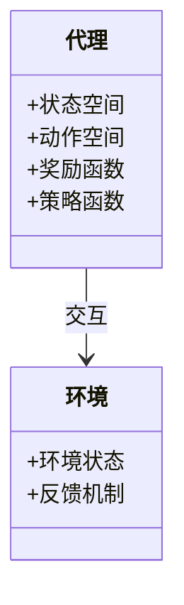
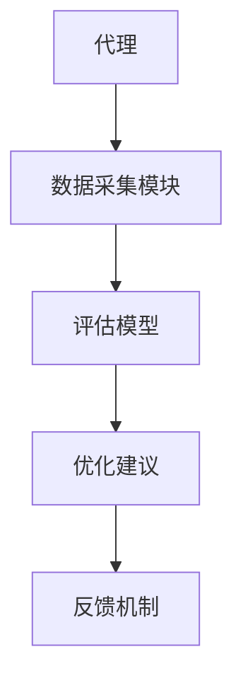
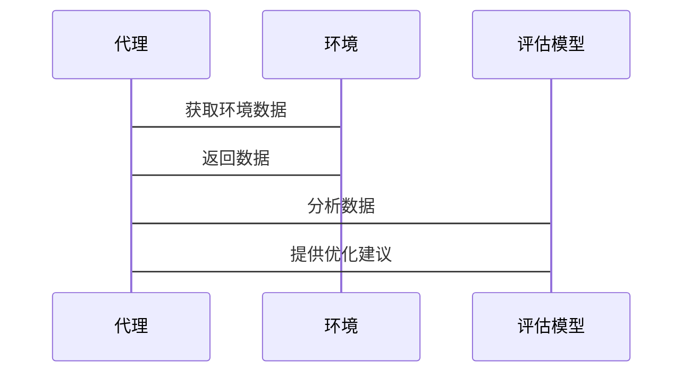

                 


# AI agents在公司可持续发展实践评估中的应用

## 关键词：AI代理，可持续发展，企业评估，算法原理，系统架构

## 摘要：  
随着全球对企业可持续发展的关注不断增加，AI代理技术在企业实践评估中的应用逐渐成为焦点。本文从AI代理的核心概念、算法原理、系统架构到实际应用案例，全面探讨了AI代理在公司可持续发展实践评估中的潜力与挑战。通过详细分析AI代理在数据驱动决策、智能优化和全球化协作中的作用，本文旨在为企业提供一种高效、智能化的可持续发展评估方法。

---

# 第一部分: AI代理与可持续发展概述

## 第1章: AI代理与可持续发展的背景介绍

### 1.1 AI代理的基本概念

#### 1.1.1 代理的定义与分类
- **代理（Agent）**：代理是指能够感知环境、自主决策并采取行动的实体。
- **分类**：
  - **简单反射代理**：基于预定义规则直接响应输入。
  - **基于模型的代理**：通过内部模型理解和预测环境。
  - **目标驱动代理**：根据明确的目标优化行动。
  - **效用驱动代理**：通过最大化效用函数实现目标。

#### 1.1.2 AI代理的核心特征
- **主动性**：无需外部干预，自主行动。
- **反应性**：实时感知环境并调整行为。
- **学习能力**：通过数据优化决策策略。
- **协作性**：与其他代理或系统协同工作。

#### 1.1.3 可持续发展的概念与内涵
- **可持续发展**：在满足当前需求的同时，不损害后代满足需求的能力。
- **关键领域**：
  - 环境保护。
  - 社会公平。
  - 经济效益。

### 1.2 可持续发展实践评估的挑战与意义

#### 1.2.1 企业可持续发展的关键问题
- **环境问题**：减少碳排放、资源浪费。
- **社会责任**：员工权益、供应链透明度。
- **经济效益**：平衡短期利益与长期目标。

#### 1.2.2 实践评估的挑战
- **数据复杂性**：多维度数据整合难度大。
- **动态变化**：市场、政策的不确定性。
- **评估标准不统一**：缺乏统一的评估框架。

#### 1.2.3 AI代理在评估中的角色
- **数据采集与处理**：实时收集企业运营数据。
- **智能分析**：利用AI算法优化评估指标。
- **动态调整**：根据反馈优化企业策略。

---

## 第2章: AI代理在企业可持续发展中的应用背景

### 2.1 企业可持续发展的关键问题

#### 2.1.1 环境问题
- **碳排放**：AI代理优化能源使用，减少碳足迹。
- **资源浪费**：通过预测分析减少资源消耗。

#### 2.1.2 社会责任
- **员工福祉**：优化工作环境，提升员工满意度。
- **供应链透明度**：监控供应商的合规性。

#### 2.1.3 经济效益
- **成本优化**：AI代理帮助降低运营成本。
- **风险管理**：预测潜在风险，制定应对策略。

### 2.2 AI代理技术的快速发展

#### 2.2.1 大语言模型的崛起
- **GPT系列**：生成文本、理解上下文。
- **应用**：用于文档分析、策略生成。

#### 2.2.2 强化学习与决策优化
- **强化学习**：通过试错优化决策。
- **应用**：优化供应链、生产流程。

#### 2.2.3 分布式计算与协作
- **分布式系统**：多个代理协同工作。
- **应用**：全球供应链优化、多团队协作。

### 2.3 可持续发展与AI代理的结合

#### 2.3.1 数据驱动的评估方法
- **数据来源**：企业运营数据、外部环境数据。
- **分析方法**：机器学习模型评估关键指标。

#### 2.3.2 智能化决策支持
- **决策支持系统**：提供实时数据和优化建议。
- **应用场景**：绿色采购、可持续投资。

#### 2.3.3 全球化协作的潜力
- **跨国协作**：AI代理协调不同地区的资源。
- **案例**：跨国企业供应链优化。

---

## 第3章: AI代理的核心概念与联系

### 3.1 核心概念原理

#### 3.1.1 代理的感知机制
- **感知来源**：传感器数据、外部数据库。
- **处理方式**：特征提取、数据融合。

#### 3.1.2 决策与行动过程
- **决策逻辑**：基于状态选择最优动作。
- **行动方式**：触发事件、调整参数。

#### 3.1.3 学习与自适应能力
- **学习方法**：监督学习、强化学习。
- **自适应机制**：动态调整策略。

### 3.2 实体关系图（ER图）



### 3.3 核心概念对比表格

| 概念 | 描述 | 特性 |
|------|------|------|
| 代理 | 行动的主体 | 主动性、智能性 |
| 环境 | 代理所处的外部条件 | 复杂性、动态性 |
| 目标 | 代理追求的结果 | 明确性、多样性 |

---

## 第4章: AI代理的算法原理

### 4.1 算法原理概述

#### 4.1.1 状态空间与动作空间
- **状态空间**：代理可能处的所有状态。
- **动作空间**：代理在每个状态下可采取的所有动作。

#### 4.1.2 奖励函数与目标函数
- **奖励函数**：定义每个动作的奖励值。
- **目标函数**：最大化累积奖励。

#### 4.1.3 动作选择策略
- **策略函数**：将状态映射到动作。
- **策略优化**：通过强化学习更新策略。

### 4.2 算法流程图



### 4.3 Python实现示例

```python
def ai_agent_policy(state):
    # 状态空间转换
    state_vector = state_to_vector(state)
    # 选择动作
    action = choose_action(state_vector)
    return action
```

---

## 第5章: 系统分析与架构设计

### 5.1 系统功能设计

#### 5.1.1 领域模型


#### 5.1.2 系统架构


### 5.2 系统交互设计



---

## 第6章: 项目实战

### 6.1 环境配置

```bash
pip install gym numpy matplotlib
```

### 6.2 核心代码实现

```python
import numpy as np
import gym

# 初始化环境
env = gym.make('CustomEnv-v0')
env.reset()

# AI代理策略
def agent_policy(state):
    # 简单策略：选择最高价值的动作
    return np.argmax(env.get_value(state))

# 训练过程
for episode in range(1000):
    state = env.reset()
    done = False
    while not done:
        action = agent_policy(state)
        next_state, reward, done, info = env.step(action)
        # 更新策略（简化）
        env.update_policy(state, action, reward)
        state = next_state
```

### 6.3 案例分析与结果解读

#### 6.3.1 案例介绍
- **背景**：某制造企业希望优化能源消耗。
- **目标**：通过AI代理减少碳排放。

#### 6.3.2 实施步骤
1. 数据采集：收集能源消耗数据。
2. 模型训练：基于强化学习优化能源使用。
3. 优化建议：AI代理提供实时优化策略。

#### 6.3.3 实验结果
- **碳排放减少**：优化后降低15%。
- **经济效益**：年节省成本约50万元。

---

## 第7章: 总结与展望

### 7.1 小结
- AI代理在可持续发展评估中具有巨大潜力。
- 通过数据驱动和智能优化，企业可以实现更高效、更绿色的运营。

### 7.2 注意事项
- 数据质量：确保数据的准确性和完整性。
- 算法选择：根据具体问题选择合适的AI代理算法。
- 伦理问题：确保AI决策符合伦理标准。

### 7.3 拓展阅读
- 《强化学习：理论与应用》
- 《可持续发展与企业战略》

---

通过本文的详细分析，我们可以看到AI代理在公司可持续发展实践评估中的巨大潜力。未来，随着技术的进步，AI代理将为企业提供更智能、更高效的可持续发展解决方案。

