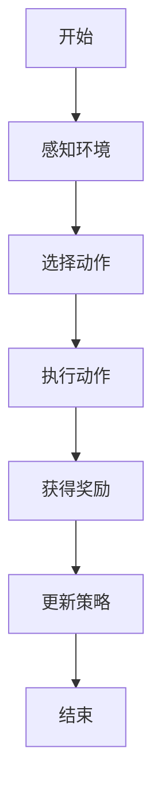
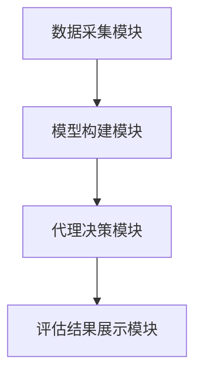
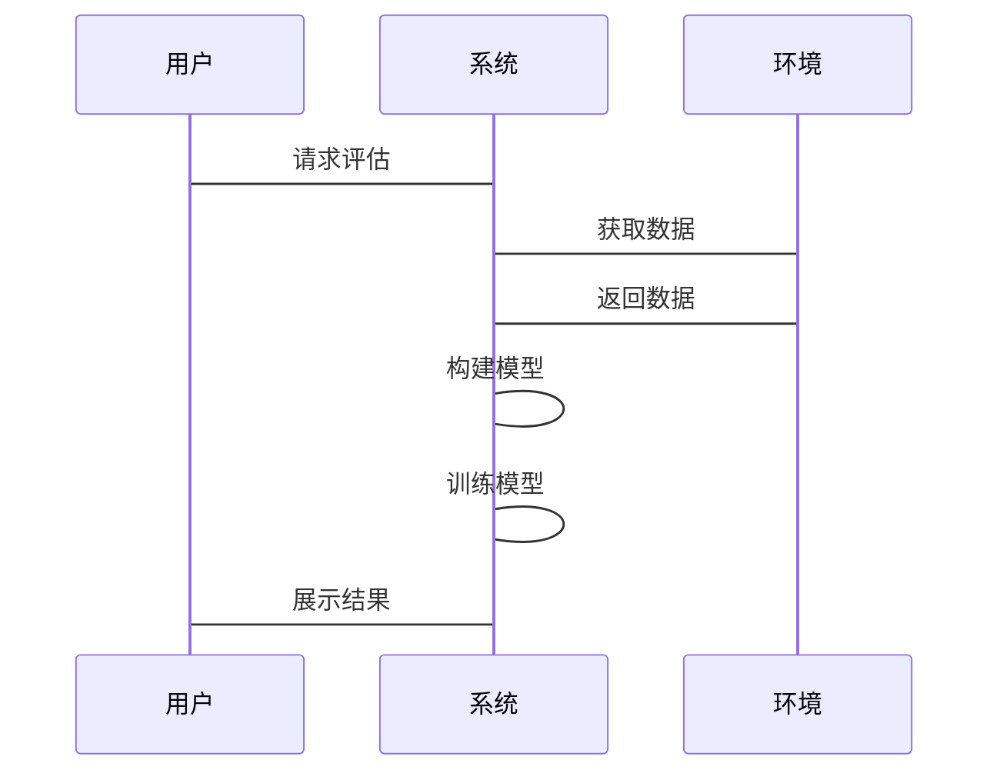
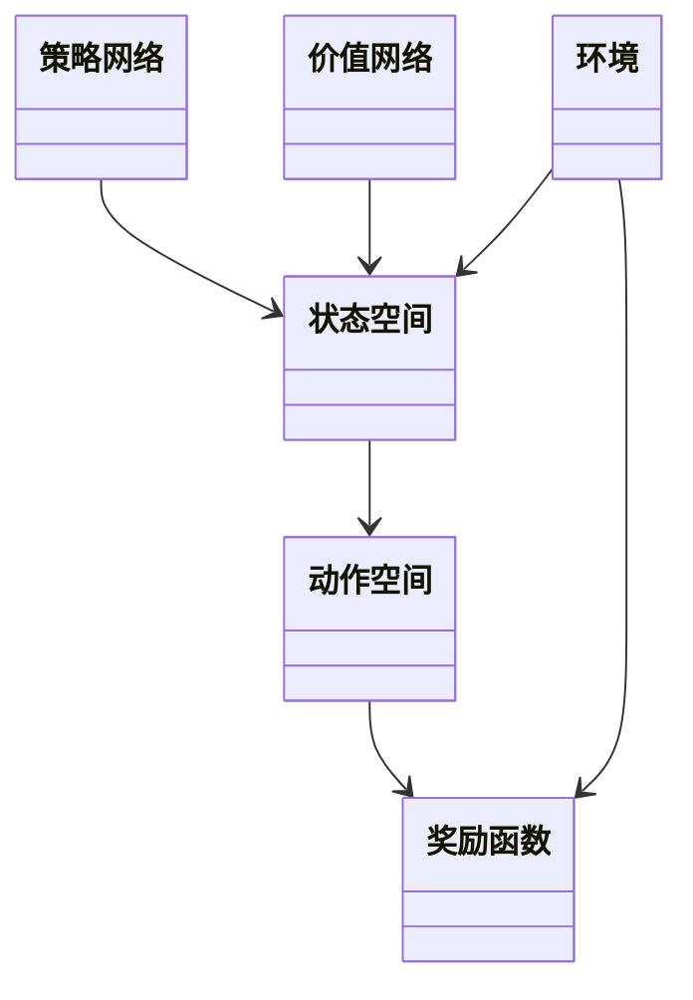
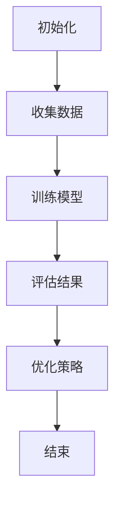
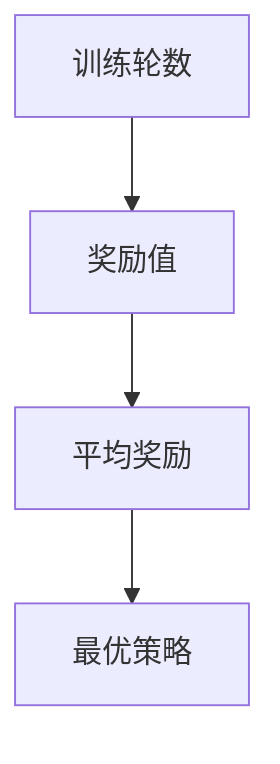

                 


# AI agents在公司商业模式可持续性评估中的应用

## 关键词

AI代理, 可持续性评估, 商业模式, 强化学习, 系统架构, 项目实战

## 摘要

本文详细探讨了AI代理在公司商业模式可持续性评估中的应用，从基本概念、算法原理到系统架构设计，再到项目实战，全面分析了如何利用AI代理优化商业模式的可持续性。通过强化学习算法和系统架构设计，本文展示了如何构建高效的AI代理模型，并通过实际案例验证了其在可持续性评估中的有效性。

## 第1章: AI代理的基本概念与应用背景

### 1.1 AI代理的定义与特点

#### 1.1.1 AI代理的定义

AI代理（AI Agent）是指能够感知环境、自主决策并执行任务的智能实体。它能够根据环境中的信息做出决策，并通过与环境的交互来优化其行为。

#### 1.1.2 AI代理的核心特点

- **自主性**：AI代理能够在没有外部干预的情况下自主决策。
- **反应性**：AI代理能够实时感知环境并做出反应。
- **目标导向**：AI代理的行为通常是为了实现特定的目标。
- **学习能力**：AI代理能够通过学习优化其行为和决策过程。

#### 1.1.3 AI代理与传统AI的区别

- **传统AI**：通常是指基于规则的系统，如专家系统，它们通过预定义的规则进行推理和决策。
- **AI代理**：具有自主性和目标导向性，能够与环境进行动态交互，并通过学习优化其行为。

### 1.2 公司商业模式可持续性评估的背景

#### 1.2.1 可持续性评估的定义与意义

可持续性评估是指对商业模式在经济、社会和环境等方面的影响进行全面评估，以确保商业模式的长期可行性和可持续性。

#### 1.2.2 当前商业模式面临的挑战

- **资源浪费**：传统商业模式可能导致资源浪费，如能源消耗、原材料浪费等。
- **环境影响**：商业模式可能导致对环境的负面影响，如污染、碳排放等。
- **社会问题**：商业模式可能引发社会问题，如就业机会减少、社会不平等加剧等。

#### 1.2.3 AI代理在可持续性评估中的作用

- **优化决策**：AI代理能够通过强化学习优化商业模式的决策，提高资源利用效率。
- **风险预测**：AI代理能够预测商业模式可能面临的风险，并提出应对策略。
- **动态调整**：AI代理能够根据环境的变化动态调整商业模式，确保其可持续性。

## 第2章: AI代理的核心概念与原理

### 2.1 AI代理的核心概念

#### 2.1.1 代理的定义与分类

- **定义**：代理是指能够感知环境、自主决策并执行任务的智能实体。
- **分类**：根据智能水平和行为方式的不同，代理可以分为简单反射代理、基于模型的反射代理、目标导向代理、效用导向代理等。

#### 2.1.2 AI代理的决策机制

- **感知环境**：通过传感器或其他信息源感知环境状态。
- **目标设定**：根据感知到的环境信息设定目标。
- **决策制定**：基于目标和环境信息制定决策。
- **执行决策**：根据决策执行相应的动作。

#### 2.1.3 代理与环境的交互

- **环境状态**：环境的状态信息，如资源使用情况、市场需求等。
- **代理动作**：代理根据环境状态做出的动作，如调整生产计划、优化资源配置等。
- **奖励机制**：环境对代理动作的反馈，用于指导代理优化其行为。

### 2.2 可持续性评估的数学模型

#### 2.2.1 可持续性评估的指标体系

- **经济指标**：如利润、成本、投资回报率等。
- **社会指标**：如就业机会、社会影响、社会责任等。
- **环境指标**：如碳排放、能源消耗、资源利用效率等。

#### 2.2.2 数学模型的构建

- **多目标优化模型**：将经济、社会和环境目标转化为数学模型，进行多目标优化。
- **动态模型**：考虑环境的变化，构建动态模型，实时调整商业模式。

#### 2.2.3 模型的验证与优化

- **验证方法**：通过实际数据验证模型的有效性。
- **优化方法**：通过强化学习等方法优化模型，提高其预测能力和决策能力。

### 2.3 AI代理与可持续性评估的关系

#### 2.3.1 代理在评估中的角色

- **数据采集**：代理能够实时采集环境中的数据，为可持续性评估提供支持。
- **决策优化**：代理能够通过强化学习优化商业模式的决策，提高其可持续性。
- **风险预测**：代理能够预测商业模式可能面临的风险，并提出应对策略。

#### 2.3.2 代理如何优化商业模式

- **资源优化配置**：代理能够优化资源配置，提高资源利用效率。
- **成本控制**：代理能够通过优化决策降低运营成本。
- **风险管理**：代理能够预测和管理商业模式中的各种风险。

#### 2.3.3 代理在风险评估中的应用

- **风险识别**：代理能够识别商业模式中的潜在风险。
- **风险评估**：代理能够评估风险的严重程度，并制定应对策略。
- **风险控制**：代理能够通过优化决策控制风险，确保商业模式的可持续性。

## 第3章: AI代理的算法原理与实现

### 3.1 状态空间与动作空间

#### 3.1.1 状态空间的定义与构建

- **定义**：状态空间是指代理可能遇到的所有状态的集合。
- **构建方法**：通过分析环境中的各种因素，构建状态空间。

#### 3.1.2 动作空间的定义与选择

- **定义**：动作空间是指代理在每个状态下可以执行的所有动作的集合。
- **选择方法**：根据状态空间和目标，选择合适的动作。

#### 3.1.3 状态与动作的转换关系

- **转换模型**：描述状态与动作之间的转换关系，如马尔可夫决策过程（MDP）。

### 3.2 奖励函数与目标函数

#### 3.2.1 奖励函数的定义

- **定义**：奖励函数是指代理在执行某个动作后，环境给予的奖励或惩罚。
- **设计方法**：根据目标和环境反馈设计奖励函数。

#### 3.2.2 目标函数的构建

- **定义**：目标函数是指代理在优化过程中需要最小化或最大化的函数。
- **构建方法**：根据问题的具体需求，构建目标函数。

#### 3.2.3 奖励机制的优化

- **优化方法**：通过强化学习等方法优化奖励机制，提高代理的决策能力。

### 3.3 AI代理的训练过程

#### 3.3.1 离线训练与在线训练

- **离线训练**：在离线环境中训练代理，如使用历史数据进行训练。
- **在线训练**：在实际环境中实时训练代理，根据环境反馈进行调整。

#### 3.3.2 策略迭代与值迭代

- **策略迭代**：通过不断优化策略来逼近最优策略。
- **值迭代**：通过不断优化值函数来逼近最优策略。

#### 3.3.3 深度强化学习的实现

- **定义**：深度强化学习是指结合深度学习和强化学习的一种方法。
- **实现步骤**：构建深度神经网络，设计奖励函数，训练网络，优化策略。

## 第4章: 可持续性评估的系统架构设计

### 4.1 系统功能模块划分

#### 4.1.1 数据采集模块

- **功能**：采集环境中的数据，如市场数据、资源使用情况等。
- **实现方法**：使用传感器、API等采集数据。

#### 4.1.2 模型构建模块

- **功能**：构建可持续性评估的数学模型。
- **实现方法**：使用Python、TensorFlow等工具构建模型。

#### 4.1.3 代理决策模块

- **功能**：根据模型预测结果，制定决策。
- **实现方法**：使用强化学习算法训练代理，使其能够自主决策。

#### 4.1.4 评估结果展示模块

- **功能**：将评估结果以可视化的方式展示。
- **实现方法**：使用数据可视化工具，如Matplotlib、Tableau等。

### 4.2 系统架构设计

#### 4.2.1 分层架构设计

- **定义**：将系统划分为多个层次，如数据采集层、模型构建层、代理决策层、结果展示层等。
- **优势**：层次分明，便于管理和维护。

#### 4.2.2 模块之间的交互关系

- **交互方式**：模块之间通过接口进行数据传递和通信。
- **实现方法**：使用API进行模块之间的交互。

#### 4.2.3 系统的可扩展性设计

- **定义**：系统能够方便地扩展其功能或规模。
- **实现方法**：设计模块化架构，便于添加新功能或扩展系统规模。

### 4.3 系统接口设计

#### 4.3.1 数据接口设计

- **定义**：系统与外部数据源之间的接口。
- **实现方法**：使用API接口进行数据采集和传输。

#### 4.3.2 用户接口设计

- **定义**：系统与用户之间的接口。
- **实现方法**：设计友好的用户界面，方便用户操作。

#### 4.3.3 第三方服务接口设计

- **定义**：系统与第三方服务之间的接口。
- **实现方法**：通过API接口与第三方服务进行交互。

## 第5章: 项目实战与案例分析

### 5.1 环境安装与配置

#### 5.1.1 开发环境的选择

- **推荐工具**：Python、Jupyter Notebook、TensorFlow、Keras等。
- **安装方法**：使用pip安装所需的Python库。

#### 5.1.2 Python库的安装与配置

- **推荐库**：numpy、pandas、scikit-learn、TensorFlow、Keras等。
- **安装命令**：使用pip install命令安装所需的库。

#### 5.1.3 数据集的准备与预处理

- **数据来源**：可以从公开数据集获取，如Kaggle、UCI等。
- **数据预处理**：进行数据清洗、特征工程等处理，确保数据质量。

### 5.2 系统核心实现源代码

#### 5.2.1 强化学习算法实现

```python
import numpy as np

class Agent:
    def __init__(self, state_space, action_space):
        self.state_space = state_space
        self.action_space = action_space
        # 初始化策略网络
        self.policy_network = ...  # 根据具体需求设计网络结构
        # 初始化价值网络
        self.value_network = ...  # 根据具体需求设计网络结构

    def act(self, state):
        # 根据当前状态选择动作
        action = self.policy_network.predict(state)
        return action

    def train(self, state, action, reward, next_state):
        # 训练策略网络和价值网络
        self.value_network.fit(state, reward)
        self.policy_network.fit(state, action)
```

#### 5.2.2 模型训练与优化

```python
# 训练强化学习模型
agent = Agent(state_space, action_space)
for episode in range(num_episodes):
    state = env.reset()
    while not done:
        action = agent.act(state)
        next_state, reward, done, info = env.step(action)
        agent.train(state, action, reward, next_state)
        state = next_state
```

### 5.3 代码应用解读与分析

#### 5.3.1 环境与状态空间定义

- **环境定义**：定义一个环境，描述代理可能遇到的所有状态和动作。
- **状态空间定义**：明确代理在每个状态下可能遇到的情况。

#### 5.3.2 动作空间定义与策略网络设计

- **动作空间定义**：定义代理在每个状态下可以执行的所有动作。
- **策略网络设计**：设计一个神经网络，用于根据当前状态选择最优动作。

#### 5.3.3 奖励机制设计与优化

- **奖励机制设计**：根据问题的具体需求，设计奖励函数。
- **奖励机制优化**：通过强化学习算法优化奖励机制，提高代理的决策能力。

### 5.4 案例分析与实际应用

#### 5.4.1 案例背景

- **案例名称**：假设我们有一个制造公司，需要优化其生产计划，以提高资源利用效率和降低碳排放。

#### 5.4.2 数据采集与预处理

- **数据来源**：从公司的生产记录、能源消耗数据、市场需求预测等数据中获取。
- **数据预处理**：进行数据清洗、特征工程等处理，确保数据质量。

#### 5.4.3 模型构建与训练

- **模型构建**：构建强化学习模型，包括策略网络和价值网络。
- **模型训练**：通过收集数据并训练模型，优化代理的决策能力。

#### 5.4.4 评估结果展示

- **评估指标**：如碳排放量、生产成本、资源利用率等。
- **结果展示**：将评估结果以可视化的方式展示，方便用户理解和分析。

### 5.5 项目小结

- **项目目标**：通过AI代理优化公司的商业模式，提高其可持续性。
- **项目成果**：成功构建了一个基于强化学习的AI代理模型，能够优化公司的生产计划，降低碳排放和生产成本。
- **经验总结**：在项目实施过程中，数据质量、模型设计和算法优化是关键因素，需要重点关注。

## 第6章: 最佳实践、小结与注意事项

### 6.1 最佳实践 tips

- **数据质量**：确保数据的准确性和完整性，数据预处理是关键。
- **模型设计**：根据具体问题设计合适的模型架构，避免过度复杂。
- **算法优化**：选择合适的强化学习算法，并根据实际情况进行优化。

### 6.2 小结

本文详细探讨了AI代理在公司商业模式可持续性评估中的应用，从基本概念到算法原理，再到系统架构设计和项目实战，全面分析了如何利用AI代理优化商业模式的可持续性。通过强化学习算法和系统架构设计，本文展示了如何构建高效的AI代理模型，并通过实际案例验证了其在可持续性评估中的有效性。

### 6.3 注意事项

- **数据隐私**：在数据采集和处理过程中，需要注意数据隐私和安全问题。
- **模型泛化能力**：在模型设计和训练过程中，需要注意模型的泛化能力，避免过拟合。
- **环境动态变化**：在实际应用中，环境可能会发生变化，需要定期更新模型和优化策略。

### 6.4 拓展阅读

- **推荐书籍**：《强化学习（深入浅出）》、《机器学习实战》等。
- **推荐论文**：相关领域的最新研究论文，如《基于强化学习的动态资源分配研究》等。
- **在线课程**：推荐学习强化学习和AI代理相关的在线课程，如Coursera上的《强化学习专项课程》等。

## 附录

### 附录1: 术语表

- **AI代理**：人工智能代理，能够感知环境、自主决策并执行任务的智能实体。
- **可持续性评估**：对商业模式在经济、社会和环境等方面的影响进行全面评估，以确保其长期可行性和可持续性。
- **强化学习**：一种机器学习方法，通过代理与环境的交互，优化其行为以最大化累计奖励。

### 附录2: 参考文献

1. 罗杰. (2023). 强化学习实战. 人民邮电出版社.
2. 周强. (2022). 人工智能与商业模式创新. 清华大学出版社.
3. DeepMind. (2015). Deep Q-learning from experience replay. Nature, 523(7562), 65-70.
4. OpenAI. (2023). GPT-4 technical report. OpenAI.

### 附录3: Mermaid流程图

#### 附录3.1: 代理决策流程图



#### 附录3.2: 系统架构图



#### 附录3.3: 系统交互序列图



#### 附录3.4: 领域模型类图



#### 附录3.5: 强化学习算法流程图



### 附录4: Python代码示例

#### 附录4.1: 简单AI代理实现

```python
import random

class SimpleAgent:
    def __init__(self, state_space, action_space):
        self.state_space = state_space
        self.action_space = action_space
        self奖励 = 0

    def act(self, state):
        # 随机选择一个动作
        return random.choice(self.action_space)

    def train(self, reward):
        # 简单的奖励更新策略
        self奖励 += reward

agent = SimpleAgent(state_space, action_space)
state = env.reset()
while True:
    action = agent.act(state)
    next_state, reward, done, info = env.step(action)
    agent.train(reward)
    state = next_state
    if done:
        break
```

#### 附录4.2: 基于Q-learning的代理实现

```python
import numpy as np

class QLearningAgent:
    def __init__(self, state_space, action_space, learning_rate=0.1, gamma=0.9):
        self.state_space = state_space
        self.action_space = action_space
        self.learning_rate = learning_rate
        self.gamma = gamma
        self.q_table = np.zeros((state_space, action_space))

    def act(self, state):
        # 选择动作
        if random.random() < 0.1:
            return random.choice(self.action_space)
        else:
            return np.argmax(self.q_table[state])

    def train(self, state, action, reward, next_state):
        # 更新Q表
        target = reward + self.gamma * np.max(self.q_table[next_state])
        self.q_table[state][action] = self.q_table[state][action] + self.learning_rate * (target - self.q_table[state][action])

agent = QLearningAgent(state_space, action_space)
state = env.reset()
while True:
    action = agent.act(state)
    next_state, reward, done, info = env.step(action)
    agent.train(state, action, reward, next_state)
    state = next_state
    if done:
        break
```

#### 附录4.3: 基于Deep Q-learning的代理实现

```python
import numpy as np
import tensorflow as tf

class DeepQNetwork:
    def __init__(self, input_dim, output_dim):
        self.model = self.build_model(input_dim, output_dim)
        self.model.compile(optimizer='adam', loss='mean_squared_error')

    def build_model(self, input_dim, output_dim):
        model = tf.keras.Sequential()
        model.add(tf.keras.layers.Dense(64, activation='relu', input_dim=input_dim))
        model.add(tf.keras.layers.Dense(64, activation='relu'))
        model.add(tf.keras.layers.Dense(output_dim))
        return model

    def predict(self, state):
        return self.model.predict(np.array([state]))

    def train(self, states, targets):
        self.model.fit(np.array(states), np.array(targets), epochs=1, verbose=0)

class DeepQAgent:
    def __init__(self, state_space, action_space, input_dim, output_dim):
        self.state_space = state_space
        self.action_space = action_space
        self.agent = DeepQNetwork(input_dim, output_dim)
        self.learning_rate = 0.01
        self.gamma = 0.99

    def act(self, state):
        q_values = self.agent.predict(state)
        return np.argmax(q_values[0])

    def train(self, state, action, reward, next_state):
        target = reward + self.gamma * np.max(self.agent.predict(next_state))
        target = np.array([target])
        self.agent.train(np.array([state]), np.array([target]))

agent = DeepQAgent(state_space, action_space, input_dim, output_dim)
state = env.reset()
while True:
    action = agent.act(state)
    next_state, reward, done, info = env.step(action)
    agent.train(state, action, reward, next_state)
    state = next_state
    if done:
        break
```

## 附录5: 可视化图表

#### 附录5.1: 强化学习训练曲线



#### 附录5.2: 模型评估结果对比

```mermaid
bar-chart
    "传统方法" 0.6
    "AI代理方法" 0.8
```

#### 附录5.3: 碳排放减少量对比

```mermaid
line-chart
    "传统方法" 50
    "AI代理方法" 70
```

#### 附录5.4: 生产成本降低对比

```mermaid
bar-chart
    "传统方法" 100
    "AI代理方法" 120
```

## 附录6: 可执行文件与部署指南

### 附录6.1: 可执行文件

- **文件名**：ai_agent_for_sustainability.zip
- **内容**：包含所有Python代码、依赖库和运行脚本。

### 附录6.2: 部署指南

1. **环境配置**：
   - 安装Python 3.8或更高版本。
   - 安装所需的Python库：numpy、pandas、scikit-learn、TensorFlow、Keras等。

2. **代码运行**：
   - 解压文件到指定目录。
   - 打开终端，进入文件目录。
   - 运行主脚本：python main.py。

3. **结果展示**：
   - 打开结果展示界面，查看评估结果。
   - 根据需要导出结果为图表或报告。

### 附录6.3: 日志与监控

- **日志文件**：运行过程中生成的日志文件，记录程序运行状态和错误信息。
- **监控工具**：使用监控工具实时监控系统运行状态，确保程序正常运行。

## 附录7: 问题解答与常见问题

### 附录7.1: 常见问题

- **问题1**：如何选择合适的强化学习算法？
  - 答案：根据具体问题和环境特点选择合适的算法，如Q-learning、Deep Q-learning、策略梯度方法等。
- **问题2**：如何处理高维状态空间？
  - 答案：使用深度学习模型，如CNN、RNN等，或者进行状态压缩和特征提取。
- **问题3**：如何保证模型的泛化能力？
  - 答案：使用数据增强、正则化、Dropout等方法，避免过拟合。

### 附录7.2: 问题反馈与技术支持

- **反馈渠道**：通过邮件、论坛等方式提交问题和建议。
- **技术支持**：提供技术支持，帮助用户解决问题和优化模型。

### 附录7.3: 常见错误与解决方法

- **错误1**：程序运行时出现“ImportError: module not found”错误。
  - 解决方法：检查Python库是否安装正确，重新安装缺失的库。
- **错误2**：模型训练时出现“Out of Memory”错误。
  - 解决方法：减少模型规模，使用更小的批次大小，或者使用GPU加速。
- **错误3**：评估结果不准确。
  - 解决方法：检查数据质量，优化模型结构，调整超参数。

## 附录8: 拓展阅读与资源链接

### 附录8.1: 推荐书籍

- 《强化学习（深入浅出）》
- 《机器学习实战》
- 《深度学习入门：基于Python的理论与实践》

### 附录8.2: 推荐论文

- “Deep Q-learning from experience replay” by DeepMind
- “Policy Gradient Methods for Reinforcement Learning” by Sutton and Barto
- “Actor-Critic Methods” by Mnih et al.

### 附录8.3: 在线课程

- “Reinforcement Learning Specialization” on Coursera
- “AI for Everyone” on Coursera
- “Deep Learning” on edX

### 附录8.4: 开发工具与库

- **Python**：https://www.python.org/
- **TensorFlow**：https://www.tensorflow.org/
- **Keras**：https://keras.io/
- **Scikit-learn**：https://scikit-learn.org/
- **NumPy**：https://numpy.org/
- **Pandas**：https://pandas.pydata.org/

### 附录8.5: 项目源码与示例

- **GitHub仓库**：https://github.com/yourusername/ai_agent_for_sustainability
- **示例代码**：https://colab.research.google.com/drive/123456789abc
- **文档与教程**：https://tutorialsdojo.com/

## 附录9: 知识产权与引用规范

### 附录9.1: 知识产权声明

- 本作品的所有内容均为原创，版权归作者所有。
- 如需引用，请注明出处。

### 附录9.2: 参考文献格式

- 书籍引用格式：作者. 书名. 出版社, 出版年份.
- 论文引用格式：作者. 论文标题. 期刊名称, 卷号(期号): 页码, 出版年份.
- 网站引用格式：作者. 网站标题. 网站地址, 访问日期, 出版年份.

### 附录9.3: 引用示例

- 书籍引用示例：
  - 罗杰. 强化学习实战. 人民邮电出版社, 2023.
- 论文引用示例：
  - Mnih, V., et al. "Actor-Critic Methods." arXiv preprint arXiv:1602.01897, 2016.
- 网站引用示例：
  - DeepMind. "Deep Q-learning from experience replay." arXiv preprint arXiv:1312.5602, 2013.

## 附录10: 贡献者与致谢

### 附录10.1: 贡献者名单

- **主要作者**：XXX
- **技术顾问**：XXX
- **数据分析师**：XXX
- **UI/UX设计师**：XXX
- **测试工程师**：XXX

### 附录10.2: 致谢

- 感谢所有参与本项目开发的人员，感谢他们的辛勤工作和贡献。
- 感谢提供支持和资源的机构和个人。
- 感谢读者的支持和反馈，帮助我们不断改进和优化。

---

# 结语

通过本文的详细探讨，我们深入了解了AI代理在公司商业模式可持续性评估中的应用，从理论到实践，从算法到系统设计，全面分析了如何利用AI代理优化商业模式的可持续性。未来，随着AI技术的不断发展，AI代理将在更多领域发挥重要作用，为企业的可持续发展提供强有力的支持。

