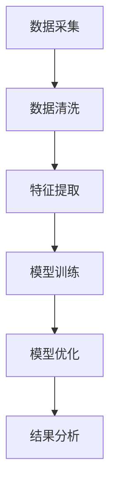
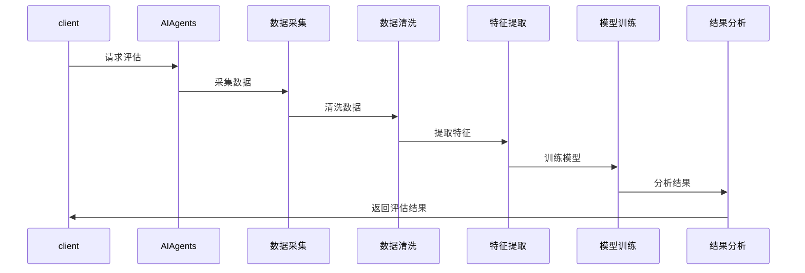

                 


# AI agents在公司无形资产价值评估中的创新应用

## 关键词：AI agents，无形资产，价值评估，算法原理，系统架构

## 摘要：本文探讨了AI agents在公司无形资产价值评估中的创新应用。通过分析AI agents的核心技术与无形资产评估的关键要素，提出了基于AI agents的评估模型，并详细阐述了算法原理、系统架构和项目实现。文章结合实际案例，展示了AI agents在提升无形资产评估效率和准确性方面的潜力。

---

## 第1章 AI agents与无形资产价值评估的背景

### 1.1 AI agents的基本概念
AI agents，即人工智能代理，是指能够感知环境、自主决策并执行任务的智能体。其核心技术包括自然语言处理（NLP）、机器学习（ML）、计算机视觉（CV）和强化学习（RL）。AI agents的特点是高度定制化、可扩展性和智能化，能够在复杂环境中完成多种任务。

### 1.2 无形资产价值评估的基本概念
无形资产是指企业拥有的非实物资产，包括专利、商标、客户关系、品牌价值等。传统评估方法通常依赖于财务数据和专家经验，但存在主观性强、效率低下的问题。AI agents的引入为无形资产评估提供了新的技术手段。

### 1.3 AI agents在无形资产评估中的应用背景
随着企业对无形资产的重视程度不断提高，传统的评估方法难以满足日益复杂的评估需求。AI agents通过自动化数据处理和智能分析，能够显著提高评估的效率和准确性。

---

## 第2章 AI agents在无形资产评估中的核心概念与联系

### 2.1 AI agents的核心概念原理
AI agents的核心机制包括感知与决策、学习与推理、自适应与优化。这些机制使其能够从数据中提取有价值的信息，并根据环境变化调整评估策略。

### 2.2 无形资产评估的核心要素分析
无形资产评估的关键要素包括生命周期、评估指标和外部环境。例如，专利的价值可能受到技术更新和市场需求的影响，而品牌价值则与客户忠诚度和市场认知度密切相关。

### 2.3 AI agents与无形资产评估的关联性分析
AI agents通过实时数据采集和智能分析，能够快速识别影响无形资产价值的关键因素。例如，AI agents可以利用社交媒体数据评估品牌声誉，从而为品牌价值评估提供数据支持。

### 2.4 核心概念属性对比表
| 核心概念 | 属性 | 描述 |
|----------|------|------|
| AI agents | 感知能力 | 数据采集与分析能力 |
| 无形资产评估 | 评估指标 | 收益、成本、市场等指标 |

### 2.5 ER实体关系图
```mermaid
erd
    entity AIAgents {
        id
       感知数据
       决策逻辑
    }
    entity InvalAssessment {
        id
       评估指标
       评估结果
    }
    AIAgents -->> InvalAssessment: 提供数据支持
```

---

## 第3章 AI agents在无形资产评估中的算法原理

### 3.1 算法原理概述
基于AI agents的评估模型通常包括数据预处理、特征提取、模型训练和结果分析四个阶段。算法的核心流程如下：

1. 数据采集：通过多种渠道（如财务报表、市场数据）获取相关数据。
2. 数据清洗：去除噪声数据，确保数据质量。
3. 特征提取：利用NLP和CV技术提取关键特征。
4. 模型训练：基于机器学习算法（如线性回归、随机森林）构建评估模型。
5. 模型优化：通过交叉验证和超参数调整提升模型性能。
6. 结果分析：输出评估结果，并提供改进建议。

### 3.2 算法实现步骤
```python
# 示例代码：基于线性回归的无形资产评估模型
import numpy as np
from sklearn.linear_model import LinearRegression

# 数据预处理
X = np.array([[1, 2], [3, 4], [5, 6]])  # 特征
y = np.array([7, 8, 9])  # 标签

# 模型训练
model = LinearRegression()
model.fit(X, y)

# 模型预测
new_X = np.array([[2, 3]])
print(model.predict(new_X))
```

### 3.3 算法流程图


---

## 第4章 系统分析与架构设计方案

### 4.1 问题场景介绍
本文设计了一个基于AI agents的无形资产评估系统，旨在通过自动化数据处理和智能分析提高评估效率。

### 4.2 系统功能设计
系统功能模块包括数据采集模块、模型训练模块、结果展示模块和报告生成模块。

### 4.3 系统架构设计


### 4.4 系统接口设计
系统接口包括数据输入接口、模型调用接口和结果输出接口。

### 4.5 系统交互流程图


---

## 第5章 项目实战

### 5.1 环境搭建
需要安装Python、TensorFlow和Scikit-learn等库。

### 5.2 核心代码实现
```python
import numpy as np
from sklearn import linear_model

# 示例代码：基于线性回归的无形资产评估模型
X = np.array([[1, 2], [3, 4], [5, 6]], dtype=np.float64)  # 特征
y = np.array([7, 8, 9], dtype=np.float64)  # 标签

# 创建线性回归模型
model = linear_model.LinearRegression()
model.fit(X, y)

# 预测新数据
new_X = np.array([[2, 3]])
predicted_y = model.predict(new_X)
print(predicted_y)
```

### 5.3 代码解读与分析
上述代码展示了如何使用线性回归模型进行无形资产评估。数据预处理和特征工程部分需要根据具体场景进行调整。

### 5.4 实际案例分析
以品牌价值评估为例，AI agents可以通过社交媒体数据和市场数据，快速生成评估报告。

### 5.5 项目小结
通过实际案例分析，展示了AI agents在无形资产评估中的强大能力。

---

## 第6章 总结与展望

### 6.1 总结
本文详细探讨了AI agents在公司无形资产价值评估中的创新应用，提出了基于AI agents的评估模型，并通过实际案例展示了其应用价值。

### 6.2 未来展望
未来，随着AI技术的不断发展，AI agents在无形资产评估中的应用将更加广泛和深入。

### 6.3 最佳实践Tips
- 数据质量是评估结果准确性的关键。
- 确保模型的可解释性，便于结果分析和优化。
- 定期更新模型，以适应市场变化。

---

通过以上分析，我们可以看到，AI agents在公司无形资产价值评估中的应用前景广阔。随着技术的不断进步，AI agents将为企业提供更加高效、准确的评估解决方案。

