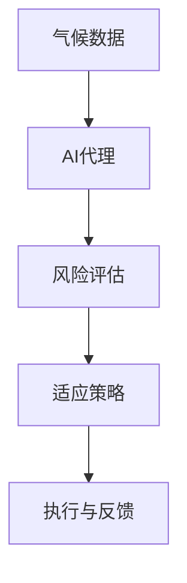
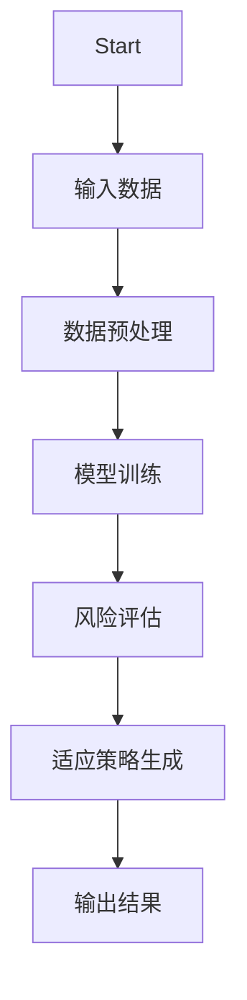
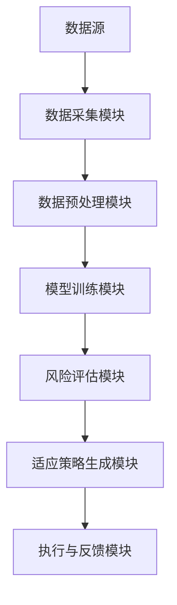

                 


# AI代理在公司气候变化适应能力评估中的应用

## 关键词：AI代理、气候变化适应能力、企业风险管理、机器学习、系统架构

## 摘要：  
随着全球气候变化的加剧，企业面临的环境风险也在不断增加。AI代理（AI Agents）作为一种智能化的决策工具，能够帮助企业高效评估和应对气候变化带来的挑战。本文将从AI代理的基本概念出发，深入探讨其在气候变化适应能力评估中的应用，结合实际案例分析，为企业提供有效的解决方案。

---

# 目录

## 第一章: AI代理与气候变化适应能力评估的背景

### 1.1 气候变化对企业的影响
- 1.1.1 气候变化对企业运营的潜在风险
- 1.1.2 企业气候变化适应能力的重要性
- 1.1.3 AI代理在气候变化适应中的作用

### 1.2 AI代理的基本概念与技术基础
- 1.2.1 AI代理的定义与分类
- 1.2.2 AI代理的核心技术特点
- 1.2.3 多智能体系统与协作机制

### 1.3 气候变化适应能力评估的框架
- 1.3.1 气候变化适应能力的定义
- 1.3.2 适应能力评估的指标体系
- 1.3.3 评估框架的构建与应用

## 第二章: AI代理的核心概念与原理

### 2.1 AI代理的核心概念
- 2.1.1 AI代理的基本属性与特征
- 2.1.2 AI代理的决策机制与行为模式
- 2.1.3 AI代理与人类决策者的对比分析

### 2.2 AI代理与气候变化适应能力评估的联系
- 2.2.1 AI代理在数据采集与处理中的应用
- 2.2.2 AI代理在风险评估与预警中的作用
- 2.2.3 AI代理在策略优化与执行中的优势

### 2.3 AI代理在气候变化适应能力评估中的实体关系图


## 第三章: AI代理在气候变化适应能力评估中的算法原理

### 3.1 算法原理概述
- 3.1.1 强化学习在AI代理中的应用
- 3.1.2 多智能体协作算法
- 3.1.3 深度学习在数据处理中的应用

### 3.2 算法实现步骤


### 3.3 数学模型与公式
- 损失函数：$$ L = \sum_{i=1}^{n} (y_i - \hat{y}_i)^2 $$
- 强化学习中的奖励机制：$$ R = \sum_{t=1}^{T} r_t $$
- 多智能体协作中的通信协议：$$ C = \{c_1, c_2, ..., c_m\} $$

## 第四章: 气候变化适应能力评估的系统架构设计

### 4.1 系统功能设计
- 数据采集模块
- 风险评估模块
- 策略优化模块
- 执行与反馈模块

### 4.2 系统架构设计


## 第五章: 项目实战——AI代理在企业气候变化适应能力评估中的应用

### 5.1 项目背景
- 某企业的气候变化风险分析需求

### 5.2 环境搭建
- Python 3.8+
- TensorFlow、Scikit-learn、Flask

### 5.3 核心代码实现
```python
import numpy as np
from sklearn.model_selection import train_test_split
from tensorflow.keras.models import Sequential
from tensorflow.keras.layers import Dense

# 数据预处理
data = np.load('climate_data.npy')
X = data[:, :-1]
y = data[:, -1]

X_train, X_test, y_train, y_test = train_test_split(X, y, test_size=0.2)

# 模型训练
model = Sequential()
model.add(Dense(64, activation='relu', input_dim=X.shape[1]))
model.add(Dense(1, activation='sigmoid'))
model.compile(optimizer='adam', loss='binary_crossentropy', metrics=['accuracy'])
model.fit(X_train, y_train, epochs=100, batch_size=32)
```

### 5.4 案例分析
- 模型在某企业气候风险评估中的应用
- 结果分析与优化建议

## 第六章: 总结与展望

### 6.1 本章小结
- AI代理在气候变化适应能力评估中的优势
- 实际应用中的挑战与解决方案

### 6.2 未来展望
- AI代理与其他技术（如区块链）的结合
- 更智能化和个性化的适应能力评估系统

---

通过以上目录结构，文章将详细阐述AI代理在气候变化适应能力评估中的应用，结合理论与实践，为企业提供有效的解决方案。

