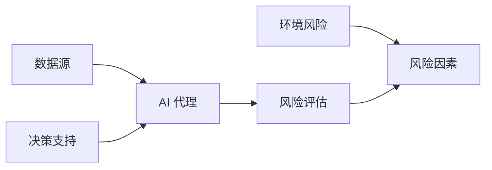
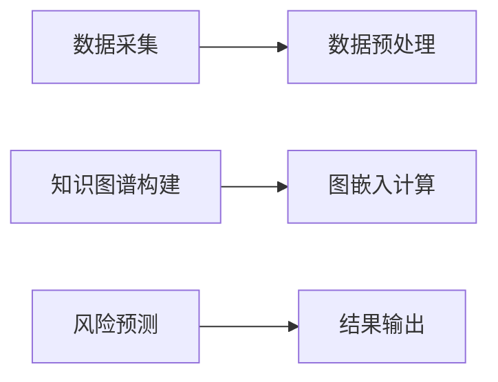
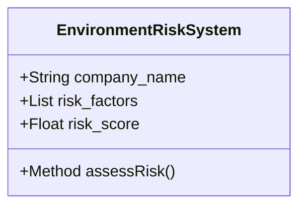
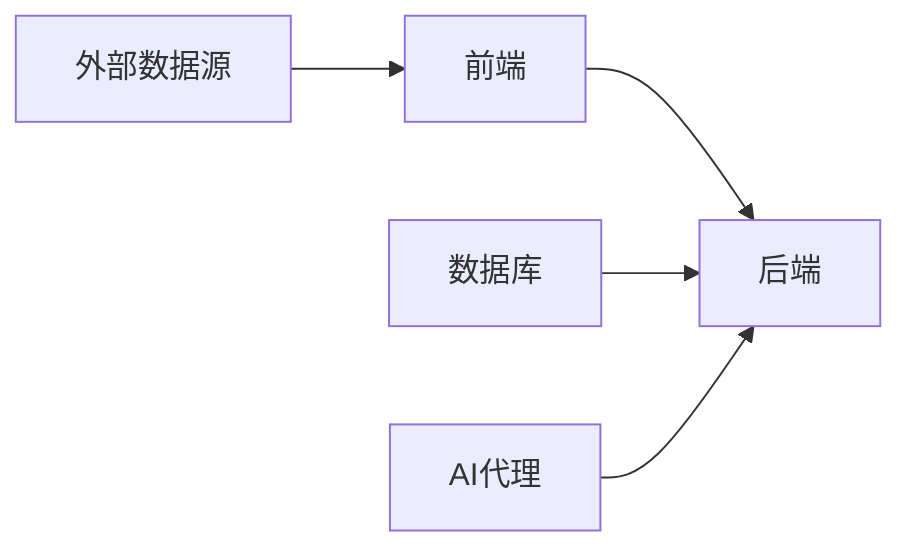
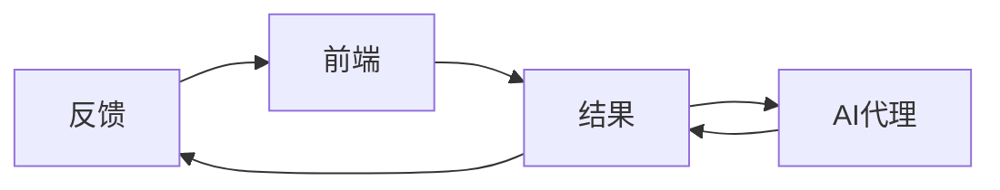

                 


# AI 代理在公司环境风险暴露评估中的应用

## 关键词：
AI代理、环境风险评估、风险管理、知识图谱、算法原理、系统架构

## 摘要：
本文详细探讨了AI代理在公司环境风险暴露评估中的应用。首先，从背景介绍入手，分析了环境风险管理的痛点与挑战，以及AI代理在其中的潜在价值。接着，深入讲解了AI代理与环境风险评估的核心概念，包括知识表示与推理机制、风险识别与量化方法等。随后，详细阐述了基于知识图谱的环境风险评估算法的数学模型和实现方法，并通过Mermaid图和Python代码示例进行直观展示。在系统分析与架构设计部分，构建了系统的功能模型、架构图和交互流程图，展示了AI代理在实际系统中的应用场景。最后，通过项目实战和最佳实践，提供了具体的实施案例和优化建议，帮助读者更好地理解和应用这些技术。

---

# 第1章: AI 代理与环境风险暴露评估的背景介绍

## 1.1 问题背景
### 1.1.1 企业环境风险暴露的定义与特征
企业环境风险暴露是指企业在经营过程中，由于外部环境的不确定性（如市场波动、政策变化、自然灾害等）所面临的风险。其特征包括复杂性、动态性和不可预测性。

### 1.1.2 当前企业环境风险管理的痛点与挑战
- 数据量大，难以实时处理。
- 风险因素复杂，难以全面识别。
- 传统方法依赖人工判断，效率低且准确性差。

### 1.1.3 AI 代理在环境风险管理中的潜在价值
AI代理可以通过实时数据分析、自动化决策和自适应学习，显著提高环境风险管理的效率和准确性。

## 1.2 问题描述
### 1.2.1 环境风险暴露的多维度分析
环境风险暴露涉及多个维度，如市场风险、操作风险和声誉风险。

### 1.2.2 传统环境风险管理的局限性
- 依赖人工经验，主观性强。
- 数据处理能力有限，难以应对海量数据。
- 响应速度慢，无法实时应对风险。

### 1.2.3 引入 AI 代理的必要性与可行性
AI代理可以实现数据的实时分析、风险的快速识别和应对策略的自动化制定，是环境风险管理的必要工具。

## 1.3 问题解决
### 1.3.1 AI 代理在环境风险管理中的应用场景
- 实时监控市场动态。
- 自动识别潜在风险。
- 优化风险应对策略。

## 1.4 边界与外延
### 1.4.1 AI 代理在环境风险管理中的适用范围
适用于需要实时数据分析和快速决策的场景。

### 1.4.2 相关概念的区分与联系
区分AI代理与传统算法，强调AI代理在环境风险管理中的独特优势。

### 1.4.3 与其他风险管理方法的对比分析
对比分析显示，AI代理在效率和准确性上具有明显优势。

## 1.5 概念结构与核心要素
### 1.5.1 环境风险暴露评估的系统模型
构建环境风险暴露评估的系统模型，包括数据采集、分析、评估和决策支持四个模块。

### 1.5.2 AI 代理在系统中的角色定位
AI代理作为系统的核心模块，负责数据处理、风险识别和决策支持。

### 1.5.3 核心要素的层次化分析
从数据、算法、系统架构三个层次分析核心要素。

## 1.6 本章小结
本章介绍了环境风险管理的背景、痛点和AI代理的应用价值，为后续章节奠定了基础。

---

# 第2章: AI 代理与环境风险评估的核心概念

## 2.1 AI 代理的基本原理
### 2.1.1 AI 代理的定义与分类
AI代理是一种能够感知环境、自主决策并采取行动的智能体，分为基于规则的代理和基于学习的代理。

### 2.1.2 知识表示与推理机制
知识表示包括知识图谱和规则库，推理机制包括逻辑推理和机器学习推理。

### 2.1.3 代理的自主性与适应性
AI代理具有自主决策和自适应学习的能力，能够在复杂环境中灵活应对。

## 2.2 环境风险评估的核心原理
### 2.2.1 风险识别与量化方法
风险识别包括数据采集和特征提取，风险量化采用概率模型和影响评估。

### 2.2.2 数据驱动的评估模型
数据驱动模型包括回归分析和聚类分析，用于风险预测和分类。

### 2.2.3 多维度风险评估指标体系
构建多维度指标体系，包括市场、操作和声誉风险三个维度。

## 2.3 AI 代理与环境风险评估的关系
### 2.3.1 代理在风险识别中的作用
AI代理通过实时数据分析和模式识别，快速发现潜在风险。

### 2.3.2 数据驱动与知识驱动的结合
结合数据驱动和知识驱动的方法，提高风险评估的准确性和全面性。

### 2.3.3 代理在风险预测与应对中的应用
AI代理能够实时预测风险并制定应对策略，显著提高风险管理效率。

## 2.4 核心概念对比分析
### 2.4.1 AI 代理与传统算法的对比
AI代理具有自主性和适应性，而传统算法依赖预设规则。

### 2.4.2 环境风险评估与传统风险管理的对比
AI代理的应用显著提高了风险评估的效率和准确性。

### 2.4.3 代理驱动与数据驱动的对比
代理驱动强调自主决策，数据驱动强调基于数据的分析。

## 2.5 实体关系图


---

# 第3章: AI 代理的算法原理

## 3.1 基于知识图谱的环境风险评估算法
### 3.1.1 算法概述
基于知识图谱的环境风险评估算法通过构建企业知识图谱，利用图嵌入技术进行风险预测。

### 3.1.2 算法步骤
1. 数据采集与预处理：收集企业内外部数据，进行清洗和特征提取。
2. 知识图谱构建：构建企业知识图谱，包括实体和关系。
3. 图嵌入计算：使用图嵌入技术计算实体的向量表示。
4. 风险预测：基于图嵌入进行风险预测和分类。

## 3.2 算法实现
### 3.2.1 数据预处理
```python
import pandas as pd
data = pd.read_csv('environment_risk.csv')
data = data.dropna()
```

### 3.2.2 知识图谱构建
```python
from py2neo import Graph, Node, Relationship
graph = Graph("http://localhost:7474", auth=("neo4j", "password"))
node_company = Node('Company', name='CompanyA')
node_market = Node('Market', name='MarketA')
graph.create(Relationship(node_company, 'OPERATES_IN', node_market))
```

### 3.2.3 图嵌入计算
```python
from node2vec import Node2Vec
model = Node2Vec(graph, walk_length=10, num_walks=10)
```

### 3.2.4 风险预测
```python
from sklearn.linear_model import LogisticRegression
model = LogisticRegression()
model.fit(X, y)
```

## 3.3 算法流程图


---

# 第4章: 系统分析与架构设计

## 4.1 问题场景介绍
企业环境风险管理系统的构建，旨在利用AI代理实现风险的实时监控和应对。

## 4.2 系统功能设计
### 4.2.1 系统功能模块
- 数据采集模块：实时采集企业内外部数据。
- 风险评估模块：基于知识图谱进行风险评估。
- 决策支持模块：提供风险应对策略。

### 4.2.2 领域模型


## 4.3 系统架构设计
### 4.3.1 系统架构图


### 4.3.2 接口设计
- 数据采集接口：用于实时数据的获取。
- 风险评估接口：用于风险的计算和输出。

## 4.4 系统交互流程图


---

# 第5章: 项目实战

## 5.1 环境安装
### 5.1.1 安装依赖
```bash
pip install neo4j sklearn node2vec
```

## 5.2 核心代码实现
### 5.2.1 数据预处理
```python
import pandas as pd
data = pd.read_csv('environment_risk.csv')
data = data.dropna()
```

### 5.2.2 知识图谱构建
```python
from py2neo import Graph, Node, Relationship
graph = Graph("http://localhost:7474", auth=("neo4j", "password"))
node_company = Node('Company', name='CompanyA')
node_market = Node('Market', name='MarketA')
graph.create(Relationship(node_company, 'OPERATES_IN', node_market))
```

### 5.2.3 风险预测
```python
from sklearn.linear_model import LogisticRegression
model = LogisticRegression()
model.fit(X, y)
```

## 5.3 案例分析
### 5.3.1 案例背景
某企业面临市场波动风险，利用AI代理进行实时监控和预测。

### 5.3.2 实施步骤
1. 数据采集与预处理。
2. 知识图谱构建。
3. 风险预测与评估。
4. 决策支持与应对。

## 5.4 项目总结
通过项目实战，验证了AI代理在环境风险管理中的有效性。

---

# 第6章: 最佳实践与总结

## 6.1 最佳实践 tips
- 确保数据质量和实时性。
- 定期更新知识图谱。
- 结合领域专家知识。

## 6.2 小结
AI代理在环境风险管理中的应用显著提高了效率和准确性。

## 6.3 注意事项
- 数据安全和隐私保护。
- 系统的可扩展性和可维护性。

## 6.4 拓展阅读
推荐相关书籍和论文，进一步深入学习。

---

通过以上结构，本文详细介绍了AI代理在公司环境风险暴露评估中的应用，从理论到实践，为读者提供了全面的指导和参考。

