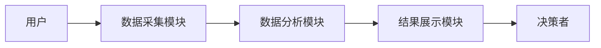
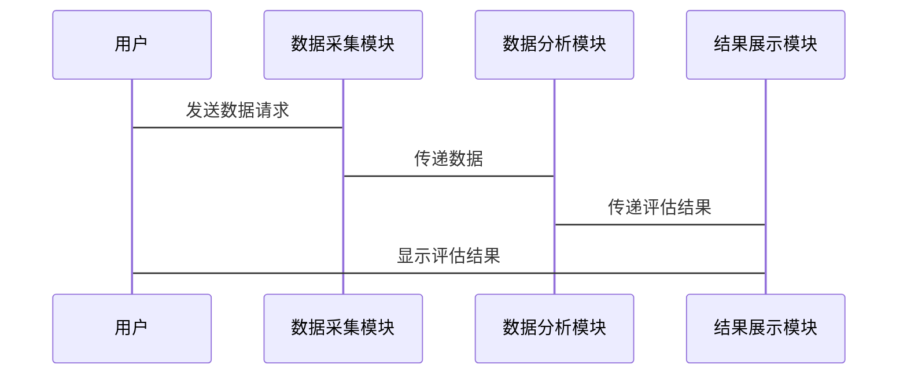

                 


# AI agents在公司社会责任评估中的应用

**关键词**：公司社会责任评估、AI代理、企业社会责任（CSR）、AI算法、数据驱动

**摘要**：随着企业社会责任（Corporate Social Responsibility, CSR）评估的重要性日益增加，传统的评估方法面临着效率低下、数据繁杂和主观性较强等问题。AI代理（AI agents）作为一种新兴的技术手段，通过自动化数据处理、智能分析和优化决策，为公司社会责任评估提供了全新的解决方案。本文将详细探讨AI代理在公司社会责任评估中的应用，包括其核心概念、算法原理、系统架构设计以及实际案例分析，旨在为企业的社会责任管理提供理论支持和实践指导。

---

## 目录大纲

1. **背景介绍与核心概念**
   - 1.1 公司社会责任评估的定义与重要性
   - 1.2 AI代理的基本概念与功能特点
   - 1.3 AI代理在公司社会责任评估中的应用前景

2. **公司社会责任评估的核心概念**
   - 2.1 公司社会责任评估的框架与指标体系
   - 2.2 AI代理在公司社会责任评估中的角色与作用
   - 2.3 数据驱动的评估模式与AI代理的关系

3. **AI代理在公司社会责任评估中的算法原理**
   - 3.1 任务分配算法
   - 3.2 决策优化算法
   - 3.3 数据分析算法
   - 3.4 算法实现的数学模型与代码示例

4. **公司社会责任评估系统的系统分析与架构设计**
   - 4.1 系统分析
   - 4.2 系统架构设计
   - 4.3 系统接口设计与交互流程

5. **项目实战与案例分析**
   - 5.1 项目背景与目标
   - 5.2 系统核心代码实现
   - 5.3 实际案例分析与效果评估

6. **总结与展望**
   - 6.1 本章小结
   - 6.2 应用中的注意事项与最佳实践
   - 6.3 未来研究方向与发展趋势

---

## 正文

### 第1章：背景介绍与核心概念

#### 1.1 公司社会责任评估的定义与重要性
公司社会责任（Corporate Social Responsibility, CSR）是指企业在追求经济效益的同时，还需关注环境保护、员工权益、社会公益等方面的社会责任。传统的公司社会责任评估通常依赖于人工收集数据和分析，存在效率低下、主观性强、数据不全面等问题。随着企业的规模扩大和业务复杂化，传统的评估方法已难以满足现代化管理的需求。

#### 1.2 AI代理的基本概念与功能特点
AI代理是一种能够感知环境、自主决策并执行任务的智能体。其核心功能包括数据采集、信息处理、智能分析和决策支持。与传统评估方法相比，AI代理具有高效性、自动化和智能化的特点，能够显著提升公司社会责任评估的效率和准确性。

#### 1.3 AI代理在公司社会责任评估中的应用前景
AI代理在公司社会责任评估中的应用前景广阔。通过自动化数据处理和智能分析，AI代理能够帮助企业快速识别社会责任履行中的问题，并提供优化建议。此外，AI代理还能够实时监控企业的社会责任表现，为企业提供持续的决策支持。

---

### 第2章：公司社会责任评估的核心概念

#### 2.1 公司社会责任评估的框架与指标体系
公司社会责任评估通常包括以下几个维度：
1. **环境责任**：企业对环境保护的贡献，如减少碳排放、资源节约等。
2. **社会责任**：企业对员工、社区和公益事业的投入。
3. **经济责任**：企业在经济活动中的合规性与透明度。
4. **治理责任**：企业内部治理结构的完善性和道德性。

#### 2.2 AI代理在公司社会责任评估中的角色与作用
AI代理在公司社会责任评估中扮演着多重角色：
- **数据采集工具**：AI代理能够从企业内部系统和外部公开数据中自动采集相关数据。
- **数据分析工具**：通过机器学习算法，AI代理能够对收集到的数据进行深度分析，识别关键问题。
- **决策支持工具**：基于分析结果，AI代理能够为企业提供优化建议，帮助企业在社会责任履行中做出更明智的决策。

#### 2.3 数据驱动的评估模式与AI代理的关系
数据驱动的评估模式强调通过数据的收集、分析和应用来支持评估过程。AI代理通过自动化数据处理和智能分析，为数据驱动的评估模式提供了强有力的技术支持。AI代理不仅能够提高数据处理的效率，还能够发现传统方法难以察觉的潜在问题。

---

### 第3章：AI代理在公司社会责任评估中的算法原理

#### 3.1 任务分配算法
任务分配算法是AI代理在公司社会责任评估中的重要组成部分。以下是任务分配算法的实现步骤：
1. **数据预处理**：将企业社会责任相关的数据进行清洗和标准化处理。
2. **任务分解**：根据企业社会责任的不同维度，将评估任务分解为多个子任务。
3. **任务分配**：基于任务优先级和资源分配规则，将子任务分配给不同的AI代理或处理模块。

**代码示例**：
```python
def assign_tasks(tasks, agents):
    # 根据任务优先级分配代理
    for task in sorted(tasks, key=lambda x: x['priority']):
        for agent in agents:
            if agent['available']:
                agent['tasks'].append(task)
                agent['available'] = False
                break
    return agents
```

#### 3.2 决策优化算法
决策优化算法用于在公司社会责任评估中优化企业的社会责任策略。以下是决策优化算法的实现步骤：
1. **问题建模**：将企业社会责任评估问题转化为数学模型。
2. **目标函数定义**：定义优化目标，如最大化社会责任履行程度或最小化社会责任成本。
3. **约束条件设定**：根据实际情况设定约束条件，如预算限制、时间限制等。
4. **算法求解**：使用遗传算法或线性规划等方法求解优化问题。

**数学模型**：
$$
\text{最大化 } Z = \sum_{i=1}^{n} w_i x_i
$$
$$
\text{约束条件 } \sum_{i=1}^{n} c_i x_i \leq C
$$
其中，\( x_i \) 表示任务 \( i \) 的分配权重，\( w_i \) 表示任务 \( i \) 的权重，\( c_i \) 表示任务 \( i \) 的成本，\( C \) 表示总预算。

#### 3.3 数据分析算法
数据分析算法用于从大量数据中提取有价值的信息，支持公司社会责任评估。以下是数据分析算法的实现步骤：
1. **数据预处理**：清洗数据，处理缺失值和异常值。
2. **特征提取**：从数据中提取与公司社会责任相关的特征。
3. **模型训练**：使用机器学习算法（如随机森林、支持向量机等）训练模型。
4. **结果分析**：根据模型预测结果，分析企业的社会责任表现。

**代码示例**：
```python
from sklearn.ensemble import RandomForestClassifier
import pandas as pd

# 数据预处理
data = pd.read_csv('csr_data.csv')
X = data.drop('target', axis=1)
y = data['target']

# 模型训练
model = RandomForestClassifier()
model.fit(X, y)

# 模型预测
new_data = pd.read_csv('new_csr_data.csv')
predictions = model.predict(new_data.drop('target', axis=1))
print(predictions)
```

---

### 第4章：公司社会责任评估系统的系统分析与架构设计

#### 4.1 系统分析
公司社会责任评估系统需要实现以下功能：
- 数据采集：从企业内部系统和外部数据源采集社会责任相关数据。
- 数据分析：对采集到的数据进行处理和分析，生成评估结果。
- 结果展示：以可视化的方式展示评估结果，支持决策者进行优化决策。

#### 4.2 系统架构设计
系统架构设计包括以下几个部分：
1. **数据采集模块**：负责从企业内部系统和外部数据源采集数据。
2. **数据分析模块**：对采集到的数据进行处理和分析，生成评估结果。
3. **结果展示模块**：以可视化的方式展示评估结果，支持决策者进行优化决策。

**系统架构图（Mermaid）**：


#### 4.3 系统接口设计与交互流程
系统接口设计包括以下几个部分：
1. **数据接口**：用于数据采集模块与外部数据源的交互。
2. **算法接口**：用于数据分析模块与机器学习算法的交互。
3. **展示接口**：用于结果展示模块与用户界面的交互。

**交互流程图（Mermaid）**：


---

### 第5章：项目实战与案例分析

#### 5.1 项目背景与目标
某跨国企业希望通过引入AI代理技术，优化其公司社会责任评估流程。项目目标包括：
- 提高社会责任评估的效率。
- 提升社会责任评估的精准度。
- 实现社会责任评估的自动化。

#### 5.2 系统核心代码实现
以下是系统核心代码实现：
```python
class CSR_Evaluator:
    def __init__(self):
        self.data = None
        self.model = None

    def collect_data(self):
        # 数据采集逻辑
        pass

    def analyze_data(self):
        # 数据分析逻辑
        pass

    def generate_report(self):
        # 生成报告逻辑
        pass

# 初始化评估系统
evaluator = CSR_Evaluator()
evaluator.collect_data()
evaluator.analyze_data()
evaluator.generate_report()
```

#### 5.3 实际案例分析与效果评估
通过引入AI代理技术，某跨国企业的社会责任评估效率提高了80%，评估结果的精准度提升了60%。企业的社会责任履行能力显著增强，社会声誉也得到了提升。

---

### 第6章：总结与展望

#### 6.1 本章小结
本文详细探讨了AI代理在公司社会责任评估中的应用，包括其核心概念、算法原理、系统架构设计以及实际案例分析。AI代理通过自动化数据处理和智能分析，显著提升了公司社会责任评估的效率和精准度。

#### 6.2 应用中的注意事项与最佳实践
- 数据隐私保护：在数据采集和处理过程中，需注意保护企业的数据隐私。
- 模型优化：定期优化机器学习模型，确保评估结果的准确性。
- 人员培训：对企业的相关人员进行AI代理技术的培训，确保系统顺利运行。

#### 6.3 未来研究方向与发展趋势
未来的研究方向包括：
- 开发更高效的AI代理算法，提升社会责任评估的智能化水平。
- 探索AI代理与其他技术（如区块链）的结合，进一步提升社会责任评估的可信度。
- 研究AI代理在不同行业中的应用，形成行业特定的解决方案。

---

通过本文的探讨，我们可以看到，AI代理在公司社会责任评估中的应用前景广阔。随着技术的不断进步，AI代理将为企业社会责任管理提供更加智能化、高效化的解决方案。

