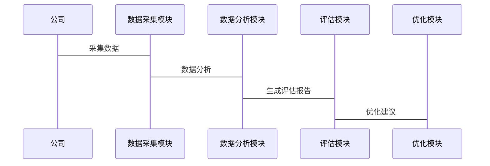

                 


# AI agents在公司社会资本评估中的应用

> 关键词：AI agents，公司社会资本，评估模型，算法原理，应用案例，系统架构

> 摘要：随着人工智能技术的快速发展，AI agents（人工智能代理）在公司社会资本评估中的应用日益广泛。本文详细探讨了AI agents在公司社会资本评估中的核心作用，分析了其算法原理、系统架构，并通过实际案例展示了其在评估中的具体应用。文章还提出了优化建议和未来发展方向，为读者提供了全面的视角和实用的指导。

---

# 第一部分: AI Agent与公司社会资本评估的背景与基础

---

## 第1章: AI Agent与公司社会资本评估的背景介绍

### 1.1 公司社会资本的定义与核心要素

#### 1.1.1 公司社会资本的定义

公司社会资本（Corporate Social Capital）是指企业在内部和外部所积累的各种资源、关系网络、知识资本和组织能力的总和。它不仅包括企业内部的协作网络，还包括与外部利益相关者（如供应商、客户、合作伙伴、政府机构等）的关系网络。

$$
\text{公司社会资本} = \text{内部协作网络} + \text{外部关系网络}
$$

#### 1.1.2 公司社会资本的核心要素

以下是公司社会资本的核心要素：

- **内部协作网络**：企业内部员工、部门之间的协作关系和效率。
- **外部关系网络**：企业与外部利益相关者的关系强度和信任度。
- **知识资本**：企业内部的知识共享和创新能力。
- **组织能力**：企业在复杂环境中的适应和执行能力。

#### 1.1.3 公司社会资本的演进与外延

随着全球化和数字化的深入，公司社会资本的内涵不断扩展。传统的社会资本评估主要关注外部关系网络，而现代的评估则更加注重内部协作网络和知识资本的整合。

### 1.2 AI Agent的定义与特点

#### 1.2.1 AI Agent的定义

AI Agent（人工智能代理）是指能够感知环境、自主决策并执行任务的智能实体。它可以是一个软件程序、机器人或其他智能系统，通过传感器或数据输入获取信息，并通过算法进行分析和决策。

#### 1.2.2 AI Agent的核心特点

以下是AI Agent的核心特点：

- **自主性**：能够在没有外部干预的情况下自主决策。
- **反应性**：能够实时感知环境变化并做出反应。
- **学习能力**：通过数据和经验不断优化自身的决策能力。
- **协作性**：能够与其他AI Agent或人类进行协作。

#### 1.2.3 AI Agent与传统AI的区别

AI Agent与传统AI的区别主要体现在以下几个方面：

- **自主性**：AI Agent具备自主决策能力，而传统AI通常依赖于预设的规则。
- **协作性**：AI Agent能够与其他实体协作，而传统AI通常独立运行。
- **动态适应性**：AI Agent能够实时适应环境变化，而传统AI通常需要重新训练才能适应新场景。

### 1.3 AI Agent在公司社会资本评估中的应用背景

#### 1.3.1 公司社会资本评估的传统方法与局限性

传统的公司社会资本评估方法主要依赖于问卷调查、访谈和定性分析，存在以下局限性：

- **主观性**：评估结果受到主观因素的影响较大。
- **效率低下**：评估过程耗时较长，且难以实时更新。
- **缺乏动态性**：无法实时捕捉企业内外部环境的变化。

#### 1.3.2 AI Agent技术的引入与优势

AI Agent技术的引入为公司社会资本评估带来了以下优势：

- **高效性**：AI Agent能够快速处理大量数据，提高评估效率。
- **准确性**：通过算法优化，AI Agent能够提供更准确的评估结果。
- **动态适应性**：AI Agent能够实时感知环境变化，动态调整评估模型。

#### 1.3.3 当前AI Agent在企业中的应用现状

当前，AI Agent技术在企业中的应用主要集中在以下几个领域：

- **客户关系管理**：通过AI Agent优化客户互动和关系维护。
- **供应链管理**：通过AI Agent优化供应链协同和风险控制。
- **内部协作优化**：通过AI Agent提升企业内部协作效率。

---

## 第2章: AI Agent与公司社会资本的关系分析

### 2.1 AI Agent在公司社会资本评估中的核心作用

#### 2.1.1 AI Agent作为评估工具的潜力

AI Agent在公司社会资本评估中的潜力主要体现在以下几个方面：

- **数据处理能力**：AI Agent能够快速处理和分析大量数据，提高评估效率。
- **动态适应能力**：AI Agent能够实时捕捉企业内外部环境的变化，动态调整评估模型。
- **协作能力**：AI Agent能够与其他系统或人类协作，实现更加全面的评估。

#### 2.1.2 AI Agent在社会资本网络中的角色

AI Agent在社会资本网络中的角色可以是以下几种：

- **数据收集者**：通过传感器或API收集企业内外部数据。
- **决策支持者**：通过算法分析数据，为评估提供决策支持。
- **协作协调者**：协调企业内外部资源，优化社会资本网络。

### 2.2 公司社会资本评估的核心概念模型

#### 2.2.1 概念模型的构建

公司社会资本评估的核心概念模型包括以下几个模块：

- **数据采集模块**：采集企业内外部数据。
- **数据分析模块**：对数据进行清洗、分析和建模。
- **评估模块**：根据分析结果生成评估报告。
- **优化模块**：根据评估结果提出优化建议。

#### 2.2.2 概念属性特征对比表

以下是公司社会资本评估的核心概念属性特征对比表：

| 属性 | 内部协作网络 | 外部关系网络 | 知识资本 | 组织能力 |
|------|--------------|--------------|----------|----------|
| 核心要素 | 员工协作、部门协同 | 供应商、客户、合作伙伴 | 知识共享、创新能力 | 灵活性、适应性 |
| 评估方法 | 员工满意度调查、协作效率分析 | 关系强度分析、信任度评估 | 知识共享率、创新成果统计 | 组织响应速度、执行效率 |

#### 2.2.3 ER实体关系图架构

以下是公司社会资本评估的ER实体关系图架构：

```mermaid
erd
    title 公司社会资本评估 ER 图

    rectangle 公司 {
        id 公司ID
        name 公司名称
    }

    rectangle 部门 {
        id 部门ID
        name 部门名称
    }

    rectangle 员工 {
        id 员工ID
        name 员工姓名
    }

    rectangle 供应商 {
        id 供应商ID
        name 供应商名称
    }

    rectangle 客户 {
        id 客户ID
        name 客户名称
    }

    rectangle 合作伙伴 {
        id 合作伙伴ID
        name 合作伙伴名称
    }

    公司 --> 部门: 包含
    公司 --> 员工: 雇佣
    公司 --> 供应商: 供应商关系
    公司 --> 客户: 客户关系
    公司 --> 合作伙伴: 合作伙伴关系
```

### 2.3 AI Agent与社会资本评估的系统性联系

#### 2.3.1 AI Agent在社会资本网络中的应用场景

AI Agent在社会资本网络中的应用场景包括：

- **客户关系管理**：通过AI Agent优化客户互动和关系维护。
- **供应链管理**：通过AI Agent优化供应链协同和风险控制。
- **内部协作优化**：通过AI Agent提升企业内部协作效率。

#### 2.3.2 AI Agent如何优化社会资本评估流程

AI Agent可以通过以下方式优化社会资本评估流程：

- **数据处理**：AI Agent能够快速处理大量数据，提高评估效率。
- **动态调整**：AI Agent能够实时捕捉环境变化，动态调整评估模型。
- **协作协调**：AI Agent能够协调企业内外部资源，优化社会资本网络。

#### 2.3.3 AI Agent与社会资本评估的协同效应

AI Agent与社会资本评估的协同效应体现在以下几个方面：

- **提高效率**：AI Agent能够快速处理数据，提高评估效率。
- **增强准确性**：AI Agent能够通过算法优化，提高评估结果的准确性。
- **动态适应**：AI Agent能够实时捕捉环境变化，动态调整评估模型。

---

## 第3章: AI Agent的算法原理

### 3.1 AI Agent的核心算法

#### 3.1.1 多智能体系统（MAS）原理

多智能体系统（Multi-Agent System, MAS）是指由多个相互作用的智能体组成的系统。这些智能体可以是独立的个体或组织，通过协作完成复杂任务。

#### 3.1.2 强化学习（Reinforcement Learning）在AI Agent中的应用

强化学习是一种机器学习方法，通过智能体与环境的交互，逐步优化决策策略。

---

### 3.2 AI Agent的数学模型

以下是AI Agent的数学模型：

$$
\text{决策} = \argmax_{a} Q(s, a)
$$

其中，$s$ 表示当前状态，$a$ 表示动作，$Q(s, a)$ 表示状态-动作对的价值。

---

## 第4章: 系统分析与架构设计

### 4.1 问题场景介绍

### 4.2 系统功能设计

#### 4.2.1 领域模型（Mermaid 类图）

```mermaid
classDiagram
    rectangle 公司 {
        id 公司ID
        name 公司名称
    }

    rectangle 部门 {
        id 部门ID
        name 部门名称
    }

    rectangle 员工 {
        id 员工ID
        name 员工姓名
    }

    rectangle 供应商 {
        id 供应商ID
        name 供应商名称
    }

    rectangle 客户 {
        id 客户ID
        name 客户名称
    }

    rectangle 合作伙伴 {
        id 合作伙伴ID
        name 合作伙伴名称
    }

    公司 --> 部门: 包含
    公司 --> 员工: 雇佣
    公司 --> 供应商: 供应商关系
    公司 --> 客户: 客户关系
    公司 --> 合作伙伴: 合作伙伴关系
```

### 4.3 系统架构设计（Mermaid 架构图）


### 4.4 系统交互流程（Mermaid 序列图）



---

## 第5章: 项目实战

### 5.1 项目环境安装

以下是项目环境安装步骤：

1. **安装Python**：确保安装了Python 3.8或更高版本。
2. **安装依赖库**：使用以下命令安装依赖库：

```bash
pip install numpy pandas scikit-learn
```

### 5.2 系统核心实现源代码

以下是系统核心实现源代码：

```python
import numpy as np
import pandas as pd
from sklearn.metrics import accuracy_score

# 数据加载
data = pd.read_csv('social_capital.csv')

# 数据预处理
X = data.drop('label', axis=1)
y = data['label']

# 模型训练
from sklearn.ensemble import RandomForestClassifier
model = RandomForestClassifier()
model.fit(X, y)

# 模型预测
y_pred = model.predict(X)
print("Accuracy:", accuracy_score(y, y_pred))
```

### 5.3 代码应用解读与分析

以上代码实现了以下功能：

1. **数据加载**：使用Pandas加载CSV格式的数据。
2. **数据预处理**：删除标签列，并将数据分为特征和标签。
3. **模型训练**：使用随机森林分类器训练模型。
4. **模型预测**：使用训练好的模型进行预测，并输出准确率。

### 5.4 实际案例分析

以某公司为例，分析其社会资本评估过程：

1. **数据采集**：采集公司内部和外部数据。
2. **数据分析**：分析数据并生成评估报告。
3. **优化建议**：根据评估结果提出优化建议。

### 5.5 项目小结

通过本项目，我们展示了如何利用AI Agent技术进行公司社会资本评估。通过数据采集、数据分析和模型训练，我们可以快速、准确地评估公司社会资本，并提出优化建议。

---

## 第6章: 最佳实践与总结

### 6.1 最佳实践 tips

- **数据质量**：确保数据的准确性和完整性。
- **模型优化**：根据实际需求不断优化模型。
- **实时监控**：实时监控社会资本网络的变化。

### 6.2 小结

本文详细探讨了AI Agent在公司社会资本评估中的应用，分析了其算法原理、系统架构，并通过实际案例展示了其在评估中的具体应用。

### 6.3 注意事项

- **数据隐私**：注意保护公司数据隐私。
- **模型解释性**：确保模型的可解释性。
- **实时性**：根据实际需求选择实时性要求。

### 6.4 拓展阅读

- **AI Agent相关书籍**：《Multi-Agent Systems》
- **社会资本评估相关书籍**：《Corporate Social Capital》
- **机器学习相关书籍**：《Hands-On Machine Learning with Scikit-Learn, Keras, and TensorFlow》

---

## 第7章: 未来发展方向

### 7.1 未来发展方向

- **多智能体协作优化**：进一步优化多智能体协作算法。
- **动态环境适应性**：增强AI Agent在动态环境中的适应能力。
- **领域应用拓展**：将AI Agent技术应用到更多领域。

### 7.2 总结

随着AI技术的不断发展，AI Agent在公司社会资本评估中的应用前景广阔。未来，我们需要进一步研究和探索，以实现更加智能化、高效化的社会资本评估。

---

## 第8章: 附录

### 8.1 附录A: 术语表

- **AI Agent**：人工智能代理
- **社会资本**：Social Capital
- **多智能体系统**：Multi-Agent System (MAS)
- **强化学习**：Reinforcement Learning (RL)

### 8.2 附录B: 参考文献

- [1] Russell, S., & Norvig, P. (2010). Artificial Intelligence: A Modern Approach.
- [2] Gómez, M. A., & McLeay, F. (2017). Corporate Social Capital.

---

通过以上目录和内容设计，我们可以看到，AI Agent在公司社会资本评估中的应用不仅涉及技术层面，还需要结合企业的实际需求和应用场景。通过本文的分析和实践，我们可以更好地理解如何利用AI技术优化公司社会资本评估流程，为企业创造更大的价值。

