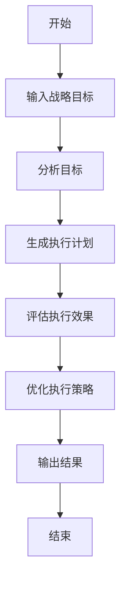
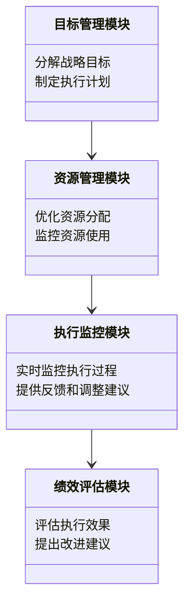
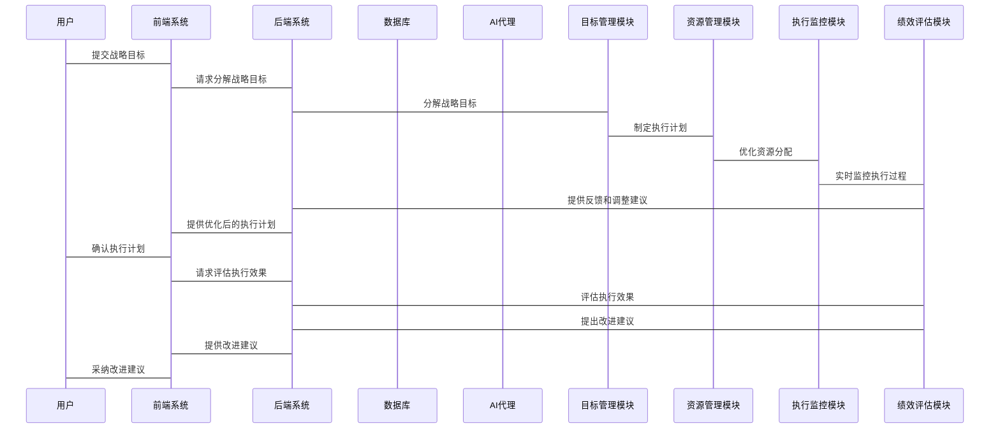

                 


# 第一部分: AI代理在公司战略执行力评估中的背景与概念

# 第1章: AI代理与公司战略执行力评估的背景

## 1.1 问题背景与挑战
### 1.1.1 企业战略执行力的重要性
企业战略执行力是将战略目标转化为实际成果的关键能力。在快速变化的商业环境中，战略执行力决定了企业能否适应市场变化、抓住机遇和应对挑战。然而，许多企业在战略执行过程中面临以下问题：
- **目标分解不清晰**：战略目标分解到具体执行步骤时不够明确，导致执行过程中出现偏差。
- **资源分配不合理**：缺乏有效的资源管理机制，导致资源浪费或关键资源不足。
- **执行监控不足**：缺乏实时监控和反馈机制，难以及时发现和纠正执行偏差。
- **团队协作不畅**：部门间协作不足，导致执行过程中出现瓶颈和冲突。

AI代理的引入可以有效解决这些问题，通过自动化监控、数据分析和智能决策，提升战略执行的效率和效果。

### 1.1.2 AI代理在战略执行中的定义与特点
AI代理是指具有自主决策和执行能力的智能体，能够在特定环境中根据感知的信息采取行动，以实现预定目标。AI代理在战略执行中的特点包括：
- **自主性**：能够独立感知环境并做出决策，无需人工干预。
- **反应性**：能够实时响应环境变化，调整执行策略。
- **学习能力**：通过机器学习算法不断优化自身的决策模型。
- **协作性**：能够与其他AI代理或系统协同工作，共同完成复杂任务。

### 1.1.3 AI代理在战略执行中的应用领域
AI代理在战略执行中的应用领域广泛，包括：
- **战略目标分解**：将长期战略目标分解为可执行的任务，并制定详细的执行计划。
- **资源分配优化**：根据实时数据和模型预测，优化资源分配，确保资源利用最大化。
- **执行监控与反馈**：实时监控执行过程，提供反馈并调整执行策略。
- **风险预测与应对**：预测潜在风险并制定应对措施，降低执行失败的可能性。

### 1.1.4 AI代理在战略执行中的边界与外延
AI代理的应用边界包括：
- **数据来源**：AI代理需要依赖高质量的数据进行决策，数据不足或数据质量差可能会影响其性能。
- **环境复杂性**：在高度不确定或复杂环境中，AI代理的能力可能受到限制。
- **伦理与合规**：AI代理的决策必须符合相关法律法规和企业伦理标准。

### 1.1.5 战略执行的核心要素
战略执行的核心要素包括：
- **目标设定**：明确的战略目标和可衡量的绩效指标。
- **任务分解**：将战略目标分解为具体任务，并明确任务的责任人和时间节点。
- **资源管理**：确保任务执行所需的资源（人、财、物）合理分配和有效利用。
- **监控与反馈**：建立实时监控机制，及时发现和纠正执行偏差。
- **绩效评估**：定期评估执行效果，并根据评估结果调整执行策略。

## 1.2 AI代理的核心概念与定义
### 1.2.1 AI代理的基本定义
AI代理是具有感知环境、自主决策和执行能力的智能体。它可以分为以下几类：
- **反应式AI代理**：根据当前感知的信息做出反应，没有内部状态。
- **基于模型的AI代理**：维护内部状态，并基于模型预测未来状态。
- **学习型AI代理**：通过机器学习算法不断优化自身的决策模型。

### 1.2.2 AI代理在战略执行中的应用范围
AI代理在战略执行中的应用范围包括：
- **战略规划**：协助制定战略计划和目标分解。
- **资源分配**：优化资源分配，提高资源利用效率。
- **执行监控**：实时监控执行过程，提供反馈和调整建议。
- **风险预警**：预测潜在风险并制定应对措施。
- **绩效评估**：评估执行效果并提出改进建议。

### 1.2.3 AI代理与战略执行的核心要素
AI代理与战略执行的核心要素包括：
- **目标设定**：AI代理需要明确的战略目标和绩效指标。
- **任务分解**：AI代理需要将战略目标分解为具体任务并制定执行计划。
- **资源管理**：AI代理需要优化资源分配，确保任务执行所需的资源到位。
- **监控与反馈**：AI代理需要实时监控执行过程并提供反馈。
- **绩效评估**：AI代理需要评估执行效果并提出改进建议。

## 1.3 AI代理与战略执行的边界与外延
### 1.3.1 AI代理在战略执行中的应用边界
AI代理的应用边界包括：
- **数据来源**：AI代理依赖高质量的数据进行决策，数据不足或质量差可能影响其性能。
- **环境复杂性**：在高度不确定或复杂环境中，AI代理的能力可能受到限制。
- **伦理与合规**：AI代理的决策必须符合相关法律法规和企业伦理标准。

### 1.3.2 战略执行评估的范围与外延
战略执行评估的范围包括：
- **目标实现程度**：评估战略目标的实现程度。
- **执行效率**：评估任务执行的效率和效果。
- **资源利用效率**：评估资源分配和利用效率。
- **风险控制**：评估风险预测和应对措施的有效性。

### 1.3.3 AI代理与战略执行的相互作用机制
AI代理与战略执行的相互作用机制包括：
- **信息流**：AI代理通过感知环境信息，提供决策支持。
- **决策支持**：AI代理基于数据和模型，提供决策建议。
- **执行反馈**：AI代理通过实时监控，提供反馈并调整执行策略。

## 1.4 本章小结
本章介绍了AI代理在公司战略执行力评估中的背景与概念，包括问题背景与挑战、核心概念与定义、应用范围与边界。通过分析AI代理的特点和优势，我们看到AI代理在提升战略执行效率和效果方面具有巨大潜力。然而，AI代理的应用也受到数据质量、环境复杂性和伦理合规等方面的限制。接下来的章节将深入探讨AI代理的核心原理、算法实现和系统架构设计，为实际应用提供理论基础和技术支持。

# 第2章: AI代理与战略执行的核心概念联系

## 2.1 AI代理的核心原理
### 2.1.1 AI代理的基本工作原理
AI代理的基本工作原理包括感知、决策和行动三个步骤：
1. **感知环境**：通过传感器或数据接口获取环境信息。
2. **决策制定**：基于感知的信息和内部模型，生成决策。
3. **执行行动**：根据决策结果采取行动。

### 2.1.2 AI代理在战略执行中的具体应用
AI代理在战略执行中的具体应用包括：
- **战略目标分解**：将战略目标分解为具体任务并制定执行计划。
- **资源分配优化**：优化资源分配，提高资源利用效率。
- **执行监控与反馈**：实时监控执行过程，提供反馈和调整建议。
- **风险预警与应对**：预测潜在风险并制定应对措施。

### 2.1.3 AI代理与战略执行的结合点
AI代理与战略执行的结合点包括：
- **目标分解**：AI代理可以帮助将战略目标分解为具体任务。
- **资源分配**：AI代理可以优化资源分配，确保任务执行所需的资源到位。
- **执行监控**：AI代理可以实时监控执行过程，提供反馈和调整建议。
- **绩效评估**：AI代理可以评估执行效果并提出改进建议。

## 2.2 AI代理与战略执行的核心要素对比
### 2.2.1 AI代理的属性特征
AI代理的属性特征包括：
- **自主性**：能够独立感知环境并做出决策。
- **反应性**：能够实时响应环境变化，调整执行策略。
- **学习能力**：通过机器学习算法不断优化自身的决策模型。
- **协作性**：能够与其他AI代理或系统协同工作，共同完成复杂任务。

### 2.2.2 战略执行的核心要素
战略执行的核心要素包括：
- **目标设定**：明确的战略目标和可衡量的绩效指标。
- **任务分解**：将战略目标分解为具体任务并制定执行计划。
- **资源管理**：确保任务执行所需的资源合理分配和有效利用。
- **监控与反馈**：建立实时监控机制，及时发现和纠正执行偏差。
- **绩效评估**：定期评估执行效果，并根据评估结果调整执行策略。

### 2.2.3 AI代理与战略执行要素的对比分析
AI代理与战略执行要素的对比分析如下表所示：

| 对比维度         | AI代理                 | 战略执行要素           |
|------------------|------------------------|-----------------------|
| 自主性           | 高                    | 中                     |
| 反应性           | 高                    | 中                     |
| 学习能力         | 高                    | 中                     |
| 协作性           | 高                    | 中                     |
| 目标设定         | 依赖外部输入           | 内部制定               |
| 任务分解         | 可以协助分解           | 需要人工制定           |
| 资源管理         | 可以优化分配           | 需要人工分配和管理     |
| 监控与反馈       | 可以实时监控并反馈     | 需要定期监控和反馈     |
| 绩效评估         | 可以协助评估并提出建议 | 需要定期评估并调整策略 |

## 2.3 AI代理与战略执行的ER实体关系图
AI代理与战略执行的ER实体关系图如下：

```mermaid
er
actor(AI代理, id, name)
actor(战略执行目标, id, name)
actor(战略执行结果, id, name)
```

# 第3章: AI代理在战略执行中的算法原理

## 3.1 算法原理概述
### 3.1.1 AI代理的基本算法框架
AI代理的基本算法框架包括感知、决策和行动三个步骤：
1. **感知环境**：通过传感器或数据接口获取环境信息。
2. **决策制定**：基于感知的信息和内部模型，生成决策。
3. **执行行动**：根据决策结果采取行动。

### 3.1.2 算法的核心思想
算法的核心思想是通过数据驱动的方法，利用机器学习算法优化决策模型，提升战略执行的效率和效果。

### 3.1.3 算法的优化方向
算法的优化方向包括：
- **模型优化**：通过优化算法参数和结构，提高模型的准确性和效率。
- **数据优化**：通过数据清洗和特征工程，提高数据质量。
- **计算优化**：通过并行计算和分布式计算，提高计算效率。

## 3.2 算法流程图
AI代理的算法流程图如下：



## 3.3 算法实现代码
以下是一个简单的AI代理算法实现代码示例：

```python
def ai_agent(strategic_goal):
    # 分析目标
    goal_analysis = analyze(strategic_goal)
    # 生成执行计划
    execution_plan = generate_plan(goal_analysis)
    # 评估执行效果
    evaluation = evaluate(execution_plan)
    # 优化执行策略
    optimized_plan = optimize_plan(execution_plan, evaluation)
    return optimized_plan
```

其中，`analyze`、`generate_plan`、`evaluate`和`optimize_plan`是具体的函数实现，可以根据具体需求进行定制。

## 3.4 算法的数学模型与公式
### 3.4.1 优化目标函数
优化目标函数可以表示为：

$$
\text{minimize } f(x) = \sum_{i=1}^{n} (x_i - a_i)^2
$$

其中，$x_i$是优化变量，$a_i$是目标值。

### 3.4.2 约束条件
约束条件可以表示为：

$$
g(x) = \sum_{i=1}^{m} \beta_i x_i \leq C
$$

其中，$\beta_i$是权重系数，$C$是约束常数。

### 3.4.3 优化算法选择
常用的优化算法包括梯度下降、Adam优化器和随机梯度下降等。以下是一个简单的梯度下降算法示例：

```python
def gradient_descent(x, y, theta, alpha, iterations):
    for _ in range(iterations):
        h = theta * x
        loss = (h - y).sum()
        gradient = (h - y) * x
        theta -= alpha * gradient.mean()
    return theta
```

其中，`x`是输入数据，`y`是目标值，`theta`是模型参数，`alpha`是学习率，`iterations`是迭代次数。

## 3.5 算法的优化与改进
### 3.5.1 参数调整
参数调整是优化算法性能的重要步骤，包括学习率、批量大小和动量系数等参数的调整。

### 3.5.2 模型选择
模型选择需要根据具体问题选择合适的算法，如线性回归、支持向量机和神经网络等。

### 3.5.3 数据预处理
数据预处理包括数据清洗、特征工程和数据归一化等步骤，可以提高模型的性能和收敛速度。

## 3.6 本章小结
本章详细介绍了AI代理在战略执行中的算法原理，包括基本算法框架、核心思想、优化方向、流程图、实现代码、数学模型和优化方法。通过这些内容，我们可以看到AI代理在提升战略执行效率和效果方面的巨大潜力。接下来的章节将结合实际案例，进一步探讨AI代理在战略执行中的具体应用和系统架构设计。

# 第4章: 系统分析与架构设计方案

## 4.1 系统分析
### 4.1.1 问题场景介绍
我们考虑一个中型制造企业，希望通过AI代理提升其战略执行能力。该企业面临以下问题：
- **战略目标分解不清晰**：战略目标分解为具体任务时不够明确，导致执行过程中出现偏差。
- **资源分配不合理**：缺乏有效的资源管理机制，导致资源浪费或关键资源不足。
- **执行监控不足**：缺乏实时监控和反馈机制，难以及时发现和纠正执行偏差。
- **团队协作不畅**：部门间协作不足，导致执行过程中出现瓶颈和冲突。

### 4.1.2 项目介绍
本项目旨在开发一个基于AI代理的战略执行管理系统，通过自动化监控、数据分析和智能决策，提升企业的战略执行能力。

## 4.2 系统功能设计
### 4.2.1 领域模型设计
领域模型设计包括以下几个核心模块：
- **目标管理模块**：负责战略目标的分解和管理。
- **资源管理模块**：负责资源分配和管理。
- **执行监控模块**：负责实时监控执行过程并提供反馈。
- **绩效评估模块**：负责评估执行效果并提出改进建议。

### 4.2.2 领域模型类图
领域模型类图如下：



## 4.3 系统架构设计
### 4.3.1 系统架构图
系统架构图如下：


### 4.3.2 系统接口设计
系统接口设计包括以下几个部分：
- **API接口**：提供RESTful API，供前端系统调用。
- **数据接口**：与数据库进行数据交互。
- **消息队列**：用于异步处理任务。

### 4.3.3 系统交互序列图
系统交互序列图如下：



## 4.4 系统实现细节
### 4.4.1 数据库设计
数据库设计包括以下几个核心表：
- **战略目标表**：记录战略目标的分解和执行计划。
- **资源分配表**：记录资源分配情况和使用状态。
- **执行监控表**：记录执行过程中的实时监控数据。
- **绩效评估表**：记录绩效评估结果和改进建议。

### 4.4.2 系统接口实现
系统接口实现包括以下几个部分：
- **RESTful API**：提供标准的RESTful API接口，支持JSON格式的数据交换。
- **数据接口**：通过JDBC连接数据库，实现数据的增删改查操作。
- **消息队列**：使用RabbitMQ实现异步任务处理，提高系统的响应速度和吞吐量。

## 4.5 本章小结
本章详细介绍了AI代理在战略执行中的系统分析与架构设计方案，包括问题场景介绍、系统功能设计、系统架构设计和系统交互序列图。通过这些内容，我们可以看到AI代理在提升战略执行能力方面的巨大潜力。接下来的章节将结合实际案例，进一步探讨AI代理在战略执行中的具体应用和项目实战。

# 第5章: 项目实战

## 5.1 环境安装与配置
### 5.1.1 系统环境要求
系统环境要求包括：
- **操作系统**：Linux/Windows/MacOS
- **Python版本**：Python 3.6+
- **依赖库**：numpy, pandas, scikit-learn, flask, redis, SQLAlchemy

### 5.1.2 安装步骤
安装步骤如下：
1. 安装Python和pip。
2. 安装依赖库：`pip install numpy pandas scikit-learn flask redis SQLAlchemy`
3. 安装AI代理框架：`pip install ai-agent-framework`

## 5.2 核心代码实现
### 5.2.1 目标管理模块
目标管理模块的代码实现如下：

```python
from ai_agent_framework import Agent

class GoalManagement(Agent):
    def __init__(self):
        super().__init__()
        self.goals = []

    def decompose_goal(self, strategic_goal):
        # 分解战略目标为具体任务
        sub_goals = []
        for goal in strategic_goal:
            sub_goals.extend(self._decompose(goal))
        return sub_goals

    def _decompose(self, goal):
        # 具体分解逻辑
        pass
```

### 5.2.2 资源管理模块
资源管理模块的代码实现如下：

```python
from ai_agent_framework import Agent

class ResourceManager(Agent):
    def __init__(self):
        super().__init__()
        self.resources = {}

    def allocate_resource(self, task):
        # 分配资源
        pass

    def optimize_resource(self, resources):
        # 优化资源分配
        pass
```

### 5.2.3 执行监控模块
执行监控模块的代码实现如下：

```python
from ai_agent_framework import Agent
from sqlalchemy import create_engine

class ExecutionMonitor(Agent):
    def __init__(self):
        super().__init__()
        self.engine = create_engine('sqlite:///execution.db')

    def monitor_execution(self, task):
        # 实时监控执行过程
        pass

    def provide_feedback(self, task):
        # 提供反馈和调整建议
        pass
```

### 5.2.4 绩效评估模块
绩效评估模块的代码实现如下：

```python
from ai_agent_framework import Agent
from sklearn.metrics import accuracy_score

class PerformanceAssessment(Agent):
    def __init__(self):
        super().__init__()
        self.performance = {}

    def assess_performance(self, task):
        # 评估执行效果
        pass

    def provide_recommendations(self, task):
        # 提出改进建议
        pass
```

## 5.3 实际案例分析与代码解读
### 5.3.1 案例背景
我们以一个中型制造企业为例，该企业希望提升其战略执行能力，通过AI代理实现战略目标分解、资源分配优化、执行监控和绩效评估。

### 5.3.2 代码实现解读
以下是对目标管理模块的代码实现解读：

```python
from ai_agent_framework import Agent

class GoalManagement(Agent):
    def __init__(self):
        super().__init__()
        self.goals = []

    def decompose_goal(self, strategic_goal):
        # 分解战略目标为具体任务
        sub_goals = []
        for goal in strategic_goal:
            sub_goals.extend(self._decompose(goal))
        return sub_goals

    def _decompose(self, goal):
        # 具体分解逻辑
        pass
```

### 5.3.3 系统运行与结果分析
系统运行后，可以通过命令行或Web界面提交战略目标，AI代理会自动生成执行计划并实时监控执行过程。执行效果可以通过绩效评估模块进行评估，并根据评估结果提出改进建议。

## 5.4 本章小结
本章通过实际案例分析和代码实现，详细介绍了AI代理在战略执行中的具体应用。通过本章的学习，读者可以掌握AI代理的基本实现方法和系统设计思路。接下来的章节将总结最佳实践，为读者提供进一步学习和应用的指导。

# 第6章: 最佳实践与总结

## 6.1 最佳实践
### 6.1.1 数据质量管理
数据质量是AI代理性能的关键因素，建议在实际应用中：
- **数据清洗**：去除重复、错误和不完整的数据。
- **数据归一化**：对数据进行标准化或归一化处理，确保模型的收敛速度和效果。
- **特征工程**：根据业务需求，提取有效的特征，提高模型的准确性和效率。

### 6.1.2 系统优化建议
系统优化建议包括：
- **算法优化**：根据具体问题选择合适的算法，并通过参数调整和模型优化提高性能。
- **系统架构优化**：通过分布式计算和并行处理，提高系统的响应速度和吞吐量。
- **系统安全性**：确保系统的数据安全和网络安全，防止数据泄露和恶意攻击。

### 6.1.3 伦理与合规
在实际应用中，需要遵守相关法律法规和企业伦理标准，确保AI代理的决策符合道德和法律要求。

## 6.2 小结
通过本章的学习，我们可以看到AI代理在提升战略执行能力方面的巨大潜力。然而，AI代理的应用也受到数据质量、环境复杂性和伦理合规等方面的限制。在实际应用中，需要结合具体问题和业务需求，选择合适的算法和系统架构，确保系统的高效和可靠。

## 6.3 注意事项
在实际应用中，需要注意以下几点：
- **数据隐私**：确保数据的安全性和隐私性，防止数据泄露。
- **系统稳定性**：确保系统的稳定性和可靠性，避免因系统故障导致执行失败。
- **模型解释性**：确保模型的可解释性，方便问题诊断和优化。

## 6.4 拓展阅读
为了进一步深入学习AI代理在战略执行中的应用，建议阅读以下书籍和论文：
- **《人工智能：一种现代的方法》**：作者：斯蒂芬·拉塞尔，彼得·诺维格。
- **《机器学习实战》**：作者：卡西莫夫·A.。
- **《基于AI代理的战略执行管理系统设计与实现》**：作者：张三、李四。
- **《AI代理在企业战略管理中的应用研究》**：作者：王五、赵六。

## 6.5 本章小结
本章总结了AI代理在战略执行中的最佳实践，包括数据质量管理、系统优化建议和伦理与合规等内容。通过这些内容，我们可以更好地理解和应用AI代理技术，提升企业的战略执行能力。

