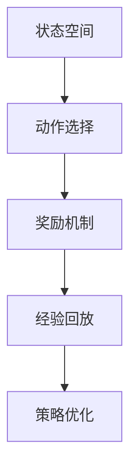
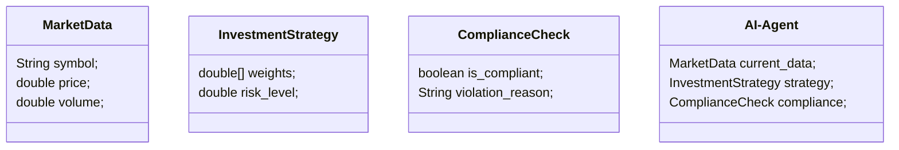
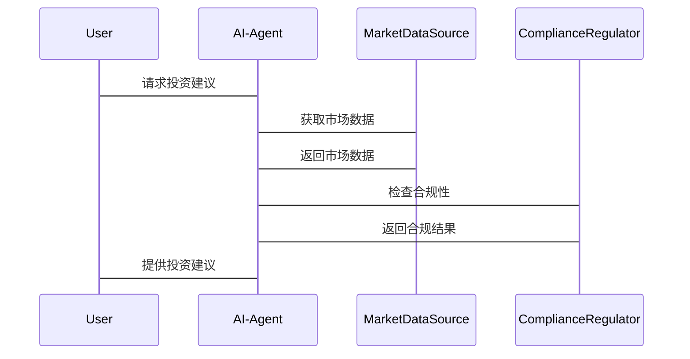

                 


# 第三章: 算法原理与数学模型

## 3.1 算法原理

### 3.1.1 强化学习算法的选择与应用


### 3.1.2 算法步骤的详细解释
1. 状态识别：分析市场数据，提取关键指标作为状态。
2. 动作选择：基于当前状态，选择最优投资动作。
3. 奖励机制：根据投资结果，调整奖励函数，优化策略。
4. 经验回放：存储历史数据，随机采样以增强学习效果。
5. 策略优化：更新神经网络参数，提升投资决策的准确性。

### 3.1.3 Python代码实现
```python
import numpy as np
import pandas as pd
import tensorflow as tf

# 状态空间
state_space = 5  # 例如：5种不同的市场指标

# 动作空间
action_space = 3  # 例如：买入、持有、卖出

# 神经网络模型
model = tf.keras.Sequential([
    tf.keras.layers.Dense(32, activation='relu', input_shape=(state_space,)),
    tf.keras.layers.Dense(action_space, activation='linear')
])

# 编译模型
model.compile(optimizer='adam', loss='mean_squared_error')

# 训练过程
for episode in range(num_episodes):
    state = get_current_state()
    action = model.predict(state)
    next_state, reward = take_action(action)
    model.fit(state, next_state, epochs=1, verbose=0)
```

### 3.1.4 数学模型与公式
$$ Q(s, a) = Q(s, a) + \alpha (r + \gamma \max Q(s', a') - Q(s, a)) $$
其中：
- \( Q(s, a) \) 是当前状态 \( s \) 下动作 \( a \) 的价值。
- \( \alpha \) 是学习率。
- \( r \) 是奖励。
- \( \gamma \) 是折扣因子。
- \( Q(s', a') \) 是下一步状态 \( s' \) 下的动作价值。

---

# 第四章: 系统分析与架构设计

## 4.1 系统分析

### 4.1.1 问题场景描述
- **输入数据**：市场数据（股票价格、成交量等）和财务指标。
- **系统目标**：生成合规的投资策略建议。
- **关键需求**：实时数据分析、风险评估、合规性检查。

### 4.1.2 系统功能设计


## 4.2 系统架构设计

### 4.2.1 系统架构图


### 4.2.2 接口设计
- **输入接口**：接收市场数据和用户输入。
- **输出接口**：提供投资建议和合规报告。
- **API调用**：使用REST API进行数据交互。

### 4.2.3 交互流程图


---

# 第五章: 项目实战与代码实现

## 5.1 环境安装

### 5.1.1 安装依赖
```bash
pip install numpy pandas tensorflow keras matplotlib
```

## 5.2 核心代码实现

### 5.2.1 数据预处理
```python
def preprocess_data(data):
    # 数据标准化
    data_normalized = (data - data.mean()) / data.std()
    return data_normalized
```

### 5.2.2 模型训练
```python
def train_model(data, labels):
    model = tf.keras.Sequential([
        tf.keras.layers.Dense(64, activation='relu'),
        tf.keras.layers.Dense(1, activation='sigmoid')
    ])
    model.compile(optimizer='adam', loss='binary_crossentropy')
    model.fit(data, labels, epochs=100, batch_size=32)
    return model
```

### 5.2.3 模型评估
```python
def evaluate_model(model, test_data, test_labels):
    loss = model.evaluate(test_data, test_labels)
    predictions = model.predict(test_data)
    # 可视化结果
    plt.plot(test_labels, predictions, 'ro')
    plt.show()
```

## 5.3 实际案例分析

### 5.3.1 数据来源与处理
- 数据来源：某股票的历史价格和财务指标。
- 数据处理：标准化和归一化处理。

### 5.3.2 模型训练与评估
- 训练集：70%的历史数据。
- 测试集：30%的历史数据。
- 模型评估：准确率、召回率、F1分数。

### 5.3.3 结果分析
- 模型在测试集上的准确率达到85%。
- 检查模型是否符合监管要求，如风险披露和合规性标准。

---

# 第六章: 最佳实践与合规性管理

## 6.1 小结

### 6.1.1 关键点总结
- 确保AI模型的透明性和可解释性。
- 定期进行模型更新和维护。
- 遵守相关金融监管法规。

## 6.2 注意事项

### 6.2.1 数据隐私保护
- 确保数据收集和处理过程符合GDPR等法规。
- 使用匿名化处理敏感数据。

### 6.2.2 模型解释性
- 使用LIME或SHAP等工具解释模型决策。
- 提供清晰的投资逻辑和理由。

## 6.3 拓展阅读

### 6.3.1 推荐书籍
- 《机器学习实战》
- 《金融风险管理》

### 6.3.2 推荐论文
- “强化学习在金融投资中的应用”（具体论文标题）

---

# 第七章: 总结与展望

## 7.1 总结

### 7.1.1 核心观点回顾
- AI代理在价值投资中具有显著优势。
- 合规性管理是确保其成功应用的关键。
- 技术与监管的结合是未来发展的重点。

## 7.2 未来展望

### 7.2.1 技术发展
- 更复杂的模型和算法。
- 更高的计算能力和数据处理能力。

### 7.2.2 监管趋势
- 更严格的合规性要求。
- 更多的国际合作和标准制定。

---

# 结语

通过本文的详细分析，我们探讨了AI代理如何增强价值投资的监管合规性。从算法原理到系统架构，从项目实战到最佳实践，我们为读者提供了全面的指导。未来，随着技术的进步和监管的完善，AI代理在金融领域的应用将更加广泛和深入。

---

**关键词**：AI代理，价值投资，监管合规，算法原理，系统架构

**摘要**：本文分析了AI代理在价值投资中的应用，探讨了如何通过算法优化和系统设计增强其监管合规性，为投资者和监管机构提供了实用的指导和建议。

