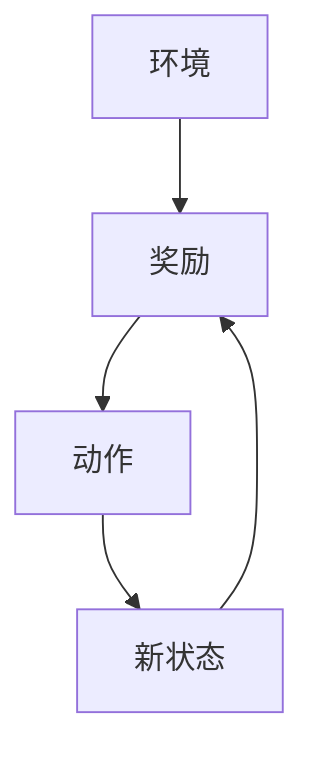

                 


# AI agents实时监控市场：捕捉价值投资机会

---

## 关键词：AI代理、金融市场分析、价值投资、实时监控、投资策略、机器学习、自然语言处理

---

## 摘要：  
本文探讨了AI代理在金融市场实时监控和价值投资机会捕捉中的应用。通过分析AI代理的核心技术，如自然语言处理、强化学习和时间序列分析，结合金融市场数据的获取与处理，提出了一种基于AI代理的投资策略实现方法。文章详细讲解了从数据收集、特征提取到投资策略设计的完整流程，并通过实际案例展示了AI代理在金融投资中的潜力和优势。

---

# 第1章: AI代理与金融市场的结合

## 1.1 AI代理的核心概念

### 1.1.1 AI代理的定义与特点

AI代理（Artificial Intelligence Agents）是指具有感知环境和自主决策能力的智能体，能够在复杂环境中执行任务。其特点包括：

- **自主性**：能够独立决策，无需人工干预。
- **反应性**：能够实时感知环境变化并做出响应。
- **学习能力**：能够通过数据和经验不断优化自身行为。
- **适应性**：能够根据环境变化调整策略。

### 1.1.2 金融市场中的问题背景

金融市场是一个高度动态和不确定的环境，传统的投资分析方法往往依赖于人工经验，存在效率低、主观性强等问题。随着数据量的爆炸式增长，人工分析难以应对海量信息，且容易受到情绪影响。

### 1.1.3 AI代理在金融投资中的应用价值

AI代理能够通过实时监控市场数据、分析新闻和社交媒体信息，快速识别潜在的投资机会。其在金融市场中的应用价值主要体现在：

- **实时监控与预警**：能够实时捕捉市场波动，提前预警风险。
- **自动化交易**：通过算法优化交易策略，实现快速决策。
- **情绪分析与市场预测**：利用自然语言处理技术分析市场情绪，预测价格走势。

### 1.1.4 核心概念与联系

以下是核心概念的对比表格和ER实体关系图：

#### 核心概念对比表

| 概念         | 描述                                                                 |
|--------------|----------------------------------------------------------------------|
| AI代理       | 具有感知和决策能力的智能体                                           |
| 金融市场     | 买卖金融资产的场所，如股票、债券、期货等                            |
| 投资策略     | 为实现投资目标而制定的行动计划                                       |
| 数据分析     | 对金融市场数据进行处理和分析，提取有用信息                          |

#### 实体关系图

```mermaid
erd
    entity 投资策略 {
        id
        名称
        描述
    }
    entity 金融市场数据 {
        id
        时间戳
        股价
        成交量
    }
    entity AI代理 {
        id
        类型
        状态
    }
    AI代理 --> 投资策略: 实现
    AI代理 --> 金融市场数据: 监控
    投资策略 --> 金融市场数据: 基于数据制定策略
```

## 1.2 AI代理与金融市场结合的必要性

### 1.2.1 传统投资分析的局限性

传统投资分析方法依赖于人工经验和主观判断，存在以下问题：

- **信息处理能力有限**：人工难以处理海量数据。
- **情绪影响**：投资者容易受到情绪影响，做出非理性决策。
- **效率低下**：分析过程耗时且效率低。

### 1.2.2 AI代理在实时监控中的优势

AI代理能够通过以下方式弥补传统方法的不足：

- **实时数据处理**：能够快速处理大量数据，捕捉市场变化。
- **自动化决策**：基于算法自动做出交易决策，减少人为错误。
- **持续学习**：能够不断优化自身模型，适应市场变化。

### 1.2.3 投资机会捕捉的新范式

AI代理通过实时监控市场数据和分析情绪，能够发现传统方法难以察觉的投资机会。例如：

- **市场情绪变化**：通过分析社交媒体和新闻，识别市场情绪拐点。
- **趋势预测**：基于历史数据和模式识别，预测未来价格走势。
- **套利机会**：通过分析不同市场的价差，捕捉套利机会。

---

## 1.3 本章小结

本章介绍了AI代理的核心概念及其在金融市场中的应用价值，分析了传统投资分析的局限性，并提出了AI代理在实时监控和投资机会捕捉中的优势。通过对比表格和实体关系图，明确了各核心概念之间的联系。

---

# 第2章: AI代理的核心技术原理

## 2.1 自然语言处理（NLP）在金融文本分析中的应用

### 2.1.1 NLP的基本原理

自然语言处理（NLP）是研究如何让计算机理解和生成人类语言的技术。其基本原理包括：

- **文本分割**：将文本分割成单词或短语。
- **词袋模型**：将文本表示为单词的集合。
- **词嵌入**：通过训练生成词向量，表示单词的语义。

### 2.1.2 金融文本分析的挑战与解决方案

金融文本分析的挑战包括：

- **领域专业性**：金融文本涉及大量专业术语，需要特定的领域知识。
- **信息歧义性**：同一文本可能有多种解读，需要上下文理解。

解决方案包括：

- **预训练模型**：使用如BERT、GPT等预训练模型进行金融文本分析。
- **领域自适应**：通过在金融领域数据上进行微调，提升模型性能。

### 2.1.3 情感分析在金融投资中的应用

情感分析通过判断文本的情感倾向（如正面、负面、中性），可以用于：

- **市场情绪分析**：通过分析社交媒体和新闻，判断市场情绪。
- **个股情绪分析**：通过分析公司新闻和财报，判断投资者对公司的情绪。

---

## 2.2 强化学习在投资策略中的应用

### 2.2.1 强化学习的基本原理

强化学习是一种通过试错机制，学习最优策略的方法。其基本原理包括：

- **状态空间**：环境中的状态描述。
- **动作空间**：智能体可以执行的动作。
- **奖励机制**：根据智能体的动作给予奖励或惩罚。

### 2.2.2 投资策略优化的强化学习模型

在投资策略优化中，强化学习可以用于：

- **交易决策**：通过学习历史数据，制定买卖决策。
- **风险控制**：通过奖励机制，控制投资风险。

### 2.2.3 基于强化学习的投资策略实现

以下是基于强化学习的投资策略实现流程图：



---

## 2.3 时间序列分析与预测

### 2.3.1 时间序列分析的基本方法

时间序列分析是研究随时间变化的数据序列的方法。常用方法包括：

- **ARIMA模型**：自回归积分滑动平均模型。
- **GARCH模型**：广义自回归条件异方差模型。
- **LSTM网络**：长短期记忆网络。

### 2.3.2 基于AI的时间序列预测模型

基于AI的时间序列预测模型包括：

- **LSTM网络**：适用于捕捉时间序列中的长期依赖关系。
- **Transformer模型**：通过自注意力机制，捕捉全局关系。

---

## 2.4 本章小结

本章介绍了AI代理的核心技术，包括自然语言处理、强化学习和时间序列分析。通过分析这些技术在金融投资中的应用，为后续章节奠定了理论基础。

---

# 第3章: 金融市场数据的获取与处理

## 3.1 数据收集与清洗

### 3.1.1 数据来源与获取方法

金融市场数据的主要来源包括：

- **交易所数据**：如股票、期货等交易数据。
- **新闻与社交媒体**：如新闻、博客、社交媒体帖子。
- **财报与公告**：如公司财报、并购公告等。

### 3.1.2 数据清洗与预处理

数据清洗的步骤包括：

- **去重**：去除重复数据。
- **填补缺失值**：对缺失值进行插值处理。
- **异常值处理**：识别并处理异常值。

### 3.1.3 数据格式转换

数据格式转换的目的是为了方便后续分析，常用格式包括：

- **CSV格式**：逗号分隔值格式。
- **JSON格式**：JavaScript对象表示法。
- **数据库存储**：将数据存储到关系型数据库中。

---

## 3.2 市场数据特征提取

### 3.2.1 技术指标与特征工程

技术指标是金融市场分析中常用的指标，包括：

- **移动平均线（MA）**：一定周期内的平均价格。
- **相对强

