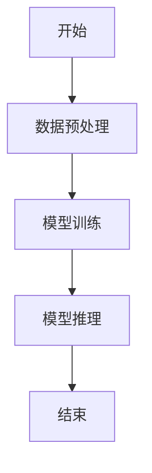
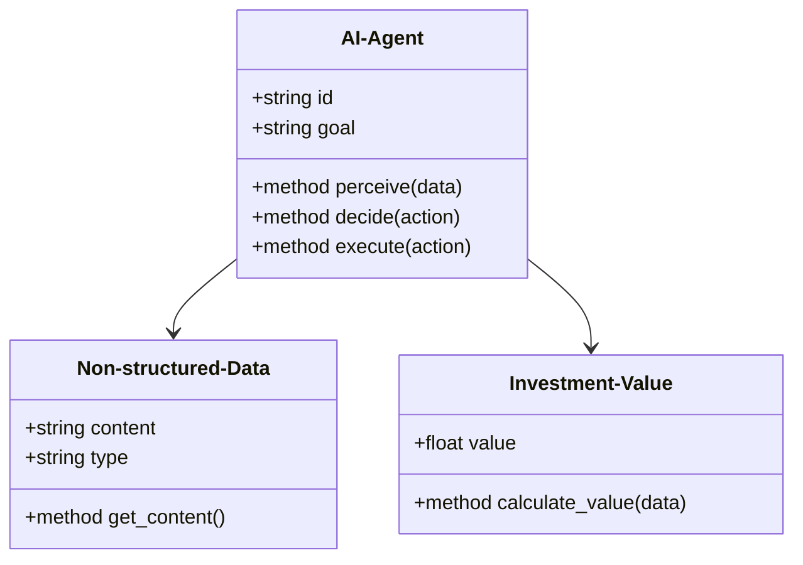

                 


# AI agents挖掘非结构化数据：发现隐藏的投资价值

## 关键词：AI代理、非结构化数据、投资价值、数据挖掘、机器学习

## 摘要：本文深入探讨了AI代理在非结构化数据挖掘中的应用，详细分析了如何通过AI技术发现隐藏的投资价值。文章从背景介绍、核心概念、算法原理、系统架构到项目实战，全面解析了AI代理在投资领域的潜力与挑战。

---

## 第一章: AI 代理与非结构化数据的背景介绍

### 1.1 问题背景与问题描述

#### 1.1.1 非结构化数据的定义与特点
非结构化数据指的是没有固定结构、难以用传统数据库存储和管理的数据形式，主要包括文本、图像、音频、视频等。这些数据通常缺乏明确的模式，但包含丰富的潜在信息。

#### 1.1.2 AI 代理在数据挖掘中的作用
AI代理（AI Agents）是一种能够感知环境、自主决策并采取行动的智能实体。在数据挖掘领域，AI代理能够处理大量非结构化数据，提取有价值的信息，并帮助做出决策。

#### 1.1.3 投资价值发现的核心问题
投资价值的发现依赖于对市场数据的深入分析。非结构化数据的复杂性使得传统方法难以提取有价值的信息，而AI代理通过自然语言处理、机器学习等技术，能够高效地发现隐藏的投资机会。

### 1.2 问题解决与边界定义

#### 1.2.1 非结构化数据的挖掘方法
AI代理通过以下步骤解决非结构化数据的挖掘问题：
1. 数据采集：从多种来源收集非结构化数据。
2. 数据清洗：去除噪声，提取有用信息。
3. 数据分析：使用机器学习算法识别数据中的模式和关联。
4. 投资决策：基于分析结果生成投资建议。

#### 1.2.2 AI 代理在投资中的边界与限制
AI代理在投资中的应用受到以下限制：
1. 数据质量：非结构化数据的准确性直接影响分析结果。
2. 模型泛化能力：AI模型可能无法覆盖所有市场情况。
3. 伦理与合规：数据使用需符合相关法律法规。

#### 1.2.3 核心概念的结构化分析
通过结构化分析，非结构化数据中的投资价值得以量化。例如，通过对新闻文本的情感分析，AI代理可以预测市场情绪，辅助投资决策。

---

## 第二章: 非结构化数据的特性与挑战

### 2.1 非结构化数据的分类

#### 2.1.1 文本数据
文本数据是最常见的非结构化数据形式，包括新闻、社交媒体评论等。这些数据可以通过自然语言处理技术提取关键词和情感信息。

#### 2.1.2 图像与视频数据
图像和视频数据包含丰富的视觉信息，广泛应用于人脸识别、行为分析等领域。AI代理可以通过计算机视觉技术识别图像中的对象和场景。

#### 2.1.3 音频数据
音频数据包括语音、音乐等，通过语音识别技术可以提取语音内容，分析说话人的情绪和意图。

### 2.2 数据处理的挑战

#### 2.2.1 数据清洗与预处理
数据清洗是数据处理的关键步骤，包括去除噪声、填补缺失值等。预处理步骤还包括数据格式转换和归一化。

#### 2.2.2 数据标注的复杂性
非结构化数据的标注需要大量人工参与，例如将文本数据分类为正面、负面或中性情绪。标注的质量直接影响模型的性能。

#### 2.2.3 数据量与计算资源的平衡
处理大规模非结构化数据需要强大的计算资源，包括高性能的CPU和GPU。数据量的增加可能导致计算成本上升。

### 2.3 投资价值发现的难点

#### 2.3.1 数据相关性的评估
非结构化数据的相关性评估需要考虑数据之间的相互作用，例如市场新闻与股价波动之间的关系。

#### 2.3.2 噪声数据的过滤
噪声数据会干扰分析结果，例如虚假新闻或误导性评论。AI代理需要具备辨别噪声的能力，以提高分析的准确性。

#### 2.3.3 动态数据环境的适应
市场环境不断变化，AI代理需要具备动态适应能力，及时更新模型以反映最新的市场趋势。

---

## 第三章: AI 代理的核心概念与原理

### 3.1 AI 代理的基本原理

#### 3.1.1 代理的感知机制
AI代理通过传感器或数据接口感知外部环境，获取非结构化数据。例如，代理可以通过API接口获取社交媒体上的实时信息。

#### 3.1.2 代理的决策机制
代理根据感知到的数据，结合内部知识库和机器学习模型，生成决策。例如，代理可以分析市场情绪，决定是否推荐某只股票。

#### 3.1.3 代理的执行机制
代理根据决策结果采取行动，例如发出买卖指令或生成投资报告。

### 3.2 代理与数据的关系

#### 3.2.1 数据驱动的代理行为
代理的行为完全依赖于输入的数据。例如，代理根据市场新闻生成投资建议。

#### 3.2.2 代理对数据的反馈作用
代理通过执行行为影响数据环境，例如，代理的投资行为可能影响市场供需，进而影响数据。

#### 3.2.3 数据的实时性与代理的响应速度
代理需要快速响应实时数据变化，以适应动态市场环境。

### 3.3 核心概念的ER实体关系图

```mermaid
er
    actor(AI Agent)
    actor(目标数据)
    actor(投资价值)
    actor(决策结果)
    relation(AI Agent --> 目标数据 --> 决策结果)
    relation(AI Agent --> 投资价值 --> 决策结果)
```

---

## 第四章: 算法原理与实现

### 4.1 选择机器学习模型

#### 4.1.1 自然语言处理模型
选择使用BERT模型进行文本分析。BERT是一种基于Transformer的深度学习模型，能够处理长文本数据。

#### 4.1.2 训练与调优
在训练BERT模型时，使用投资相关的文本数据进行微调，以提升模型在金融领域的表现。

### 4.2 模型实现

#### 4.2.1 数据预处理
对文本数据进行分词、去除停用词等预处理步骤。

#### 4.2.2 模型训练
使用预处理后的数据训练BERT模型，设置适当的超参数以优化模型性能。

#### 4.2.3 模型推理
使用训练好的模型对新的文本数据进行分析，生成情感评分和关键词提取结果。

### 4.3 算法流程图



---

## 第五章: 系统架构与设计

### 5.1 系统架构图


### 5.2 类图设计



---

## 第六章: 项目实战

### 6.1 环境安装

#### 6.1.1 安装Python
```bash
python --version
pip install --upgrade pip
```

#### 6.1.2 安装依赖
```bash
pip install transformers pandas numpy
```

### 6.2 核心代码实现

#### 6.2.1 数据采集
```python
import pandas as pd
import requests
from bs4 import BeautifulSoup

def fetch_data(url):
    response = requests.get(url)
    soup = BeautifulSoup(response.text, 'html.parser')
    texts = soup.find_all('p')
    return [text.get_text() for text in texts]
```

#### 6.2.2 模型训练
```python
from transformers import BertForSequenceClassification, BertTokenizer
from torch.utils.data import Dataset, DataLoader

class CustomDataset(Dataset):
    def __init__(self, texts, labels):
        self.texts = texts
        self.labels = labels
        self.tokenizer = BertTokenizer.from_pretrained('bert-base-uncased')

    def __len__(self):
        return len(self.texts)

    def __getitem__(self, idx):
        text = self.texts[idx]
        label = self.labels[idx]
        encoding = self.tokenizer(text, padding='max_length', truncation=True, return_tensors='pt')
        return {
            'input_ids': encoding['input_ids'].flatten(),
            'attention_mask': encoding['attention_mask'].flatten(),
            'labels': torch.tensor(label, dtype=torch.long)
        }

model = BertForSequenceClassification.from_pretrained('bert-base-uncased')
tokenizer = BertTokenizer.from_pretrained('bert-base-uncased')
```

#### 6.2.3 模型推理
```python
def predict(text):
    inputs = tokenizer(text, padding=True, truncation=True, return_tensors='pt')
    outputs = model(**inputs)
    prediction = torch.argmax(outputs.logits).item()
    return prediction
```

### 6.3 实际案例分析

#### 6.3.1 数据来源
从新闻网站爬取财经新闻，训练模型预测市场情绪。

#### 6.3.2 模型表现
通过验证集评估模型的准确率和F1分数，优化模型参数以提高预测精度。

#### 6.3.3 投资建议
根据模型预测结果生成投资建议，例如在市场情绪为正面时推荐买入股票。

---

## 第七章: 总结与展望

### 7.1 总结

本文详细介绍了AI代理在非结构化数据挖掘中的应用，通过理论分析和实际案例展示了如何利用AI技术发现隐藏的投资价值。AI代理通过感知、决策和执行机制，能够高效地处理非结构化数据，为投资决策提供支持。

### 7.2 未来展望

未来，AI代理在投资领域的应用将更加广泛。结合区块链技术，可以实现更加安全和透明的数据处理。边缘计算的引入将提升代理的实时处理能力，适应动态市场环境。

### 7.3 最佳实践 tips

- 数据标注需谨慎，确保数据质量。
- 模型选择应根据具体任务需求，避免盲目追求复杂性。
- 注意数据隐私保护，遵守相关法律法规。

---

通过本文的分析，读者可以深入了解AI代理在非结构化数据挖掘中的潜力，并为实际应用提供有价值的参考。

