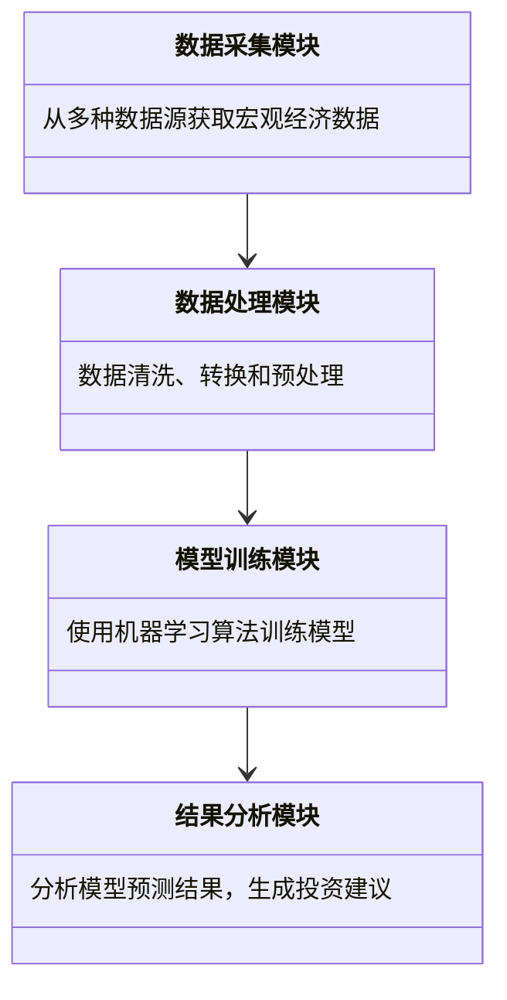
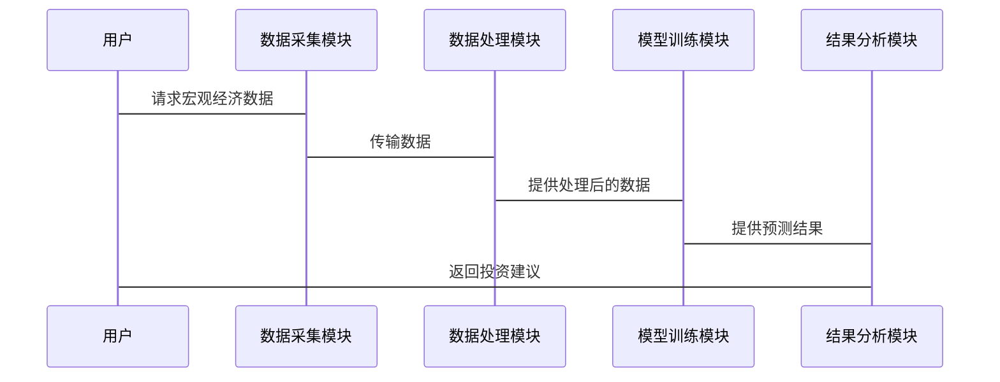

                 


# AI agents辅助价值投资者解读宏观经济指标

> 关键词：AI代理，宏观经济指标，价值投资，自然语言处理，时间序列分析

> 摘要：本文详细探讨了AI代理如何辅助价值投资者解读宏观经济指标。通过分析宏观经济指标的核心概念、AI代理在价值投资中的作用、自然语言处理与时间序列分析的算法原理，以及系统架构设计，本文为读者提供了全面的视角，展示了AI代理在宏观经济分析中的潜力和应用。通过实际案例分析，本文进一步验证了AI代理在价值投资中的实际价值。

---

# 第一部分: AI代理与宏观经济指标基础

## 第1章: AI代理与宏观经济指标概述

### 1.1 AI代理的核心概念

#### 1.1.1 什么是AI代理
AI代理（Artificial Intelligence Agent）是指能够感知环境、自主决策并采取行动的智能体。在投资领域，AI代理可以通过分析数据和市场动态，为投资者提供决策支持。

#### 1.1.2 AI代理的基本特征
- **自主性**：能够在没有人为干预的情况下运行。
- **反应性**：能够实时感知环境并做出反应。
- **目标导向**：根据预设目标采取行动。
- **学习能力**：通过机器学习算法不断优化性能。

#### 1.1.3 宏观经济指标的定义与分类
宏观经济指标是衡量经济运行状态的统计指标，主要包括：
- **GDP（国内生产总值）**：衡量一个国家或地区的经济总规模。
- **失业率**：衡量劳动力市场的情况。
- **通货膨胀率**：衡量价格水平的变化。
- **利率**：衡量资金成本。
- **PMI（采购经理人指数）**：衡量制造业和服务业的经济活动。

---

### 1.2 价值投资与宏观经济分析

#### 1.2.1 价值投资的基本原理
价值投资是一种投资策略，通过分析企业的基本面，寻找市场价格低于其内在价值的投资机会。宏观经济指标对企业的盈利能力、行业趋势和市场环境有重要影响。

#### 1.2.2 宏观经济指标对投资决策的影响
- **GDP增长**：影响整体经济环境和企业盈利能力。
- **失业率**：影响消费能力和企业用人成本。
- **通货膨胀率**：影响企业的成本和利润。
- **利率**：影响企业的融资成本和投资决策。

#### 1.2.3 AI代理在价值投资中的作用
AI代理可以通过分析宏观经济指标和企业基本面数据，帮助投资者识别潜在的投资机会，优化投资组合，并降低风险。

---

## 第2章: AI代理与宏观经济指标的关系

### 2.1 AI代理如何辅助解读宏观经济指标

#### 2.1.1 自然语言处理在宏观经济分析中的应用
自然语言处理（NLP）可以帮助AI代理从新闻报道、政策文件等文本数据中提取信息，分析宏观经济趋势。例如，通过分析政府发布的经济报告，AI代理可以预测未来的经济政策变化。

#### 2.1.2 时间序列分析与宏观经济预测
时间序列分析是一种统计方法，用于分析和预测随时间变化的数据。AI代理可以通过时间序列分析预测GDP、PMI等指标的变化趋势，帮助投资者做出更准确的决策。

#### 2.1.3 数据挖掘在宏观经济指标分析中的作用
数据挖掘技术可以帮助AI代理从海量数据中发现隐藏的模式和趋势，例如通过分析历史数据，识别经济周期的变化规律。

---

### 2.2 宏观经济指标的特征与挑战

#### 2.2.1 宏观经济指标的复杂性
宏观经济指标通常受到多种因素的影响，例如政策变化、国际市场波动等，这使得指标的分析和预测具有较高的复杂性。

#### 2.2.2 数据噪声与缺失的处理
宏观经济数据往往存在噪声和缺失，AI代理需要通过数据清洗和补全技术，提高数据的质量和可用性。

#### 2.2.3 宏观经济指标的动态变化
宏观经济指标会随着时间推移而变化，AI代理需要具备动态适应能力，实时更新模型和预测结果。

---

## 第3章: AI代理辅助价值投资者的背景与需求

### 3.1 宏观经济分析的复杂性

#### 3.1.1 宏观经济指标的多维度性
宏观经济指标涉及多个维度，例如GDP、失业率、通货膨胀率等，投资者需要综合分析这些指标，才能做出准确的投资决策。

#### 3.1.2 宏观经济指标的相互关联性
宏观经济指标之间存在相互关联，例如高失业率可能导致低消费，进而影响企业的盈利能力。AI代理需要分析这些关联性，帮助投资者全面理解经济环境。

#### 3.1.3 宏观经济指标的实时性需求
宏观经济指标的变化可能对市场产生即时影响，投资者需要实时获取和分析这些指标，以抓住投资机会或规避风险。

---

### 3.2 价值投资者的需求分析

#### 3.2.1 价值投资者对宏观经济指标的敏感性
价值投资者注重企业的内在价值，但宏观经济指标的变化会影响企业的经营环境和盈利能力，因此投资者需要密切关注宏观经济指标的变化。

#### 3.2.2 价值投资者对实时分析的需求
价值投资者需要实时了解宏观经济指标的变化，以便及时调整投资策略。AI代理可以通过实时数据流处理，满足投资者的这一需求。

#### 3.2.3 价值投资者对个性化分析的需求
每位投资者的策略和目标可能不同，AI代理需要根据投资者的个性化需求，提供定制化的宏观经济分析和投资建议。

---

## 第4章: AI代理辅助宏观经济指标分析的核心原理

### 4.1 自然语言处理在宏观经济分析中的应用

#### 4.1.1 文本数据的预处理
在使用自然语言处理技术分析宏观经济指标之前，需要对文本数据进行预处理，包括分词、去停用词、实体识别等步骤。

#### 4.1.2 基于Transformer的宏观经济文本分析
Transformer模型（如BERT）可以用于分析宏观经济相关的文本数据，提取关键信息和情感倾向。例如，分析新闻标题的情绪，预测市场走势。

#### 4.1.3 自然语言处理在宏观经济新闻分析中的应用
通过自然语言处理技术，AI代理可以从新闻报道中提取关键信息，例如政策变化、行业趋势等，帮助投资者做出更准确的决策。

---

### 4.2 时间序列分析与宏观经济预测

#### 4.2.1 时间序列分析的基本原理
时间序列分析是一种统计方法，用于分析随时间变化的数据。其核心在于识别数据中的趋势、周期性和随机性，以便进行预测。

#### 4.2.2 基于LSTM的宏观经济预测模型
长短时记忆网络（LSTM）是一种特殊的循环神经网络（RNN），能够有效处理时间序列数据。通过训练LSTM模型，AI代理可以预测未来的宏观经济指标变化。

#### 4.2.3 时间序列分析在宏观经济预测中的应用
例如，使用LSTM模型预测GDP增长率，帮助投资者评估经济前景，优化投资组合。

---

## 第5章: 宏观经济指标分析的系统架构设计

### 5.1 系统功能设计

#### 5.1.1 数据采集模块
数据采集模块负责从多种数据源（如政府发布的经济报告、新闻网站、社交媒体等）获取宏观经济数据。

#### 5.1.2 数据处理模块
数据处理模块对采集到的数据进行清洗、转换和预处理，确保数据的准确性和一致性。

#### 5.1.3 模型训练模块
模型训练模块使用机器学习算法（如LSTM、随机森林等）对数据进行训练，生成宏观经济预测模型。

#### 5.1.4 结果分析模块
结果分析模块对模型的预测结果进行分析和解释，生成投资建议和风险提示。

---

### 5.2 系统架构设计

#### 5.2.1 领域模型设计
领域模型展示了系统各模块之间的关系，使用Mermaid类图表示如下：



---

### 5.3 系统接口设计

#### 5.3.1 数据接口
- 数据接口用于与外部数据源（如政府数据库、新闻网站）进行数据交换。
- 使用API（如RESTful API）实现数据的实时获取。

#### 5.3.2 用户接口
- 用户接口是投资者与AI代理交互的界面，可以是Web界面或移动应用。
- 用户可以通过界面查看宏观经济指标的分析结果和投资建议。

---

### 5.4 系统交互设计

#### 5.4.1 系统交互流程
使用Mermaid序列图表示系统交互流程：



---

## 第6章: 项目实战

### 6.1 环境安装

#### 6.1.1 安装Python环境
使用Python 3.8及以上版本，并安装以下库：
- `numpy`
- `pandas`
- `tensorflow`
- `scikit-learn`
- `requests`

#### 6.1.2 数据集获取
从政府数据库或新闻网站获取宏观经济数据，并存储为CSV格式。

---

### 6.2 系统核心实现

#### 6.2.1 数据处理代码
```python
import pandas as pd
import numpy as np

# 读取数据
data = pd.read_csv('macro_economic_indicators.csv')

# 数据清洗
data.dropna(inplace=True)
data['date'] = pd.to_datetime(data['date'])
data.set_index('date', inplace=True)

# 数据标准化
from sklearn.preprocessing import StandardScaler

scaler = StandardScaler()
scaled_data = scaler.fit_transform(data)
```

#### 6.2.2 模型训练代码
```python
from tensorflow.keras.models import Sequential
from tensorflow.keras.layers import LSTM, Dense

# 构建LSTM模型
model = Sequential()
model.add(LSTM(units=50, input_shape=(None, data.shape[1])))
model.add(Dense(1))
model.compile(loss='mean_squared_error', optimizer='adam')

# 训练模型
model.fit(scaled_data[:-100], scaled_data[100:], epochs=50, batch_size=32)
```

#### 6.2.3 结果分析代码
```python
# 预测结果
predicted_data = model.predict(scaled_data[-100:])
# 反转标准化
predicted_data = scaler.inverse_transform(predicted_data)

# 可视化结果
import matplotlib.pyplot as plt

plt.plot(predicted_data, label='预测值')
plt.plot(data[-100:], label='真实值')
plt.xlabel('时间')
plt.ylabel('指标值')
plt.legend()
plt.show()
```

---

### 6.3 实际案例分析

#### 6.3.1 数据来源与处理
以GDP数据为例，从政府数据库获取历史GDP数据，并进行清洗和标准化处理。

#### 6.3.2 模型训练与预测
使用LSTM模型预测未来的GDP增长率，并与实际数据进行对比，评估模型的准确性。

#### 6.3.3 投资建议生成
根据模型预测结果，生成投资建议，例如：
- 如果GDP增长率预测为上升，建议增加股票投资。
- 如果GDP增长率预测为下降，建议减少股票投资，增加债券投资。

---

## 第7章: 总结与展望

### 7.1 总结
本文详细探讨了AI代理如何辅助价值投资者解读宏观经济指标，包括自然语言处理、时间序列分析等技术的应用，以及系统的架构设计和项目实战。

### 7.2 小结
AI代理在宏观经济分析中的应用前景广阔，可以帮助投资者更准确地理解经济环境，优化投资决策。

### 7.3 注意事项
- 数据的准确性和及时性对模型的预测结果有重要影响。
- 模型的可解释性需要进一步提高，以便投资者更好地理解预测结果。

### 7.4 拓展阅读
- 《Deep Learning for Time Series Forecasting》
- 《自然语言处理在金融领域的应用》

---

通过本文的分析，读者可以全面了解AI代理在宏观经济分析中的应用，并能够实际操作相关技术，为价值投资提供有力支持。

