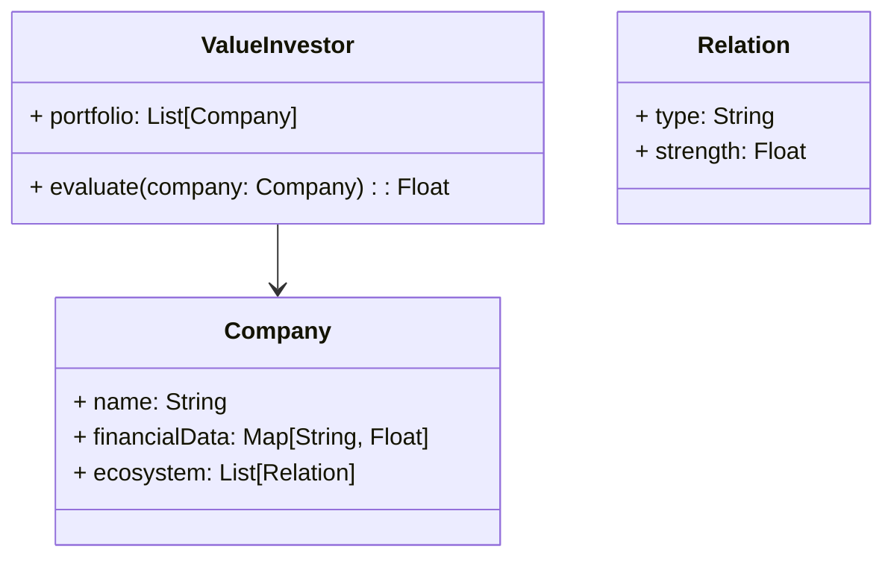
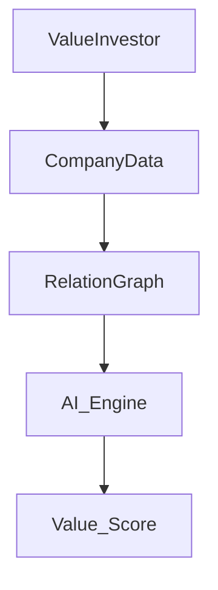

                 


# AI agents辅助价值投资者评估公司的平台生态价值

> 关键词：AI agents, 价值投资者, 平台生态价值, 强化学习, 图神经网络, 系统架构设计

> 摘要：本文探讨了AI agents在辅助价值投资者评估公司平台生态价值中的应用。通过分析平台生态价值的核心要素，设计了一种基于强化学习和图神经网络的AI agents模型，提出了系统架构设计和实现方案，并通过实际案例验证了模型的有效性。

---

## 第一部分: AI agents辅助价值投资者评估公司的平台生态价值概述

### 第1章: 背景介绍与核心概念

#### 1.1 问题背景与问题描述

- **1.1.1 价值投资者的决策挑战**
  - 价值投资者需要评估公司的长期价值，而平台生态价值是其中的关键因素。
  - 公司的平台生态包括供应链、合作伙伴、客户关系等，这些因素相互作用，影响公司的整体价值。
  - 传统的财务指标（如利润、收入）无法完全反映平台生态的复杂性。

- **1.1.2 平台生态价值的定义与外延**
  - 平台生态价值：指公司通过构建和维护一个生态系统所创造的价值，包括生态的广度、深度、互动频率和稳定性。
  - 外延：涉及供应链管理、合作伙伴关系、客户忠诚度等方面。

- **1.1.3 AI agents在价值评估中的作用**
  - AI agents可以通过数据挖掘、模式识别和预测分析，帮助投资者识别生态系统的潜在风险和机会。
  - AI agents能够实时监控生态系统的动态变化，提供及时的评估和建议。

#### 1.2 核心概念与概念结构

- **1.2.1 AI agents的定义与特点**
  - AI agents：具有感知环境、自主决策和执行任务的能力。
  - 特点：智能性、自主性、反应性、协作性。

- **1.2.2 价值投资者的行为模式**
  - 价值投资者关注长期收益，注重公司的基本面和竞争优势。
  - 他们的决策依赖于对生态系统全面的理解和分析。

- **1.2.3 平台生态价值的核心要素**
  - 生态系统的广度：合作伙伴的数量和多样性。
  - 生态系统的深度：合作伙伴之间的互动频率和协同效应。
  - 生态系统的稳定性：合作伙伴关系的长期性和可靠性。

---

## 第二部分: AI agents与平台生态价值的核心原理

### 第2章: AI agents的核心原理与算法

#### 2.1 AI agents的基本原理

- **2.1.1 强化学习在AI agents中的应用**
  - 强化学习：通过试错和奖励机制，训练AI agents做出最优决策。
  - 应用场景：生态系统的动态优化和风险预测。

- **2.1.2 图神经网络在生态价值评估中的作用**
  - 图神经网络：用于建模复杂的生态系统，分析节点之间的关系和权重。
  - 应用场景：识别关键合作伙伴和潜在风险点。

- **2.1.3 多智能体协作机制**
  - 多智能体协作：多个AI agents协同工作，分别负责不同的任务（如数据收集、风险评估、决策优化）。
  - 协作机制：通过消息传递和任务分配实现协作。

#### 2.2 平台生态价值评估的数学模型

- **2.2.1 生态价值评估的公式表示**
  $$ V = f(e, s, c) $$
  其中：
  - $e$：生态系统的复杂性（如合作伙伴的数量和互动频率）。
  - $s$：系统的稳定性（如合作伙伴关系的长期性）。
  - $c$：用户的反馈和评价（如客户满意度）。

---

## 第三部分: 系统分析与架构设计

### 第3章: 系统分析与架构设计

#### 3.1 问题场景与项目介绍

- **3.1.1 价值投资者的决策场景**
  - 投资者需要实时监控多个公司的平台生态，评估其价值。
  - 竞争对手的生态系统变化可能影响投资决策。

- **3.1.2 平台生态价值评估的项目目标**
  - 构建一个AI agents系统，帮助投资者实时评估和预测平台生态价值。
  - 提供可视化界面，便于投资者理解和分析。

#### 3.2 系统功能设计

- **3.2.1 领域模型设计（Mermaid类图）**


#### 3.3 系统架构设计

- **3.3.1 系统架构图（Mermaid架构图）**


---

## 第四部分: 项目实战与代码实现

### 第4章: 项目实战与代码实现

#### 4.1 环境安装与配置

- **4.1.1 安装Python和相关库**
  ```bash
  pip install numpy pandas scikit-learn networkx
  ```

#### 4.2 系统核心实现源代码

- **4.2.1 强化学习代码示例**
  ```python
  import numpy as np
  import random

  class AI-Agent:
      def __init__(self, state_space, action_space):
          self.state_space = state_space
          self.action_space = action_space
          self.q_table = np.zeros((state_space, action_space))

      def act(self, state):
          return random.choice(self.action_space)

      def learn(self, state, action, reward, next_state):
          self.q_table[state][action] += reward
  ```

- **4.2.2 图神经网络代码示例**
  ```python
  import networkx as nx

  class Graph Neural Network:
      def __init__(self, nodes, edges):
          self.graph = nx.Graph()
          self.graph.add_nodes_from(nodes)
          self.graph.add_edges_from(edges)

      def compute_embeddings(self):
          # 使用图嵌入算法计算节点表示
          pass
  ```

#### 4.3 代码应用解读与分析

- **4.3.1 强化学习模型的训练**
  - 使用真实数据训练AI agents，优化其决策策略。
  - 通过奖励机制强化正确的决策，弱化错误的决策。

- **4.3.2 图神经网络模型的应用**
  - 将公司生态系统建模为图结构，分析节点之间的关系。
  - 使用图嵌入算法计算节点的表示，识别关键合作伙伴。

#### 4.4 实际案例分析和详细讲解剖析

- **4.4.1 案例分析**
  - 以某公司为例，分析其生态系统。
  - 使用AI agents模型评估其生态价值。
  - 提供可视化报告，帮助投资者做出决策。

#### 4.5 项目小结

- 本章通过实际案例展示了AI agents在平台生态价值评估中的应用。
- 通过代码实现和案例分析，验证了模型的有效性和实用性。

---

## 第五部分: 总结与展望

### 第5章: 总结与展望

#### 5.1 最佳实践 tips

- 数据质量是模型性能的关键，建议使用高质量、多源数据进行训练。
- 定期更新模型参数，适应生态系统的变化。
- 在实际应用中，结合投资者的主观判断，避免模型的片面性。

#### 5.2 小结

- 本文提出了基于AI agents的平台生态价值评估方法。
- 通过强化学习和图神经网络，构建了一个高效的评估系统。
- 该系统能够帮助价值投资者做出更明智的投资决策。

#### 5.3 注意事项

- 数据隐私和安全问题需要特别注意，确保投资者数据的保密性。
- 模型的可解释性是一个挑战，需要进一步研究。

#### 5.4 拓展阅读

- 《强化学习入门》
- 《图神经网络实战》
- 《价值投资策略》

---

通过本文的详细分析和代码实现，我们展示了AI agents在平台生态价值评估中的巨大潜力。未来的研究可以进一步探索更复杂的模型和更广泛的应用场景，为价值投资者提供更强大的工具和决策支持。

