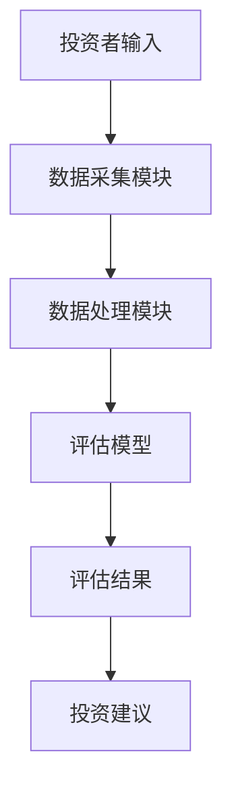
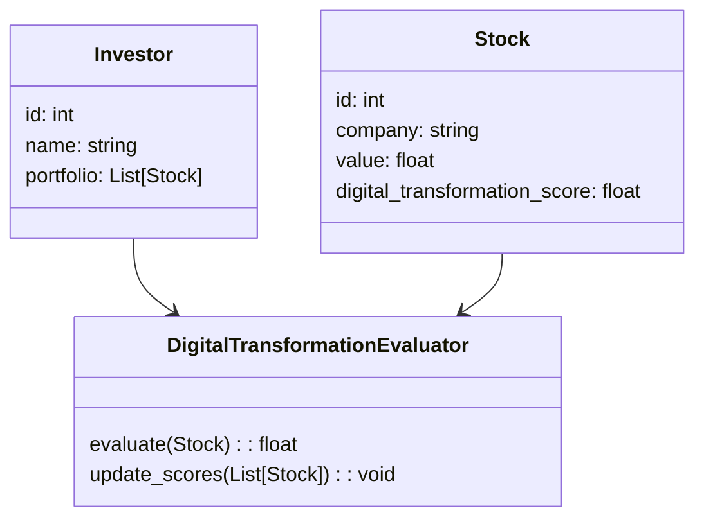
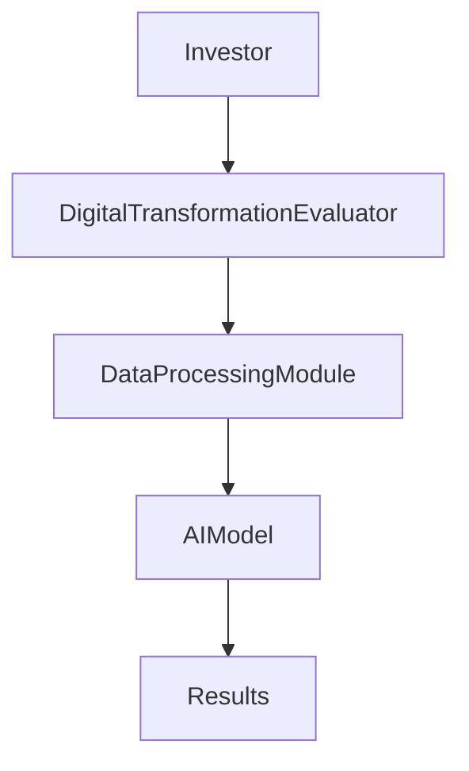
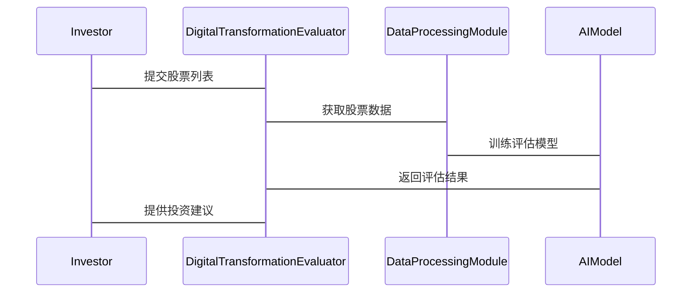

                 


# AI agents辅助价值投资者评估公司的数字化转型速度

## 关键词：AI agents, 价值投资者, 数字化转型, 投资决策, 企业评估

## 摘要：  
随着数字化转型在全球范围内的加速推进，企业之间的竞争日益激烈，价值投资者需要更高效、更精准的方法来评估公司的数字化转型速度。AI agents作为一种新兴的技术工具，能够通过深度学习和自然语言处理等技术，帮助投资者快速分析企业的数字化转型能力，从而做出更明智的投资决策。本文将从AI agents的核心原理、数字化转型评估方法、系统设计与实现等方面展开详细分析，为价值投资者提供一种全新的评估工具和思路。

---

# 第一部分: 引言

# 第1章: 背景介绍

## 1.1 问题背景  
数字化转型已成为全球企业发展的核心驱动力。企业通过数字化技术的应用，能够显著提升运营效率、优化业务流程、改善客户体验，从而在市场竞争中占据优势。然而，对于价值投资者而言，如何准确评估一家公司的数字化转型速度，成为一个极具挑战性的难题。传统的评估方法依赖于人工分析和经验判断，耗时且容易受到主观因素的影响。因此，引入AI agents技术，利用其强大的数据处理能力和自动化决策能力，成为解决这一问题的关键。

### 1.1.1 数字化转型的定义与重要性  
数字化转型是指通过技术手段（如大数据、人工智能、云计算等）对企业的业务模式、运营流程、组织架构等进行重新设计和优化的过程。数字化转型能够显著提升企业的竞争力和创新能力，是企业在当前数字经济时代的核心战略之一。

### 1.1.2 价值投资者的决策挑战  
价值投资者通常关注企业的长期价值和成长潜力，他们需要对企业的财务状况、市场地位、管理团队等多个维度进行全面评估。然而，数字化转型的复杂性和动态性使得传统评估方法难以捕捉企业的数字化能力，这成为价值投资者面临的重大挑战。

### 1.1.3 AI agents在投资决策中的作用  
AI agents是一种能够自主感知环境、做出决策并执行任务的智能体。它们通过数据驱动的方法，能够快速分析企业的数字化转型能力，为投资者提供客观、精准的评估结果。AI agents的应用不仅提高了评估效率，还能够发现传统方法难以察觉的潜在风险和机会。

## 1.2 问题描述  
在数字化转型的背景下，价值投资者需要评估企业数字化转型的速度和效果。然而，传统评估方法存在以下问题：  
1. 数据量庞大且复杂，难以快速处理和分析。  
2. 评估指标主观性强，缺乏统一的标准。  
3. 企业数字化转型的动态性要求评估方法具有更高的灵活性和实时性。  

### 1.2.1 数字化转型速度的评估难点  
数字化转型是一个持续的过程，涉及多个维度的指标，如技术创新能力、数字化投入、团队能力等。如何将这些指标量化，并动态跟踪企业的转型进度，是评估过程中的核心难点。

### 1.2.2 价值投资者的需求与目标  
价值投资者关注企业的长期价值和成长潜力，他们需要通过评估企业的数字化转型能力，判断其在未来市场中的竞争力。因此，投资者需要一种能够实时跟踪企业数字化转型进度的工具。

### 1.2.3 AI agents辅助决策的核心问题  
AI agents需要能够从企业的内外部数据中提取关键信息，分析企业的数字化转型能力，并为投资者提供决策支持。这涉及到数据采集、特征提取、模型训练等多个技术环节。

## 1.3 问题解决  
通过引入AI agents技术，价值投资者能够更高效地评估企业的数字化转型速度。AI agents能够从企业的公开数据、行业报告、新闻资讯等多源数据中提取关键信息，构建数字化转型评估模型，并为投资者提供实时的评估结果和决策建议。

### 1.3.1 AI agents如何辅助价值投资者  
AI agents通过分析企业的数字化转型指标，评估其在市场中的竞争力，并为投资者提供个性化的投资建议。

### 1.3.2 数字化转型评估的创新方法  
本文提出了一种基于AI agents的数字化转型评估方法，通过构建多维度评估指标体系，结合机器学习算法，实现对企业数字化转型能力的精准评估。

### 1.3.3 价值投资与AI技术的结合  
通过AI agents技术，价值投资者能够更快速、更准确地发现具有潜力的企业，优化投资组合，降低投资风险。

## 1.4 边界与外延  
数字化转型的评估需要明确的边界，包括企业数字化转型的范围、评估指标的选择以及AI agents的应用场景等。本文将重点分析AI agents在价值投资中的应用边界，确保评估结果的准确性和可操作性。

### 1.4.1 数字化转型的边界定义  
数字化转型的边界包括企业的业务模式、组织架构、技术应用等多个方面，需要根据企业的实际情况进行动态调整。

### 1.4.2 价值投资的适用范围  
价值投资的适用范围主要集中在那些具有长期增长潜力的企业，尤其是那些在数字化转型中表现突出的企业。

### 1.4.3 AI agents的应用场景与限制  
AI agents的应用场景包括企业数据的实时监控、数字化转型指标的动态评估等，但其应用也受到数据质量和模型精度的限制。

## 1.5 概念结构与核心要素组成  
数字化转型评估的核心要素包括企业的技术创新能力、数字化投入、管理团队能力等。AI agents通过这些要素的综合评估，为投资者提供决策支持。

### 1.5.1 数字化转型的核心要素  
数字化转型的核心要素包括技术创新能力、数字化投入、管理团队能力、客户体验等。

### 1.5.2 价值投资的关键指标  
价值投资的关键指标包括企业的财务状况、市场地位、管理团队、创新能力等。

### 1.5.3 AI agents的功能模块  
AI agents的功能模块包括数据采集、特征提取、模型训练、评估分析等。

---

# 第二部分: 核心概念与联系

# 第2章: AI agents的核心原理

## 2.1 AI agents的定义与特点  
AI agents是一种能够自主感知环境、做出决策并执行任务的智能体。它们通过数据驱动的方法，能够快速分析企业的数字化转型能力，为投资者提供客观、精准的评估结果。

### 2.1.1 AI agents的定义  
AI agents是一种能够自主感知环境、做出决策并执行任务的智能体。它们通过数据驱动的方法，能够快速分析企业的数字化转型能力，为投资者提供客观、精准的评估结果。

### 2.1.2 AI agents的核心特点  
1. 自主性：AI agents能够自主感知环境并做出决策。  
2. 反应性：AI agents能够根据环境变化实时调整行为。  
3. 学习能力：AI agents能够通过机器学习算法不断优化自身的决策能力。  

## 2.2 价值投资的核心原理  
价值投资是一种以企业长期价值为导向的投资策略。投资者通过分析企业的财务状况、市场地位、管理团队等因素，判断其投资价值。

### 2.2.1 价值投资的定义  
价值投资是一种以企业长期价值为导向的投资策略。投资者通过分析企业的财务状况、市场地位、管理团队等因素，判断其投资价值。

### 2.2.2 价值投资的关键指标  
1. 财务状况：企业的盈利能力、资产负债情况等。  
2. 市场地位：企业在市场中的竞争地位。  
3. 管理团队：企业的管理团队能力。  

## 2.3 AI agents与数字化转型的关系  
AI agents通过分析企业的数字化转型指标，评估其在市场中的竞争力，并为投资者提供实时的评估结果和决策建议。

### 2.3.1 AI agents如何影响数字化转型  
AI agents通过分析企业的数字化转型指标，评估其在市场中的竞争力，并为投资者提供实时的评估结果和决策建议。

### 2.3.2 数字化转型对AI agents的需求  
数字化转型的动态性和复杂性要求AI agents具备更高的灵活性和实时性。

### 2.3.3 AI agents在价值投资中的作用  
AI agents通过分析企业的数字化转型能力，为投资者提供精准的评估结果和决策建议。

## 2.4 核心概念对比表格  
以下是AI agents与传统算法、数字化转型与传统转型、价值投资与传统投资的核心概念对比：

| **对比项**        | **AI agents**                | **传统算法**                |
|--------------------|------------------------------|-----------------------------|
| 决策能力           | 自主感知环境，动态调整决策   | 预先设定规则，无法动态调整 |
| 学习能力           | 具备机器学习能力，不断优化   | 无学习能力，固定不变       |
| 适应性             | 能够适应环境变化             | 适应性较弱                 |

---

# 第三部分: 算法原理讲解

# 第3章: AI agents的算法原理  

## 3.1 强化学习算法  
强化学习是一种通过试错方式优化决策的算法。AI agents通过与环境的交互，不断优化自身的决策策略。

### 3.1.1 算法流程  
1. 状态感知：AI agents感知当前环境状态。  
2. 动作选择：根据当前状态选择最优动作。  
3. 奖励反馈：根据动作执行结果获得奖励或惩罚。  
4. 策略优化：根据奖励反馈优化决策策略。  

### 3.1.2 算法实现  
以下是强化学习算法的Python实现示例：

```python
class Agent:
    def __init__(self, state_space, action_space):
        self.state_space = state_space
        self.action_space = action_space
        self.model = self.build_model()

    def build_model(self):
        # 构建神经网络模型
        pass

    def act(self, state):
        # 根据当前状态选择动作
        pass

    def learn(self, state, action, reward, next_state):
        # 根据奖励反馈优化模型
        pass
```

## 3.2 自然语言处理算法  
自然语言处理（NLP）用于分析企业的文本数据，如公司公告、新闻报道等，提取关键信息。

### 3.2.1 算法流程  
1. 数据预处理：对文本数据进行清洗和分词。  
2. 特征提取：提取文本中的关键词和情感倾向。  
3. 模型训练：基于特征数据训练NLP模型。  

### 3.2.2 算法实现  
以下是NLP算法的Python实现示例：

```python
from sklearn.feature_extraction.text import TfidfVectorizer
from sklearn.svm import SVC

# 数据预处理
documents = ["This is a sample document.", "This is another document."]

# 特征提取
vectorizer = TfidfVectorizer()
X = vectorizer.fit_transform(documents)

# 模型训练
model = SVC()
model.fit(X, [0, 1])
```

## 3.3 数学模型和公式  

### 3.3.1 强化学习的数学模型  
强化学习的核心是通过最大化累积奖励来优化决策策略。数学公式如下：  
$$ Q(s, a) = Q(s, a) + \alpha (r + \gamma \max Q(s', a') - Q(s, a)) $$  
其中，$Q(s, a)$表示在状态$s$下执行动作$a$的Q值，$\alpha$是学习率，$r$是奖励，$\gamma$是折扣因子，$s'$是下一状态。  

### 3.3.2 自然语言处理的数学模型  
文本相似度计算通常采用余弦相似度：  
$$ \text{similarity} = \frac{\mathbf{v}_1 \cdot \mathbf{v}_2}{\|\mathbf{v}_1\| \|\mathbf{v}_2\|} $$  
其中，$\mathbf{v}_1$和$\mathbf{v}_2$是文本的特征向量。  

---

# 第四部分: 系统设计与实现

# 第4章: 系统设计  

## 4.1 系统架构设计  
以下是AI agents辅助价值投资者评估公司的数字化转型速度的系统架构图：



## 4.2 功能设计  

### 4.2.1 领域模型设计  
以下是系统功能的类图：



### 4.2.2 系统架构设计  
以下是系统的架构图：



## 4.3 接口设计  
系统主要接口包括：  
1. `evaluate(Stock)`: 评估单个股票的数字化转型能力。  
2. `update_scores(List[Stock])`: 更新多个股票的评估结果。  

## 4.4 交互流程设计  
以下是系统的交互流程图：



---

# 第五部分: 项目实战

# 第5章: 项目实战  

## 5.1 环境安装  
需要安装以下工具和库：  
1. Python 3.8+  
2. TensorFlow  
3. Scikit-learn  
4. NLTK  

## 5.2 核心代码实现  

### 5.2.1 数据采集模块  
以下是数据采集模块的实现代码：

```python
import requests
from bs4 import BeautifulSoup

def get_stock_data(ticker):
    url = f"https://finance.yahoo.com/quote/{ticker}"
    response = requests.get(url)
    soup = BeautifulSoup(response.text, 'html.parser')
    data = {
        'name': soup.find('h1').text,
        'price': float(soup.find('span', {'class': 'Fw(b)'}).text)
    }
    return data
```

### 5.2.2 评估模型训练  
以下是评估模型的训练代码：

```python
from sklearn.model_selection import train_test_split
from sklearn.ensemble import RandomForestRegressor

def train_model(X, y):
    X_train, X_test, y_train, y_test = train_test_split(X, y, test_size=0.2)
    model = RandomForestRegressor(n_estimators=100)
    model.fit(X_train, y_train)
    return model
```

## 5.3 数据处理与分析  
通过对企业的数字化转型指标进行数据清洗和特征工程，构建评估模型所需的特征集。

## 5.4 案例分析  
以某科技公司为例，分析其数字化转型能力，并基于AI agents的评估结果，提供投资建议。

---

# 第六部分: 结论与展望

## 6.1 结论  
通过本文的分析和实践，AI agents能够有效辅助价值投资者评估公司的数字化转型速度。本文提出了基于AI agents的评估方法，结合强化学习和自然语言处理技术，为投资者提供实时、精准的评估结果。

## 6.2 展望  
未来，随着AI技术的不断发展，AI agents在价值投资中的应用将更加广泛和深入。研究者可以进一步优化算法，提升模型的准确性和实时性，为投资者提供更强大的决策支持工具。

---

# 第七部分: 最佳实践与注意事项

## 7.1 最佳实践  
1. 数据质量：确保数据的准确性和完整性。  
2. 模型优化：定期更新模型，确保评估结果的准确性。  
3. 风险控制：结合传统投资策略，降低投资风险。  

## 7.2 小结  
通过本文的分析和实践，AI agents能够有效辅助价值投资者评估公司的数字化转型速度。本文提出了基于AI agents的评估方法，结合强化学习和自然语言处理技术，为投资者提供实时、精准的评估结果。

## 7.3 注意事项  
1. 数据隐私：注意保护投资者的隐私数据。  
2. 模型解释性：确保模型的可解释性，便于投资者理解。  
3. 系统稳定性：确保系统的稳定运行，避免因技术问题影响投资决策。  

## 7.4 拓展阅读  
1. 《Reinforcement Learning: Theory and Algorithms》  
2. 《Natural Language Processing with Python》  

---

# 结语  

通过本文的分析和实践，AI agents能够有效辅助价值投资者评估公司的数字化转型速度。本文提出了基于AI agents的评估方法，结合强化学习和自然语言处理技术，为投资者提供实时、精准的评估结果。未来，随着AI技术的不断发展，AI agents在价值投资中的应用将更加广泛和深入。

