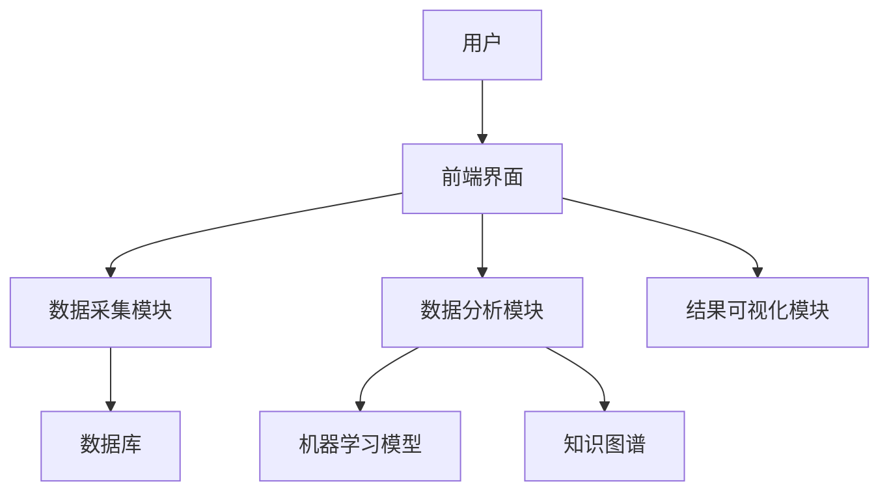

                 

# AI 代理辅助价值投资者进行专利分析

> 关键词：AI代理，价值投资者，专利分析，自然语言处理，机器学习，知识图谱，数据挖掘

> 摘要：随着人工智能技术的快速发展，AI代理在辅助价值投资者进行专利分析方面展现出巨大的潜力。本文将从AI代理与价值投资的基本概念出发，详细探讨专利分析在投资决策中的重要作用，结合AI代理的核心算法与系统架构，深入分析其在专利数据处理中的应用，最后通过实际案例展示AI代理在专利分析中的具体应用场景与优势。

---

## 第一部分：AI 代理与价值投资的背景介绍

### 第1章：AI 代理与价值投资的基本概念

#### 1.1 AI 代理的核心概念

##### 1.1.1 AI 代理的定义与特点
AI代理（Artificial Intelligence Agents）是指能够感知环境、执行任务并做出决策的智能实体。其特点包括自主性、反应性、目标导向和学习能力。

##### 1.1.2 价值投资的基本原理
价值投资是一种投资策略，强调通过分析企业的基本面，如财务状况、市场地位和竞争优势，寻找被市场低估的投资标的。

##### 1.1.3 AI 代理与价值投资的结合点
AI代理可以通过数据挖掘和机器学习技术，辅助投资者快速分析大量专利数据，发现潜在投资机会。

#### 1.2 专利分析在价值投资中的作用

##### 1.2.1 专利分析的定义与方法
专利分析是指通过对专利数据的收集、整理和分析，评估企业的技术创新能力和市场竞争力。

##### 1.2.2 专利分析在投资决策中的价值
专利分析能够帮助投资者识别企业的核心技术和竞争优势，从而做出更明智的投资决策。

##### 1.2.3 AI 代理如何辅助专利分析
AI代理可以通过自然语言处理技术提取专利信息，利用机器学习模型预测专利价值，并构建知识图谱辅助分析。

#### 1.3 AI 代理辅助专利分析的边界与外延

##### 1.3.1 专利分析的边界
专利分析的范围包括专利数据的获取与清洗、专利文本的理解以及专利技术的可比性分析。

##### 1.3.2 AI 代理在专利分析中的适用场景
AI代理适用于专利数据量大、分析复杂度高的场景，如跨行业专利趋势分析和竞争对手专利布局监测。

##### 1.3.3 专利分析与企业价值评估的关系
专利分析是企业价值评估的重要组成部分，能够反映企业的技术创新能力和市场竞争力。

---

### 第2章：AI 代理辅助专利分析的核心要素与组成

#### 2.1 核心要素分析

##### 2.1.1 专利数据的获取与清洗
专利数据的获取需要通过公开数据库或商业平台，清洗过程包括数据去重和格式统一。

##### 2.1.2 专利文本的理解
通过自然语言处理技术，提取专利文本中的关键信息，如技术领域和发明人信息。

##### 2.1.3 专利技术的可比性与可量化性
利用机器学习模型对专利技术进行分类和量化，评估其市场价值和竞争优势。

##### 2.1.4 专利分析的实时性与动态性
AI代理可以实时更新专利数据，动态监控市场和技术趋势。

#### 2.2 AI 代理辅助专利分析的核心问题与解决方案

##### 2.2.1 专利分析中的关键问题
专利数据的复杂性与多样性、专利技术的可比性与可量化性、专利分析的实时性与动态性。

##### 2.2.2 AI 代理解决专利分析问题的思路
利用自然语言处理技术提取专利信息、通过机器学习模型预测专利价值、结合知识图谱构建专利分析框架。

---

### 第3章：AI 代理辅助专利分析的系统架构与实现

#### 3.1 系统功能设计

##### 3.1.1 数据采集模块
通过API接口或爬虫技术获取专利数据，清洗并存储到数据库中。

##### 3.1.2 数据处理模块
利用自然语言处理技术提取专利文本中的关键信息，构建专利知识图谱。

##### 3.1.3 数据分析模块
通过机器学习模型对专利数据进行分类和预测，评估专利价值和市场竞争力。

##### 3.1.4 结果可视化模块
将分析结果以图表形式展示，帮助投资者快速理解专利分析结果。

#### 3.2 系统架构设计

##### 3.2.1 系统架构图

##### 3.2.2 关键模块实现
- 数据采集模块：通过爬虫技术获取专利数据，清洗并存储到数据库中。
- 数据分析模块：利用自然语言处理技术提取专利文本中的关键信息，构建专利知识图谱。
- 机器学习模型：使用监督学习算法对专利数据进行分类和预测。

---

### 第4章：AI 代理辅助专利分析的项目实战

#### 4.1 实际案例分析

##### 4.1.1 案例背景
某科技公司希望利用AI代理分析其竞争对手的专利布局，评估自身技术优势。

##### 4.1.2 数据采集与清洗
通过专利数据库获取竞争对手的专利数据，清洗并存储到数据库中。

##### 4.1.3 数据分析与建模
利用自然语言处理技术提取专利文本中的关键信息，构建专利知识图谱，评估专利价值和市场竞争力。

##### 4.1.4 结果解读与策略制定
通过分析结果，识别竞争对手的核心技术领域，制定相应的技术研发和投资策略。

---

### 第5章：总结与展望

#### 5.1 项目总结
本文详细探讨了AI代理在辅助价值投资者进行专利分析中的应用，介绍了AI代理的核心算法与系统架构，通过实际案例展示了AI代理在专利分析中的具体应用场景与优势。

#### 5.2 最佳实践 tips
- 选择合适的AI代理工具和平台，确保数据的准确性和分析的高效性。
- 定期更新专利数据，保持分析结果的实时性和动态性。
- 结合企业的实际需求，灵活调整分析模型和策略。

#### 5.3 小结
AI代理辅助专利分析是一种创新的投资工具，能够帮助价值投资者快速获取信息，发现投资机会，提升决策效率。

---

通过以上章节的详细讲解，读者可以全面了解AI代理在辅助价值投资者进行专利分析中的应用，掌握其核心算法与系统架构，并通过实际案例理解其具体应用场景与优势。

