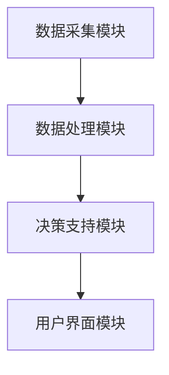

                 


# AI agents辅助价值投资者进行专家网络分析

## 关键词
AI agents, 价值投资, 专家网络分析, 机器学习, 算法原理, 系统架构

## 摘要
AI agents在价值投资中的应用，特别是在专家网络分析方面，正在成为一种新兴的趋势。本文将详细探讨AI agents如何辅助价值投资者进行专家网络分析，包括AI agents的基本概念、价值投资的核心原则、专家网络分析的流程、相关算法的数学模型和系统架构设计。通过实际案例分析和代码实现，本文将展示AI agents如何帮助投资者做出更明智的投资决策。

---

## 第一部分: AI agents与价值投资概述

### 第1章: AI agents的基本概念

#### 1.1 AI agents的核心特点
- **智能性**：AI agents能够通过机器学习算法处理大量数据，识别模式，并做出预测。
- **自主性**：AI agents能够在没有人工干预的情况下自主执行任务。
- **适应性**：AI agents能够根据反馈不断优化自身的决策过程。

#### 1.2 价值投资的核心原则
- **长期视角**：价值投资者关注企业的长期表现，而非短期波动。
- **基本面分析**：通过分析企业的财务数据、行业地位等因素来评估其内在价值。
- **安全边际**：在投资时，确保买入价格低于企业的内在价值，以降低风险。

#### 1.3 AI agents在价值投资中的应用
- **数据处理**：AI agents能够快速处理大量非结构化数据，如新闻、社交媒体评论等，提取有用的信息。
- **模式识别**：通过自然语言处理和计算机视觉技术，AI agents能够识别市场趋势和潜在风险。
- **决策支持**：AI agents为投资者提供基于数据的决策支持，帮助他们做出更明智的投资决策。

---

## 第二部分: 专家网络分析的核心概念与原理

### 第2章: 专家网络分析的核心概念

#### 2.1 专家网络分析的定义与特点
- **定义**：专家网络分析是一种通过分析专家（如行业分析师、投资顾问等）的意见和建议，来辅助投资决策的方法。
- **特点**：
  - 数据来源多样化
  - 分析结果具有深度和专业性
  - 能够捕捉市场中的隐性信息

#### 2.2 AI agents在专家网络分析中的角色
- **数据收集**：AI agents通过爬取互联网上的信息，收集与目标公司相关的新闻、报告等。
- **信息处理**：利用自然语言处理技术，AI agents能够理解文本内容，并提取关键信息。
- **决策支持**：基于处理后的数据，AI agents为投资者提供个性化的投资建议。

#### 2.3 专家网络分析的核心算法
- **监督学习**：用于分类任务，如情感分析。
- **无监督学习**：用于聚类任务，如主题挖掘。
- **强化学习**：用于动态决策任务，如实时市场监控。

---

## 第三部分: AI agents辅助专家网络分析的算法原理

### 第3章: AI agents辅助专家网络分析的算法原理

#### 3.1 算法原理概述
- **监督学习**：用于分类任务，如判断新闻是正面还是负面。
- **无监督学习**：用于主题挖掘，如识别市场趋势。
- **强化学习**：用于动态决策，如实时调整投资组合。

#### 3.2 算法的数学模型与公式
- **监督学习模型**：
  $$ P(y|x) = \frac{P(x|y)P(y)}{P(x)} $$
  其中，\( P(y|x) \) 是在给定 \( x \) 的情况下，\( y \) 的概率。

- **无监督学习模型**：
  $$ \text{相似度} = \frac{\sum_{i=1}^{n} w_i x_i}{\sqrt{\sum_{i=1}^{n} w_i^2 x_i^2}} $$
  其中，\( w_i \) 是权重，\( x_i \) 是特征值。

- **强化学习模型**：
  $$ Q(s, a) = r + \gamma \max_{a'} Q(s', a') $$
  其中，\( Q(s, a) \) 是状态 \( s \) 下采取动作 \( a \) 的价值，\( r \) 是奖励，\( \gamma \) 是折扣因子。

#### 3.3 算法的实现与代码示例
- **监督学习实现**：
  ```python
  from sklearn.linear_model import LogisticRegression
  model = LogisticRegression()
  model.fit(X_train, y_train)
  y_pred = model.predict(X_test)
  ```

- **无监督学习实现**：
  ```python
  from sklearn.cluster import KMeans
  kmeans = KMeans(n_clusters=3)
  kmeans.fit(X)
  clusters = kmeans.labels_
  ```

- **强化学习实现**：
  ```python
  import gym
  env = gym.make('CartPole-v0')
  model = ...
  for _ in range(1000):
      observation = env.reset()
      for _ in range(1000):
          action = model.predict(observation)
          observation, reward, done, info = env.step(action)
          if done:
              break
  ```

---

## 第四部分: 专家网络分析的系统架构与设计

### 第4章: 专家网络分析的系统架构

#### 4.1 系统架构设计概述
- **分层架构**：系统分为数据采集层、数据处理层、决策层和用户界面层。
- **模块化设计**：每个功能模块独立开发，便于维护和扩展。

#### 4.2 系统功能设计
- **数据采集模块**：负责收集专家的意见和市场数据。
- **数据处理模块**：对收集到的数据进行清洗和特征提取。
- **决策支持模块**：基于处理后的数据，为投资者提供决策支持。

#### 4.3 系统架构图


---

## 第五部分: 项目实战与案例分析

### 第5章: 项目实战

#### 5.1 环境安装与配置
- **安装Python**：确保安装了Python 3.8或更高版本。
- **安装依赖库**：如 `scikit-learn`, `gym`, `mermaid` 等。

#### 5.2 系统核心实现源代码
- **监督学习代码**：
  ```python
  from sklearn.linear_model import LogisticRegression
  model = LogisticRegression()
  model.fit(X_train, y_train)
  y_pred = model.predict(X_test)
  ```

- **无监督学习代码**：
  ```python
  from sklearn.cluster import KMeans
  kmeans = KMeans(n_clusters=3)
  kmeans.fit(X)
  clusters = kmeans.labels_
  ```

- **强化学习代码**：
  ```python
  import gym
  env = gym.make('CartPole-v0')
  model = ...
  for _ in range(1000):
      observation = env.reset()
      for _ in range(1000):
          action = model.predict(observation)
          observation, reward, done, info = env.step(action)
          if done:
              break
  ```

#### 5.3 实际案例分析
- **案例背景**：某科技公司面临市场波动，投资者希望通过专家网络分析做出投资决策。
- **分析过程**：通过AI agents收集和分析专家意见，预测公司股价走势。
- **结果解读**：基于分析结果，投资者调整投资策略，降低风险。

---

## 第六部分: 最佳实践与总结

### 第6章: 最佳实践

#### 6.1 小结
- AI agents在专家网络分析中的应用能够显著提高投资决策的效率和准确性。
- 通过机器学习算法，投资者能够更好地捕捉市场趋势和潜在风险。

#### 6.2 注意事项
- 数据质量是关键：确保收集的数据准确且具有代表性。
- 模型优化：定期更新和优化模型，以适应市场变化。
- 风险管理：结合AI分析结果，制定合理的风险管理策略。

#### 6.3 拓展阅读
- 《机器学习实战》：深入理解机器学习算法的实现。
- 《投资学原理》：掌握价值投资的基本理论和方法。

---

通过以上内容，您可以撰写一篇详细且结构清晰的技术博客文章，帮助读者理解AI agents如何辅助价值投资者进行专家网络分析。

