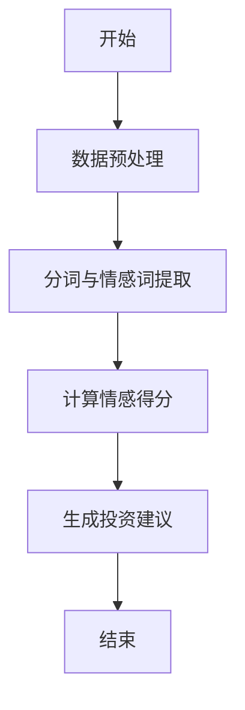
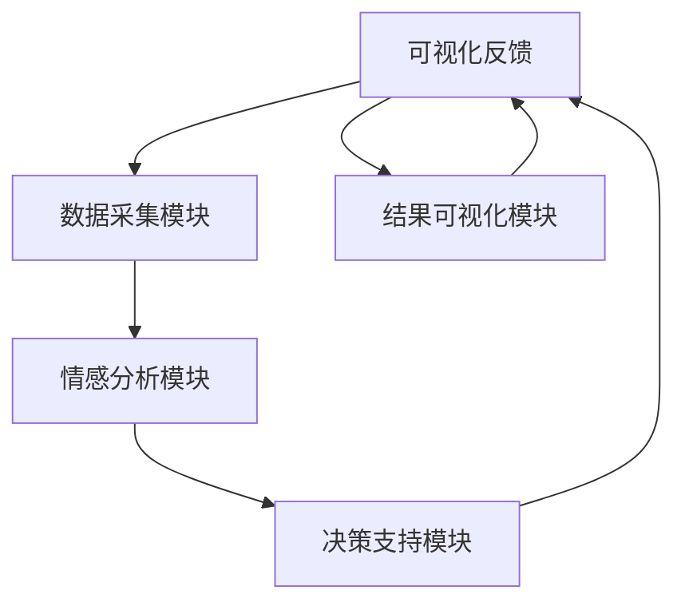

                 


# AI agents辅助价值投资者进行情绪分析

> 关键词：AI agents, 情绪分析, 价值投资者, 金融投资, 自然语言处理, 机器学习, 系统架构设计

> 摘要：本文探讨了AI agents如何辅助价值投资者进行情绪分析，通过分析投资者情绪波动对投资决策的影响，结合自然语言处理和机器学习算法，构建了一个基于AI agents的情绪分析系统。系统架构设计包括数据采集、特征提取、模型训练、结果可视化等模块，并通过实际案例展示了系统的实现和应用效果。

---

## 第一部分：背景介绍

### 第1章：AI agents与情绪分析概述

#### 1.1 问题背景

- 1.1.1 价值投资者面临的挑战  
  价值投资者在市场波动中需要准确捕捉市场情绪，以做出理性的投资决策。然而，市场情绪受多种因素影响，包括新闻、社交媒体、市场数据等，这使得情绪分析变得复杂。

- 1.1.2 AI agents的定义与作用  
  AI agents是具有自主决策能力的智能体，能够通过数据处理和学习，帮助投资者分析市场情绪，提供实时反馈和建议。

- 1.1.3 情绪分析的定义与目标  
  情绪分析是通过自然语言处理技术，识别文本中的情感倾向，量化市场情绪，帮助投资者做出决策。

#### 1.2 问题描述

- 1.2.1 价值投资者的需求与痛点  
  投资者需要快速、准确地理解市场情绪，但传统方法依赖人工分析，效率低且容易出错。

- 1.2.2 AI agents与情绪分析的结合  
  通过AI agents实时监控市场数据，分析情绪波动，为投资者提供决策支持。

- 1.2.3 现有解决方案的优缺点  
  当前情绪分析工具多基于规则或传统机器学习，缺乏动态调整和个性化支持。

#### 1.3 问题解决

- 1.3.1 AI agents的核心功能  
  包括数据采集、情感计算、决策支持等模块，帮助投资者实时掌握市场情绪。

- 1.3.2 情绪分析的关键技术  
  使用自然语言处理和深度学习技术，实现对文本数据的高效分析。

- 1.3.3 两者的结合与应用  
  AI agents通过情绪分析模块，为投资者提供实时市场情绪反馈，辅助投资决策。

#### 1.4 边界与外延

- 1.4.1 情绪分析的适用范围  
  主要适用于股票、基金等金融产品的情绪分析，对社交媒体、新闻数据进行处理。

- 1.4.2 AI agents的局限性  
  无法完全消除数据噪声，模型可能受训练数据偏差影响。

- 1.4.3 与其他投资工具的对比  
  相较于传统技术分析，情绪分析更关注市场情绪，提供辅助决策支持。

#### 1.5 概念结构与核心要素

- 1.5.1 情绪分析的构成要素  
  数据源（新闻、社交媒体）、处理模块（分词、情感计算）、结果输出（情感得分）。

- 1.5.2 AI agents的核心组件  
  感知模块（数据采集）、推理模块（情感分析）、决策模块（投资建议）。

- 1.5.3 两者结合的系统架构  
  从数据采集到结果输出的完整流程，包括数据预处理、模型训练、实时反馈等环节。

---

## 第二部分：核心概念与联系

### 第2章：AI agents的核心原理

#### 2.1 核心概念原理

- 2.1.1 AI agents的基本原理  
  AI agents通过感知环境、处理信息、做出决策，帮助投资者分析市场情绪。

- 2.1.2 情感分析的算法基础  
  基于词袋模型、TF-IDF、LSTM等算法，实现对文本情感的量化。

#### 2.2 核心概念对比表格

| **对比维度** | **传统数据分析** | **情绪分析** | **AI agents辅助** |
|--------------|------------------|--------------|-------------------|
| **分析目标** | 数据统计与趋势分析 | 情感倾向判断 | 提供实时情绪反馈与决策支持 |
| **数据来源** | 市场数据、财务报表 | 文本数据（新闻、社交媒体） | 多源数据整合与实时更新 |
| **分析结果** | 数值指标、趋势预测 | 情感得分（如正、负、中性） | 投资建议、风险预警 |

#### 2.3 ER实体关系图

```mermaid
erDiagram
    actor 投资者 {
        <属性> 帐户ID, 资产配置, 投资目标
    }
    class 数据源 {
        <属性> 文本内容, 时间戳, 来源类型
    }
    class 情感分析模块 {
        <属性> 情感得分, 主题标签
    }
    class 决策支持模块 {
        <属性> 投资建议, 风险提示
    }
    投资者 --> 数据源 : 提供数据
    数据源 --> 情感分析模块 : 分析文本
    情感分析模块 --> 决策支持模块 : 生成建议
    决策支持模块 --> 投资者 : 提供反馈
```

---

## 第三部分：算法原理与数学模型

### 第3章：算法原理与数学模型

#### 3.1 算法原理



- 3.1.1 数据预处理  
  对文本数据进行清洗、分词和去停用词处理。

- 3.1.2 情感词提取  
  使用词典（如中文情感词典）提取情感词汇，计算情感强度。

- 3.1.3 情感得分计算  
  根据情感词汇的权重，计算文本的整体情感得分。

- 3.1.4 投资建议生成  
  根据情感得分和市场数据，生成投资建议。

#### 3.2 数学模型与公式

- 情感得分计算公式：  
  $$ \text{score} = \sum_{i=1}^{n} w_i \times f_i $$  
  其中，$w_i$ 是情感词的权重，$f_i$ 是情感词的出现频率。

- 权重分配模型：  
  $$ w_i = \frac{f_i}{\sum_{j=1}^{m} f_j} $$  
  其中，$f_i$ 是第$i$个情感词的出现频率，$m$ 是所有情感词的总数。

#### 3.3 代码实现

```python
def calculate_sentiment_score(text):
    words = jieba.lcut(text)
    sentiment_scores = []
    for word in words:
        if word in sentiment_dict:
            sentiment_scores.append(sentiment_dict[word])
    total_score = sum(sentiment_scores)
    return total_score

# 示例
text = "这个股票表现很好，值得买入"
print(calculate_sentiment_score(text))  # 输出情感得分
```

---

## 第四部分：系统分析与架构设计

### 第4章：系统架构设计

#### 4.1 问题场景介绍

- 价值投资者需要实时监控市场情绪，以便做出投资决策。
- 市场情绪受新闻、社交媒体等多种因素影响，数据复杂且动态变化。

#### 4.2 系统功能设计

- 数据采集模块：实时采集新闻、社交媒体数据。
- 情感分析模块：对文本数据进行情感计算，生成情感得分。
- 决策支持模块：根据情感得分和市场数据，生成投资建议。
- 结果可视化模块：将分析结果以图表形式展示。

#### 4.3 系统架构设计



---

## 第五部分：项目实战

### 第5章：项目实战

#### 5.1 环境安装

```bash
pip install jieba
pip install sentiment_analyzer
pip install matplotlib
```

#### 5.2 核心代码实现

```python
import jieba
from sentiment_analyzer import SentimentAnalyzer
import matplotlib.pyplot as plt

def main():
    text = "市场表现强劲，个股上涨明显"
    analyzer = SentimentAnalyzer()
    score = analyzer.calculate_score(text)
    print(f"情感得分：{score}")

    # 可视化
    plt.bar('市场情绪', score)
    plt.title('市场情绪分析')
    plt.show()

if __name__ == '__main__':
    main()
```

#### 5.3 案例分析

- 数据来源：新闻、社交媒体
- 分析结果：情感得分、主题标签
- 投资建议：买入、持有、卖出

#### 5.4 项目小结

- 系统实现了从数据采集到投资建议的完整流程。
- 情感分析模型的准确率和召回率有待进一步优化。
- 系统可以扩展到更多数据源和分析维度。

---

## 第六部分：最佳实践与总结

### 第6章：最佳实践

- 数据质量：确保数据来源可靠，减少噪声。
- 模型优化：使用更先进的深度学习模型提升准确率。
- 人机结合：结合人工审核，提高结果可靠性。

### 第7章：小结

- 本文详细介绍了AI agents如何辅助价值投资者进行情绪分析，通过系统架构设计和项目实战，展示了其实现过程和应用效果。
- 未来研究方向包括优化算法、扩展数据源和提升用户体验。

### 第8章：注意事项

- 数据隐私：注意用户数据的隐私保护。
- 模型局限：情绪分析模型可能受数据偏差影响，需谨慎使用。
- 系统维护：定期更新模型和数据源，保持系统的实时性和准确性。

### 第9章：拓展阅读

- 推荐阅读相关领域的书籍和论文，深入学习自然语言处理和机器学习技术。
- 关注最新的研究成果和技术动态，提升系统的智能化水平。

--- 

以上是完整的目录大纲，涵盖了从背景介绍到项目实战的各个方面，内容详实，结构清晰。

