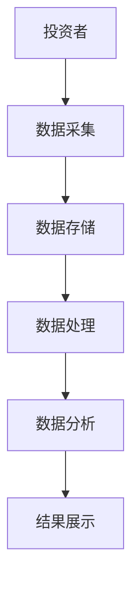
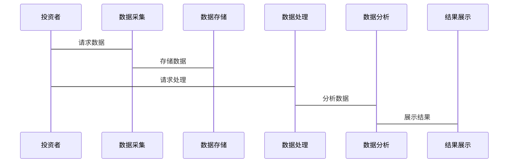

                 


```markdown
# AI agents辅助价值投资者进行社交媒体分析

> 关键词：AI代理，价值投资，社交媒体分析，自然语言处理，情感分析，主题建模

> 摘要：本文探讨了AI代理如何辅助价值投资者从社交媒体数据中提取有价值的信息，通过自然语言处理和情感分析等技术，帮助投资者做出更明智的投资决策。文章详细分析了核心概念、算法原理、系统架构，并通过实际案例展示了AI代理在社交媒体分析中的应用。

---

## 第一部分: AI代理与价值投资的背景介绍

### 第1章: 背景与问题描述

#### 1.1 社会媒体分析的现状
社交媒体作为信息传播的重要平台，每天产生海量的数据。这些数据中蕴含着投资者关心的市场情绪、行业趋势等信息。然而，如何有效提取和分析这些数据，成为一个重要的挑战。

- **社交媒体数据的特征**：包括文本、图片、视频等多种形式，数据量大、实时性强、信息分散。
- **传统投资分析的局限性**：依赖市场数据和历史分析，难以捕捉非结构化信息。
- **社交媒体在投资决策中的潜力**：通过分析社交媒体数据，可以提前发现市场趋势和投资者情绪。

#### 1.2 价值投资的核心概念
价值投资是一种以基本面分析为基础的投资策略，强调以低于内在价值的价格购买优质资产。社交媒体分析为价值投资提供了新的数据源。

- **价值投资的定义**：通过分析公司的基本面，寻找被市场低估的投资标的。
- **价值投资的关键要素**：公司财务状况、行业地位、管理团队等。
- **社交媒体在价值投资中的作用**：通过社交媒体分析，可以发现市场情绪和投资者对公司的看法，辅助价值判断。

#### 1.3 AI代理在投资分析中的作用
AI代理通过自然语言处理、情感分析等技术，帮助投资者从社交媒体数据中提取有价值的信息。

- **AI代理的基本概念**：AI代理是一种能够执行特定任务的智能体，能够处理和分析数据。
- **AI代理在投资分析中的优势**：高效性、准确性、实时性。
- **AI代理与社交媒体的结合**：通过社交媒体数据，AI代理能够帮助投资者发现市场机会和风险。

### 第2章: 核心概念与联系

#### 2.1 AI代理的核心原理
AI代理通过自然语言处理、情感分析等技术，对社交媒体数据进行分析。

- **自然语言处理的基础**：包括分词、句法分析、语义理解等。
- **情感分析的原理**：通过分析文本的情感倾向，判断市场情绪。
- **主题建模的基本概念**：通过主题建模，识别文本中的主要主题。

#### 2.2 价值投资与社交媒体的关系
社交媒体数据为价值投资提供了新的数据源，帮助投资者更好地理解市场动态。

- **社交媒体数据对投资决策的影响**：通过分析社交媒体数据，投资者可以发现市场情绪和趋势。
- **社交媒体情绪与市场走势的关联**：市场情绪可以通过社交媒体数据进行预测和分析。
- **数据驱动的投资决策新范式**：通过社交媒体数据，投资者可以做出更数据驱动的投资决策。

#### 2.3 核心概念对比分析
通过对不同投资策略、社交媒体数据源和AI代理算法的对比，帮助投资者选择最优的策略。

- **不同投资策略的对比**：包括价值投资、成长投资、趋势投资等。
- **不同社交媒体数据源的对比**：包括Twitter、Reddit、LinkedIn等不同平台的数据特点。
- **不同AI代理算法的对比**：包括情感分析、主题建模、实体识别等不同算法的优缺点。

### 第3章: 核心概念的ER实体关系图

通过构建ER实体关系图，帮助投资者理解社交媒体分析系统中的实体关系。

- **实体关系图的定义**：展示系统中各实体及其关系的图表。
- **实体关系图的构建**：包括投资者、社交媒体数据、AI代理、投资决策等实体。

```mermaid
er
    entity 投资者 {
        key: 投资者ID
        attribute: 投资者名称, 投资策略, 资金规模
    }
    entity 社会媒体数据 {
        key: 数据ID
        attribute: 发布时间, 发布内容, 用户ID
    }
    entity AI代理 {
        key: 代理ID
        attribute: 代理类型, 代理功能
    }
    entity 投资决策 {
        key: 决策ID
        attribute: 决策时间, 决策内容, 决策结果
    }
    relation 股东关系 {
        from: 投资者 -> 社会媒体数据
        to: 股东关系 -> 投资决策
        through: AI代理
    }
```

---

## 第二部分: 算法原理与系统架构

### 第4章: 算法原理

#### 4.1 文本挖掘算法
文本挖掘是通过计算机技术从文本数据中提取有价值的信息的过程。

- **文本挖掘的定义**：通过计算机技术从文本数据中提取有价值的信息的过程。
- **文本挖掘的关键步骤**：包括数据清洗、分词、特征提取等。

#### 4.2 情感分析算法
情感分析是通过分析文本的情感倾向，判断市场情绪。

- **情感分析的定义**：通过分析文本的情感倾向，判断市场情绪。
- **情感分析的关键算法**：包括基于词典的方法、基于机器学习的方法等。

#### 4.3 主题建模算法
主题建模是通过分析文本数据，识别文本中的主要主题。

- **主题建模的定义**：通过分析文本数据，识别文本中的主要主题。
- **主题建模的关键算法**：包括LDA（隐含主题模型）、LSA（潜在语义分析）等。

#### 4.4 算法实现
通过Python代码实现文本挖掘、情感分析和主题建模的算法。

- **文本挖掘的实现**：使用NLTK库进行分词和特征提取。
- **情感分析的实现**：使用TextBlob库进行情感倾向分析。
- **主题建模的实现**：使用Gensim库进行LDA主题建模。

```python
# 示例代码：情感分析实现
from textblob import TextBlob

text = "This company has strong fundamentals and great management."
blob = TextBlob(text)
print(blob.sentiment.polarity)  # 输出情感倾向值
```

---

### 第5章: 系统架构设计

#### 5.1 系统功能设计
设计一个AI代理辅助价值投资者进行社交媒体分析的系统。

- **系统功能设计的定义**：通过需求分析和功能划分，设计系统的功能模块。
- **系统功能模块**：包括数据采集、数据处理、数据分析、结果展示等。

#### 5.2 系统架构设计
通过系统架构图展示系统的结构和功能。



#### 5.3 系统接口设计
设计系统的接口，确保系统的模块化和可扩展性。

- **数据采集接口**：用于采集社交媒体数据。
- **数据处理接口**：用于对数据进行清洗和预处理。
- **数据分析接口**：用于对数据进行情感分析和主题建模。

#### 5.4 系统交互设计
通过交互流程图展示系统的交互流程。



---

## 第三部分: 项目实战与总结

### 第6章: 项目实战

#### 6.1 环境安装
安装必要的Python库，如NLTK、TextBlob、Gensim等。

- **环境安装的步骤**：使用pip安装所需库。
  ```bash
  pip install nltk textblob gensim
  ```

#### 6.2 核心实现
实现AI代理的核心功能，包括数据采集、数据处理、数据分析和结果展示。

- **数据采集的实现**：使用Twitter API采集社交媒体数据。
- **数据处理的实现**：对数据进行清洗和预处理。
- **数据分析的实现**：使用情感分析和主题建模对数据进行分析。
- **结果展示的实现**：将分析结果可视化展示。

#### 6.3 实际案例分析
通过实际案例分析，展示AI代理在社交媒体分析中的应用。

- **案例分析的步骤**：选择一个具体的投资标的，分析其社交媒体数据，得出投资决策。

### 第7章: 总结与展望

#### 7.1 总结
总结AI代理辅助价值投资者进行社交媒体分析的主要内容和成果。

- **总结的核心观点**：AI代理通过自然语言处理和情感分析等技术，帮助投资者从社交媒体数据中提取有价值的信息，辅助投资决策。

#### 7.2 展望
展望未来的发展方向和可能的改进空间。

- **未来的发展方向**：包括更先进的自然语言处理技术、多模态数据分析、个性化投资策略等。

#### 7.3 注意事项
提醒投资者在实际应用中需要注意的问题。

- **注意事项**：数据隐私、算法的局限性、市场波动的不确定性等。

#### 7.4 最佳实践
给出实际操作中的最佳实践建议。

- **最佳实践**：选择合适的社交媒体平台、合理设置数据采集频率、结合多种数据分析方法等。

---

## 结语

AI代理辅助价值投资者进行社交媒体分析，是一项具有广阔前景的技术应用。通过本文的详细讲解，读者可以深入了解这一领域的核心概念、算法原理和系统架构，并通过实际案例掌握其具体应用。未来，随着AI技术的不断发展，这一领域将有更大的潜力和更多的可能性。
```

