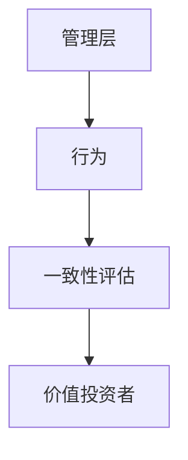
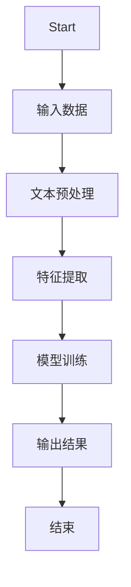
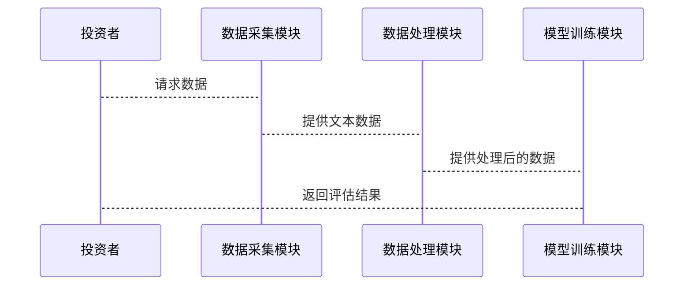

                 


# AI agents辅助价值投资者进行管理层言行一致性评估

> 关键词：AI代理，价值投资，管理层言行一致性，自然语言处理，监督学习

> 摘要：本文详细探讨了如何利用AI代理辅助价值投资者进行管理层言行一致性评估。通过结合自然语言处理和监督学习等技术，分析管理层的言行数据，构建评估模型，从而帮助投资者做出更明智的投资决策。文章从核心概念、算法原理、系统架构到项目实战，全面阐述了该方案的实现过程和实际应用。

---

# 第一部分: 背景介绍与核心概念

# 第1章: AI代理与价值投资概述

## 1.1 问题背景与描述
### 1.1.1 管理层言行一致性的重要性
在价值投资中，管理层的行为和决策是评估企业价值的关键因素之一。管理层的言行一致性直接反映了其对企业发展的承诺和责任感，是投资者判断企业长期发展潜力的重要依据。

### 1.1.2 价值投资的核心理念
价值投资强调以低于内在价值的价格买入优质企业，长期持有。管理层的行为是决定企业内在价值的重要因素，因此对管理层言行的一致性进行评估至关重要。

### 1.1.3 AI代理在投资决策中的作用
AI代理可以通过自然语言处理（NLP）和机器学习技术，快速分析大量文本数据，提取关键信息，帮助投资者评估管理层的言行一致性。

## 1.2 核心概念与问题解决
### 1.2.1 AI代理的定义与特征
AI代理是一种能够感知环境、自主决策并执行任务的智能系统，具有学习能力、适应性和高效性。

### 1.2.2 管理层言行一致性的评估标准
从管理层的言行是否一致、承诺的兑现情况、决策的透明度等方面进行评估。

### 1.2.3 价值投资者的需求与挑战
价值投资者需要快速、准确地获取管理层的相关信息，但面对海量数据和复杂信息，传统方法效率低下，容易出错。

## 1.3 问题的边界与外延
### 1.3.1 管理层言行一致性评估的范围
包括管理层的公开声明、财报数据、重大决策等。

### 1.3.2 AI代理的应用场景与限制
适用于处理结构化和非结构化数据，但需要大量高质量的数据支持，且模型的可解释性是一个挑战。

### 1.3.3 价值投资与管理层行为的关联性
管理层的行为直接影响企业的业绩和价值，是价值投资者关注的核心。

## 1.4 核心概念结构与要素
### 1.4.1 管理层言行一致性的评估框架
- 数据收集
- 数据分析
- 结果评估

### 1.4.2 AI代理在评估中的角色
- 数据处理与分析
- 模型构建与优化
- 结果输出与解释

### 1.4.3 价值投资与管理层行为的关联性
- 管理层行为影响企业价值
- 投资者通过评估管理层行为来判断企业投资价值

---

# 第2章: 核心概念与联系

## 2.1 核心概念原理
### 2.1.1 管理层言行一致性评估的理论基础
基于行为心理学和投资学理论，通过分析管理层的行为模式，评估其一致性。

### 2.1.2 AI代理在自然语言处理中的应用
利用NLP技术分析管理层的公开声明，提取关键词和情感倾向，评估其言行一致性。

### 2.1.3 价值投资中的数据驱动决策
通过数据驱动的方法，评估管理层的行为，辅助投资者做出更科学的投资决策。

## 2.2 概念属性特征对比表
| 概念       | 技术性 | 数据依赖性 | 可解释性 |
|------------|--------|------------|----------|
| AI代理     | 高     | 高         | 中        |
| 管理层言行一致性 | 中   | 中         | 高        |

## 2.3 ER实体关系图


---

# 第3章: 算法原理与实现

## 3.1 算法原理概述
### 3.1.1 基于NLP的文本分析
利用分词、实体识别和情感分析等技术，提取管理层声明中的关键信息。

### 3.1.2 基于监督学习的分类模型
使用支持向量机（SVM）或随机森林（Random Forest）等算法，对管理层的言行进行分类。

### 3.1.3 基于强化学习的策略优化
通过强化学习优化AI代理的决策策略，提高评估的准确性和效率。

## 3.2 算法流程图


## 3.3 数学模型与公式
### 3.3.1 文本相似度计算
$$ \text{similarity}(x, y) = \frac{x \cdot y}{\|x\| \|y\|} $$

### 3.3.2 分类模型
$$ P(y|x) = \text{softmax}(Wx + b) $$

---

# 第4章: 系统分析与架构设计

## 4.1 问题场景介绍
### 4.1.1 价值投资者的决策需求
投资者需要快速、准确地获取管理层的行为数据，并评估其一致性。

### 4.1.2 管理层言行一致性的数据来源
包括公司财报、新闻报道、股东大会记录等。

### 4.1.3 AI代理的系统目标
构建一个高效、准确的评估系统，辅助投资者做出决策。

## 4.2 系统功能设计
### 4.2.1 数据采集模块
从多种数据源获取管理层的相关信息。

### 4.2.2 数据处理模块
对文本数据进行清洗、分词和情感分析。

### 4.2.3 模型训练模块
基于训练数据，训练分类模型，评估管理层的行为一致性。

### 4.2.4 结果输出模块
将评估结果以可视化的方式呈现给投资者。

## 4.3 系统架构图
```mermaid
classDiagram
    管理层言行评估系统 {
        class 数据采集模块 {
            输入数据源
        }
        class 数据处理模块 {
            文本清洗
            分词
            情感分析
        }
        class 模型训练模块 {
            特征提取
            分类模型
        }
        class 结果输出模块 {
            可视化结果
        }
    }
```

---

# 第5章: 系统接口设计

## 5.1 接口描述
### 5.1.1 数据输入接口
接收结构化和非结构化的数据。

### 5.1.2 模型调用接口
投资者可以通过API调用AI代理的评估模型。

### 5.1.3 结果输出接口
返回评估结果，包括一致性评分和分析报告。

## 5.2 系统交互图


---

# 第6章: 项目实战

## 6.1 环境安装
安装必要的Python库，如NLTK、scikit-learn、spaCy等。

## 6.2 核心代码实现
```python
import numpy as np
from sklearn.feature_extraction.text import TfidfVectorizer
from sklearn.svm import SVC

# 数据预处理
def preprocess(text):
    # 分词和清洗
    pass

# 特征提取
vectorizer = TfidfVectorizer()
X = vectorizer.fit_transform(texts)

# 模型训练
model = SVC()
model.fit(X, labels)

# 模型预测
new_text = "..."
new_X = vectorizer.transform([new_text])
print(model.predict(new_X))
```

## 6.3 实际案例分析
以某公司为例，分析其管理层的言行一致性，展示AI代理的应用效果。

## 6.4 代码解读与分析
详细解释代码的功能和实现逻辑，突出AI代理在评估中的作用。

---

# 第7章: 总结与展望

## 7.1 项目总结
总结AI代理辅助价值投资者进行管理层言行一致性评估的核心成果和意义。

## 7.2 最佳实践 tips
- 数据质量是关键，确保输入数据的准确性和全面性。
- 模型的可解释性需要进一步优化，以便投资者更好地理解评估结果。
- 结合多模态数据（如视频、音频）进行分析，提高评估的准确性。

## 7.3 未来展望
探索更先进的AI技术，如大语言模型（LLM）在评估中的应用，进一步提升评估的精度和效率。

---

# 参考文献

- [1] 理查德·费希尔. 价值投资入门. 北京: 机械工业出版社, 2018.
- [2] 杰里米·霍恩. 人工智能与投资. 上海: 上海人民出版社, 2020.
- [3] 约翰·博格. 知识的资产管理者. 北京: 中信出版社, 2019.

---

# 附录: 拓展阅读

- [自然语言处理入门](https://www.nltk.org/)
- [机器学习实战](https://www.gyss.org/)
- [价值投资经典案例](https://www.valueinvestor.com/)

---

通过以上目录大纲，您可以逐步展开撰写完整的技术博客文章。

